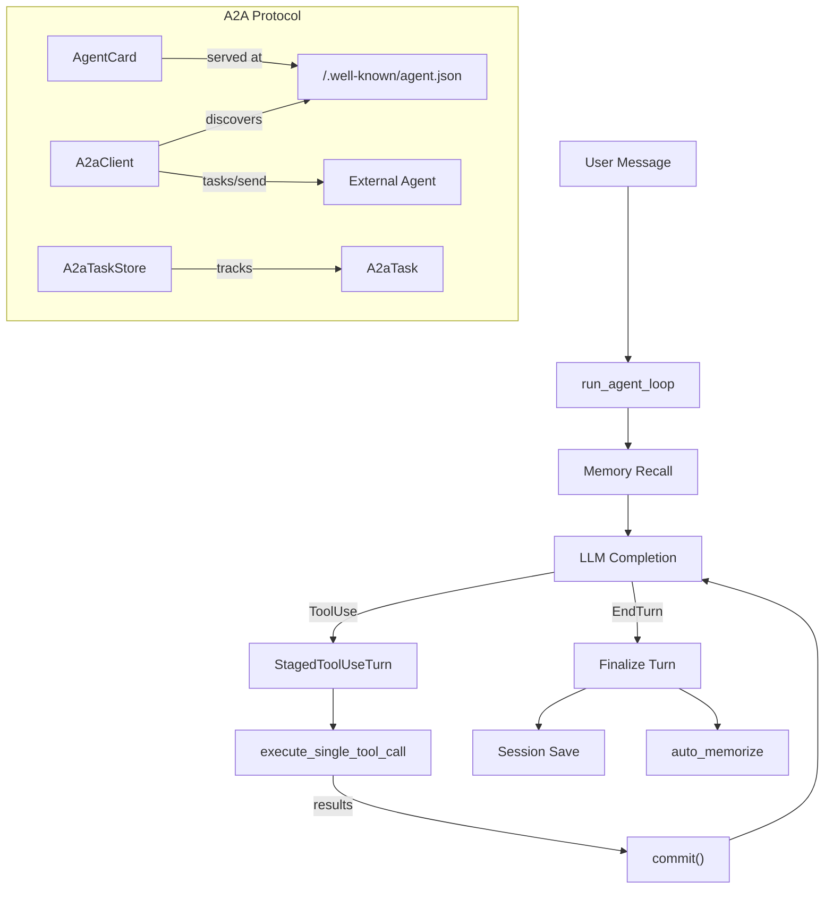

# Agent Runtime — librefang-runtime-src

# LibreFang Runtime (`librefang-runtime`)

The runtime crate is the execution engine of LibreFang. It contains the core agent loop that orchestrates LLM calls, tool execution, memory recall, and session persistence, as well as the A2A (Agent-to-Agent) interoperability layer for cross-framework agent communication.

## Architecture Overview



---

## Agent Loop (`agent_loop.rs`)

The agent loop is the heart of the runtime. It handles a single user turn end-to-end: receiving the message, recalling relevant memories, calling the LLM, executing any tool calls the model requests, and persisting the conversation.

### Entry Points

Two public entry points serve different channel types:

- **`run_agent_loop`** — non-streaming (returns the full response at once)
- **`run_agent_loop_streaming`** — streaming (emits `StreamEvent` values over an `mpsc` channel as tokens arrive)

Both share the same core logic; the streaming variant wraps completion calls in the streaming driver and forwards `StreamEvent::Token` / `StreamEvent::PhaseChange` events to the caller.

### Loop Lifecycle

The loop proceeds through these phases:

1. **Pre-flight checks** — provider configuration validation, cooldown checks, checkpoint restoration
2. **Memory recall** — vector search (embedding-based) or text search, plus proactive memory auto-retrieval
3. **Prompt assembly** — system prompt construction, A/B experiment variant selection, memory context injection
4. **Message preparation** — session repair, safe trimming, image stripping, PII filtering
5. **LLM completion** — rate-limited by a process-global semaphore (`MAX_CONCURRENT_LLM_CALLS = 5`), with retry logic for transient errors
6. **Tool execution** (if `stop_reason == ToolUse`) — staged commit pattern, see below
7. **Turn finalization** — response delivery, auto-memorize, session persistence, hook firing

### `StagedToolUseTurn` — Atomic Tool-Use Commits

The `StagedToolUseTurn` struct is a critical correctness mechanism. It solves a class of bugs (upstream #2381) where tool-use turns left session history in a half-committed state — an assistant `ToolUse` message without the paired user `ToolResult` response — causing API rejections on the next turn.

**How it works:**

- When the LLM responds with `ToolUse`, a `StagedToolUseTurn` buffers the assistant message and accumulates tool results in memory
- Each `execute_single_tool_call` appends its result via `append_result()`
- Only when `commit()` is called do both the assistant message and the user tool-result message get pushed to `session.messages` and the LLM working copy atomically
- If the loop exits early (error, signal, interrupt), `pad_missing_results()` fills in synthetic "tool interrupted" results for any unexecuted tool calls before committing
- Dropping the struct without committing leaves `session.messages` untouched — by construction, no orphan `ToolUse` can reach persistence

### Tool Execution

`execute_single_tool_call` processes a single tool invocation through this pipeline:

1. **Loop guard check** — circuit breaker, block, or warn verdicts
2. **Fork allowlist check** — in fork mode, only explicitly permitted tools execute
3. **Pre-tool hook** — `HookEvent::BeforeToolCall` can block execution
4. **Execution with timeout** — `TOOL_TIMEOUT_SECS = 600s`, configurable per-tool via `KernelHandle::tool_timeout_secs_for`
5. **Decision trace recording** — captures rationale, input, output summary, timing
6. **Post-tool hook** — `HookEvent::AfterToolCall`
7. **Transform hook** — `HookEvent::TransformToolResult` can rewrite the result content
8. **Content sanitization** — strips injection markers, truncates to context budget

### Loop Guard and Safety Mechanisms

| Mechanism | Constant | Purpose |
|-----------|----------|---------|
| Max iterations | `AutonomousConfig::DEFAULT_MAX_ITERATIONS` | Prevents infinite agent loops |
| Consecutive all-failed abort | `MAX_CONSECUTIVE_ALL_FAILED = 3` | Exits when every tool fails N times in a row |
| Max continuations | `MAX_CONTINUATIONS = 5` | Caps `MaxTokens` response continuation rounds |
| History trim | `MAX_HISTORY_MESSAGES = 40` | Prevents context overflow from growing conversation |
| Tool timeout | `TOOL_TIMEOUT_SECS = 600` | Per-tool execution deadline |
| LLM concurrency | `MAX_CONCURRENT_LLM_CALLS = 5` | Global semaphore caps in-flight API calls |

Soft errors (parameter mistakes, sandbox rejections, approval denials) do not count toward the consecutive-failure threshold — the LLM is expected to self-correct. Hard errors (network failures, unrecognized tools) do.

### Memory Recall

The loop uses a tiered recall strategy:

1. **Context engine** (when available) — plugin-customizable `ingest()` → `recalled_memories`
2. **Vector search** — embedding-based similarity search with `MemoryFilter` scoping
3. **Text search** — fallback when embedding fails
4. **Proactive memory** — `ProactiveMemoryStore::auto_retrieve()` adds deduplicated memory items

Fork turns (`opts.is_fork = true`) and stable-prefix-mode agents skip auto-retrieval to maintain cache alignment with the parent turn.

### Session Repair and Trimming

`safe_trim_messages` cuts message history at conversation-turn boundaries so `ToolUse`/`ToolResult` pairs are never split. After trimming, `session_repair::validate_and_repair` re-validates the surviving messages. If fewer than 2 messages survive, a minimal `[user_message]` is synthesized.

`strip_prior_image_data` removes base64 image data from all messages except the last user message, preventing token bloat from already-processed images.

### Web Search Augmentation

When enabled (`web_search_augmentation` != `Off`), the loop can augment context with web search results:

- **Auto mode**: augments only when the model doesn't support tools
- **Always mode**: always augments
- Uses a lightweight LLM call to generate focused search queries from conversation context
- Falls back to the raw user message if query generation fails

### A/B Experiments

`select_running_experiment` checks for active prompt experiments via the kernel handle. When one is found, session-based hash determines the variant, and the variant's `prompt_version_id` replaces the default system prompt.

### `LoopOptions`

| Field | Purpose |
|-------|---------|
| `is_fork` | Derivative turn — skip session persistence, flag hooks |
| `allowed_tools` | Runtime tool allowlist (enforced at execute time, not schema level, to preserve cache alignment) |
| `interrupt` | Per-session interrupt handle for long-running tools |
| `max_iterations` | Operator-level override for iteration cap |

### `AgentLoopResult`

The loop returns a structured result containing:

- `response` — final text (empty when `silent`)
- `total_usage` — cumulative `TokenUsage` across all LLM calls
- `iterations` — how many loop iterations ran
- `silent` — agent chose not to reply
- `provider_not_configured` — no LLM provider available
- `decision_traces` — per-tool-call traces with rationale, timing, outcomes
- `memories_saved` / `memories_used` / `memory_conflicts` — memory subsystem feedback
- `new_messages_start` — index for slicing turn messages from the session
- `owner_notice` — optional private message to the operator (from `notify_owner` tool)
- `skill_evolution_suggested` — flags when 5+ tool calls suggest skill review

### Utility Functions

**`strip_provider_prefix(model, provider)`** — normalizes model IDs by removing provider prefixes (`openrouter/` → bare model) and qualifying bare model names for providers that require `org/model` format (OpenRouter, Together, Fireworks, Replicate, HuggingFace). Recognizes common families: `gemini-*`, `claude-*`, `gpt-*`, `llama-*`, `deepseek-*`, `mistral-*`, `qwen-*`, `command-*`.

**`build_group_sender_prefix`** — constructs `[sender]: ` prefixes for group chats, sanitizing labels to prevent spoofing or format injection.

**`is_no_reply`** / **`is_progress_text_leak`** — detect silent-response tokens and progress-text leaks (short ellipsis-terminated preambles the model emits before abandoning a tool call).

### Lazy Tool Loading

When an agent's granted tool set exceeds `LAZY_TOOLS_THRESHOLD = 30`, the loop activates lazy mode: only always-native tools plus any tools the LLM has explicitly loaded via `tool_load` are included in the request. This reduces prompt size for agents with access to the full ~75 builtin catalog. The `tool_load` tool must be in the allowlist for lazy mode to engage — otherwise all tools are shipped eagerly.

---

## A2A Protocol (`a2a.rs`)

Implements Google's Agent-to-Agent protocol for cross-framework agent interoperability. The module provides both server-side (exposing LibreFang agents) and client-side (discovering and interacting with external agents) functionality.

### Core Types

#### `AgentCard`

JSON capability manifest served at `/.well-known/agent.json`. Describes an agent's name, description, endpoint URL, capabilities (streaming, push notifications, state transition history), and skills.

Built from a LibreFang `AgentManifest` via `build_agent_card()`, which converts tool names into A2A skill descriptors.

#### `A2aTask`

Unit of work exchanged between agents. Contains:

- `id` — unique task identifier
- `session_id` — optional session for conversation continuity
- `status` — wrapped in `A2aTaskStatusWrapper` for flexible serialization
- `messages` — conversation history (list of `A2aMessage` with `A2aPart` content)
- `artifacts` — outputs produced by the task

#### `A2aTaskStatus`

```rust
enum A2aTaskStatus {
    Submitted,      // received but not started
    Working,        // being processed
    InputRequired,  // needs more input from caller
    Completed,      // done successfully
    Cancelled,      // cancelled by user
    Failed,         // failed
}
```

`A2aTaskStatusWrapper` handles the two serialization forms implementations use: bare string (`"completed"`) and object (`{"state": "completed", "message": null}`). The `state()` method extracts the underlying status regardless of encoding.

#### `A2aPart` — Message Content

Tagged enum supporting three content types:

- `Text { text }` — plain text
- `File { name, mime_type, data }` — base64-encoded file
- `Data { mime_type, data }` — structured JSON

#### `A2aArtifact` — Task Outputs

Artifacts carry optional `name`, `description`, `metadata`, `index`, and `last_chunk` fields (all optional per spec) plus a list of `A2aPart` content blocks.

### `A2aTaskStore` — Task Lifecycle Management

In-memory bounded store for tracking A2A tasks. Used by the server side to track tasks created by `tasks/send`, polled by `tasks/get`, and cancelled by `tasks/cancel`.

**Eviction policy** (applied lazily on each `insert`):

1. **TTL sweep** — any task older than `task_ttl` (default 24 hours) is removed regardless of state, including `Working`/`InputRequired` tasks that would otherwise accumulate
2. **Capacity eviction** — if at capacity after TTL sweep, evict the oldest terminal-state task first (`Completed`/`Failed`/`Cancelled`), falling back to the oldest task overall

```rust
let store = A2aTaskStore::new(1000);               // 1000-task capacity
let store = A2aTaskStore::with_ttl(100, Duration::from_secs(3600)); // custom TTL
```

Key methods:

| Method | Description |
|--------|-------------|
| `insert(task)` | Insert with eviction |
| `get(task_id)` | Retrieve by ID |
| `update_status(task_id, status)` | Update status and touch timestamp |
| `complete(task_id, response, artifacts)` | Add response message + artifacts, set Completed |
| `fail(task_id, error_message)` | Add error message, set Failed |
| `cancel(task_id)` | Set Cancelled |

### `A2aClient` — External Agent Interaction

HTTP client for discovering and communicating with external A2A agents.

```rust
let client = A2aClient::new();

// Fetch an agent's card
let card: AgentCard = client.discover("https://other.example.com").await?;

// Send a task
let task: A2aTask = client.send_task(
    "https://other.example.com/a2a",
    "Summarize this document",
    Some("session-123"),
).await?;

// Poll task status
let updated: A2aTask = client.get_task(
    "https://other.example.com/a2a",
    &task.id,
).await?;
```

All methods use JSON-RPC 2.0 (`tasks/send`, `tasks/get`). The client uses the shared `proxied_client_builder` from `librefang-http` with a 30-second timeout.

### Boot-Time Discovery

`discover_external_agents(agents)` is called during kernel boot to fetch agent cards from all configured external agents. Failures are logged but non-fatal — the system continues with whatever agents were successfully discovered.

---

## Cross-Module Integration Points

- **`librefang-types`** — message types, tool definitions, agent manifest, memory types
- **`librefang-memory`** — `MemorySubstrate`, `Session`, `ProactiveMemoryStore`
- **`librefang-llm-driver`** — `LlmDriver` trait, `CompletionRequest`, `StreamEvent`
- **`librefang-http`** — `proxied_client_builder` for HTTP clients with proxy support
- **`librefang-skills`** — `SkillRegistry` for skill-based tool resolution
- **Kernel handle** (`KernelHandle`) — runtime policy interface (tool timeouts, experiment lookup, prompt version tracking)