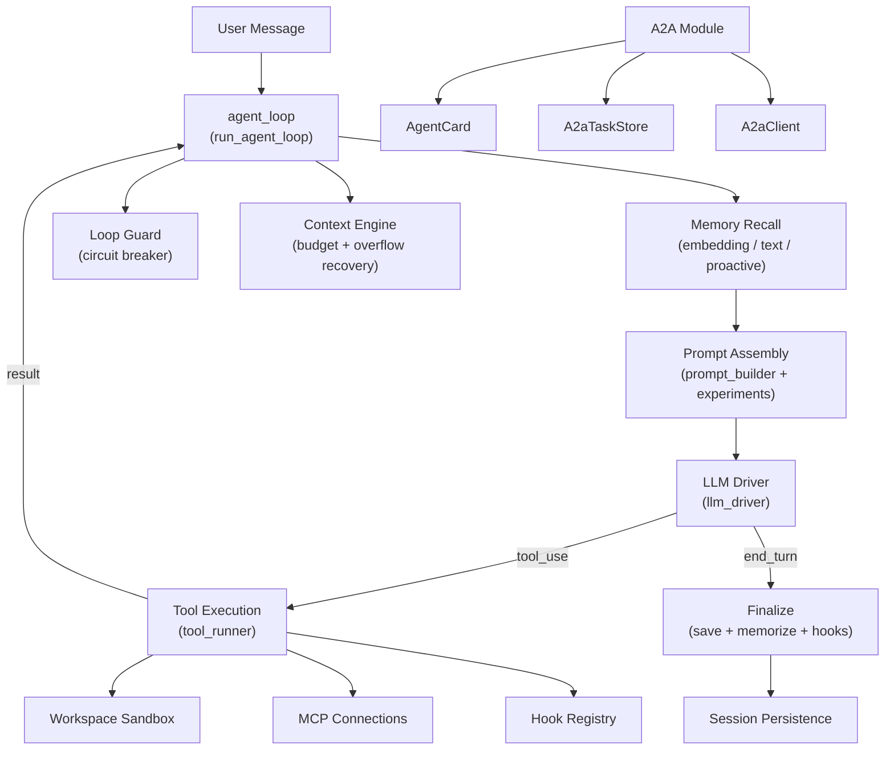

# Agent Runtime — librefang-runtime-src

# LibreFang Runtime (`librefang-runtime`)

The execution environment for LibreFang agents. It owns the core agent loop, LLM driver orchestration, tool execution pipeline, and over thirty supporting subsystems that together turn a user message into an intelligent, tooled response.

## Architecture Overview



## Module Inventory

The crate re-exports several sibling crates and declares ~50 internal modules. The most important:

| Module | Purpose |
|--------|---------|
| `agent_loop` | Core execution loop — the heart of the runtime |
| `a2a` | Agent-to-Agent protocol interoperability |
| `tool_runner` | Dispatches tool calls to the appropriate handler |
| `llm_driver` | Re-exported from `librefang-llm-driver` — unified LLM interface |
| `context_engine` | Plugin-aware context window management |
| `context_budget` | Token budget allocation and truncation strategies |
| `context_overflow` | Recovery when the context window is exceeded |
| `loop_guard` | Circuit breaker and rate limiting for tool calls |
| `workspace_sandbox` | Path resolution and escape prevention for file tools |
| `prompt_builder` | System prompt assembly and memory formatting |
| `session_repair` | Message history validation and safe trimming |
| `proactive_memory` | Background memory extraction and retrieval |
| `pii_filter` | Personally identifiable information redaction |
| `hooks` | Lifecycle hook registry (before/after tool call, loop end) |
| `web_search` / `web_fetch` / `web_content` | Web access tools |
| `mcp` | Model Context Protocol connections (re-exported) |
| `sandbox` | WASM sandboxing (re-exported from `librefang-runtime-wasm`) |
| `plugin_manager` / `plugin_runtime` | Plugin lifecycle |
| `model_catalog` | Model metadata, aliases, and provider detection |
| `retry` | Exponential backoff for rate-limited API calls |
| `routing` | Request routing across providers |
| `embedding` | Embedding driver trait for vector recall |

Re-exported crates: `llm_driver`, `llm_errors`, `drivers`, `http_client`, `kernel_handle`, `mcp`, `mcp_oauth`, `sandbox`, `host_functions`, `chatgpt_oauth`, `copilot_oauth`.

## Core Agent Loop

The entry points are `run_agent_loop` and `run_agent_loop_streaming`. They implement the same algorithm; the streaming variant yields `StreamEvent` tokens to the caller in real time.

### Execution Phases

1. **Experiment selection** — `select_running_experiment` checks the kernel for an active A/B test and picks a variant based on deterministic session-hash traffic splitting.

2. **Memory recall** — `setup_recalled_memories` queries the `ContextEngine` (if present), falls back to embedding-based vector recall via `EmbeddingDriver`, or uses plain text search. Proactive memory (`auto_retrieve`) is merged in for non-fork, non-stable-prefix-mode turns.

3. **Prompt assembly** — `build_prompt_setup` merges the manifest's system prompt, experiment variant (if active), recalled memories, and a language-matching instruction.

4. **Message preparation** — `prepare_llm_messages` filters out system messages, injects canonical context, trims to `MAX_HISTORY_MESSAGES` (40) at safe turn boundaries, strips stale image data, and repairs any structural damage.

5. **LLM loop** — The loop runs up to `MAX_ITERATIONS` (50) turns:
   - Call the LLM driver.
   - If the response is `end_turn`, break.
   - If `max_tokens` was hit, auto-continue up to `MAX_CONTINUATIONS` (5).
   - If `tool_use`, stage the turn via `StagedToolUseTurn`, execute each tool through `execute_single_tool_call`, and feed results back.
   - Check mid-turn signals (injected messages, approval resolutions).
   - Track consecutive hard failures; abort after `MAX_CONSECUTIVE_ALL_FAILED` (3).

6. **Finalization** — `finalize_successful_end_turn` saves the assistant response, persists the session, writes episodic memory, fires the `AgentLoopEnd` hook, runs `auto_memorize` for proactive memory, and checks skill evolution eligibility.

### Loop Guards and Safety

- **`LoopGuard`** — Per-tool circuit breaker. Configurable thresholds emit `Warn`, `Block`, or `CircuitBreak` verdicts. A circuit break saves the session and exits the loop with an error.
- **`MAX_ITERATIONS`** (50) — Absolute upper bound on LLM turns.
- **`MAX_HISTORY_MESSAGES`** (40) — Message history auto-trimmed at conversation boundaries. Both the LLM working copy and the canonical session are trimmed so the persisted blob stays bounded.
- **`TOOL_TIMEOUT_SECS`** (600) — Per-tool execution deadline.
- **`MAX_CONSECUTIVE_ALL_FAILED`** (3) — Stops expensive wheel-spinning when every tool in a batch fails.

### Staged Tool-Use Turns

`StagedToolUseTurn` is the structural fix for issue #2381. Previously, the assistant's `tool_use` message was eagerly appended to `session.messages` before tools executed. Any mid-turn exit (error, signal) left an orphan `tool_use` block without a paired `tool_result`, causing the next API call to fail with "tool_call_ids did not have response messages."

The staged approach buffers both the assistant message and all tool results locally. Only `commit()` touches the persisted vectors, and it does so atomically. If the staged turn is dropped without commit — which is what `?` propagation does — `session.messages` is untouched.

Key methods:
- `append_result(block)` — accumulate one tool result
- `pad_missing_results()` — synthesize "tool interrupted" results for any `tool_use_id` that never got a real result
- `commit(session, messages)` — atomically push assistant + user messages, return outcome summary

### Fork Mode

`LoopOptions { is_fork: true }` marks a derivative turn (auto-dream, memory extraction). Forks:
- Do **not** persist session changes to disk
- Do **not** trigger `auto_memorize` / `auto_retrieve` / context engine updates (preventing infinite recursion)
- Fire `AgentLoopEnd` hooks with `is_fork: true` so subscribers like auto-dream can filter themselves out
- Share the parent session's messages as a prompt prefix for Anthropic cache hit alignment

### Runtime Tool Allowlist

`LoopOptions::allowed_tools` enforces a secondary allowlist at execute time rather than stripping tools from the request schema. This keeps the request body byte-identical to the parent turn for prompt cache hits while preventing the model from invoking disallowed tools — it receives a synthetic error result instead.

### Web Search Augmentation

When an agent's model doesn't support tool use (e.g. small local models), `web_search_augment` can inject search results into the context. The `WebSearchAugmentationMode` setting (`Off`, `Auto`, `Always`) controls this. In `Auto` mode, augmentation activates when `model_supports_tools` is false. Search queries can be generated by a secondary LLM call (`generate_search_queries`) or fall back to the raw user message.

### Retry and Backoff

Transient LLM errors (rate limits, overloaded) are retried up to `MAX_RETRIES` (3) with exponential backoff starting at `BASE_RETRY_DELAY_MS` (1000ms). Auth cooldowns are tracked per-provider via `ProviderCooldown`.

### Context Overflow Recovery

When the context window is exceeded, `recover_from_overflow` applies a multi-stage recovery strategy (defined in `context_overflow`) — summarization, aggressive trimming, or fallback to a minimal context — to keep the loop running.

### PII Filtering

User messages pass through `PiiFilter::filter_message` before entering the session. The `PrivacyConfig::mode` setting controls whether filtering is active. Group-chat sender prefixes are applied after filtering to prevent display names that look like emails from being redacted.

### Group Chat Support

In group chats (`is_group: true` in manifest metadata), user messages are prefixed with `[sanitized_sender]:` via `build_group_sender_prefix`. The sender label is sanitized by `sanitize_sender_label` to prevent spoofing.

## A2A Protocol Module

Implements Google's Agent-to-Agent protocol for cross-framework agent interoperability.

### Agent Cards

`AgentCard` is a JSON capability manifest served at `/.well-known/agent.json`. It describes:
- Agent identity (`name`, `description`, `url`)
- Capabilities (`streaming`, `push_notifications`, `state_transition_history`)
- Skills (converted from tool names via `build_agent_card`)
- Supported I/O modes

`build_agent_card(manifest, base_url)` constructs a card from a LibreFang `AgentManifest`, mapping each tool to an `AgentSkill`.

### Tasks

`A2aTask` is the unit of work exchanged between agents. Status progression:

```
Submitted → Working → InputRequired → Completed
                   ↘ Failed
                   ↘ Cancelled
```

`A2aTaskStatusWrapper` handles the two serialization forms used by different A2A implementations:
- **Object form**: `{"state": "completed", "message": null}`
- **Bare enum form**: `"completed"`

Both deserialize correctly; `.state()` extracts the underlying `A2aTaskStatus`.

### Task Store

`A2aTaskStore` is an in-memory, bounded store for tracking task lifecycle. Default capacity is 1000 tasks with a 24-hour TTL.

Eviction policy (applied lazily on `insert`):
1. **TTL sweep** — remove all tasks older than `task_ttl`, regardless of state. This prevents `Working`/`InputRequired` tasks from accumulating indefinitely.
2. **Capacity eviction** — if still at capacity, evict the oldest terminal-state task first (`Completed`/`Failed`/`Cancelled`), then fall back to the oldest task overall.

Key methods:
- `insert(task)` — insert with eviction
- `get(task_id)` — retrieve by ID
- `complete(task_id, response, artifacts)` — mark completed with message
- `fail(task_id, error_message)` — mark failed
- `cancel(task_id)` — mark cancelled

### A2A Client

`A2aClient` discovers and interacts with external A2A agents:
- `discover(url)` — fetches `/.well-known/agent.json` from a remote agent
- `send_task(url, message, session_id)` — sends a `tasks/send` JSON-RPC request
- `get_task(url, task_id)` — polls `tasks/get` for task status

`discover_external_agents` is called during kernel boot to populate the list of known external agents from configuration.

### Message and Artifact Types

- `A2aMessage` — carries `role` ("user"/"agent") and `parts: Vec<A2aPart>`
- `A2aPart` — tagged union: `Text { text }`, `File { name, mime_type, data }`, or `Data { mime_type, data }`
- `A2aArtifact` — output with optional `name`, `description`, `metadata`, `index`, `last_chunk`, and `parts`

## Key Types Reference

### `AgentLoopResult`

Returned by the agent loop. Fields of note:
- `response` — final text (empty when `silent`)
- `total_usage` — cumulative `TokenUsage` across all LLM calls
- `iterations` — number of loop turns executed
- `silent` — agent chose not to reply (`NO_REPLY` / `[[silent]]`)
- `provider_not_configured` — no LLM provider available (distinct from `silent`)
- `decision_traces` — per-tool-call trace with timing, rationale, and outcomes
- `memories_saved` / `memories_used` / `memory_conflicts` — memory system telemetry
- `experiment_context` — A/B test variant, if active
- `new_messages_start` — index into `session.messages` where this turn's messages begin
- `skill_evolution_suggested` — true when 5+ tool calls indicate a reusable skill pattern

### `LoopPhase`

Lifecycle phases for UX indicators:
- `Thinking` — LLM call in progress
- `ToolUse { tool_name }` — tool executing
- `Streaming` — tokens being yielded
- `Done` — completed successfully
- `Error` — encountered an error

### `LoopOptions`

- `is_fork` — derivative turn (no persistence, no memory writes)
- `allowed_tools` — optional runtime allowlist enforced at execute time

## Utility Constants

| Constant | Value | Purpose |
|----------|-------|---------|
| `MAX_ITERATIONS` | 50 | Hard limit on LLM loop turns |
| `MAX_RETRIES` | 3 | Retries for transient API errors |
| `BASE_RETRY_DELAY_MS` | 1000 | Exponential backoff base |
| `TOOL_TIMEOUT_SECS` | 600 | Per-tool execution deadline |
| `MAX_CONTINUATIONS` | 5 | Consecutive `max_tokens` continuations |
| `MAX_HISTORY_MESSAGES` | 40 | History trim threshold |
| `MAX_CONSECUTIVE_ALL_FAILED` | 3 | Abort threshold for repeated hard failures |
| `DEFAULT_CONTEXT_WINDOW` | 200,000 | Token-based trimming fallback |
| `USER_AGENT` | `librefang/{version}` | HTTP header for all outgoing requests |

## Provider Prefix Handling

`strip_provider_prefix(model, provider)` normalizes model IDs for providers that store qualified names (`provider/org/model`) but require only `org/model` at the API. For providers requiring qualified format (OpenRouter, Together, Fireworks, Replicate, Chutes, HuggingFace), bare model names like `gemini-2.5-flash` are auto-qualified to `google/gemini-2.5-flash` via `normalize_bare_model_id`.

## Integration Points

- **Kernel** — `KernelHandle` trait provides session persistence, experiment lookup, prompt versioning, and tool timeout configuration.
- **Memory** — `MemorySubstrate` for recall/remember; `ProactiveMemoryStore` for `auto_memorize`/`auto_retrieve`.
- **Skills** — `SkillRegistry` passed to `tool_runner` for skill-based tool dispatch.
- **MCP** — `McpConnection` objects passed through for Model Context Protocol tool calls.
- **Hooks** — `HookRegistry` fires `BeforeToolCall` / `AfterToolCall` / `AgentLoopEnd` events. Hooks can block tool execution by returning `Err`.
- **Context Engine** — Optional plugin interface for custom context window management, memory recall, and tool result truncation.
- **HTTP** — All outgoing HTTP uses `librefang_http::proxied_client_builder()` for consistent proxy and TLS configuration.