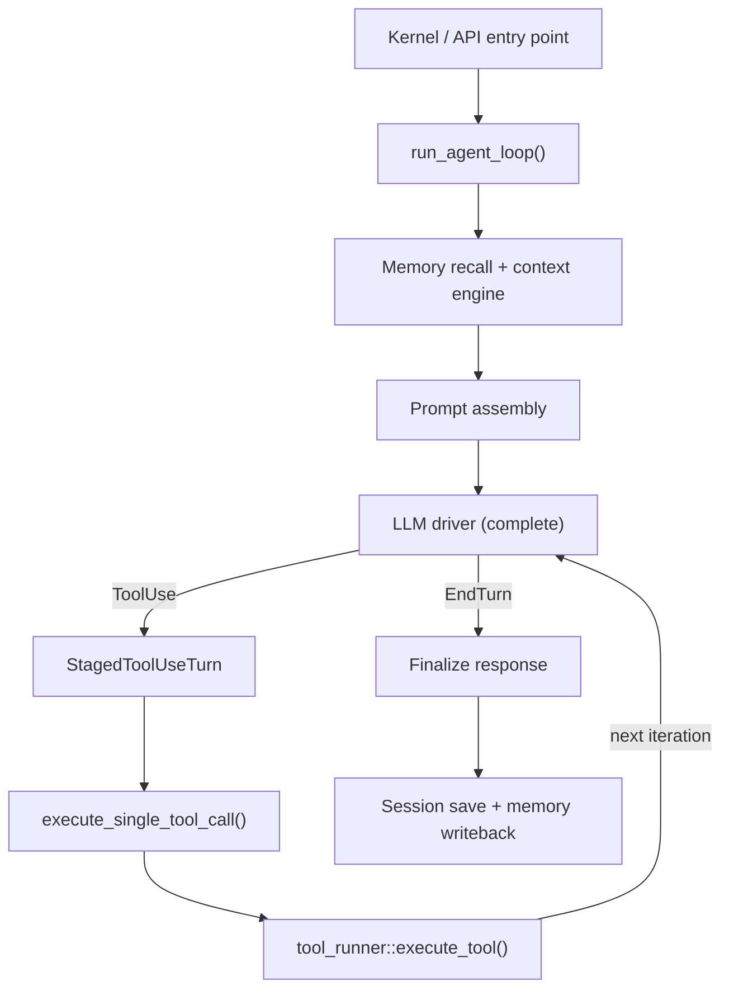

# Agent Runtime — librefang-runtime-src

# Agent Runtime — `librefang-runtime`

The agent runtime is the execution heart of LibreFang. It manages the agent loop (receive message → recall memories → call LLM → execute tools → persist conversation), provides a tool execution pipeline with sandboxing and policy enforcement, and integrates memory, context management, web search, MCP servers, and plugin/skill systems into a coherent runtime.

## Architecture Overview

## The Agent Loop (`agent_loop.rs`)

The central function is `run_agent_loop()`. It accepts a user message, an agent manifest, a session, driver references, and a large set of dependency-injected components. The loop runs up to `MAX_ITERATIONS` (default 50, overridable via `manifest.autonomous.max_iterations`).

### Loop phases per iteration

1. **Interrupt check** — if `LoopOptions::interrupt` signals cancellation, the loop returns a silent result immediately.
2. **Context engine compaction** — when `context_engine.should_compress()` returns true, the engine runs an LLM-based summarisation pass to shrink the message history before assembling the prompt.
3. **Context overflow recovery** — if messages still exceed the context window, `recover_from_overflow()` performs hard trimming, then `apply_context_guard()` enforces per-message token limits.
4. **LLM call** — a `CompletionRequest` is built with the assembled messages, system prompt, tools, and model parameters. The call goes through `call_with_retry()` which handles rate-limiting, overloaded errors, and provider cooldown.
5. **Response classification** by `stop_reason`:
   - **EndTurn / StopSequence** — the LLM is done. Text is extracted, reply directives are parsed, and the loop either returns the response or retries on empty/hallucinated output.
   - **ToolUse** — tool calls are staged via `StagedToolUseTurn`, executed one by one through `execute_single_tool_call()`, and the results are committed back to the message history.
   - **MaxTokens** — the response was truncated. The assistant's partial text is appended and the loop continues with a continuation prompt, up to `MAX_CONTINUATIONS` (5).

### StagedToolUseTurn

A structural guard against orphaned `tool_use` messages. Previously, eager message insertion before tool execution could leave `session.messages` in a half-committed state (assistant message with `tool_use` blocks but no matching `tool_result`), causing provider 400 errors. `StagedToolUseTurn` buffers the assistant message and all tool results locally; only `commit()` writes to `session.messages` and the LLM working copy atomically. If control flow exits early (error, signal, `?` propagation), the staged turn is dropped without side effects. `pad_missing_results()` fabricates synthetic "not executed" results for any tool that didn't run.

### LoopOptions

| Field | Purpose |
|---|---|
| `is_fork` | Derivative (ephemeral) turn — skips session persistence, memory writeback, and `AgentLoopEnd` hooks with `is_fork: false`. Used by auto-dream and other background tasks. |
| `allowed_tools` | Runtime allowlist beyond the manifest. Enforced at execute time (not request-schema time) so Anthropic prompt cache alignment is preserved. |
| `interrupt` | Per-session `SessionInterrupt` handle. Long-running tools poll this to abort on `/stop`. |

### Loop exit conditions

- Normal `EndTurn` completion
- Silent response (`NO_REPLY`, `[[silent]]`, or policy block)
- Provider not configured
- Session interrupt
- `MAX_ITERATIONS` exceeded
- Circuit breaker from `LoopGuard`
- `MAX_CONSECUTIVE_ALL_FAILED` (3) iterations where every tool returned a hard error
- Tool timeout (`TOOL_TIMEOUT_SECS`, default 600s)
- `MAX_CONTINUATIONS` consecutive MaxTokens continuations

## Tool Execution Pipeline (`tool_runner.rs`)

`execute_tool()` validates inputs then delegates to `execute_tool_raw()`, which is a large dispatch function routing to the appropriate handler:

- **Built-in tools** — file operations, shell execution, memory tools, web search/fetch, browser automation, image generation, TTS, canvas, cron, task management, knowledge queries
- **Skill-invoked tools** — dispatched through the `SkillRegistry`
- **MCP tools** — routed through `McpConnection` instances
- **Hand tools** — `tool_hand_activate` delegates to external hands (Python runtimes, etc.)

Safety layers applied during execution:

| Layer | Mechanism |
|---|---|
| Loop guard | `LoopGuard` tracks per-tool call frequency; can warn, block, or circuit-break |
| Approval policy | Tool-level approval requirements (human-in-the-loop) |
| Sandbox | Workspace sandbox prevents path traversal (`resolve_sandbox_path`); Docker sandbox available for untrusted code |
| Dangerous commands | `DangerousCommandChecker` with per-session allowlists for shell commands |
| Tool budget | `ToolBudgetEnforcer` caps per-turn aggregate tool output size |
| Injection guard | `scan_message()` detects prompt-injection patterns in user input |
| Hooks | `HookRegistry` fires `BeforeToolCall` / `AfterToolCall`; hooks can block execution |

Each tool execution is wrapped in a `tokio::time::timeout` (default 600s). Timeout produces an `Expired` status result fed back to the LLM.

## Context Management

### Context budget (`context_budget.rs`)

`ContextBudget` is constructed from the model's context window size. It provides:
- `apply_context_guard()` — caps individual tool result sizes within the message history
- `truncate_tool_result_dynamic()` — head+tail truncation preserving start and end of output

### Context overflow recovery (`context_overflow.rs`)

`recover_from_overflow()` is a multi-stage trim:
1. Drop oldest non-pinned messages
2. Truncate large tool results
3. Final error if still over budget

Returns a `RecoveryStage` enum (`None`, `Trimmed`, `FinalError`).

### Context compressor (`context_compressor.rs`)

`ContextCompressor` performs LLM-based summarisation when token usage exceeds ~80% of the context window. Only triggers when the hard trim fallback would also be needed, serving as a softer first pass.

### Context engine (`context_engine.rs`)

Pluggable interface for custom context management. Implementations can override:
- `ingest()` — recall memories for a user message
- `assemble()` — build the final message list for the LLM
- `compact()` — LLM-powered compaction with summary generation
- `should_compress()` — threshold gating
- `after_turn()` — post-turn state updates
- `truncate_tool_result()` — custom tool result truncation

When `context_engine` is `None`, the runtime falls back to inline logic (compressor → overflow recovery → context guard).

## Memory Integration

### Recall flow

1. If a `ContextEngine` is provided, it handles recall via `ingest()`.
2. Otherwise, if an `EmbeddingDriver` is available, vector-based semantic recall is used (`recall_with_embedding_async`), falling back to text search on embedding failure.
3. Text-only recall (`memory.recall()`) is the final fallback.
4. Proactive memory (`auto_retrieve`) supplements recalled memories for non-fork turns.

### Writeback flow (post-turn, non-fork only)

1. `remember_interaction_best_effort()` — persists a "User asked: … I responded: …" episodic memory, preferring embedding-backed storage.
2. `context_engine.after_turn()` — advances context engine state.
3. `proactive_memory.auto_memorize()` — extracts structured memories and relations from the turn's messages via a forked agent call.

## Web Tools

### Web search (`web_search.rs`)

Multi-provider search: Brave, DuckDuckGo, Perplexity, Jina. `search_auto()` tries providers in order based on configuration.

For agents whose models don't support tool/function calling (`web_search_augmentation` mode), the runtime automatically generates search queries via a lightweight LLM call, executes searches, and injects results as context before the main LLM call.

### Web fetch (`web_fetch.rs`)

HTTP fetch with options for extraction mode, content type handling, and caching. Uses a pinned HTTP client with proxy support.

### Web content (`web_content.rs`)

HTML → markdown conversion with `extract_main_content()` for readable article extraction. Used by both fetch and search to clean external content.

### Web cache (`web_cache.rs`)

In-memory LRU cache with TTL eviction for fetched/searched content.

## Model ID Resolution

`strip_provider_prefix()` handles the discrepancy between stored model IDs (often `provider/org/model`) and what upstream APIs expect. For providers requiring `org/model` format (OpenRouter, Together, Fireworks, Replicate, Chutes, Huggingface), bare model names are normalized to qualified form via `normalize_bare_model_id()`, covering common prefixes like `gemini-`, `claude-`, `gpt-`, `llama-`, `deepseek-`, `mistral-`, `qwen-`, `command-`.

## Safety and Security Modules

### Workspace sandbox (`workspace_sandbox.rs`)

`resolve_sandbox_path()` canonicalizes paths and rejects:
- Absolute paths outside the workspace root
- `..` traversal components
- Symlink escapes
- Paths with null bytes

### Shell bleed (`shell_bleed.rs`)

Detects and redacts sensitive information (API keys, tokens, passwords) that might leak through shell command output before it's returned to the LLM.

### PII filter (`pii_filter.rs`)

Configurable regex-based redaction of personally identifiable information (emails, phone numbers, etc.) from user messages. Applied via `push_filtered_user_message()` before messages enter the session.

### Injection guard (`injection_guard.rs`)

Scans user messages for prompt-injection patterns. On detection, a warning prefix is prepended (the message is never silently dropped).

### Dangerous command checker (`dangerous_command.rs`)

`DangerousCommandChecker` maintains a per-session allowlist for shell commands that would otherwise be blocked. Shared across all tool executions within a loop via `Arc<RwLock<...>>`.

## Streaming (`run_agent_loop_streaming`)

The streaming variant follows the same loop structure but:
- Uses `driver.complete_streaming()` which returns `StreamEvent` items via an `mpsc` channel
- Emits `LoopPhase::Streaming` during token production
- Fires `signal_response_complete()` to unblock UI input before post-processing
- Handles partial output on timeout via `TIMEOUT_PARTIAL_OUTPUT_MARKER`

## Session Management

### Session repair (`session_repair.rs`)

`validate_and_repair()` ensures message history integrity:
- Ensures `ToolResult` messages are always preceded by matching `ToolUse`
- Removes orphaned blocks
- `find_safe_trim_point()` locates conversation-turn boundaries for safe trimming
- `strip_tool_result_details()` removes verbose injection markers from tool output

### Checkpoint manager (`checkpoint_manager.rs`)

Git-backed file checkpointing for workspace files. `snapshot()` creates commits in a shadow repository; `init_shadow_repo_if_needed()` lazily initializes the repo. Triggered by `maybe_snapshot()` in tool execution for file-modifying tools.

## Submodule Reference

| Module | Purpose |
|---|---|
| `a2a` | Agent-to-agent communication protocol |
| `apply_patch` | LLM-generated patch application |
| `audit` | Audit log queries for the dashboard |
| `auth_cooldown` | Provider-level rate-limit cooldown tracking |
| `browser` | Playwright-based browser automation tools |
| `catalog_sync` | Model catalog synchronization with remote registries |
| `channel_registry` | Channel (Discord, Slack, etc.) registration |
| `compactor` | Token counting and context size estimation |
| `context_compressor` | LLM-based context summarisation |
| `context_engine` | Pluggable context management trait |
| `context_overflow` | Hard context overflow recovery |
| `docker_sandbox` | Docker-based isolation for untrusted code |
| `embedding` | Embedding driver trait for vector recall |
| `graceful_shutdown` | Coordinated shutdown signaling |
| `hooks` | Lifecycle hook registry (BeforePromptBuild, BeforeToolCall, AfterToolCall, AgentLoopEnd) |
| `image_gen` | Image generation tool |
| `interrupt` | Per-session cancellation signaling |
| `link_understanding` | URL content extraction and summarization |
| `loop_guard` | Per-tool and global call frequency limits with circuit breaker |
| `mcp` | Model Context Protocol client connections |
| `mcp_migrate` | MCP configuration migration |
| `mcp_server` | In-process MCP server for exposing agent tools |
| `media` | Media driver caching |
| `media_understanding` | Image/video analysis engine |
| `model_catalog` | Model pricing and capability lookup |
| `plugin_manager` | Plugin lifecycle (install, parse, validate) |
| `plugin_runtime` | Plugin execution environment |
| `proactive_memory` | Background memory extraction and consolidation |
| `process_manager` | Long-running subprocess lifecycle |
| `process_registry` | System process discovery (which tools are available) |
| `prompt_builder` | System prompt construction and memory section formatting |
| `provider_health` | LLM provider health monitoring |
| `python_runtime` | Python execution environment for hands |
| `registry_sync` | Home directory resolution for registry operations |
| `reply_directives` | Parsing of `[[reply_to:...]]` / `[[silent]]` directives |
| `retry` | Exponential backoff retry with error classification |
| `routing` | Request routing across providers |
| `session_repair` | Message history validation and repair |
| `silent_response` | Detection of `NO_REPLY` / `[no reply needed]` sentinels |
| `shell_bleed` | Sensitive data redaction from shell output |
| `str_utils` | String utilities (safe truncation, etc.) |
| `subprocess_sandbox` | Subprocess-based isolation |
| `tool_budget` | Per-turn aggregate tool output size enforcement |
| `tool_policy` | Tool approval policy engine |
| `tool_runner` | Tool dispatch and execution |
| `trace_store` | On-disk storage for decision traces |
| `tts` | Text-to-speech synthesis (ElevenLabs, Google, OpenAI) |
| `web_cache` | In-memory LRU cache for web content |
| `web_content` | HTML → markdown conversion |
| `web_fetch` | HTTP fetch with extraction |
| `web_search` | Multi-provider web search |
| `workspace_context` | Workspace type detection and file caching |
| `workspace_sandbox` | Path validation and traversal prevention |

## Re-exports

The runtime re-exports several sibling crates for convenience:

- `librefang_llm_drivers::drivers` — concrete LLM driver implementations
- `librefang_llm_driver` — `LlmDriver` trait, `CompletionRequest`, `CompletionResponse`, `StreamEvent`
- `librefang_llm_driver::llm_errors` — error classification utilities
- `librefang_http` — shared HTTP client with proxy support
- `librefang_kernel_handle` — `KernelHandle` trait for kernel RPC
- `librefang_runtime_mcp` — MCP client connections and OAuth
- `librefang_runtime_wasm::sandbox` — WASM sandboxing for untrusted plugins
- `librefang_runtime_wasm::host_functions` — host-side functions exposed to WASM guests
- `librefang_runtime_oauth::{chatgpt_oauth, copilot_oauth}` — OAuth flows for ChatGPT and Copilot providers

## Concurrency Control

A process-global `tokio::sync::Semaphore` (`LLM_CONCURRENCY`) caps simultaneous LLM HTTP calls at 5 (`MAX_CONCURRENT_LLM_CALLS`). Callers queue (`.await`) rather than fail when the limit is reached. This prevents memory spikes on constrained deployments where many agents fire simultaneously.

## Group Chat Support

When `manifest.metadata.is_group` is true, a sanitized `[sender]:` prefix is prepended to user messages so the LLM can distinguish speakers. The prefix is applied after PII filtering to prevent display names that resemble emails/phones from being redacted.

## A/B Experiments

When a running prompt experiment is active for an agent, the runtime:
1. Hashes the session ID modulo 100 to deterministically select a variant via `traffic_split` weights
2. Loads the variant's prompt version from the kernel
3. Replaces the system prompt for the duration of the turn
4. Records `ExperimentContext` (experiment ID, variant, timing) in the `AgentLoopResult`

## AgentLoopResult

The return value from the agent loop carries:

| Field | Description |
|---|---|
| `response` | Final text response (empty if silent) |
| `total_usage` | Accumulated `TokenUsage` across all iterations |
| `iterations` | Number of loop iterations executed |
| `cost_usd` | Populated by the kernel after the loop returns |
| `silent` | True when the agent chose not to reply |
| `directives` | Parsed `reply_to`, `current_thread`, `silent` directives |
| `decision_traces` | Per-tool-call traces with rationale, timing, outcome |
| `memories_saved` | Summaries from `auto_memorize` |
| `memories_used` | Summaries of recalled memories |
| `memory_conflicts` | Detected contradictions between new and existing memories |
| `provider_not_configured` | True when no LLM provider is available |
| `experiment_context` | A/B experiment tracking data |
| `new_messages_start` | Index into `session.messages` where this turn's messages begin |
| `skill_evolution_suggested` | True when 5+ tool calls suggest a repeatable skill pattern |