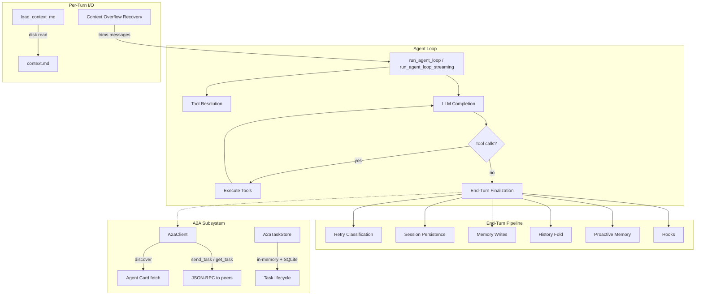

# Agent Runtime — librefang-runtime-src

# LibreFang Runtime (`librefang-runtime`)

## Overview

`librefang-runtime` is the core execution engine for LibreFang agents. It implements the agent loop (the cycle of receiving a user message, dispatching to an LLM, executing tools, and returning a response), cross-agent interoperability via the A2A protocol, per-turn context loading, and all the infrastructure that keeps long-running agent sessions healthy—history trimming, context overflow recovery, proactive memory, and SSRF-hardened outbound networking.

The crate is consumed by the kernel (`librefang-daemon`) and the API layer (`librefang-api`). Extensions and CLI tooling call into specific runtime subsystems (catalog sync, registry sync, provider health probes) but never run the agent loop directly.

## Architecture


```mermaid
graph TD
    subgraph "Agent Loop"
        A[run_agent_loop / run_agent_loop_streaming] --> B[Tool Resolution]
        A --> C[LLM Completion]
        C --> D{Tool calls?}
        D -- yes --> E[Execute Tools]
        E --> C
        D -- no --> F[End-Turn Finalization]
    end

    subgraph "End-Turn Pipeline"
        F --> G[Retry Classification]
        F --> H[Session Persistence]
        F --> I[Memory Writes]
        F --> J[History Fold]
        F --> K[Proactive Memory]
        F --> L[Hooks]
    end

    subgraph "A2A Subsystem"
        M[A2aClient] -->|discover| N[Agent Card fetch]
        M -->|send_task / get_task| O[JSON-RPC to peers]
        P[A2aTaskStore] -->|in-memory + SQLite| Q[Task lifecycle]
    end

    subgraph "Per-Turn I/O"
        R[load_context_md] -->|disk read| S[context.md]
        T[Context Overflow Recovery] -->|trims messages| A
    end

    F -.-> M
```

---

## A2A Protocol (`a2a.rs`)

Implements Google's Agent-to-Agent protocol for cross-framework interoperability. LibreFang agents can both *expose* themselves to external systems and *consume* external agents.

### Core Types

| Type | Purpose |
|---|---|
| `AgentCard` | Capability manifest served at `/.well-known/agent.json`. Lists name, description, skills, supported I/O modes, and streaming capability. |
| `A2aTask` | Unit of work exchanged between agents. Carries messages, artifacts, status, session continuity, and agent/caller identity. |
| `A2aTaskStatus` | Six-state lifecycle: `Submitted` → `Working` → `Completed` / `Failed` / `Cancelled`, plus `InputRequired`. |
| `A2aTaskStatusWrapper` | Polymorphic deserializer that accepts both bare `"completed"` and object `{"state": "completed", "message": …}` forms from different A2A implementations. |
| `A2aMessage` / `A2aPart` | Conversation messages with multi-part content (text, file, structured data). |
| `A2aArtifact` | Task output carrying optional metadata, indexing, and streaming chunk markers. |

### Agent Card Generation

`build_agent_card(manifest, base_url)` converts a `librefang_types::agent::AgentManifest` into an `AgentCard`. Each tool in `manifest.capabilities.tools` becomes an A2A skill descriptor.

### External Agent Discovery

`discover_external_agents` runs at kernel boot for every `ExternalAgent` entry in `config.toml`. It fetches each peer's `/.well-known/agent.json` and returns `(canonical_url, AgentCard)` pairs. URL canonicalization (`canonicalize_a2a_url`) normalizes scheme casing, host casing, default port stripping, and fragment/query cleanup so the trust gate at `/api/a2a/send` matches reliably.

### A2aClient — Outbound A2A Networking

All outbound requests go through `A2aClient`, which rebuilds a `reqwest::Client` per call for SSRF safety.

**SSRF prevention stack (Bugs #3563, #3782, #3785):**

1. `build_client_for_url` calls `web_fetch::check_ssrf` to resolve DNS and validate addresses against private-IP/cloud-metadata ranges.
2. Validated IPs are pinned via `ClientBuilder::resolve` so reqwest cannot re-resolve to a different IP (DNS rebinding TOCTOU).
3. Redirect policy is `Policy::none` — the caller short-circuits on any 3xx. Following redirects would re-resolve DNS for the target, bypassing the pin.
4. Response bodies are streamed through `read_capped_body` with caps of 256 KiB (agent cards) and 1 MiB (task RPCs). Transport decompression is disabled so `Content-Length` and actual byte count match.

### A2aTaskStore — Task Lifecycle Persistence

Tracks all A2A tasks with a bounded in-memory map and optional SQLite backing.

**Construction:**
- `A2aTaskStore::new(max_tasks)` — in-memory only.
- `A2aTaskStore::with_persistence(max_tasks, db_path)` — opens/creates `a2a_tasks_v2` table, prunes rows older than 7 days, loads the most recent `max_tasks` rows into memory on boot.

**Eviction policy (applied lazily on `insert`):**
1. TTL sweep removes all tasks whose `updated_at` exceeds the 24-hour TTL, regardless of status (prevents `Working`/`InputRequired` tasks from accumulating indefinitely).
2. If still at capacity, evicts the oldest terminal-state task (`Completed`/`Failed`/`Cancelled`), falling back to the oldest task overall.

**Read path:** `get(task_id)` checks the in-memory map first. On miss, queries SQLite directly—so tasks evicted from memory by capacity pressure remain queryable via the DB fallback.

**Schema note:** The v2 schema stores `messages` and `artifacts` as JSON arrays plus `session_id`, fixing the v1 bug that split messages into input/output columns and dropped artifacts entirely.

---

## Per-Turn Context Loading (`agent_context.rs`)

Loads the agent's `context.md` file—typically maintained by external tools (cron jobs, scripts)—before each LLM turn. Previously cached for the session lifetime; now re-read from disk every turn by default.

### File Resolution

1. `{workspace}/.identity/context.md` (current layout)
2. `{workspace}/context.md` (legacy fallback)

First candidate that exists wins.

### API

```rust
// Sync — use from non-async entry points (streaming sender path)
fn load_context_md(workspace: &Path, cache_context: bool) -> Option<String>

// Async — use from any tokio runtime context
async fn load_context_md_async(workspace: &Path, cache_context: bool) -> Option<String>
```

Pass `cache_context = true` to freeze on the first successful read (reads from `AgentManifest::cache_context`). Default (`false`) re-reads every turn.

### Behavior

| Condition | Result |
|---|---|
| File absent or empty (whitespace-only) | `None` |
| File is a symlink | `None` with `warn!` — prevents prompt-injection exfil via `/etc/passwd` links |
| File exceeds 32 KiB | Truncated at the last valid UTF-8 boundary |
| Read fails after prior success | Returns cached content with `warn!` — graceful degradation during external writer mid-rewrite |
| Binary / non-UTF-8 content | `None` or `Err` depending on whether valid UTF-8 prefix exists |

The async variant is byte-for-byte identical in behavior (same cache, same symlink rejection, same caps) but uses `tokio::fs` to avoid parking the executor.

---

## Agent Loop: End-Turn Pipeline (`agent_loop/end_turn.rs`)

Handles everything that happens after the LLM emits a final text response (no more tool calls).

### Retry Classification

`classify_end_turn_retry` inspects the response and decides whether the loop should retry:

| Retry Variant | Trigger |
|---|---|
| `EmptyResponse { is_silent_failure }` | Blank text + no tool calls. `is_silent_failure` is true when both input and output token counts are zero (API key / credits issue). Only fires on iteration 0 or silent failures to avoid infinite retry on legitimate empty-end turns. |
| `HallucinatedAction` | Non-empty text, no tool calls, no tools executed this turn, `looks_like_hallucinated_action` matches (e.g. the model says "I'll run the script" but never produces the `tool_use` block). One-shot per turn. |
| `ActionIntent` | User message has action intent (`user_message_has_action_intent`), model produced text but no tool calls. One-shot per turn; not fired if hallucination retry already consumed. |

### Text Finalization

`finalize_end_turn_text` produces the response string:
- Non-empty text passes through unchanged.
- Empty text falls back to `accumulated_text` from intermediate tool-use iterations (agents commonly emit user-facing text alongside tool calls).
- If both are empty: a context-appropriate placeholder message is returned depending on whether tools were executed.

### Successful Turn Finalization

`finalize_successful_end_turn` orchestrates the post-turn pipeline:

1. **Session update** — appends the assistant message to `session.messages`.
2. **Heartbeat pruning** — removes stale heartbeat turns per `autonomous.heartbeat_keep_recent`.
3. **Session persistence** — `memory.save_session_async` (skipped for fork/incognito turns).
4. **Episodic memory** — `remember_interaction_best_effort` writes a `[Past exchange]` entry with sanitized user/response text. Skipped for fork/incognito.
5. **Context engine** — `engine.after_turn` callback (skipped for fork/incognito).
6. **Proactive memory** — `ProactiveMemoryStore::auto_memorize` extracts memories from the new message slice. Gated per-agent via `gated_proactive_memory_for_memorize`.
7. **Hooks** — fires `AgentLoopEnd` event.
8. **Prompt-cache metrics** — emits `librefang::cache` log line with hit ratio, creation, and read token counts.

Fork and incognito turns skip all persistence writes (steps 3–6) to keep ephemeral conversations from leaking into long-term state.

### History Folding

`maybe_fold_stale_tool_results` is the shared fold pass used by both streaming and non-streaming loops. It:

1. Checks a fast-path: if `fold_after_turns == 0` or the message count is under `2 × fold_after_turns`, skips entirely.
2. Calls `history_fold::fold_stale_tool_results` which summarizes old tool-result blocks via the aux LLM.
3. Replays rewrites onto `session.messages` by `tool_use_id` so the fold persists across `save_session_async` and future turns short-circuit via `is_already_folded`.

### Proactive Memory Gating

Two helpers control per-agent overrides:

- `gated_proactive_memory_for_retrieve` — returns `Some(store)` only when both global config and the per-agent `manifest.proactive_memory` allow `auto_retrieve`.
- `gated_proactive_memory_for_memorize` — same pattern for `auto_memorize`.

Both return `Some(store)` without checking per-agent flags when `manifest.proactive_memory` is empty (i.e., no override configured, fall through to global).

---

## Agent Loop: History Configuration (`agent_loop/history.rs`)

Manages the message-history trim cap that prevents unbounded context growth.

| Constant | Value | Purpose |
|---|---|---|
| `DEFAULT_MAX_HISTORY_MESSAGES` | 60 | ~7–10 real turns, keeps prompt-cache prefix stable |
| `MAX_HISTORY_MESSAGES` | 500 | Hard ceiling; operator overrides above this are clamped with a warning |
| `MIN_HISTORY_MESSAGES` | 4 | Floor; caps below this defeat `safe_trim_messages` which needs at least one full tool round-trip |

**Resolution order** (`resolve_max_history`):
1. `manifest.max_history_messages` (per-agent override)
2. `opts.max_history_messages` (kernel config)
3. `DEFAULT_MAX_HISTORY_MESSAGES` (compiled-in default)

The result is then clamped into `[MIN_HISTORY_MESSAGES, MAX_HISTORY_MESSAGES]` with warning logs on out-of-range values.

---

## Agent Loop: Message Helpers (`agent_loop/message.rs`)

### Bounded Text Accumulator

`push_accumulated_text` manages the fallback buffer for the empty-response guard. Intermediate text from tool-use iterations is appended with `\n\n` separators, capped at 64 KiB (`ACCUMULATED_TEXT_MAX_BYTES`). Once the cap is hit, the buffer is sealed with a sentinel and padding—subsequent appends short-circuit. This prevents unbounded heap growth in long-running autonomous loops.

### Response Classifiers

| Function | Purpose |
|---|---|
| `is_no_reply(text)` | Delegates to `silent_response::is_silent_response` — detects `NO_REPLY`, `[no reply needed]`, etc. |
| `is_progress_text_leak(text)` | Catches short ellipsis-terminated preambles ("Let me check…") that the model emits before a tool call that never materializes. Filters by ≤120 chars + trailing `...` or `…`. |

### Memory Sanitizer

`sanitize_for_memory(text) → Option<String>` strips channel-envelope prefixes (`[Group message from …]`, `User asked:`, etc.) before persisting as episodic memory. Returns `None` when nothing meaningful remains—callers must skip persistence to avoid half-empty memory rows that trigger cascade-leak guards on recall.

### Image Stripping

- `strip_processed_image_data` — removes image data from the current turn's messages (already sent to the model).
- `strip_prior_image_data` — removes image data from all messages before the current turn to reclaim context window space.

Both delegate to `librefang_types::message` methods (`strip_images`, `has_images`).

---

## Connections to the Rest of the Codebase

| Consumer | What it uses |
|---|---|
| `librefang-daemon` (kernel) | `run_agent_loop*`, `A2aClient`, `A2aTaskStore`, `discover_external_agents`, `build_agent_card` |
| `librefang-api` | `A2aTaskStore` for `/api/a2a/*` endpoints; `workspace_context::get_file` for dashboard serving |
| `librefang-extensions` (catalog) | `registry_sync::resolve_home_dir_for_tests` for catalog operations |
| `librefang-cli` (bundled agents) | `registry_sync::sync_registry` for initial agent setup |
| `agent_loop` integration tests | `push_accumulated_text`, `finalize_end_turn_text`, `tool_resolution::ResolvedToolsCache` |
| Kernel provider probe | `model_catalog::is_suppressed`, `probe_provider`, `merge_discovered_models` |

### Key Cross-Module Dependencies

- **`web_fetch::check_ssrf`** — called by `A2aClient::build_client_for_url` for DNS resolution + address validation. Returns a `SsrfResolution` that pins validated IPs.
- **`http_client::proxied_client_builder`** — base client builder for all A2A outbound requests.
- **`history_fold`** — the stale tool-result summarization engine; `maybe_fold_stale_tool_results` is the agent-loop integration point.
- **`context_budget`** — provides `truncate_tool_result_dynamic` for dynamic tool-result truncation.
- **`silent_response`** — owns the canonical `is_silent_response` classifier and the envelope prefix/marker constants.
- **`librefang_memory::ProactiveMemoryStore`** — the proactive memory subsystem; called at end-of-turn for `auto_memorize`.
- **`librefang_types::message::Message`** / **`TokenUsage`** — core data types flowing through every agent-loop iteration.