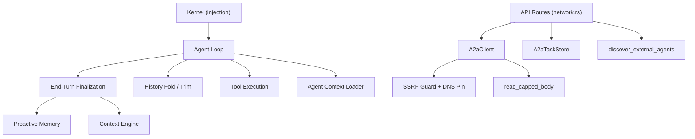

# Agent Runtime — librefang-runtime-src

# LibreFang Runtime (`librefang-runtime`)

The runtime crate houses the core agent execution infrastructure: the agent loop that drives multi-turn conversations, the A2A protocol layer for cross-framework agent interoperability, per-turn context loading, message-history management, and security boundaries for outbound network access.

## Architecture


```mermaid
graph TD
    Kernel["Kernel (injection)"] --> AgentLoop["Agent Loop"]
    AgentLoop --> EndTurn["End-Turn Finalization"]
    AgentLoop --> HistoryFold["History Fold / Trim"]
    AgentLoop --> ToolExec["Tool Execution"]
    
    A2ARoutes["API Routes (network.rs)"] --> A2AClient["A2aClient"]
    A2ARoutes --> A2ATaskStore["A2aTaskStore"]
    A2ARoutes --> Discovery["discover_external_agents"]
    
    AgentLoop --> AgentContext["Agent Context Loader"]
    EndTurn --> ProactiveMem["Proactive Memory"]
    EndTurn --> ContextEngine["Context Engine"]
    
    A2AClient --> SSRF["SSRF Guard + DNS Pin"]
    A2AClient --> BodyCap["read_capped_body"]
```

---

## A2A Protocol (`a2a.rs`)

Implements Google's Agent-to-Agent protocol, enabling LibreFang agents to advertise capabilities via **Agent Cards** and coordinate work through **Tasks**.

### Core Types

**`AgentCard`** — A JSON capability manifest served at `/.well-known/agent.json`. Built from an `AgentManifest` via `build_agent_card`, which converts each tool in the agent's capabilities into an `AgentSkill` descriptor. Cards declare streaming support, push notification support, and accepted input/output content types.

**`A2aTask`** — A unit of work exchanged between agents. Tracks:
- `id` / `session_id` for correlation and conversation continuity
- `status` (current lifecycle state)
- `messages` — the conversation transcript
- `artifacts` — outputs produced by the task
- `agent_id` — which local agent was dispatched to
- `caller_a2a_agent_id` — the external caller's identity (from `X-A2A-Agent-ID` header)

**`A2aTaskStatus`** — Enum: `Submitted` → `Working` → `Completed` / `Failed` / `Cancelled` / `InputRequired`. Wrapped in `A2aTaskStatusWrapper` which deserializes both the bare string form (`"completed"`) and the object form (`{"state": "completed", "message": null}`) used by different A2A implementations.

### Task Store (`A2aTaskStore`)

Bounded in-memory store with optional SQLite persistence. Tasks are created by `tasks/send`, polled by `tasks/get`, and cancelled by `tasks/cancel`.

**Eviction policy** (applied lazily on every `insert`):

1. **TTL sweep** — any task whose `updated_at` exceeds `task_ttl` (default 24 hours) is removed regardless of state. This prevents `Working`/`InputRequired` tasks from accumulating indefinitely.
2. **Capacity eviction** — if still at capacity after the TTL sweep, the oldest terminal-state task (`Completed`/`Failed`/`Cancelled`) is evicted first. Falls back to the oldest task overall when no terminal tasks exist.

**Persistence** (`with_persistence`):

- Schema: `a2a_tasks_v2` table storing `messages_json` and `artifacts_json` as full JSON arrays plus `session_id`, `agent_id`, and `caller_a2a_agent_id`.
- On startup: prunes rows older than 7 days, then loads the most recent `max_tasks` rows into memory. Older rows remain queryable through the SQLite fallback in `get()`.
- Best-effort writes — SQLite failures log a warning but don't block the caller. A full disk silently degrades to in-memory-only behavior.
- `get()` tries the in-memory map first (fast path), then falls back to a direct SQLite query for tasks evicted from memory.

### Client (`A2aClient`)

Discovers and interacts with external A2A agents. Key methods:

- **`discover(url)`** — Fetches the Agent Card from `{url}/.well-known/agent.json`. Response body capped at 256 KiB (`MAX_AGENT_CARD_BYTES`).
- **`send_task(url, message, session_id)`** — Sends a JSON-RPC `tasks/send` request. Body capped at 1 MiB (`MAX_A2A_TASK_BYTES`).
- **`get_task(url, task_id)`** — Polls task status via JSON-RPC `tasks/get`.

Each outbound call builds a fresh `reqwest::Client` rather than reusing one. This is deliberate: DNS resolution and SSRF validation happen together per request so resolved IPs can be pinned.

### Security Hardening

**SSRF prevention** (`build_client_for_url`):

1. Runs `web_fetch::check_ssrf` on the target URL to resolve DNS and validate addresses against private-IP/cloud-metadata ranges.
2. Pins those exact IPs via `ClientBuilder::resolve`, closing the DNS-rebinding TOCTOU window (#3563).
3. Redirect policy set to `Policy::none` — 3xx responses are explicitly rejected. Re-following redirects would re-resolve DNS for the redirect target, defeating the pin (#3563).

**Body size caps** (`read_capped_body`):

Enforces `MAX_AGENT_CARD_BYTES` (256 KiB) or `MAX_A2A_TASK_BYTES` (1 MiB) at two levels:
- Upfront rejection when `Content-Length` exceeds the cap
- Mid-stream abort once accumulated chunks trip the cap

Transport decompression is disabled (`no_gzip`/`no_brotli`/`no_deflate`) so `Content-Length` reflects the actual wire bytes and a compressed bomb can't slip past the upfront check (#3785).

**URL canonicalization** (`canonicalize_a2a_url`):

Normalizes URLs for trust-list comparison: lowercases scheme/host, strips default ports (80 for HTTP, 443 for HTTPS), removes fragments and empty query strings. Used at both trust-insertion time and gate-check time so cosmetic variations don't bypass or falsely deny access (#3786).

### Discovery (`discover_external_agents`)

Called during kernel boot to populate the list of known external agents. Fetches Agent Cards for each configured `ExternalAgent`, stores them keyed by canonicalized URL so the trust gate in `/api/a2a/send` can match on the same key callers pass.

---

## Agent Context (`agent_context.rs`)

Loads per-turn context from `context.md` files that external tools (cron jobs, scripts) write into the agent's workspace. This is the mechanism by which live external data reaches the LLM prompt.

### File Resolution

```
{workspace}/.identity/context.md   ← preferred (new layout)
{workspace}/context.md             ← fallback (legacy / unmigrated)
```

`resolve_context_path` checks `.identity/` first; the first candidate that exists on disk wins.

### Read Semantics

- **Per-turn re-read by default** — the file is read fresh before every system prompt assembly, so external updates propagate immediately.
- **`cache_context` mode** — when `AgentManifest::cache_context` is `true`, the first successful read is frozen and returned verbatim on all subsequent calls.
- **Size cap** — 32 KiB (`MAX_CONTEXT_BYTES`). Oversized files are truncated via `safe_truncate_str`.
- **Read cap** — the I/O itself is bounded (`take(cap)`) so a multi-GB file is never fully loaded into memory.
- **UTF-8 boundary safety** — if the cap lands mid-codepoint, bytes are trimmed back to the last valid UTF-8 boundary.

### Failure Handling

When a re-read fails (e.g. an external writer replaced the file mid-write with invalid UTF-8), the loader falls back to the previously cached content rather than dropping context mid-conversation. Returns `None` only when no context has ever been seen for the workspace.

### Security

- Uses `symlink_metadata` (not `metadata`) and explicitly refuses to follow symlinks. Without this guard, an attacker who can drop a symlink into the workspace could point `context.md` at `/etc/passwd` and have its contents injected into the LLM prompt.
- Both sync (`load_context_md`) and async (`load_context_md_async`) variants enforce identical behavior.

### Sync vs Async

The sync variant exists because the streaming entry point (`send_message_streaming_with_sender_and_opts`) is a non-async wrapper returning a `JoinHandle`. Lifting it to async requires converting an entire kernel entry path (#3579). The async variant uses `tokio::fs` and never parks the executor during the read.

---

## Agent Loop Submodules

### End-Turn Finalization (`agent_loop/end_turn.rs`)

Handles everything that happens after the LLM produces its final response for a turn.

**`finalize_successful_end_turn`** — the main finalization path:

1. Pushes the final response onto the session as an assistant message.
2. Prunes stale heartbeat turns (configurable via `heartbeat_keep_recent`).
3. Persists the session via `memory.save_session_async` — **skipped for fork and incognito turns** (ephemeral conversations must not leak into the parent's canonical history or long-term memory).
4. Writes episodic memory (`remember_interaction_best_effort`) — the user message and response are sanitized via `sanitize_for_memory` to strip channel-envelope prefixes that would become toxic prompt scaffolding on recall.
5. Updates the context engine (`engine.after_turn`).
6. Fires the `AgentLoopEnd` hook.
7. Runs proactive-memory auto-memorize on the new message slice, stamping memories with `sender_chat_scope` to prevent cross-chat leakage (#5227).
8. Emits prompt-cache observability metrics.
9. Assembles the final `AgentLoopResult`.

**Retry classification** (`classify_end_turn_retry`):

Before finalization, the loop checks whether the response warrants a retry:
- **`EmptyResponse`** — empty text and no tool calls on iteration 0, or a silent failure (zero tokens both directions).
- **`HallucinatedAction`** — non-empty text, no tool calls, tools were available, none were executed, and the text matches `looks_like_hallucinated_action`.
- **`ActionIntent`** — same preconditions but the *user's* message has action intent and no hallucination retry was attempted.

**`maybe_fold_stale_tool_results`** — shared fold pass for both streaming and non-streaming loops. Periodically rewrites stale tool results (old `tool_result` blocks replaced with summaries) to keep the context window viable. Fast-paths when there aren't enough messages for any tool result to be classified stale. Rewrites are projected back onto `session.messages` by `tool_use_id` so they persist across turns.

**Proactive-memory gating**:

`gated_proactive_memory_for_retrieve` and `gated_proactive_memory_for_memorize` check per-agent overrides in `manifest.proactive_memory`. This allows operators to disable auto-retrieval or auto-memorization for specific agents (e.g. cron sub-agents) while keeping the global config enabled.

### History Management (`agent_loop/history.rs`)

Constants and resolution logic for the message-history trim cap:

| Constant | Value | Purpose |
|---|---|---|
| `DEFAULT_MAX_HISTORY_MESSAGES` | 60 | ~7–10 real turns, stable prompt-cache prefix |
| `MAX_HISTORY_MESSAGES` | 500 | Hard ceiling; operator overrides above this are clamped |
| `MIN_HISTORY_MESSAGES` | 4 | Floor; lower values defeat `safe_trim_messages`'s repair heuristic |

**`resolve_max_history(manifest, opts)`** — resolution order:
1. `manifest.max_history_messages` (per-agent)
2. `opts.max_history_messages` (kernel config)
3. `DEFAULT_MAX_HISTORY_MESSAGES` (fallback)

Result is clamped to `[MIN_HISTORY_MESSAGES, MAX_HISTORY_MESSAGES]` with a warning log on out-of-range values.

### Message Helpers (`agent_loop/message.rs`)

Utilities used across the agent loop for text classification, sanitization, and bounded accumulation.

**Accumulated-text buffer** (`push_accumulated_text`):

Agents sometimes emit intermediate text alongside `tool_use` blocks. The buffer captures this as a fallback for the empty-response guard. Bounded at 64 KiB (`ACCUMULATED_TEXT_MAX_BYTES`) — once the cap is reached the buffer is sealed with padding and further appends short-circuit. This prevents unbounded heap growth in long-running autonomous loops.

**Response classifiers**:

- **`is_no_reply(text)`** — delegates to `silent_response::is_silent_response` for `NO_REPLY` / `[no reply needed]` detection.
- **`is_progress_text_leak(text)`** — detects short ellipsis-terminated preambles the model emits before tool calls that never materialize (e.g. `"Waiting for the script to complete..."`). Prevents nonsensical partial output from being delivered as the final reply.

**Memory sanitizer** (`sanitize_for_memory`):

Strips channel-envelope prefixes (WhatsApp-gateway envelope shapes) from messages before persisting as episodic memory. On recall, raw envelope text looks like training-data turn frames and causes the model to dump the literal scaffolding back into the chat reply. Returns `None` when nothing meaningful remains — callers must skip persistence to avoid creating leaky half-empty memory rows.

**`safe_trim_messages`** — trims message history on conversation-turn boundaries with validation/repair to ensure the trimmed window always contains at least a minimal user-assistant exchange.

**`truncate_tool_result_dynamic`** — delegates to the context-budget subsystem for dynamic tool-result truncation based on injection markers and current budget state.

---

## Integration Points

### Inbound (called by)

- **Kernel injection** — `run_agent_loop` and `run_agent_loop_streaming` are the two entry points the kernel calls to execute an agent turn. They consume `LoopOptions`, `AgentManifest`, session state, and the driver chain.
- **API routes** (`src/routes/network.rs`) — A2A routes instantiate `A2aClient`, call `discover_external_agents`, `send_task`, `get_task`, `complete`, and `canonicalize_a2a_url`.
- **Cron compaction** (`src/kernel/cron_compaction.rs`) — uses `CompactionConfig` for background session summarization.

### Outbound (calls into)

- **LLM driver** (`librefang-llm-driver`) — `CompletionRequest` / `CompletionResponse` for all LLM interactions (summarization, folding, routing, the agent loop itself).
- **Memory substrate** (`librefang-memory`) — session persistence (`save_session_async`), proactive memory (`auto_memorize`).
- **HTTP client** (`librefang-http`) — `proxied_client_builder` for all outbound HTTP with proxy support.
- **SSRF guard** (`web_fetch::check_ssrf`) — validates and pins DNS for every outbound A2A request.
- **Context engine** — `after_turn` for post-turn state updates.
- **History fold** (`history_fold.rs`) — `fold_stale_tool_results` for periodic tool-result summarization.
- **Hooks** (`hooks.rs`) — `fire_hook_best_effort` for `AgentLoopEnd` and other lifecycle events.