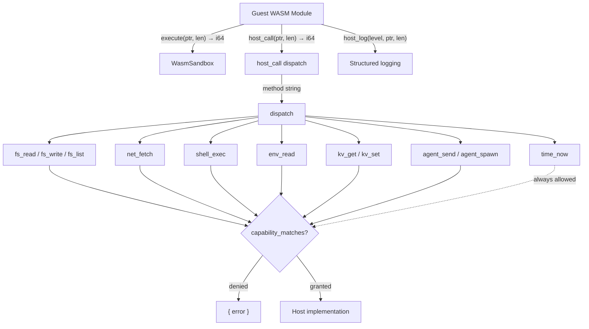

# Agent Runtime — librefang-runtime-wasm-src

# Agent Runtime — librefang-runtime-wasm

Secure WASM sandbox for executing untrusted skill/plugin modules with deny-by-default capability-based access control.

## Overview

This crate provides the execution layer for LibreFang's WASM-based agent skills. Untrusted WASM modules run inside a Wasmtime sandbox that enforces three independent resource limits — CPU fuel, wall-clock timeout, and memory growth — while exposing a controlled set of host functions that each require explicit capability grants.

The sandbox is intentionally minimal: no WASI, no filesystem access, no network. Every privileged operation goes through `host_call`, which dispatches to a capability-checked handler. If no matching capability is found, the operation is rejected.

## Architecture



## Guest ABI Contract

WASM modules must export three symbols:

| Export | Signature | Purpose |
|--------|-----------|---------|
| `memory` | Linear memory | Shared memory for data transfer |
| `alloc` | `(size: i32) → i32` | Allocate `size` bytes in guest memory, return pointer |
| `execute` | `(input_ptr: i32, input_len: i32) → i64` | Entry point receiving JSON input |

The `execute` return value is a packed `i64`: high 32 bits = result pointer, low 32 bits = result length. Both input and result are UTF-8 JSON bytes.

## Host ABI

The host injects two functions under the `"librefang"` import module:

### `host_call(request_ptr: i32, request_len: i32) → i64`

Single RPC entry point for all privileged operations. The request is JSON:

```json
{"method": "fs_read", "params": {"path": "/data/config.toml"}}
```

Response is a packed `(ptr, len)` pointing to one of:

```json
{"ok": "<result>"}
{"error": "Capability denied: FileRead(\"/etc/passwd\")"}
```

Request payloads are capped at `MAX_HOST_CALL_REQUEST_BYTES` (1 MiB). Responses are capped at `MAX_GUEST_RESULT_BYTES` (1 MiB). Both caps are enforced before any memory access or JSON parsing.

### `host_log(level: i32, msg_ptr: i32, msg_len: i32)`

Lightweight logging with no capability check. Messages are truncated at `MAX_LOG_BYTES` (4096 bytes) with lossy UTF-8 decoding. Bare CR/LF characters are replaced with the pilcrow character (↵) to prevent log injection of fake structured lines.

| Level | Mapping |
|-------|---------|
| 0 | `trace` |
| 1 | `debug` |
| 2 | `info` |
| 3 | `warn` |
| ≥4 | `error` |

## Sandbox Lifecycle

Each call to `WasmSandbox::execute` follows these steps:

1. **Fresh Engine creation** — a new `wasmtime::Engine` is created per invocation so that epoch-based interruption is isolated to this guest only (no cross-guest contamination from `Engine::increment_epoch`).

2. **`spawn_blocking` dispatch** — the synchronous WASM execution runs on a Tokio blocking thread so the async executor stays responsive.

3. **Store setup** — `GuestState` is initialized with capabilities, kernel handle, agent ID, and a `MemoryLimiter` enforcing `max_memory_bytes`.

4. **Fuel + epoch** — `store.set_fuel(fuel_limit)` meters guest instructions; `store.set_epoch_deadline(1)` enables wall-clock interruption via a watchdog thread.

5. **Watchdog thread** — an RAII-guarded OS thread sleeps until the timeout expires, then calls `engine.increment_epoch()`. On normal completion the guard signals the done flag, unparks the thread, and joins it — no thread leak on any exit path.

6. **Instantiation** — host functions are registered in a `Linker`, the module is instantiated, and required exports (`memory`, `alloc`, `execute`) are validated.

7. **Input marshalling** — JSON input is serialized, guest `alloc` is called, bytes are copied into guest memory with overflow-checked bounds.

8. **Execution** — `execute_fn.call` runs the guest. Traps are classified: `Trap::OutOfFuel` → `FuelExhausted`, `WallClockTimeout` or `Trap::Interrupt` → timeout error.

9. **Output extraction** — result pointer/length are unpacked, bounds-checked, capped at `MAX_GUEST_RESULT_BYTES`, and deserialized as JSON.

### Denial-of-Wallet Fuel Guard

Wasm fuel only meters guest CPU instructions. Without additional protection, a guest could loop on `agent_send` or `net_fetch` with near-zero fuel burn while consuming real LLM tokens or outbound bandwidth. To prevent this, `host_call` reserves method-keyed fuel **before** dispatching:

| Method | Fuel cost |
|--------|-----------|
| `agent_spawn` | 200,000 |
| `agent_send` | 100,000 |
| `net_fetch` | 5,000 |
| `shell_exec` | 5,000 |
| All others | 0 |

If remaining fuel is below the reservation, the call is rejected with `"host fuel exhausted"` without invoking the host function. This makes `fuel_limit` a real ceiling on host-side resource consumption.

### Epoch Interruption (Bug #3864 Defense-in-Depth)

Each `execute` call gets its own `Engine`, so `increment_epoch` physically cannot reach another guest's store. On top of that, the per-store `epoch_deadline_callback` checks the guest's own `start.elapsed() >= timeout` before trapping — false-positive epoch ticks (from any future regression that shares an Engine) are silently dropped by extending the deadline.

## Capability System

Capabilities are deny-by-default. Every host function (except `time_now`) calls `check_capability` before executing. The check uses `capability_matches` from `librefang-types`, which supports wildcard patterns — e.g., `FileRead("/data/*")` matches any path under `/data/`.

On macOS, canonicalize resolves `/tmp` → `/private/tmp`, `/var` → `/private/var`, etc. at the firmlink layer. `check_capability` strips the `/private/` prefix before matching so that operator grants written against user-facing paths (`/tmp/*`, `/var/log/*`) work correctly.

## Host Functions

### `time_now` — Always Allowed

Returns current UNIX epoch seconds. No capability check.

### Filesystem: `fs_read`, `fs_write`, `fs_list`

All three canonicalize the path **before** the capability check so that symlink escapes and traversal sequences are resolved to their real targets:

- **`fs_read`** / **`fs_list`** use `safe_resolve_path`, which rejects `..` components and then `canonicalize`s to resolve symlinks. Requires `FileRead(canonical_path)`.
- **`fs_write`** uses `safe_resolve_parent`, which canonicalizes the parent directory and appends the filename. Additionally rejects leaf symlinks (via `symlink_metadata` check + `O_NOFOLLOW` on the `open` call) to prevent an attacker from pre-staging a symlink that points outside the grant. Requires `FileWrite(resolved_path)`.

### Network: `net_fetch`

Performs outbound HTTP requests with multi-layer SSRF protection:

1. **Scheme validation** — only `http://` and `https://` allowed.
2. **Userinfo rejection** — URLs containing `@` in the authority are blocked (prevents `http://allowed@evil/` bypass).
3. **Hostname blocklist** — `localhost`, `169.254.169.254`, cloud metadata endpoints.
4. **DNS resolution + IP check** — every resolved IP is checked against private ranges (10.0.0.0/8, 172.16.0.0/12, 192.168.0.0/16, 169.254.0.0/16, fc00::/7, fe80::/10). IPv4-mapped IPv6 addresses (`::ffff:X.X.X.X`) are canonicalized to IPv4 before the check.
5. **DNS pinning** — resolved addresses are pinned onto the HTTP client via `resolve()` so DNS rebinding cannot bypass the IP check between validation and connection.

Requires `NetConnect(host:port)`.

Uses `tokio::task::block_in_place` to bridge the sync host call to async HTTP without starving the epoch watchdog.

### Shell: `shell_exec`

Spawns a subprocess via `tokio::process::Command::new` (not a shell — safe from injection). Security measures:

- **Environment stripping** — `env_clear()` followed by a hard-coded allowlist (`PATH`, `HOME`, `TMPDIR`, `LANG`, `LC_ALL`, `TERM`). Prevents exfiltration of LLM API keys, vault tokens, etc.
- **Output cap** — 1 MiB per stream (`SHELL_EXEC_MAX_OUTPUT_BYTES`). Both stdout and stderr are drained concurrently via `tokio::select!`; if either hits the cap the child is killed immediately.
- **Wall-clock timeout** — 30 seconds (`SHELL_EXEC_TIMEOUT_SECS`). Child is killed on timeout via `kill_on_drop`.

Requires `ShellExec(command_path)`.

### Environment: `env_read`

Reads a single environment variable. Two-layer protection:

1. **Capability gate** — requires `EnvRead(name)`.
2. **Secret blocklist** — regardless of capability, variables matching blocked patterns return `null` silently (no error, so the guest can't probe for secret existence).

The blocklist uses word-boundary substring matching to avoid false positives like `MONKEYHOUSE` or `KEYBOARD_LAYOUT`:

- **Substring patterns**: `KEY`, `SECRET`, `TOKEN`, `PASSWORD`, `CREDENTIAL`, `PRIVATE` — matched at word boundaries (non-alphanumeric or string edge on both sides).
- **Exact names**: `LIBREFANG_VAULT_KEY`, `ANTHROPIC_API_KEY`, `OPENAI_API_KEY`, `AWS_SECRET_ACCESS_KEY`, etc.

### Memory KV: `kv_get`, `kv_set`

Persistent key-value storage backed by the kernel's `MemoryAccess` trait. Security measures:

- **Namespace isolation** — keys are prefixed with `{agent_id}:` so agents cannot read or overwrite each other's entries.
- **Key size cap** — 1024 bytes (`MAX_KV_KEY_BYTES`).
- **Value size cap** — 1 MiB (`MAX_KV_VALUE_BYTES`), checked on both get and set.
- Capability check runs **before** value deserialization so a guest without `MemoryWrite` cannot force the host to serialize a large blob.

Requires `MemoryRead(key)` / `MemoryWrite(key)`.

### Agent Interaction: `agent_send`, `agent_spawn`

- **`agent_send`** — sends a message to another agent and returns the response. Uses `block_in_place` to avoid starving the watchdog. Requires `AgentMessage(target)`.
- **`agent_spawn`** — spawns a new agent from a TOML manifest. The kernel enforces capability inheritance (child capabilities ≤ parent). Requires `AgentSpawn`.

Both require a kernel handle in `GuestState`.

## Security Measures Summary

| Threat | Mitigation |
|--------|------------|
| Path traversal | `..` component rejection + `canonicalize` before capability check |
| Symlink escape | Canonical path checked against grant; `O_NOFOLLOW` on writes |
| SSRF | Scheme/userinfo check, hostname blocklist, DNS-pinned private IP rejection, IPv6-mapped canonicalization |
| Credential exfiltration via env | Word-boundary blocklist returns `null` silently |
| KV namespace collision | Agent-prefixed keys |
| Unbounded memory growth | `MemoryLimiter` on every `memory.grow` |
| CPU runaway | Wasmtime fuel metering |
| Wall-clock hang | Per-engine epoch watchdog thread + store-local timeout callback |
| Denial-of-wallet | Per-method fuel reservation before host dispatch |
| Log injection | CR/LF sanitization, message truncation at 4 KiB |
| Oversized payloads | 1 MiB caps on host_call requests, guest results, KV values, shell output |

## Configuration

```rust
pub struct SandboxConfig {
    pub fuel_limit: u64,           // Default: 1,000,000
    pub max_memory_bytes: usize,   // Default: 16 MiB
    pub capabilities: Vec<Capability>,
    pub timeout_secs: Option<u64>, // Default: 30s
}
```

## Error Types

```rust
pub enum SandboxError {
    Compilation(String),    // WASM validation or compilation failure
    Instantiation(String),  // Link-time failure (missing exports, etc.)
    Execution(String),      // Runtime trap, timeout, or ABI violation
    FuelExhausted,          // Guest exceeded CPU fuel budget
    AbiError(String),       // Missing exports, invalid packed pointers, oversized results
}
```

## External Dependencies

| Crate | Role |
|-------|------|
| `wasmtime` | WASM runtime with fuel metering, epoch interruption, and resource limiters |
| `librefang-types` | `Capability` enum, `capability_matches` |
| `librefang-kernel-handle` | `KernelHandle` trait — `MemoryAccess`, `AgentControl`, etc. |
| `librefang-http` | `proxied_client_builder` for DNS-pinned HTTP client |
| `tokio` | Async runtime, `block_in_place`, `spawn_blocking`, subprocess management |
| `serde_json` | All host/guest data interchange |