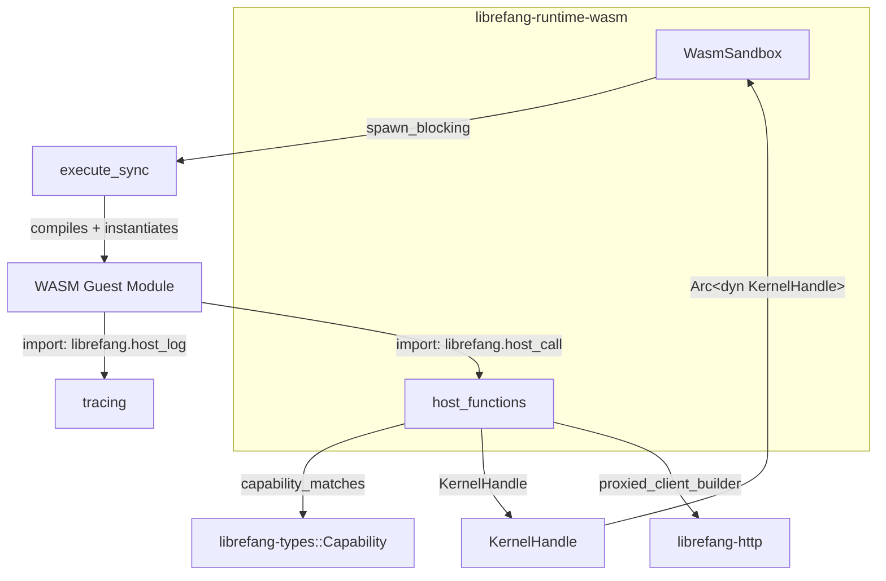

# Agent Runtime — librefang-runtime-wasm-src

# Agent Runtime — `librefang-runtime-wasm`

WASM sandbox for executing untrusted agent skills and plugins. Built on Wasmtime with deny-by-default capability enforcement, deterministic fuel metering, and wall-clock epoch interruption.

## Architecture



The crate has two modules:

- **`sandbox`** — The `WasmSandbox` engine: compiles WASM, manages the Wasmtime store, handles the guest ABI, and drives execution on a blocking thread.
- **`host_functions`** — The `dispatch` function and individual host handlers. Every privileged operation goes through `check_capability` before executing.

## Sandbox Execution Flow

```
WasmSandbox::execute (async)
  └─ spawn_blocking → execute_sync
       ├─ Module::new (compile)
       ├─ Store::new (with GuestState)
       ├─ store.set_fuel(fuel_limit)
       ├─ Spawn watchdog thread (epoch interruption)
       ├─ Linker → instantiate (no WASI)
       ├─ Write input JSON into guest memory via alloc
       ├─ Call guest execute(ptr, len) → packed i64
       └─ Read output JSON from guest memory
```

### `WasmSandbox::execute`

```rust
pub async fn execute(
    &self,
    wasm_bytes: &[u8],
    input: serde_json::Value,
    config: SandboxConfig,
    kernel: Option<Arc<dyn KernelHandle>>,
    agent_id: &str,
) -> Result<ExecutionResult, SandboxError>
```

Wraps `execute_sync` in `tokio::task::spawn_blocking` because WASM compilation and execution are CPU-bound. The `Engine` is cloned (cheap — it shares internal state) and moved into the blocking closure.

### Resource Limits

| Mechanism | Config field | Default | Effect |
|-----------|-------------|---------|--------|
| Fuel metering | `fuel_limit` | 1,000,000 | Traps with `Trap::OutOfFuel` when exhausted |
| Epoch interruption | `timeout_secs` | 30 | Watchdog thread calls `Engine::increment_epoch()`; guest traps with `Trap::Interrupt` |
| Memory cap | `max_memory_bytes` | 16 MiB | Reserved for future enforcement |

The watchdog thread uses `park_timeout` with an RAII guard (`WatchdogGuard`). When execution completes normally, `Drop` sets a done flag and unparks the watchdog so it exits immediately — no leaked sleeping threads, no false epoch ticks on concurrent stores.

## Guest ABI

WASM modules must export three items:

| Export | Signature | Purpose |
|--------|-----------|---------|
| `memory` | `(memory ...)` | Linear memory backing all data transfer |
| `alloc` | `(func (param i32) -> (result i32))` | Bump allocator: takes size, returns pointer |
| `execute` | `(func (param i32 i32) -> (result i64))` | Entry point: input pointer + length, returns packed result |

### Packed i64 Convention

Both the guest's `execute` return and the host's `host_call` return use the same encoding:

```
i64 = (ptr: u32 << 32) | len: u32
```

High 32 bits are the pointer into guest memory; low 32 bits are the byte length. The host reads/writes JSON bytes at these locations.

### Input/Output Protocol

Input to `execute` is JSON bytes written by the host into guest memory (via `alloc`). Output is JSON bytes written by the host (via the guest's `alloc`) with the packed pointer returned.

## Host ABI

The host provides two imports in the `"librefang"` module:

### `host_call(request_ptr: i32, request_len: i32) -> i64`

Single RPC dispatch. The request is JSON:

```json
{"method": "fs_read", "params": {"path": "/data/config.toml"}}
```

The response is a packed pointer to JSON:

```json
{"ok": "contents..."}
{"error": "Capability denied: FileRead(\"/data/config.toml\")"}
```

All capability-checked operations flow through this function → `host_functions::dispatch`.

### `host_log(level: i32, msg_ptr: i32, msg_len: i32)`

Lightweight logging with no capability check. Level mapping: 0=trace, 1=debug, 2=info, 3=warn, ≥4=error. Messages are prefixed with `[wasm]` and include the agent ID.

## Host Function Dispatch

`host_functions::dispatch` maps method names to handlers:

| Method | Capability | Notes |
|--------|-----------|-------|
| `time_now` | *(none — always allowed)* | Returns `{"ok": unix_timestamp}` |
| `fs_read` | `FileRead(path)` | Path traversal checked after capability gate |
| `fs_write` | `FileWrite(path)` | Uses parent canonicalization for new files |
| `fs_list` | `FileRead(path)` | Returns `{"ok": ["file1", "file2", ...]}` |
| `net_fetch` | `NetConnect(host:port)` | SSRF-protected, DNS-pinned |
| `shell_exec` | `ShellExec(command)` | Environment stripped to safe allowlist |
| `env_read` | `EnvRead(name)` | Returns `{"ok": value}` or `{"ok": null}` |
| `kv_get` | `MemoryRead(key)` | Requires kernel handle |
| `kv_set` | `MemoryWrite(key)` | Requires kernel handle |
| `agent_send` | `AgentMessage(target)` | Async via `tokio_handle.block_on` |
| `agent_spawn` | `AgentSpawn` | Capability inheritance enforced |

Unknown methods return `{"error": "Unknown host method: ..."}`.

### Capability Checking

```rust
fn check_capability(capabilities: &[Capability], required: &Capability) -> Result<(), Value>
```

Iterates granted capabilities and calls `librefang_types::capability::capability_matches`. Deny-by-default: if no granted capability matches the required one, returns a JSON error. This runs before any filesystem, network, or kernel operation.

## Security Defenses

### Path Traversal Protection

Two functions guard filesystem access:

- **`safe_resolve_path`** — For reads and directory listings. Rejects any path containing `..` components, then canonicalizes to resolve symlinks.
- **`safe_resolve_parent`** — For writes where the target may not exist yet. Canonicalizes the parent directory and validates the filename. Double-checks the filename doesn't contain `..`.

Both use `checked_add` on pointer arithmetic to prevent overflow on 32-bit hosts.

### SSRF Protection (`is_ssrf_target`)

Network requests go through multi-layer validation:

1. **Scheme allowlist** — Only `http://` and `https://` permitted.
2. **Hostname blocklist** — Rejects `localhost`, `metadata.google.internal`, `metadata.aws.internal`, `instance-data`, `169.254.169.254`.
3. **DNS resolution and IP check** — Resolves the hostname, canonicalizes IPv4-mapped IPv6 (`::ffff:X.X.X.X` → IPv4), then checks every address against private ranges (10.0.0.0/8, 172.16.0.0/12, 192.168.0.0/16, 169.254.0.0/16, fc00::/7, fe80::/10).

The resolved addresses are pinned into the HTTP client via `reqwest::ClientBuilder::resolve` to prevent DNS rebinding / TOCTOU attacks. `librefang_http::proxied_client_builder()` provides the base client.

### Shell Environment Sanitization

`host_shell_exec` passes arguments directly to `Command::new` (no shell, no injection). Before execution, `sanitize_shell_env` clears the entire environment and restores only a hard-coded allowlist:

- **Unix**: `PATH`, `HOME`, `TMPDIR`, `TMP`, `TEMP`, `LANG`, `LC_ALL`, `TERM`
- **Windows**: additionally `USERPROFILE`, `SYSTEMROOT`, `APPDATA`, `LOCALAPPDATA`, `COMSPEC`, `WINDIR`, `PATHEXT`

This prevents accidental exfiltration of API keys, vault tokens, or cloud metadata credentials from the daemon's environment.

On Windows, `CREATE_NO_WINDOW` (0x08000000) is set to suppress console windows.

### Capability Inheritance for Spawns

`host_agent_spawn` calls `kernel.spawn_agent_checked` with the parent's capability list, ensuring child agents never exceed their parent's permissions.

## Key Types

### `SandboxConfig`

```rust
pub struct SandboxConfig {
    pub fuel_limit: u64,           // Default: 1_000_000
    pub max_memory_bytes: usize,   // Default: 16 MiB
    pub capabilities: Vec<Capability>,
    pub timeout_secs: Option<u64>, // Default: 30
}
```

### `GuestState`

Carried inside the Wasmtime `Store<GuestState>`, accessible by all host functions:

```rust
pub struct GuestState {
    pub capabilities: Vec<Capability>,
    pub kernel: Option<Arc<dyn KernelHandle>>,
    pub agent_id: String,
    pub tokio_handle: tokio::runtime::Handle,
}
```

### `ExecutionResult`

```rust
pub struct ExecutionResult {
    pub output: serde_json::Value,
    pub fuel_consumed: u64,
}
```

### `SandboxError`

```rust
pub enum SandboxError {
    Compilation(String),
    Instantiation(String),
    Execution(String),
    FuelExhausted,
    AbiError(String),
}
```

## Dependencies on Other Crates

| Crate | Usage |
|-------|-------|
| `librefang-types` | `Capability` enum, `capability_matches` |
| `librefang-kernel-handle` | `KernelHandle` trait for inter-agent operations and memory KV |
| `librefang-http` | `proxied_client_builder()` for SSRF-safe HTTP clients |
| `wasmtime` | WASM compilation, instantiation, fuel, epoch interruption |

## Testing Patterns

Tests in `sandbox.rs` use hand-written WAT modules:

- **`ECHO_WAT`** — Minimal module that returns input unchanged. Tests the full execute cycle.
- **`INFINITE_LOOP_WAT`** — Validates fuel exhaustion traps.
- **`HOST_CALL_PROXY_WAT`** — Forwards input to `host_call` and returns the response. Tests capability denial and method dispatch.

Tests in `host_functions.rs` construct `GuestState` directly via `test_state()` helper and call host functions synchronously, bypassing the sandbox. This allows testing capability logic, path traversal, SSRF, and environment sanitization in isolation.