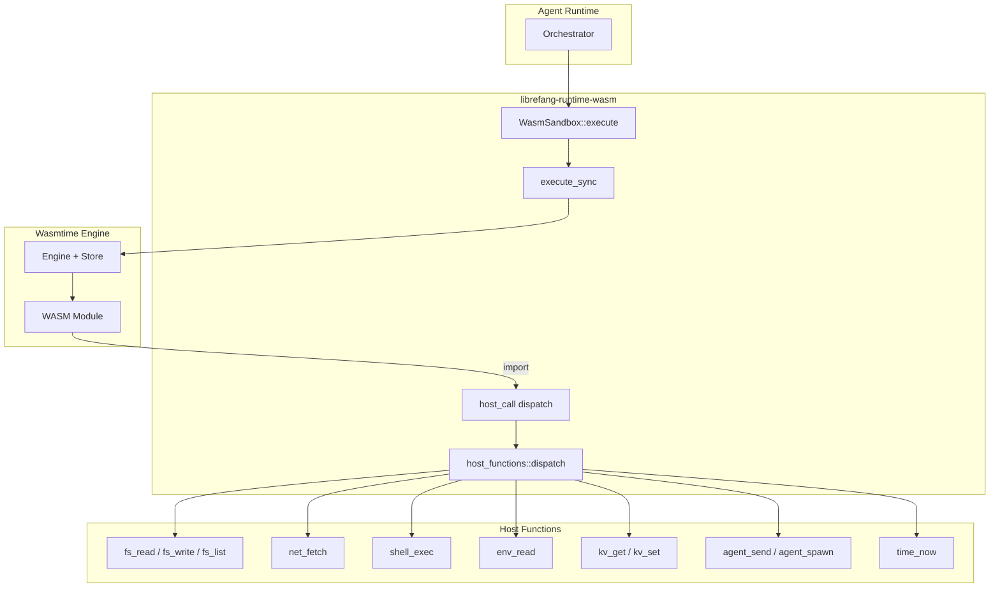

# Agent Runtime — librefang-runtime-wasm-src

# Agent Runtime — librefang-runtime-wasm

## Purpose

This crate provides a **WASM sandbox** for executing untrusted skills and plugins inside the LibreFang agent runtime. It uses [Wasmtime](https://wasmtime.dev/) to isolate guest code with:

- **Deny-by-default capabilities** — no filesystem, network, credential, or inter-agent access unless explicitly granted
- **Fuel-based CPU metering** — deterministic instruction budgets that cap guest CPU consumption
- **Epoch-based wall-clock timeouts** — per-guest interrupt that kills runaway modules
- **Memory growth limits** — `ResourceLimiter` caps linear memory expansion
- **Denial-of-wallet guards** — host calls to external resources (LLM, HTTP, subprocess) charge fuel *before* dispatch

The crate is consumed by the top-level agent runtime when an agent's skill is compiled to WASM. It is a leaf dependency — it calls into `librefang-kernel-handle`, `librefang-types`, and `librefang-http` but nothing calls into it from within the workspace except the runtime orchestrator.

## Architecture



## Guest ABI

WASM modules must export three items:

| Export | Signature | Purpose |
|---|---|---|
| `memory` | Linear memory | Shared memory buffer |
| `alloc` | `(size: i32) -> i32` | Allocate `size` bytes, return pointer |
| `execute` | `(input_ptr: i32, input_len: i32) -> i64` | Main entry point |

The `execute` function receives JSON input bytes and returns a packed `i64`: high 32 bits = result pointer, low 32 bits = result length. The result is JSON bytes in guest memory.

## Host ABI

The host provides two imports in the `"librefang"` module:

### `host_call(request_ptr: i32, request_len: i32) -> i64`

Single RPC dispatch for all capability-checked operations. The request is JSON:

```json
{"method": "fs_read", "params": {"path": "/data/file.txt"}}
```

The response is a packed pointer to JSON:

```json
{"ok": "file contents here"}
{"error": "Capability denied: FileRead(\"/etc/passwd\")"}
```

Before dispatch, `host_call` enforces:
1. **Size cap** — request payload ≤ 1 MiB (`MAX_HOST_CALL_REQUEST_BYTES`)
2. **Fuel reservation** — methods that touch external resources charge fuel *before* the host function runs (denial-of-wallet guard)

### `host_log(level: i32, msg_ptr: i32, msg_len: i32)`

Lightweight logging with no capability check. Level mapping: 0=trace, 1=debug, 2=info, 3=warn, 4+=error. Messages are capped at `MAX_LOG_BYTES` (4096 bytes), truncated with a byte-count annotation, and newlines are sanitized to prevent log injection.

## Sandbox Execution Flow

### `WasmSandbox::execute` (async entry point)

1. Creates a **fresh `Engine`** per invocation for epoch isolation (see Bug #3864 below)
2. Offloads to `spawn_blocking` → `execute_sync` (CPU-bound WASM should not run on the Tokio executor)

### `execute_sync` (blocking inner function)

1. **Compiles** the WASM module via `Module::new` (accepts `.wasm` binary and `.wat` text)
2. **Creates a `Store`** with `GuestState` containing capabilities, kernel handle, agent ID, tokio handle, memory limiter, and wall-clock timeout
3. **Attaches `MemoryLimiter`** — every `memory.grow` from the guest passes through `ResourceLimiter::memory_growing`, rejecting growth beyond `SandboxConfig::max_memory_bytes`
4. **Registers epoch deadline callback** — per-store wall-clock check (defense in depth)
5. **Sets fuel budget** — deterministic instruction metering
6. **Spawns a watchdog thread** — sleeps until timeout, then calls `engine.increment_epoch()`. An RAII guard (`WatchdogGuard`) signals completion and joins the thread on every exit path
7. **Instantiates** the module with host function imports
8. **Calls `execute`** — writes input into guest memory via `alloc`, calls the typed function, reads the packed result
9. **Validates result** — caps at `MAX_GUEST_RESULT_BYTES` (1 MiB), bounds-checks with `checked_add`, parses JSON

### Trap Handling

The `execute_fn.call` result is matched against:

| Trap | Error |
|---|---|
| `Trap::OutOfFuel` | `SandboxError::FuelExhausted` |
| `WallClockTimeout` (typed downcast) | `SandboxError::Execution("timed out")` |
| `Trap::Interrupt` (fallback) | `SandboxError::Execution("timed out")` |
| Anything else | `SandboxError::Execution(e.to_string())` |

## SandboxConfig

```rust
pub struct SandboxConfig {
    pub fuel_limit: u64,           // Default: 1_000_000
    pub max_memory_bytes: usize,   // Default: 16 MiB
    pub capabilities: Vec<Capability>,
    pub timeout_secs: Option<u64>, // Default: 30s
}
```

## Host Functions (`host_functions.rs`)

### Dispatch

`dispatch(state: &GuestState, method: &str, params: &serde_json::Value)` routes to the appropriate handler. All handlers receive `&GuestState` (immutable) and return `serde_json::Value`.

| Method | Capability Required | Notes |
|---|---|---|
| `time_now` | None (always allowed) | Returns UNIX epoch seconds |
| `fs_read` | `FileRead` | Canonicalizes path before capability check |
| `fs_write` | `FileWrite` | Canonicalizes parent directory; refuses symlink leaves |
| `fs_list` | `FileRead` | Directory listing |
| `net_fetch` | `NetConnect` | SSRF-protected, DNS-pinned |
| `shell_exec` | `ShellExec` | Stripped environment, output-capped |
| `env_read` | `EnvRead` | Blocklist suppresses secrets |
| `kv_get` | `MemoryRead` | Keyspaced by `agent_id` |
| `kv_set` | `MemoryWrite` | Keyspaced by `agent_id`, size-capped |
| `agent_send` | `AgentMessage` | Inter-agent messaging via kernel |
| `agent_spawn` | `AgentSpawn` | Spawns child agent with ≤ parent capabilities |

### Denial-of-Wallet Fuel Costs

Host calls that touch external resources charge fuel *before* dispatch:

| Method | Cost | Rationale |
|---|---|---|
| `agent_spawn` | 200,000 | Registers + may run a child agent (highest cost) |
| `agent_send` | 100,000 | Triggers downstream LLM-bearing agent loop |
| `net_fetch` | 5,000 | Outbound HTTP bandwidth |
| `shell_exec` | 5,000 | Subprocess spawn |
| All others | 0 | Pure-host, no external cost |

With the default `fuel_limit` of 1,000,000, a guest can make at most ~5 spawns, ~10 agent sends, or ~200 fetches.

## Security Measures

### Capability Checking

`check_capability` iterates the guest's granted capabilities and calls `capability_matches` from `librefang-types`. On macOS, it also strips the `/private/` prefix that canonicalize adds for alias paths (`/tmp` → `/private/tmp`, `/var` → `/private/var`, `/etc` → `/private/etc`) so operator grants written against the user-facing path still match.

### Path Traversal Protection

Two functions prevent directory traversal:

- **`safe_resolve_path`** — for reads where the file must exist. Rejects any `..` component, then `canonicalize`-s to resolve symlinks. The capability check runs against the canonical path.
- **`safe_resolve_parent`** — for writes where the file may not exist yet. Canonicalizes the parent directory, appends the filename, and double-checks the filename for `..`.

This order matters: canonicalization happens *before* the capability check so that a guest cannot bypass a narrow workspace grant via symlinks (Bug #3457, #3814).

### Symlink Leaf Protection (fs_write)

Even after `safe_resolve_parent`, the leaf filename itself could be a pre-staged symlink pointing outside the grant. `host_fs_write`:

1. Checks `symlink_metadata` — refuses if the leaf is a symlink
2. Opens with `O_NOFOLLOW` (platform-specific: `0o400000` on Linux, `0x0100` on BSD/macOS) so the kernel atomically rejects symlink following, closing the TOCTOU window between the lstat and the open

### SSRF Protection

`is_ssrf_target` validates outbound URLs before `net_fetch`:

1. Only `http://` and `https://` schemes allowed
2. Rejects `@` in the authority component (prevents host confusion bypass, Bug #3527)
3. Blocklists metadata endpoints: `localhost`, `metadata.google.internal`, `metadata.aws.internal`, `instance-data`, `169.254.169.254`
4. Resolves DNS and checks every returned IP against private ranges (10.0.0.0/8, 172.16.0.0/12, 192.168.0.0/16, 169.254.0.0/16, IPv6 fc00::/7, fe80::/10)
5. Canonicalizes IPv4-mapped IPv6 (`::ffff:X.X.X.X`) to IPv4 before checking — prevents bypassing the private-IP check via mapped addresses
6. Pins resolved IPs to the HTTP client via `reqwest::ClientBuilder::resolve` — prevents DNS-rebinding TOCTOU attacks

The HTTP client is built via `librefang_http::proxied_client_builder` and uses `tokio::task::block_in_place` to bridge the sync host call to async HTTP without starving the epoch watchdog.

### Shell Execution Hardening

`host_shell_exec` spawns via `tokio::process::Command::new` (no shell, safe from injection). Security layers:

- **Environment stripping** — `sanitize_shell_env` clears the child's environment and re-adds only a hard-coded allowlist (`PATH`, `HOME`, `TMPDIR`, `TMP`, `TEMP`, `LANG`, `LC_ALL`, `TERM`, plus Windows-specific vars). This prevents API key exfiltration.
- **Wall-clock timeout** — 30 seconds (`SHELL_EXEC_TIMEOUT_SECS`), child is killed on expiry
- **Output cap** — 1 MiB per stream (`SHELL_EXEC_MAX_OUTPUT_BYTES`), child is killed on overflow. Both stdout and stderr are drained concurrently via `tokio::select!`; either stream hitting the cap immediately kills the child (Bug #3529).
- **`kill_on_drop(true)`** — ensures cleanup on all exit paths

### Environment Variable Blocklist

`host_env_read` applies a blocklist *after* the capability check. Secret-shaped variables silently return `null` (not an error), so well-behaved plugins can't probe for secret existence:

- **Substring blocklist** (word-boundary matching): `KEY`, `SECRET`, `TOKEN`, `PASSWORD`, `CREDENTIAL`, `PRIVATE`
- **Exact-name blocklist**: `LIBREFANG_VAULT_KEY`, `ANTHROPIC_API_KEY`, `OPENAI_API_KEY`, `GROQ_API_KEY`, `GEMINI_API_KEY`, `GITHUB_TOKEN`, `NPM_TOKEN`, `AWS_SECRET_ACCESS_KEY`, `AWS_SESSION_TOKEN`

The word-boundary check (`has_word_boundary_substring`) ensures `MONKEYHOUSE` and `KEYBOARD_LAYOUT` are not false-positives — both sides of the match must have a non-alphanumeric boundary (string edge, `_`, `-`, `.`).

### KV Namespace Isolation

`kv_get` and `kv_set` prefix every key with `agent_id:` before passing to the kernel handle (Bug #3837). Two agents using the same guest key produce different namespaced keys and cannot read or overwrite each other's data.

Keys are capped at `MAX_KV_KEY_BYTES` (1024 bytes) and values at `MAX_KV_VALUE_BYTES` (1 MiB, aliased from `MAX_GUEST_RESULT_BYTES`) to prevent unbounded SQLite growth (Bug #3866).

## Epoch Isolation (Bug #3864)

Wasmtime's `Engine::increment_epoch()` is global to an engine — calling it interrupts *every* `Store` sharing that engine. The fix uses two layers:

1. **Per-execution Engine** — `execute_sync` creates a fresh `Engine` for each invocation, so the epoch tick cannot physically reach another guest
2. **Per-store deadline callback** — `store.epoch_deadline_callback` checks this store's own elapsed time before trapping. Even on a hypothetical shared engine, a false-positive epoch tick is silently dropped for a guest whose budget hasn't elapsed

The watchdog thread blocks in `park_timeout(deadline - now)` and is woken via `Thread::unpark` when the main thread finishes (RAII `WatchdogGuard`). On timeout, it calls `engine.increment_epoch()` which triggers the store's deadline callback, which returns a `WallClockTimeout` error that the trap handler detects via `downcast_ref`.

## Error Types

```rust
pub enum SandboxError {
    Compilation(String),      // WASM compilation failed
    Instantiation(String),    // WASM instantiation failed
    Execution(String),        // Runtime trap or timeout
    FuelExhausted,            // CPU budget consumed
    AbiError(String),         // Missing exports, invalid JSON, oversized result
}
```

## Integration Points

| Dependency | Usage |
|---|---|
| `librefang-types` | `Capability` enum, `capability_matches` |
| `librefang-kernel-handle` | `KernelHandle` trait for KV, agent messaging, agent spawning |
| `librefang-http` | `proxied_client_builder` for SSRF-safe outbound HTTP |
| `wasmtime` | Engine, Store, Linker, Module, fuel, epochs, `ResourceLimiter` |
| `tokio` | `spawn_blocking`, `block_in_place`, async process, runtime handle |

## Adding a New Host Function

1. Add the method name to the `match` in `host_functions::dispatch`
2. Implement the handler function following the pattern: extract params → capability check → execute → return JSON
3. If the method touches external resources (LLM, HTTP, subprocess), add a fuel cost entry in `host_call_fuel_cost`
4. Add the corresponding `Capability` variant to `librefang-types` if it doesn't already exist
5. Write tests with a `GuestState` built via `GuestState::for_test`