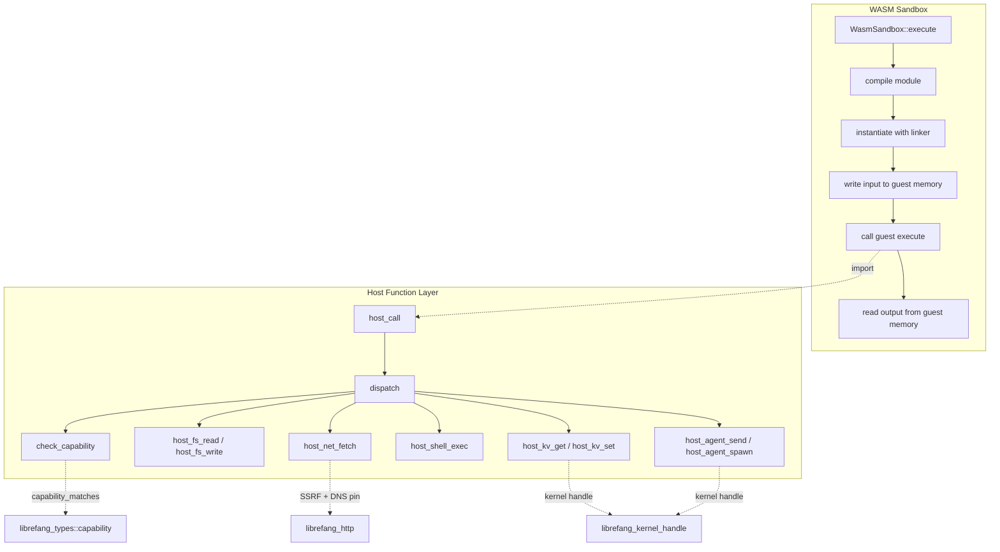

# Agent Runtime — librefang-runtime-wasm-src

# LibreFang WASM Runtime (`librefang-runtime-wasm`)

Secure sandbox for executing untrusted agent skills and plugins as compiled WebAssembly modules. Built on Wasmtime with deny-by-default capability enforcement, deterministic CPU metering, and wall-clock timeouts.

## Architecture



## Module Layout

| File | Responsibility |
|------|---------------|
| `sandbox.rs` | Wasmtime engine lifecycle, guest/host ABI, memory marshalling, fuel and epoch enforcement |
| `host_functions.rs` | Capability-checked host function implementations, path/SSRF/shell security |

## Sandbox Engine

`WasmSandbox` wraps a Wasmtime `Engine` configured with fuel consumption and epoch interruption. Create one instance per kernel and reuse it — the engine is expensive to construct but compiles and instantiates many modules.

### Execution Flow

1. **`WasmSandbox::execute`** (async) — offloads to `spawn_blocking` because WASM compilation and execution are CPU-bound.
2. **`execute_sync`** — the core path:
   - Compiles the WASM bytes (accepts `.wasm` binary or `.wat` text).
   - Creates a `Store<GuestState>` with the caller's capabilities and optional kernel handle.
   - Sets the fuel budget (`SandboxConfig::fuel_limit`).
   - Starts a watchdog thread for wall-clock timeout (`SandboxConfig::timeout_secs`, default 30s).
   - Builds a `Linker` with `host_call` and `host_log` imports.
   - Instantiates the module, retrieves required guest exports (`memory`, `alloc`, `execute`).
   - Marshals JSON input into guest memory via `alloc`.
   - Calls guest `execute`, unpacks the packed `i64` result `(ptr << 32 | len)`.
   - Reads and deserializes JSON output from guest memory.
   - Returns `ExecutionResult` with output JSON and fuel consumed.

### Watchdog Thread

The watchdog uses `park_timeout` with an `AtomicBool` done flag rather than a sleep loop. An RAII `WatchdogGuard` sets the flag and joins the thread on every exit path (success, error, panic). This avoids the previous problems:

- No leaked OS threads from fire-and-forget sleep loops.
- No false epoch interrupts on concurrent stores (the flag is checked before `increment_epoch`).
- Sub-microsecond cleanup on the happy path via `Thread::unpark`.

### SandboxConfig

| Field | Default | Purpose |
|-------|---------|---------|
| `fuel_limit` | `1_000_000` | Max WASM instructions. `0` = unlimited. |
| `max_memory_bytes` | `16 MiB` | Reserved for future enforcement. |
| `capabilities` | `vec![]` | Capabilities granted to this invocation. |
| `timeout_secs` | `30` | Wall-clock timeout via epoch interruption. |

### SandboxError Variants

| Variant | Trigger |
|---------|---------|
| `Compilation` | Wasmtime module compilation failure. |
| `Instantiation` | Linker/instantiation failure. |
| `Execution` | Runtime trap, timeout (epoch interrupt), or `spawn_blocking` join failure. |
| `FuelExhausted` | Guest consumed all allocated fuel. |
| `AbiError` | Missing exports, invalid packed pointers, JSON parse errors, memory bounds violations. |

## Guest ABI

WASM modules targeting this sandbox **must** export three symbols:

```wat
(memory (export "memory") 1)                          ;; linear memory
(func (export "alloc") (param $size i32) (result i32)) ;; bump allocator
(func (export "execute") (param $ptr i32) (param $len i32) (result i64))
```

- **`alloc(size) -> ptr`** — allocate `size` bytes in guest linear memory, return pointer.
- **`execute(input_ptr, input_len) -> i64`** — receive JSON input bytes, return packed `(result_ptr << 32) | result_len` pointing to JSON output bytes.

The host writes input by calling `alloc`, then `copy_from_slice` into guest memory. After `execute` returns, the host reads output from the packed pointer/length.

## Host ABI

The sandbox provides two imports under the `"librefang"` module:

### `host_call(request_ptr: i32, request_len: i32) -> i64`

RPC dispatch for all capability-checked operations. Reads a JSON request from guest memory:

```json
{"method": "fs_read", "params": {"path": "/data/file.txt"}}
```

Returns a packed `(ptr, len)` pointing to JSON in guest memory:

```json
{"ok": "file contents here"}
```

or

```json
{"error": "Capability denied: FileRead(\"/data/file.txt\")"}
```

### `host_log(level: i32, msg_ptr: i32, msg_len: i32)`

Lightweight logging. No capability check. Level mapping: `0` = trace, `1` = debug, `2` = info, `3` = warn, `≥4` = error.

## Host Function Dispatch

`host_functions::dispatch` routes method names to handlers. Every handler (except `time_now`) checks capabilities before executing.

### Method Reference

| Method | Required Capability | Kernel Required | Notes |
|--------|--------------------|-----------------|-------|
| `time_now` | *none* | No | Returns `{"ok": <unix_epoch_secs>}`. Always allowed. |
| `fs_read` | `FileRead(path)` | No | Reads file to string. Path traversal protected. |
| `fs_write` | `FileWrite(path)` | No | Writes string to file. Path traversal protected. |
| `fs_list` | `FileRead(path)` | No | Lists directory entries. Path traversal protected. |
| `net_fetch` | `NetConnect(host)` | No | HTTP client with SSRF protection and DNS pinning. |
| `shell_exec` | `ShellExec(command)` | No | Executes process with sanitized environment. |
| `env_read` | `EnvRead(name)` | No | Reads single environment variable. |
| `kv_get` | `MemoryRead(key)` | Yes | Reads from kernel memory store. |
| `kv_set` | `MemoryWrite(key)` | Yes | Writes to kernel memory store. |
| `agent_send` | `AgentMessage(target)` | Yes | Sends message to another agent. |
| `agent_spawn` | `AgentSpawn` | Yes | Spawns child agent with capability inheritance check. |

All methods return `{"ok": ...}` on success or `{"error": "..."}` on failure.

### Capability Checking

`check_capability` iterates granted capabilities and calls `librefang_types::capability::capability_matches`. Wildcard capabilities (e.g., `FileRead("*")`) match any resource within that domain. If no match is found, the operation is rejected immediately — deny by default.

## Security Measures

### Path Traversal Protection

Two functions enforce safe filesystem access:

- **`safe_resolve_path`** — for reads where the target must exist. Rejects any `..` component, then `canonicalize`s to resolve symlinks.
- **`safe_resolve_parent`** — for writes where the file may not exist yet. Canonicalizes the parent directory, validates the filename doesn't contain `..`, and joins them.

Both functions run **after** the capability gate, providing defense-in-depth.

### SSRF Protection

`host_net_fetch` runs `is_ssrf_target` before any HTTP request:

1. **Scheme allowlist** — only `http://` and `https://` (blocks `file://`, `gopher://`, `ftp://`).
2. **Hostname blocklist** — `localhost`, cloud metadata endpoints (`169.254.169.254`, `metadata.google.internal`, etc.).
3. **DNS resolution** — resolves the hostname, checks every returned IP.
4. **IP classification** — `canonical_ip` unwraps IPv4-mapped IPv6 (`::ffff:X.X.X.X`) to prevent bypass, then blocks loopback, unspecified, and private ranges (RFC 1918, link-local).
5. **DNS pinning** — the resolved addresses are pinned on the HTTP client via `resolve()`, preventing DNS rebinding / TOCTOU attacks between the check and the actual connection.

The HTTP client is built via `librefang_http::proxied_client_builder`, which provides proxy-aware configuration.

### Shell Environment Sanitization

`host_shell_exec` calls `sanitize_shell_env` on every `Command`:

- `env_clear()` removes the entire parent environment.
- Only a hardcoded allowlist is restored: `PATH`, `HOME`, `TMPDIR`, `TMP`, `TEMP`, `LANG`, `LC_ALL`, `TERM`.
- On Windows, additional safe vars are restored (`USERPROFILE`, `SYSTEMROOT`, etc.).

This prevents exfiltration of LLM provider API keys, vault tokens, and cloud metadata credentials through the child process environment. Commands are executed directly via `Command::new` (no shell), so shell injection is not possible.

### Memory Safety

All pointer arithmetic in the sandbox uses `checked_add` to prevent wraparound on 32-bit hosts. Guest memory accesses are bounds-checked against the actual WASM linear memory size before any read or write.

### Capability Inheritance

`host_agent_spawn` calls `kernel.spawn_agent_checked` with the parent's capabilities. The kernel enforces that the child's capabilities are a subset of the parent's — a spawned agent cannot escalate privileges.

## Integration Points

| Dependency | Usage |
|-----------|-------|
| `librefang_types` | `Capability` enum, `capability_matches` function. |
| `librefang_kernel_handle` | `KernelHandle` trait for `memory_recall`, `memory_store`, `send_to_agent`, `spawn_agent_checked`. |
| `librefang_http` | `proxied_client_builder` for SSRF-safe, proxy-aware HTTP requests. |

## Testing

The test suite covers:

- **Capability gating** — every host function rejects calls without matching capabilities (`test_fs_read_denied_no_capability`, `test_shell_exec_denied`, `test_env_read_denied`, etc.).
- **Capability granting** — wildcard capabilities allow access (`test_fs_read_granted_wildcard`, `test_env_read_granted`).
- **Shell environment stripping** — stamps a fake secret into the parent env, runs `/usr/bin/env` via `shell_exec`, verifies the child output doesn't contain it but does contain `PATH` (`test_shell_exec_strips_parent_env_secrets`, Unix only).
- **SSRF blocking** — private IPs, loopback, metadata endpoints, blocked schemes (`test_ssrf_private_ips_blocked`, `test_ssrf_scheme_validation`).
- **SSRF IPv6 bypass** — `::ffff:10.0.0.1` and similar are correctly classified as private (`test_is_private_ip_recognises_ipv4_mapped_v6`).
- **Path traversal** — `..` components rejected in both `safe_resolve_path` and `safe_resolve_parent` (`test_safe_resolve_path_traversal`).
- **Fuel exhaustion** — infinite loop module traps with `FuelExhausted` at low fuel limit (`test_fuel_exhaustion`).
- **Echo module** — basic round-trip: input JSON comes back unchanged (`test_echo_module`).
- **Host call proxy** — `time_now` works through the full sandbox round-trip, unknown methods return errors, capability-denied operations return errors (`test_host_call_time_now`, `test_host_call_unknown_method`, `test_host_call_capability_denied`).

Test WAT modules (`ECHO_WAT`, `INFINITE_LOOP_WAT`, `HOST_CALL_PROXY_WAT`) are defined inline in `sandbox.rs` and don't require external WASM files.