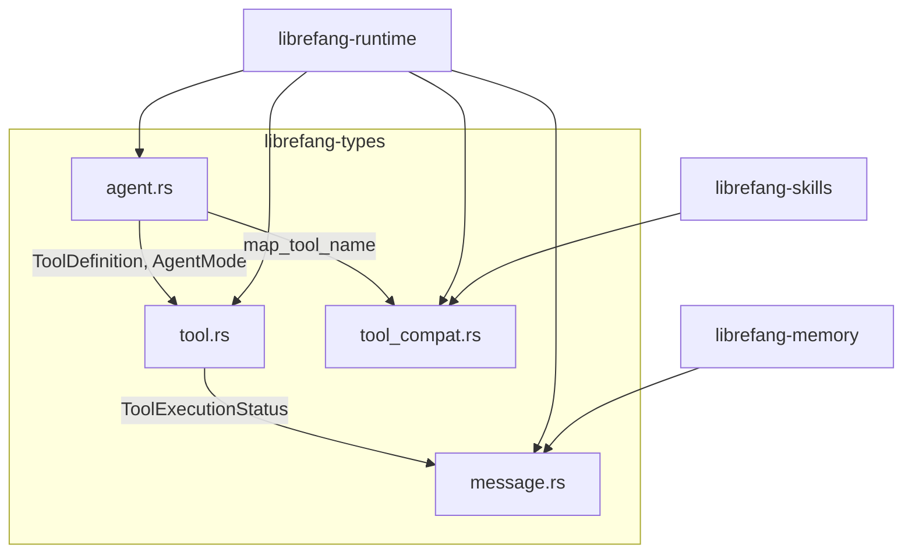

# Agent Runtime — librefang-types-src

# librefang-types

Shared type definitions for the LibreFang agent runtime. This crate is the single source of truth for data structures that flow between the daemon, the runtime, the memory layer, the skill system, and external drivers. Every other crate depends on `librefang-types`; it depends on nothing except `serde`, `chrono`, `uuid`, and `serde_json`.

## Architecture



All crates import from this single location, ensuring that serialisation formats, field names, and enum variants never drift.

---

## agent.rs — Agent Identity, Manifests, State, and Scheduling

### Identifiers

Three newtype wrappers provide type-safe, UUID-backed identifiers:

| Type | Inner | Factory methods |
|---|---|---|
| `UserId` | `Uuid` | `UserId::new()` — random v4 |
| `AgentId` | `Uuid` | `AgentId::new()` — random v4, `AgentId::from_name(name)` — deterministic v5, `AgentId::from_hand_id(hand_id)` — deterministic v5 for hands, `AgentId::from_hand_agent(hand_id, role, instance_id)` — deterministic v5 for multi-agent hand roles |
| `SessionId` | `Uuid` | `SessionId::new()` — random v4, `SessionId::for_channel(agent_id, channel)` — deterministic v5 |

**Deterministic ID derivation.** `AgentId` and `SessionId` use UUID v5 (SHA-1) so the same logical entity always maps to the same UUID across daemon restarts. This preserves session history, cron job associations, and memory key ownership. `AgentId` uses a single namespace UUID with typed prefixes (`"agent:"`, bare hand ID for backward compat, `"{hand_id}:{role}"` or `"{hand_id}:{role}:{instance_id}"`) to avoid collisions.

`SessionId::for_channel` derives a stable session per `(agent, channel)` pair. This means a Telegram session and a WhatsApp session for the same agent are distinct, but each is stable across restarts.

### Agent Lifecycle

```rust
pub enum AgentState {
    Created,     // spawned but not started
    Running,     // actively processing
    Suspended,   // paused, not processing
    Terminated,  // dead, cannot resume
    Crashed,     // awaiting recovery
}
```

`AgentMode` controls what tools an agent can invoke:

- **Observe** — no tools at all.
- **Assist** — read-only subset (`file_read`, `file_list`, `memory_list`, `memory_recall`, `web_fetch`, `web_search`, `agent_list`).
- **Full** (default) — everything granted by the manifest.

`AgentMode::filter_tools` applies this at runtime, returning a reduced `Vec<ToolDefinition>`.

### Scheduling

```rust
pub enum ScheduleMode {
    Reactive,                                                          // event-driven (default)
    Periodic { cron: String },                                         // cron expression
    Proactive { conditions: Vec<String> },                             // condition monitors
    Continuous { check_interval_secs: u64 },                           // persistent loop (default 300s)
}
```

### AgentManifest

`AgentManifest` is the complete declarative configuration for an agent. It is the TOML/JSON structure written by users and persisted by the kernel. Key field groups:

**Identity and routing**
- `name`, `version`, `description`, `author`, `tags`, `metadata`
- `is_hand` — set by the kernel when spawning from a Hand definition
- `identity: AgentIdentity` — emoji, avatar URL, hex color, archetype, vibe, greeting style

**LLM configuration**
- `model: ModelConfig` — provider, model name, max_tokens, temperature, system_prompt, optional api_key_env/base_url
- `model.extra_params` — provider-specific parameters flattened into the API body via `#[serde(flatten)]`. Useful for things like Qwen's `enable_memory`.
- `fallback_models: Vec<FallbackModel>` — tried in order on primary failure
- `routing: Option<ModelRoutingConfig>` — auto-select cheap/mid/expensive models by token count thresholds
- `pinned_model: Option<String>` — stable mode override
- `thinking: Option<ThinkingConfig>` — per-agent extended thinking budget
- `response_format: Option<ResponseFormat>` — structured output mode

**Scheduling and sessions**
- `schedule: ScheduleMode`
- `session_mode: SessionMode` — `Persistent` (reuse session, default) or `New` (fresh session per invocation)
- `autonomous: Option<AutonomousConfig>` — heartbeat interval, timeout overrides, max iterations, max restarts, quiet hours

**Tool access**
- `profile: Option<ToolProfile>` — named presets (`Minimal`, `Coding`, `Research`, `Messaging`, `Automation`, `Full`, `Custom`)
- `capabilities: ManifestCapabilities` — fine-grained grants (network, shell, memory scopes, agent messaging, OFP)
- `tools: HashMap<String, ToolConfig>` — per-tool configuration parameters
- `tool_allowlist` / `tool_blocklist` — additional filtering layers applied after profile/capability expansion
- `tools_disabled` — hard kill switch
- `exec_policy: Option<ExecPolicy>` — per-agent shell execution security

**Resource limits** (`resources: ResourceQuota`)
- Memory (256 MB), CPU time (30s), tool calls/min (60), network/hour (100 MB), cost/hour, cost/day, cost/month
- `max_llm_tokens_per_hour` — `None` inherits global default, `Some(0)` is unlimited, `Some(n)` enforces limit. Use `effective_token_limit()` for the resolved value.

**Skill and plugin access**
- `skills` — empty means all available; `skills_disabled` hard-disables
- `mcp_servers` — empty means all connected servers
- `allowed_plugins` — empty means all installed plugins

**Behavioral flags**
- `enabled` — disabled agents are not spawned at startup
- `show_progress` — inject `🔧 tool_name` progress markers into channel replies (default true)
- `auto_evolve` — run skill evolution review after each turn (default true)
- `auto_dream_enabled`, `auto_dream_min_hours`, `auto_dream_min_sessions` — background memory consolidation
- `inherit_parent_context` — subagents receive parent workflow context (default true)
- `generate_identity_files` — create SOUL.md, USER.md etc. on spawn (default true)
- `web_search_augmentation: WebSearchAugmentationMode` — `Off`, `Auto` (when model lacks tool support), `Always`

### ToolProfile Expansion

`ToolProfile` maps to a concrete tool list and derived `ManifestCapabilities`:

```rust
let profile = ToolProfile::Coding;
let tools = profile.tools();           // ["file_read", "file_write", "file_list", "shell_exec", "web_fetch"]
let caps = profile.implied_capabilities(); // network=["*"], shell=["*"], etc.
```

`Full` and `Custom` both expand to `["*"]`, which is interpreted as "all tools" downstream.

### AgentEntry

`AgentEntry` is the runtime representation stored in the kernel registry — the manifest plus live state:

- `id`, `name`, `manifest`, `state`, `mode`
- `created_at`, `last_active`
- `parent`, `children` — agent hierarchy
- `session_id` — currently active session
- `source_toml_path` — original manifest file on disk
- `identity: AgentIdentity` — visual representation
- `onboarding_completed`, `onboarding_completed_at`
- `is_hand`

### Prompt Experiments

The `PromptExperiment`, `ExperimentVariant`, and `ExperimentVariantMetrics` types support A/B testing of prompt versions. Experiments progress through `Draft → Running → Paused → Completed`. Each variant references a `PromptVersion` which stores the full system prompt, tool list, variables, and a content hash.

---

## tool.rs — Tool Definitions, Results, and Schema Normalization

### ToolDefinition

```rust
pub struct ToolDefinition {
    pub name: String,
    pub description: String,
    pub input_schema: serde_json::Value,  // JSON Schema
}
```

The universal tool descriptor passed to LLM drivers. Every built-in tool, MCP tool, and skill-exposed function is represented this way.

### Tool Call Lifecycle

```rust
ToolCall  →  (execution)  →  ToolResult
```

`ToolResult` carries the outcome with a typed `ToolExecutionStatus`:

| Status | Meaning |
|---|---|
| `Completed` | Success |
| `Error` | Execution failed |
| `WaitingApproval` | Deferred to human, `approval_request_id` set |
| `Denied` | Human rejected |
| `Expired` | Approval timed out |
| `ModifyAndRetry` | Soft error, LLM can retry |
| `Skipped` | Intentionally skipped |

`is_error()` distinguishes hard failures; `is_soft_error()` identifies recoverable situations that should not abort the remaining tool calls.

Constructors: `ToolResult::ok()`, `ToolResult::error()`, `ToolResult::waiting_approval()`, `ToolResult::with_status()`.

### Deferred Execution and Approval Flow

`DeferredToolExecution` captures everything needed to execute a tool after a human approval decision — agent ID, tool input, allowed tools/env vars, exec policy, sender, channel, workspace root. Stored by the approval manager while awaiting a decision.

`ToolApprovalSubmission` indicates whether a tool was auto-approved or deferred (`Pending { request_id }`).

`AgentLoopSignal` is the mid-turn message sent into a running agent loop — either a new `Message` or an `ApprovalResolved` decision.

### DecisionTrace

A structured audit record for each tool selection:

- `tool_use_id`, `tool_name`, `input` — what was called
- `rationale` — the LLM's reasoning text from the same response
- `recovered_from_text` — true if extracted from non-native tool calling
- `execution_ms`, `is_error`, `output_summary` (truncated to 200 chars)
- `iteration`, `timestamp`

### Schema Normalization

`normalize_schema_for_provider(schema, provider)` transforms JSON Schemas for cross-provider compatibility. Anthropic receives schemas unchanged; all other providers get normalized schemas with:

- `$schema`, `$defs`, `$ref`, `additionalProperties`, `default`, `const`, `format`, `title`, `examples` stripped
- `$ref` references inlined from `$defs`
- `anyOf`/`oneOf` with nullable patterns flattened to `type + nullable`
- Type arrays like `["string", "null"]` collapsed to `"string"` + `nullable: true`
- String-serialized schemas parsed into objects
- `null`/non-object schemas replaced with `{"type": "object", "properties": {}}`

This is critical because Gemini, Groq, and most non-Anthropic providers reject standard JSON Schema features. The normalization is recursive through `properties` and `items`.

---

## tool_compat.rs — Tool Name Normalization

Maps tool names from other systems (Claude, OpenClaw, LLM hallucinations) to LibreFang canonical names.

Three functions:

- **`map_tool_name(name) → Option<&str>`** — Returns `Some("librefang_name")` if the input is a known alias, `None` if it has no mapping.
- **`normalize_tool_name(name) → &str`** — Returns the canonical name. If the name is already a known LibreFang tool, returns it unchanged. Otherwise tries `map_tool_name`. Falls back to the original name for custom/MCP tools.
- **`is_known_librefang_tool(name) → bool`** — Checks against the 25 built-in tool names.

Mappings cover:
- Claude-style: `Read`, `Write`, `Edit`, `Glob`, `Bash`, `WebSearch`, `WebFetch`
- OpenClaw: `read_file`, `write_file`, `list_files`, `execute_command`, `fetch_url`, `memory_all`, `memory_search`, `memory_save`, `sessions_send`, `sessions_list`, `sessions_spawn`
- LLM hallucinations: `fs-read`, `fsRead`, `readFile`, `run`, `runCommand`, `shell`, `ls`

Used by the runtime's `execute_tool`/`execute_tool_raw` to normalize whatever tool name the LLM produces before dispatching.

---

## message.rs — LLM Conversation Messages

### Message and Role

```rust
pub struct Message {
    pub role: Role,              // System, User, Assistant
    pub content: MessageContent,
    pub pinned: bool,            // protected from context overflow trimming
}
```

Factory methods: `Message::system(text)`, `Message::user(content)`, `Message::assistant(content)`.

### MessageContent

Either `Text(String)` or `Blocks(Vec<ContentBlock>)`. The `#[serde(untagged)]` attribute means simple text serializes as a plain string, while structured content serializes as an array.

### ContentBlock Variants

| Variant | Purpose |
|---|---|
| `Text` | Plain text, with optional `provider_metadata` for driver round-tripping |
| `Image` | Inline base64-encoded image (validated: PNG/JPEG/GIF/WebP, max 5MB decoded) |
| `ImageFile` | Image referenced by file path |
| `ToolUse` | LLM requesting a tool invocation |
| `ToolResult` | Tool execution result, includes `status` and optional `approval_request_id` |
| `Thinking` | Extended thinking / reasoning trace, with `provider_metadata` |
| `Unknown` | Catch-all for forward compatibility with new block types |

`provider_metadata` on `Text`, `ToolUse`, and `Thinking` blocks is opaque to the core — drivers like Gemini use it to round-trip fields such as `thoughtSignature` that must be preserved across requests.

### Image Handling

`validate_image(media_type, data)` enforces format and size constraints. After an image has been sent to the LLM, `MessageContent::strip_images()` replaces the base64 data with a lightweight text placeholder to reclaim ~56K tokens per image from session history.

### Text Extraction

- `text_length()` — total character count across text, tool results, and thinking blocks
- `text_content()` — concatenation of all `Text` blocks into a single string
- `has_images()` — check for image content

These are used by the routing system (`score` in `librefang-runtime/src/routing.rs`) to estimate message complexity and select the appropriate model tier.

---

## Conventions and Patterns

**Serde compatibility.** All types use `#[serde(default)]` extensively and custom deserializers from `crate::serde_compat` (`vec_lenient`, `map_lenient`, `exec_policy_lenient`) so that manifests missing optional fields or containing slightly wrong types still deserialize cleanly. This is critical for user-authored TOML configs.

**Deterministic UUIDs.** Both `AgentId` and `SessionId` offer v5 derivation methods for stable identity across restarts. Always prefer deterministic IDs when the logical entity has a stable name or key.

**Builder-style constructors.** Types like `ToolResult` and `Message` provide named constructors (`ToolResult::ok`, `ToolResult::waiting_approval`, `Message::system`) rather than requiring struct literals. This ensures required fields like `status` and `is_error` are always consistent.

**Profile → Capability expansion.** When consuming `ToolProfile`, use `implied_capabilities()` to get the full `ManifestCapabilities` rather than trying to derive them manually. The method inspects the tool list to determine network, shell, agent, and memory access.

**Error classification.** `ToolExecutionStatus::is_soft_error()` identifies denied/expired/skipped/modify-and-retry cases that should not abort the agent loop. Hard errors (`Error`, `Expired`) are terminal for that tool call but the loop may continue with other pending calls.