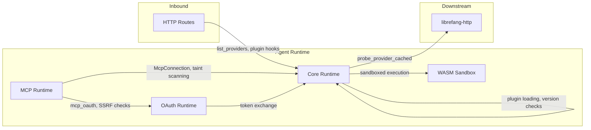

# Agent Runtime

# Agent Runtime

The Agent Runtime is the execution layer of LibreFang. It orchestrates agent identity, tool invocation, sandboxed code execution, provider communication, and authentication — the full lifecycle from "an agent needs to do something" to "it happened safely and was recorded."

## Sub-modules

| Sub-module | Responsibility |
|---|---|
| [Core Runtime](librefang-runtime-src.md) | Agent context, plugin management, provider health probing, audit logging, patch application |
| [MCP Runtime](librefang-runtime-mcp-src.md) | Model Context Protocol connections, argument taint scanning, MCP-specific OAuth, tool registration |
| [OAuth Runtime](librefang-runtime-oauth-src.md) | Browser-based and device-flow OAuth 2.0 for ChatGPT (OpenAI) and GitHub Copilot providers |
| [WASM Runtime](librefang-runtime-wasm-src.md) | WebAssembly sandboxing — host functions for filesystem, shell, and KV with enforcement of size limits, symlink rejection, and child process scoping |

## How they fit together

The **Core Runtime** is the hub. It owns agent identity (`agent_context`), audit trails (`audit`), plugin lifecycle (`plugin_manager`), and provider health (`provider_health`). When an incoming route needs to check provider availability or load a plugin, it flows through core.

**MCP Runtime** extends the agent with external tool servers. It manages `McpConnection` instances and applies `scan_mcp_arguments_for_taint_with_policy` to every inbound tool argument. Its own OAuth implementation (`mcp_oauth`) handles MCP-specific authorization server metadata discovery and SSRF-protected endpoint validation — distinct from the user-facing OAuth module.

**OAuth Runtime** handles user authentication. It provides two flows: a browser-based PKCE flow (ChatGPT) and a device authorization grant (Copilot). The MCP module's OAuth is self-contained for server-to-server metadata and token exchange, while this module handles the interactive user login.

**WASM Runtime** is the execution sandbox. Core delegates untrusted code to it, and it exposes tightly scoped host functions — `host_fs_write` (with `safe_resolve_parent`), `host_shell_exec` (with child process killing on output cap, parent env secret stripping), and `host_kv_set` (with oversized key/value rejection). Timeouts are enforced at the store level via `per_store_callback_traps_on_real_timeout`.

## Key cross-module workflows

**Provider health check** — `list_providers` → `probe_provider_cached` → `probe_provider` → `try_probe_endpoint` → `probe_client` → `proxied_client_builder` → `build_http_client` → `tls_config`. Core drives the probe; the HTTP module builds the transport.

**Plugin hook** — `benchmark_plugin_hook` → `get_plugin_info` → `load_plugin_manifest` → `version_satisfies` → `semver_parts`. Core owns the entire plugin resolution chain.

**MCP tool invocation** — A tool call enters through MCP Runtime, arguments are scanned for taint, OAuth metadata is validated with SSRF checks, and the connection (`McpConnection`) routes the call to the external tool server.