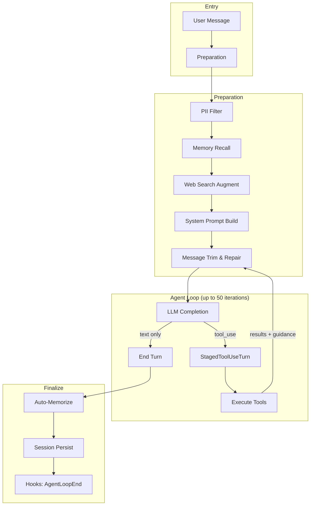

# Agent Runtime

# Agent Runtime

The agent runtime is LibreFang's execution core — it orchestrates the full lifecycle of an agent turn: receiving a user message, recalling memories, calling the LLM, executing tool calls, persisting results, and extracting new memories. It also implements the A2A (Agent-to-Agent) protocol for cross-framework interoperability.

## Architecture Overview



## A2A Protocol (`a2a.rs`)

Implements Google's A2A protocol for cross-framework agent interoperability. Agents discover each other via JSON capability manifests (Agent Cards) and coordinate through task-based messaging.

### Agent Card

`AgentCard` is a JSON capability manifest served at `/.well-known/agent.json` per the A2A specification. It describes:

- **Identity** — `name`, `description`, `url`, `version`
- **Capabilities** — `AgentCapabilities` (streaming, push notifications, state transition history)
- **Skills** — `Vec<AgentSkill>` descriptors with IDs, tags, and example prompts for discovery
- **Content modes** — `default_input_modes` / `default_output_modes` (e.g., `["text"]`)

Use `build_agent_card(manifest, base_url)` to convert a LibreFang `AgentManifest` into an A2A card. Tool names from the manifest become A2A skill descriptors:

```rust
let card = build_agent_card(&manifest, "https://example.com");
// card.url == "https://example.com/a2a"
// card.skills derived from manifest.capabilities.tools
```

### A2A Task Lifecycle

Tasks are the unit of work exchanged between agents. Each `A2aTask` carries:

| Field | Purpose |
|-------|---------|
| `id` | Unique task identifier |
| `session_id` | Optional conversation continuity |
| `status` | `A2aTaskStatus` — `Submitted`, `Working`, `InputRequired`, `Completed`, `Cancelled`, `Failed` |
| `messages` | Conversation between agents (`Vec<A2aMessage>`) |
| `artifacts` | Outputs produced by the task (`Vec<A2aArtifact>`) |

**Status encoding** — `A2aTaskStatusWrapper` accepts two wire formats:
- Bare string: `"completed"`
- Object form: `{"state": "completed", "message": null}`

Use `.state()` to extract the `A2aTaskStatus` enum regardless of encoding.

### A2aTaskStore

In-memory bounded store for task lifecycle tracking. Thread-safe via interior mutability (`Mutex<HashMap>`).

**Eviction policy** (applied lazily on `insert`):

1. **TTL sweep** — any task older than `task_ttl` (default 24h) is removed regardless of state, including `Working`/`InputRequired` tasks that would otherwise accumulate.
2. **Capacity eviction** — if still at capacity after TTL sweep, evict the oldest terminal-state task (`Completed`/`Failed`/`Cancelled`). If no terminal tasks exist, evict the oldest task overall.

```rust
let store = A2aTaskStore::new(1000);          // capacity 1000, default 24h TTL
let store = A2aTaskStore::with_ttl(500, Duration::from_secs(3600)); // custom TTL

store.insert(task);
store.complete("task-id", response_msg, artifacts);
store.fail("task-id", error_msg);
store.cancel("task-id");
```

### A2aClient

HTTP client for discovering and interacting with external A2A agents. Uses the shared proxied HTTP client builder with a 30-second timeout.

```rust
let client = A2aClient::new();

// Discover an agent's capabilities
let card: AgentCard = client.discover("https://other-agent.example.com").await?;

// Send a task
let task: A2aTask = client.send_task("https://other-agent.example.com/a2a", "Hello", None).await?;

// Poll task status
let task: A2aTask = client.get_task("https://other-agent.example.com/a2a", &task.id).await?;
```

`discover_external_agents` is called during kernel boot to populate the list of known external agents from configuration. Failures log warnings but don't prevent startup.

---

## Agent Execution Loop (`agent_loop.rs`)

The core loop handles a single agent turn. It runs up to `MAX_ITERATIONS` (50) cycles of LLM completion → tool execution → response.

### Entry Points

Two entry points exist (non-streaming and streaming), both sharing the same internal logic. They accept:

- `AgentManifest` — agent configuration, model, tools, system prompt
- `Session` — conversation state with message history
- `MemorySubstrate` — memory recall/persistence backend
- `LlmDriver` — provider-specific completion interface
- `LoopOptions` — modifiers for fork turns, tool allowlists, interrupts

### LoopOptions

Controls non-standard loop behavior:

| Field | Default | Purpose |
|-------|---------|---------|
| `is_fork` | `false` | Derivative turn — skip session persistence, memory writes, and context engine updates |
| `allowed_tools` | `None` | Runtime tool allowlist enforced at execute time (not schema time) |
| `interrupt` | `None` | `SessionInterrupt` handle for cancelling long-running tools |

Fork turns are ephemeral — used by auto-dream, memory extraction, and other derivative tasks. They share the parent session's message prefix for prompt cache alignment but must not pollute the canonical conversation history.

### Execution Flow

#### 1. Preparation Phase

1. **PII filtering** — `push_filtered_user_message` applies the configured `PrivacyMode` to user text and content blocks before they enter the session.
2. **Experiment selection** — `select_running_experiment` checks for active A/B experiments and selects a variant deterministically from the session ID hash.
3. **Memory recall** — `setup_recalled_memories` retrieves relevant memories through:
   - `ContextEngine.ingest()` if a context engine is configured
   - Vector recall (`embed_one` → `recall_with_embedding_async`) when an embedding driver is available
   - Text search fallback
   - Proactive memory `auto_retrieve` (skipped for forks)
4. **Web search augmentation** — `web_search_augment` optionally generates search queries via LLM and injects results for models without tool support.
5. **System prompt construction** — `build_prompt_setup` applies experiment variant prompts and appends memory context. Language-matching instruction is appended unconditionally.
6. **Message preparation** — `prepare_llm_messages` filters system messages, applies `safe_trim_messages`, and strips stale image data.

#### 2. Agent Loop Iteration

Each iteration:

1. **LLM completion** — gated by `LLM_CONCURRENCY` semaphore (max 5 concurrent calls globally). Uses exponential backoff (up to 3 retries) for rate-limited/overloaded responses.
2. **Response classification**:
   - **End turn** (`stop_reason == EndTurn`) — proceed to finalization
   - **Tool use** (`stop_reason == ToolUse`) — stage and execute tools
   - **MaxTokens** — attempt continuation (up to `MAX_CONTINUATIONS = 5`)

#### 3. Tool Execution via StagedToolUseTurn

The `StagedToolUseTurn` struct is the fix for issue #2381. It buffers the assistant's `tool_use` message and all tool-result blocks in memory, committing them atomically to `session.messages` and the LLM working copy only when `commit()` is called.

**Why staging matters**: The previous approach eagerly pushed the assistant message to `session.messages` before any tool executed. Any control-flow exit between the push and result finalization (error `break`, mid-turn signal, `?` propagation) left orphan `ToolUse` blocks without paired `ToolResult` blocks — causing HTTP 400 from providers on the next request.

```
StagedToolUseTurn lifecycle:
  stage_tool_use_turn()    ← buffer assistant message + tool_call_ids
  append_result()          ← add each tool result as it completes
  pad_missing_results()    ← fill any gaps with "[tool interrupted]" stubs
  commit()                 ← atomic push to session + messages
```

Each tool call goes through `execute_single_tool_call` which applies, in order:

1. **LoopGuard** check — circuit breaker, block, or warn
2. **Fork allowlist** check — reject tools not in `allowed_tools`
3. **BeforeToolCall hook** — hooks can block execution
4. **Tool execution** via `tool_runner::execute_tool` with timeout (`TOOL_TIMEOUT_SECS = 600`)
5. **AfterToolCall hook** — post-execution notification
6. **Result sanitization** — strip injection markers, truncate via context budget

After all tools execute, `append_tool_result_guidance_blocks` injects system messages for:
- Denied tools (instructs LLM not to retry)
- Modify-and-retry feedback
- Parameter errors (LLM should self-correct)
- Non-parameter execution errors (LLM should report honestly)

#### 4. End-Turn Finalization

`finalize_successful_end_turn` handles post-response processing:

1. Append assistant response to session
2. Prune heartbeat turns if configured
3. **Session persistence** — `save_session_async` (skipped for forks)
4. **Episodic memory** — `remember_interaction_best_effort` stores the user–agent exchange
5. **Context engine** — `after_turn` update (skipped for forks)
6. **Proactive memory** — `auto_memorize` extracts new memories from the turn's messages (skipped for forks)
7. **AgentLoopEnd hook** — fires with iteration count, response length, and fork flag

### Safety Mechanisms

#### LoopGuard

`LoopGuard` with `LoopGuardConfig` provides three verdicts for each tool call:

- **CircuitBreak** — hard stop, returns error to caller
- **Block** — tool rejected, returns error to LLM for adaptation
- **Warn** — tool executes but warning is appended to the result

#### Consecutive Failure Detection

Tracks consecutive iterations where every executed tool produced a hard error. After `MAX_CONSECUTIVE_ALL_FAILED` (3) such iterations, the loop exits with `RepeatedToolFailures` to prevent expensive wheel-spinning.

Soft errors (sandbox rejections, parameter errors, approval denials) don't count toward this threshold — the LLM is expected to recover from these cheaply.

#### Message History Trimming

`safe_trim_messages` enforces `MAX_HISTORY_MESSAGES` (40). Trimming cuts at conversation-turn boundaries so `ToolUse`/`ToolResult` pairs are never split. After trimming, `validate_and_repair` ensures structural integrity, and a minimal user message is synthesized if too few messages survive.

#### Image Data Stripping

Two stripping passes prevent token bloat from base64 image data:
- `strip_prior_image_data` — called before the LLM, strips all images except the last user message
- `strip_processed_image_data` — strips images from messages the LLM has already processed

#### Global LLM Concurrency

`LLM_CONCURRENCY` semaphore caps simultaneous LLM HTTP calls at 5 (`MAX_CONCURRENT_LLM_CALLS`). Calls queue rather than fail; per-call timeouts still fire independently.

### Context Budget

Tool results are truncated through a two-layer system:

1. **`sanitize_tool_result_content`** — strips injection markers, then truncates. When a `ContextEngine` is configured, truncation is delegated to the engine. Otherwise falls back to `truncate_tool_result_dynamic`.
2. **`ToolBudgetEnforcer`** — per-turn aggregate budget applied in `finalize_tool_use_results` across all tool results.

### Provider Prefix Handling

`strip_provider_prefix` normalizes model IDs before API calls:
- Strips `provider/` or `provider:` prefixes
- For providers requiring `org/model` format (OpenRouter, Together, Fireworks, Replicate, Chutes, Huggingface), bare model names like `gemini-2.5-flash` are auto-normalized to `google/gemini-2.5-flash`
- `normalize_bare_model_id` recognizes common model families (Gemini, Claude, GPT, Llama, DeepSeek, Mistral, Qwen, Cohere)

### AgentLoopResult

The loop returns an `AgentLoopResult` with:

| Field | Description |
|-------|-------------|
| `response` | Final text response |
| `total_usage` | Accumulated `TokenUsage` across all LLM calls |
| `iterations` | Number of loop iterations |
| `silent` | True when agent chose not to reply (`NO_REPLY` / `[silent]`) |
| `decision_traces` | `Vec<DecisionTrace>` — reasoning, timing, and outcomes for each tool call |
| `memories_saved` / `memories_used` | Memory activity summaries |
| `memory_conflicts` | Detected contradictions between new and existing memories |
| `provider_not_configured` | True when no LLM provider is available |
| `experiment_context` | Active A/B experiment variant |
| `new_messages_start` | Index in `session.messages` where this turn's messages begin |
| `skill_evolution_suggested` | True when 5+ tool calls suggest skill creation opportunity |

### Web Search Augmentation

When enabled (`web_search_augmentation` in manifest), the loop can inject web search results as context before the first LLM call. This is primarily for models without tool support.

The augmentation pipeline:
1. `generate_search_queries` uses a small LLM call to produce 1–3 focused search queries from conversation context
2. `web_search_augment` executes searches and injects formatted results
3. Mode `Auto` activates only when the model doesn't support tools; `Always` forces augmentation; `Off` disables it

### Group Chat Support

For group-chat agents (metadata key `is_group: true`), `build_group_sender_prefix` prepends sanitized sender labels to user messages. Sender display names are cleaned of bracket/colon/newline characters to prevent prefix-format spoofing.

---

## Integration Points

| Component | Role |
|-----------|------|
| `tool_runner::execute_tool` | Executes individual tool calls within the loop |
| `session_repair` | Validates and repairs message structure after trimming |
| `loop_guard` | Rate-limits and blocks problematic tool call patterns |
| `context_engine` | Pluggable context management (recall, truncation, after-turn updates) |
| `hooks::HookRegistry` | BeforeToolCall / AfterToolCall / AgentLoopEnd events |
| `checkpoint_manager` | Workspace snapshots for file-modifying tools |
| `interrupt::SessionInterrupt` | Cooperative cancellation for long-running tools |
| `silent_response` | Detects `NO_REPLY` / `[no reply needed]` tokens |
| `reply_directives` | Parses `[[reply_to:...]]` / `[[thread:...]]` / `[[silent]]` directives |
| `prompt_builder` | Formats memory sections and personal context |
| `pii_filter` | Strips PII from user messages before they reach the LLM |
| `proactive_memory` | Auto-extract and auto-retrieve memories around turns |