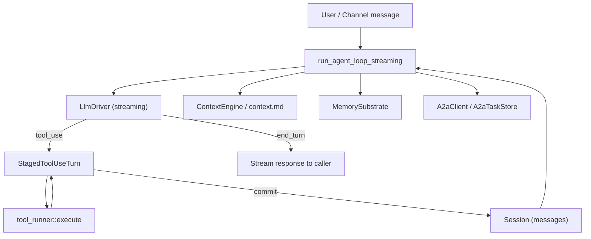

# Agent Runtime

# Agent Runtime

The agent runtime is the core execution engine that drives agent behavior: receiving messages, managing conversation context, calling LLMs, executing tools, and persisting session state. It comprises three subsystems — the **agent loop**, the **A2A protocol layer**, and the **context loader** — that together turn an `AgentManifest` into a running, conversing agent.

## Architecture Overview



---

## Agent Loop (`agent_loop.rs`)

The agent loop is an iterative cycle that continues until the LLM produces a final text response (no more tool calls) or a guard trips. Each iteration:

1. **Assembles context** — system prompt, conversation history, per-turn `context.md`, recalled memories, and any experiment configuration.
2. **Calls the LLM** — streams the response, collecting text blocks and `tool_use` blocks.
3. **Executes tools** — for each `tool_use` block, runs the tool and collects results into a staged turn.
4. **Commits the turn** — atomically appends the assistant message (with `ToolUse` blocks) and the user message (with `ToolResult` blocks) to session history.
5. **Repeats** — feeds the updated history back to the LLM until it produces an `end_turn` stop reason.

### Entry Point

`run_agent_loop_streaming` is the primary entry point. It accepts a `LoopOptions` struct and returns results via an `mpsc::Sender<StreamEvent>` channel, making it suitable for both HTTP streaming and background task execution.

### Loop Guards and Circuit Breakers

The loop applies several safety guards to prevent runaway execution:

| Guard | Purpose | Threshold |
|---|---|---|
| `LoopGuard` | Caps total iterations per turn | `MAX_ITERATIONS` (default 100) |
| `MAX_CONSECUTIVE_ALL_FAILED` | Aborts when every tool fails repeatedly | 3 consecutive iterations |
| `ACCUMULATED_TEXT_MAX_BYTES` | Bounds the in-memory text fallback buffer | 64 KiB |
| `MAX_CONTINUATIONS` | Limits consecutive `MaxTokens` continuation rounds | 5 |
| `LLM_CONCURRENCY` | Process-global semaphore capping simultaneous LLM HTTP calls | 5 |

### Tool Execution: `StagedToolUseTurn`

The critical structural invariant is that `session.messages` is never left in a half-committed state. `StagedToolUseTurn` buffers both the assistant's `tool_use` message and all corresponding `tool_result` blocks in local fields. Only the `commit()` method writes to the persisted message vectors, and it does so atomically (assistant message + user tool-result message pushed together). If control flow exits early (via `?`, `break`, or signal), the staged turn is dropped without ever touching session state — eliminating orphan `ToolUse` blocks that cause provider 400 errors.

After all tool results are appended, `append_tool_result_guidance_blocks` injects system-level guidance blocks that instruct the LLM how to handle denied calls, modification requests, parameter errors, and hard failures — preventing the model from silently retrying denied tools or fabricating results.

### Lazy Tool Loading

Agents with large tool catalogs (>30 tools) can opt into lazy loading: only the native (always-available) tools plus any tools explicitly loaded this session via `tool_load(name)` are shipped to the LLM per iteration. The LLM can discover and load additional tools on demand. This is managed by `ResolvedToolsCache`, which only rebuilds the tool list when the session's loaded-tool set grows, avoiding per-iteration deep clones of the full catalog.

### Context and History Management

**Message trimming** (`safe_trim_messages`) keeps the conversation window bounded:

- Trims at conversation-turn boundaries so `ToolUse`/`ToolResult` pairs are never split.
- Rescues pinned messages (e.g., delegation results) from the drain range before removal.
- Re-validates with `session_repair::validate_and_repair` after trimming.
- Synthesizes a minimal user message if fewer than 2 messages survive.
- The cap is resolved from manifest → kernel config → compiled default (40 messages), clamped up to a floor of 4.

**Image stripping** (`strip_processed_image_data`) replaces base64 image blocks with lightweight text placeholders after the LLM has processed them, preventing token bloat from accumulating across turns.

**Context overflow recovery** delegates to `context_overflow::recover_from_overflow`, which applies a multi-stage strategy (trim, summarize, compress) when the assembled context exceeds the model's window.

### Retry and Error Handling

LLM calls are retried with exponential backoff (base 1 second, up to 3 retries) for rate-limited or overloaded responses. Tool errors are classified:

- **Soft errors** — approval denials, sandbox path-traversal rejections, parameter errors. The LLM is expected to self-correct. These do not count toward the consecutive-failure abort threshold.
- **Hard errors** — network failures, unrecognized tools. After 3 consecutive iterations where every tool produces a hard error, the loop exits with `RepeatedToolFailures`.

On failure exit paths (circuit breaker, max iterations, timeout), `repair_session_before_save` runs `validate_and_repair` on session messages to ensure no orphan `ToolUse` blocks persist — preventing provider rejection on the next session load.

### Response Classification

Before the final response is emitted, it passes through two filters:

- `is_no_reply` — detects silent-reply sentinels (`NO_REPLY`, `[no reply needed]`, etc.) that suppress the agent's response entirely (used for cron-triggered agents and monitoring).
- `is_progress_text_leak` — catches short ellipsis-terminated progress preambles (e.g., `"Waiting for the script to complete..."`) that the model emitted before a tool call that never materialized, preventing them from surfacing as the agent's final reply.

### Streaming Protocol

The loop communicates with its consumer via `StreamEvent` over an `mpsc` channel. The `PhaseChange` event with phase `PHASE_RESPONSE_COMPLETE` fires once the LLM finishes producing text, allowing UI consumers to unblock user input before the loop's remaining post-processing (session persistence, memory extraction) completes.

---

## A2A Protocol (`a2a.rs`)

Implements Google's Agent-to-Agent protocol for cross-framework agent interoperability. Agents advertise capabilities via **Agent Cards** and coordinate work through **Tasks**.

### Agent Cards

`AgentCard` is a JSON capability manifest served at `/.well-known/agent.json`. `build_agent_card` converts an `AgentManifest` into an `AgentCard`, mapping each tool name to an `AgentSkill` descriptor and advertising the agent's endpoint URL, supported content types, and capabilities (streaming, push notifications, state-transition history).

### Task Lifecycle

`A2aTask` represents a unit of work exchanged between agents. Tasks progress through states:

```
Submitted → Working → InputRequired → Completed
                   ↘ Failed
                   ↘ Cancelled
```

`A2aTaskStatusWrapper` handles two serialization forms used by different A2A implementations: the bare string form (`"completed"`) and the object form (`{"state": "completed", "message": null}`). The `state()` method extracts the underlying status from either form.

### Task Store (`A2aTaskStore`)

An in-memory + optional SQLite backing store for task lifecycle management.

**Eviction policy** (applied lazily on each `insert`):

1. **TTL sweep** — all tasks whose `updated_at` exceeds the TTL (default 24 hours) are removed regardless of state. This prevents `Working`/`InputRequired` tasks from accumulating indefinitely.
2. **Capacity eviction** — if still at capacity after the TTL sweep, the oldest terminal-state task is evicted first, falling back to the oldest task overall.

**Persistence** (`with_persistence`):

- Schema `a2a_tasks_v2` stores the full `messages` and `artifacts` arrays as JSON, preserving chronological ordering and all metadata fields.
- On startup: prunes rows older than 7 days, then loads the most recent `max_tasks` rows into memory. Older rows remain queryable through the `get()` SQLite fallback path.
- Persistence is best-effort: SQLite write failures log a warning but do not fail the in-memory operation. A full disk degrades silently to in-memory-only behavior.

### A2A Client (`A2aClient`)

Discovers and interacts with external A2A agents. Each outbound request builds a fresh `reqwest::Client` to avoid DNS pinning across different targets.

**SSRF protection** (Bugs #3563, #3782):

- `build_client_for_url` runs `web_fetch::check_ssrf` to resolve DNS once, validate addresses, and pin those exact IPs via `ClientBuilder::resolve` — closing the DNS-rebinding TOCTOU window.
- Redirect policy is `Policy::none` — redirects are not followed. A 302 to a cloud-metadata IP is blocked because DNS for the redirect target would be re-resolved by reqwest's connector, and the pinned-DNS protection only covers the original hostname.
- An optional allowlist permits specific hosts/CIDRs that resolve to private IP space; cloud metadata ranges (169.254.0.0/16) remain blocked unconditionally.

**Response size capping** (Bug #3785):

- `read_capped_body` streams chunks instead of using `reqwest::Response::json()` (which reads the entire body unbounded).
- Enforces both an upfront `Content-Length` check and a per-chunk running total.
- Transport-layer decompression is disabled so `Content-Length` reflects actual wire bytes (preventing a small gzip bomb from decompressing past the cap).
- Limits: 256 KiB for Agent Cards, 1 MiB for task RPC responses.

### URL Canonicalization

`canonicalize_a2a_url` normalizes peer URLs for trust-list comparison: lowercases scheme and host, strips default ports, removes fragments and empty queries. This prevents an attacker from bypassing the trust gate via cosmetic URL variations, while ensuring legitimate variations (trailing slash, case differences) don't cause false denials.

---

## Context Loader (`agent_context.rs`)

Loads per-turn refreshable context from `context.md` files. This is the mechanism by which external tools (cron jobs, scripts) inject live data into the agent's prompt without restarting the session.

### File Resolution

```
{workspace}/.identity/context.md   ← preferred (new layout)
{workspace}/context.md              ← fallback (legacy)
```

The first candidate that exists on disk wins. If the `.identity/` file exists but is unreadable, the loader reports that failure rather than silently falling back to a stale legacy file.

### Read Behavior

- **Default (`cache_context = false`)**: Re-reads from disk every turn, picking up external updates mid-conversation. If the re-read fails (file temporarily absent, mid-write corruption, non-UTF-8 bytes), the loader falls back to the last successfully cached content rather than dropping context entirely.
- **Cached (`cache_context = true`)**: Freezes the first successful read for the lifetime of the process. Used by agents that depend on static context loaded once at startup.
- **Size cap**: 32 KiB. Oversized files are truncated at a UTF-8 boundary.
- **Symlink rejection**: Uses `symlink_metadata` to explicitly refuse symlinks, preventing a prompt-injection vector where an attacker points `context.md` at `/etc/passwd` and has its contents injected into the LLM prompt.

### Async Variant

`load_context_md_async` mirrors the sync API using `tokio::fs`, keeping the runtime worker thread free during the disk read. The sync version is retained for the non-async streaming entry point. Both share the same in-memory cache and behave identically byte-for-byte.

---

## Key Types Reference

| Type | Location | Purpose |
|---|---|---|
| `LoopOptions` | `agent_loop.rs` | Configuration for a single agent loop invocation |
| `StagedToolUseTurn` | `agent_loop.rs` | Buffers a tool-use turn for atomic commit to session |
| `ResolvedToolsCache` | `agent_loop.rs` | Per-loop cache avoiding per-iteration tool-catalog clones |
| `AgentCard` | `a2a.rs` | A2A capability manifest |
| `A2aTask` / `A2aTaskStatus` | `a2a.rs` | A2A task lifecycle representation |
| `A2aTaskStore` | `a2a.rs` | In-memory + SQLite task storage with TTL eviction |
| `A2aClient` | `a2a.rs` | HTTP client for A2A discovery and task RPC |
| `AgentSkill` | `a2a.rs` | A2A skill descriptor (maps to tool names) |

## Integration Points

- **LLM drivers** — the loop delegates all model interactions to `LlmDriver`, which abstracts provider-specific APIs behind a unified streaming interface.
- **Memory substrate** — memories are recalled via `ContextEngine::ingest` and saved after each turn through `ProactiveMemoryHooks`.
- **Session persistence** — the loop calls `save_session_async` after each completed turn, ensuring conversation state survives restarts.
- **Tool execution** — `tool_runner::execute` handles individual tool calls, including sandbox enforcement, approval gates, and MCP delegation.
- **Kernel handle** — `kernel_handle::prelude` provides shared kernel services (config, logging, metrics) to the loop.