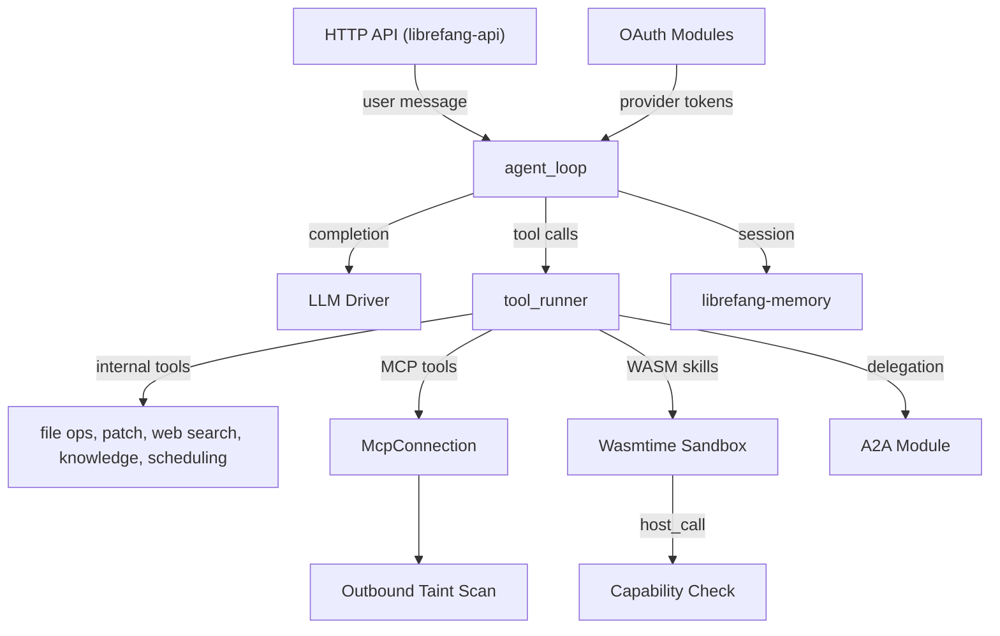

# Agent Runtime

# Agent Runtime

The Agent Runtime is the execution backbone of LibreFang. It owns the agent turn loop, tool dispatch, session persistence, and all infrastructure between the HTTP API surface and the underlying LLM/memory/storage drivers. Four specialized sub-modules handle distinct concerns and converge at the central `tool_runner`.

## Sub-Module Map

| Sub-module | Responsibility |
|---|---|
| [Core Runtime](librefang-runtime-src.md) | Agent loop, LLM driver, tool dispatch, A2A delegation, provider health, workspace sandbox, tracing, plugin management |
| [MCP Client](librefang-runtime-mcp-src.md) | Model Context Protocol client — transport lifecycle, tool discovery, namespaced registration, invocation with taint scanning |
| [OAuth](librefang-runtime-oauth-src.md) | OAuth 2.0 flows for ChatGPT (browser/PKCE) and GitHub Copilot (RFC 8628 device authorization grant) |
| [WASM Sandbox](librefang-runtime-wasm-src.md) | Secure Wasmtime sandbox for untrusted skills — deny-by-default capability control, CPU fuel / memory / timeout limits |

## How They Fit Together

The **core runtime** owns the main agent loop (`agent_loop`), which processes each user turn by requesting completions from the LLM driver, dispatching any tool calls through `tool_runner`, persisting session state to memory, and optionally delegating sub-tasks via A2A.

`tool_runner` is the convergence point. It routes each tool invocation to the correct backend:

- **Internal tools** — file reads, patch application, web search/content, knowledge graph operations, scheduled task management — are handled directly.
- **MCP tools** are forwarded to an `McpConnection` discovered at startup. Every outbound call passes through the MCP module's taint scanner before hitting the transport layer, blocking credential exfiltration.
- **WASM skills** execute inside the sandbox, where every privileged operation (`host_net_fetch`, `host_fs_write`, etc.) goes through `host_call` → capability check. No WASI, filesystem, or network access is granted unless explicitly allowed.

The **OAuth** module sits slightly outside this loop. It provides async auth entry points (`chatgpt_oauth_start`, `copilot_oauth_start`, `copilot_oauth_poll`) consumed by the HTTP route layer, producing tokens that feed back into the LLM driver configuration for authenticated provider connections.

## Key Cross-Module Workflows

**Provider probe and authentication** — A provider list request flows from the API route through `provider_health` → `probe_provider` → `proxied_client_builder` → TLS config in `librefang-http`. When the provider requires OAuth (ChatGPT, Copilot), the corresponding OAuth module handles the interactive flow, returning tokens that enable subsequent completions.

**MCP tool invocation** — `tool_runner` matches a namespaced tool name to an active `McpConnection`, calls `call_tool`, which passes arguments through the taint scanner (blocking if secrets are detected), then dispatches to the MCP server over stdio or HTTP transport.

**Plugin/Skill execution** — `plugin_manager` loads a manifest, validates semver constraints, then dispatches the skill through the WASM sandbox. The sandbox enforces fuel, memory, and wall-clock limits, and rejects any `host_call` that lacks an explicit capability grant.

**Outbound taint protection** — Taint scanning spans both the MCP module (for MCP tool calls) and the core runtime (for `agent_send` and network fetch tools), providing a uniform defense against credential leaks regardless of the execution path.

See the individual sub-module pages for implementation details, configuration options, and transport-specific behavior.