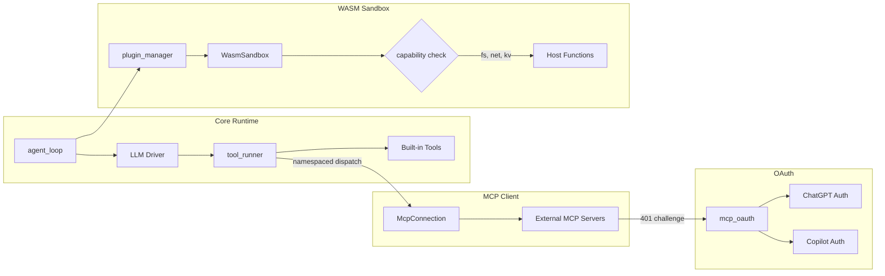

# Agent Runtime

# Agent Runtime

The execution layer that turns user messages into intelligent, tooled responses. It orchestrates the core agent loop, LLM drivers, tool execution, external service integrations, and plugin sandboxing.

## Sub-Modules

| Module | Purpose |
|--------|---------|
| [**Core Runtime**](librefang-runtime-src.md) | Agent loop, LLM driver orchestration, memory recall, prompt assembly, tool execution pipeline, and 30+ supporting subsystems |
| [**MCP Client**](librefang-runtime-mcp-src.md) | Connects to external MCP servers, discovers their tools, and dispatches namespaced tool calls (`mcp_{server}_{tool}`) |
| [**OAuth**](librefang-runtime-oauth-src.md) | Browser-based and device-flow OAuth 2.0 for ChatGPT (OpenAI) and GitHub Copilot authentication |
| [**WASM Sandbox**](librefang-runtime-wasm-src.md) | Wasmtime-based sandbox for executing untrusted skills and plugins with deny-by-default capabilities |

## How They Fit Together

**Tool dispatch** is the primary integration point. The core runtime's `tool_runner` sends built-in tools directly to their handlers, while MCP-discovered tools route through `McpConnection`, which supports Stdio, HTTP, and SSE transports. When an MCP server returns a 401, the MCP client delegates to its OAuth subsystem to discover metadata, acquire tokens, and retry.

**Authentication flows** are shared. The standalone OAuth module handles the user-facing ChatGPT and Copilot login flows (browser redirect and device-code polling), while the MCP module's embedded OAuth handles machine-to-machine authentication against protected MCP servers.

**Plugin execution** flows from the core runtime's `plugin_manager` into the WASM sandbox. Skills are loaded, versioned, and dispatched as compiled Wasmtime modules. The sandbox gates all host interactions—filesystem reads, network fetches, KV store access—through explicit capability checks, keeping untrusted code isolated from the host.

## Key Cross-Module Workflows

1. **Tooled response cycle** — `agent_loop` → memory recall → prompt assembly → LLM → `tool_runner` → built-in tool or MCP dispatch → result feeds back into the loop
2. **Authenticated MCP call** — `tool_runner` resolves the MCP server → `McpConnection.call_tool` → if 401, `mcp_oauth` runs PKCE flow → retries with token
3. **Skill sandboxing** — `plugin_manager` parses and versions the plugin → `WasmSandbox.execute` compiles and instantiates it → host functions gate filesystem, network, and KV access behind capability checks