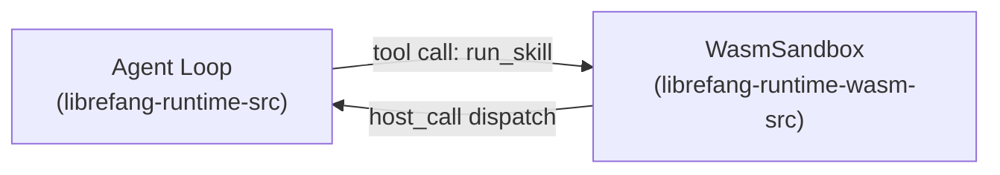

# Agent Runtime

# Agent Runtime — `librefang-runtime`

The agent runtime is the execution core of LibreFang. It orchestrates the full agent lifecycle — receiving messages, recalling memories, calling LLMs, executing tools, and persisting conversations — while integrating memory, context management, web capabilities, and plugin/skill systems into a unified runtime.

## Sub-modules

| Sub-module | Purpose |
|---|---|
| [Agent Runtime — `librefang-runtime-src`](librefang-runtime-src.md) | Core agent loop, tool execution pipeline, web search/fetch, memory integration, TTS, and plugin management |
| [Agent Runtime — `librefang-runtime-wasm-src`](librefang-runtime-wasm-src.md) | WASM sandbox for executing untrusted skills/plugins with deny-by-default capabilities, fuel metering, and epoch timeouts |

## How they fit together

The core runtime (`librefang-runtime-src`) drives the agent loop: it recalls memory, assembles prompts, calls the LLM, and routes tool calls through `execute_tool_raw`. When a tool invocation requires running an untrusted skill or plugin, the runtime delegates to the WASM sandbox (`librefang-runtime-wasm-src`), which compiles and instantiates the guest module under Wasmtime with strict capability enforcement and resource limits.

The sandbox exposes hardened host functions (`fs_read`, `fs_write`, `fs_list`, `net_fetch`, `shell_exec`, `kv_get`, etc.) that the guest can call only if the corresponding capability has been explicitly granted. This keeps the core runtime's tool execution pipeline (including Docker exec, subprocess sandboxing, TTS, and media tools) safely isolated from arbitrary plugin code.

## Key cross-cutting workflows

- **Skill evolution and deletion** flows from the API layer through `plugin_manager::parse` / `parse_version` in the core runtime, coordinating with the skill evolution system.
- **Hand readiness checks** (`check_hand_deps`, `get_hand`) traverse the hands registry's requirement validation, ultimately calling into the runtime's `process_registry` to verify tool availability (e.g., checking for Python 3).
- **Web capabilities** (search via Tavily/Jina/DuckDuckGo, SSRF-protected fetch, HTML-to-Markdown conversion, and a TTL-based response cache) are all managed within the core runtime and available to both the agent loop and tool execution.
- **Workspace context detection** reads cached project files to provide environment-aware context to the agent, with configurable file size caps.

Together, these sub-modules provide a complete, sandboxed execution environment: the core runtime handles orchestration and trusted operations, while the WASM sub-module ensures that third-party skills and plugins run under strict security boundaries.