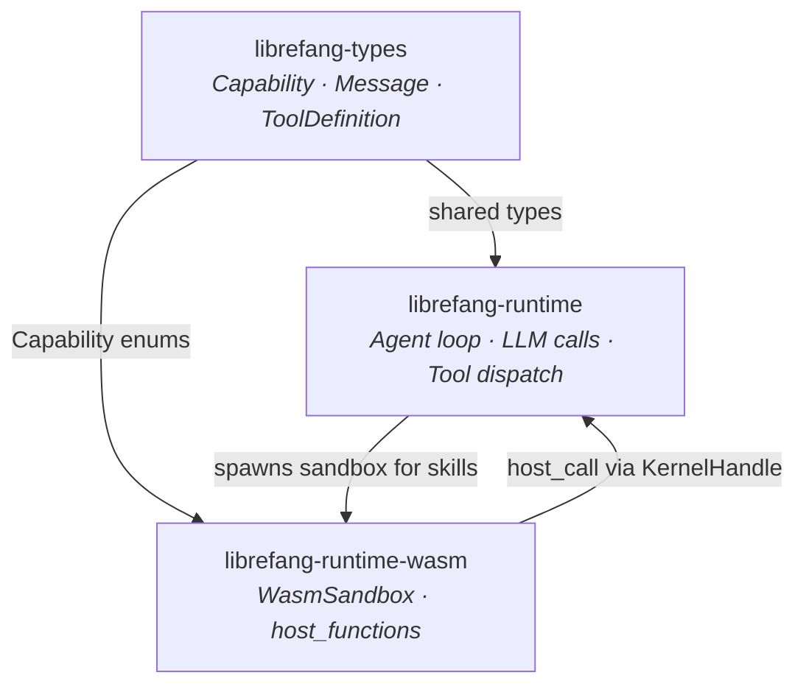

# Agent Runtime

# Agent Runtime

The agent runtime is the execution core of LibreFang. It manages the full agent lifecycle—receiving user messages, recalling memories, calling LLMs, executing tools (including sandboxed skills), and persisting sessions. Three sub-modules divide this responsibility:

| Sub-module | Role |
|---|---|
| [**librefang-types**](librefang-types-src.md) | Shared type definitions. The single source of truth for `AgentId`, `SessionId`, `Message`, `ToolDefinition`, `Capability`, and all other data structures that flow between crates. |
| [**librefang-runtime**](librefang-runtime-src.md) | The main agent loop. Orchestrates prompt construction, LLM calls with retry, tool dispatch, memory recall, and session persistence. Re-exports key dependencies as a single facade. |
| [**librefang-runtime-wasm**](librefang-runtime-wasm-src.md) | WASM sandbox for executing untrusted skills and plugins. Built on Wasmtime with deny-by-default capability enforcement, fuel metering, and epoch-based interruption. |

## How They Fit Together

**`librefang-types`** is the foundation—every other crate depends on it, and it depends on nothing external beyond Serde, Chrono, UUID, and serde_json.

**`librefang-runtime`** is the orchestrator. Its `run_agent_loop` drives the core cycle: memory recall → prompt setup → LLM call → stop-reason dispatch. On `EndTurn` it finalizes; on `ToolUse` it stages `StagedToolUseTurn`; on `MaxTokens` it handles continuations. Tool execution may delegate to the WASM sandbox when the tool is a skill or plugin.

**`librefang-runtime-wasm`** isolates untrusted code. `WasmSandbox` receives a `KernelHandle` and compiles/instantiates guest modules. Guest code can only interact with the host through imported functions (`librefang.host_call`, `librefang.host_log`), each gated by `Capability` checks defined in `librefang-types`. The sandbox also enforces SSRF protection and workspace path resolution.

## Key Cross-Module Workflows

- **Tool execution pipeline**: The runtime's agent loop receives a `ToolUse` stop reason from the LLM → stages the tool call → if the tool is a sandboxed skill, `WasmSandbox::execute_sync` runs it → the guest module calls back into `host_functions`, which check `Capability` from `librefang-types` and route through `KernelHandle`.
- **Session persistence**: Messages flow as `librefang-types::Message` through the runtime's agent loop → `extract_text_content` in the memory layer → session storage, with all intermediate types sourced from `librefang-types`.
- **Plugin loading**: The runtime's `plugin_manager` parses skill metadata and versions, with validation types shared through `librefang-types`, while actual execution is delegated to the WASM sandbox with appropriate capability grants.