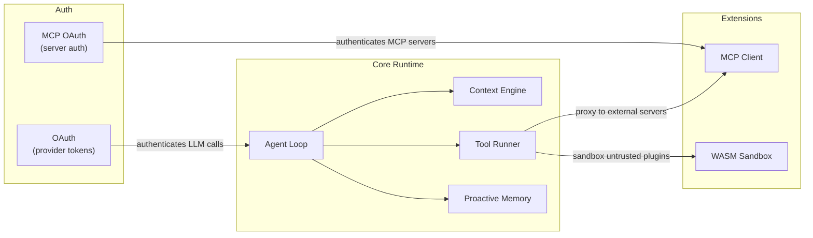

# Agent Runtime

# Agent Runtime

The agent runtime is LibreFang's execution layer — everything that happens between a user message arriving and a response being delivered. It coordinates the LLM call cycle, tool execution, authentication, external tool discovery, and plugin sandboxing across four specialised crates.

## Sub-modules

| Crate | Responsibility |
|---|---|
| [**Core Runtime**](librefang-runtime.md) (`librefang-runtime`) | The agent loop, context assembly, tool running, memory, retry logic, graceful shutdown, audit logging, and loop-guard detection |
| [**MCP Client**](librefang-runtime-mcp.md) (`librefang-runtime-mcp`) | Connects to external MCP servers, discovers their tools, proxies invocations, and scans outbound arguments for credential exfiltration |
| [**OAuth**](librefang-runtime-oauth.md) (`librefang-runtime-oauth`) | Browser-based and device-flow OAuth 2.0 with PKCE for OpenAI/ChatGPT and GitHub Copilot, plus token refresh and model discovery |
| [**WASM Sandbox**](librefang-runtime-wasm.md) (`librefang-runtime-wasm`) | Sandboxed execution of untrusted skills/plugins via Wasmtime, with fuel metering, memory limits, and deny-by-default capabilities |

## How they fit together

## Key cross-module workflows

**Authenticated agent loop** — The [core runtime's agent loop](librefang-runtime.md) drives each turn: it recalls memories, assembles context, requests an LLM completion (authenticated via the [OAuth module](librefang-runtime-oauth.md)), and processes the stop reason. On `ToolUse` it stages a `StagedToolUseTurn`, executes the requested tools, and loops back.

**Tool dispatch** — The [tool runner](librefang-runtime.md) routes tool calls to the right backend. Native tools run directly. Calls prefixed `mcp_{server}_{tool}` are forwarded to the [MCP client](librefang-runtime-mcp.md), which handles transport, namespacing, and outbound taint scanning. Untrusted skills execute inside the [WASM sandbox](librefang-runtime-wasm.md), which deducts fuel before dispatching any host call (LLM, HTTP, subprocess).

**Authentication at two levels** — The [OAuth module](librefang-runtime-oauth.md) handles user-facing provider auth (OpenAI, Copilot). Separately, the MCP client validates `OAuthMetadata` endpoints and rejects cross-domain auth endpoints, ensuring MCP server authentication is isolated per-server.

**Safety and resource bounds** — The core runtime's `LoopGuardConfig` detects ping-pong patterns and escalating loops. The `RetryConfig` governs exponential backoff for LLM calls. The WASM sandbox adds deterministic CPU limits (fuel), wall-clock timeouts (epochs), and memory caps. The MCP client's taint scanner blocks credential exfiltration before arguments leave the process. Together these form a layered defence against runaway agents.