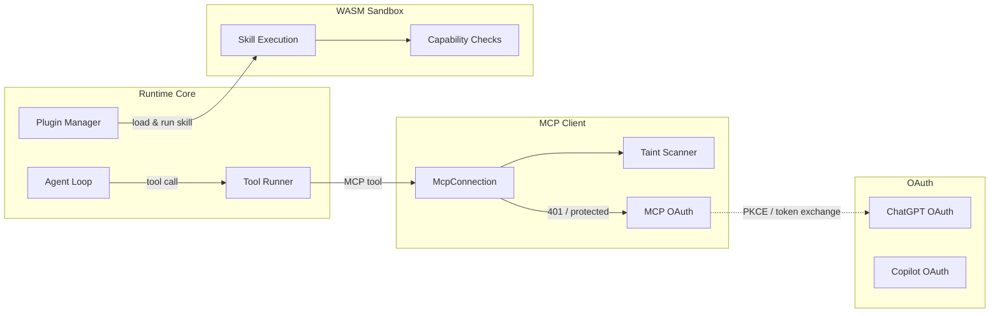

# Agent Runtime

# Agent Runtime

The Agent Runtime is the execution layer of LibreFang. It drives the core agent loop and provides the infrastructure for tool invocation, authentication, external protocol support, and secure plugin execution.

## Sub-modules

| Module | Purpose |
|--------|---------|
| [Runtime Core](librefang-runtime-src.md) | The main agent loop (`run_agent_loop`), orchestrating LLM completions, tool execution, memory recall, and session persistence. Also includes workspace context detection, web search/fetch, plugin management, and the A2A inter-agent protocol. |
| [MCP Client](librefang-runtime-mcp-src.md) | Model Context Protocol client that discovers and invokes tools on external MCP servers. Tools are surfaced as namespaced (`mcp_{server}_{tool}`) to prevent collisions. Supports Stdio, SSE, and Streamable HTTP transports with built-in taint scanning. |
| [OAuth](librefang-runtime-oauth-src.md) | OAuth 2.0 token acquisition and refresh for **ChatGPT** (browser + device flow) and **GitHub Copilot** (device flow). Designed for both interactive desktop and headless environments. |
| [WASM Sandbox](librefang-runtime-wasm-src.md) | Wasmtime-based sandbox for running untrusted agent skills and plugins under deny-by-default capability-based access control. Gates filesystem, network, shell, and messaging operations behind explicit capability grants. |

## How they work together

### Key workflows spanning sub-modules

1. **Agent loop → MCP tool execution**: The core agent loop dispatches tool calls through the tool runner. MCP tools are identified by the `is_mcp_tool` check and routed to `McpConnection`, which handles transport negotiation (Stdio / SSE / HTTP) and taint scanning of arguments before invocation.

2. **MCP → OAuth**: When an MCP server requires authentication (e.g., a 401 response triggers `discover_oauth_metadata`), the MCP module initiates its own OAuth flow with PKCE support, sharing the OAuth infrastructure provided by the OAuth sub-module.

3. **Provider authentication**: The OAuth module's ChatGPT and Copilot flows are triggered at the CLI and server layers to obtain tokens that feed into LLM provider configuration used by the core runtime.

4. **Plugin/skill sandboxing**: The plugin manager in the core runtime loads skills and delegates their execution to the WASM sandbox. Every host function call from a guest module passes through `check_capability`, ensuring untrusted code cannot access filesystem, network, or other sensitive resources without explicit grants.