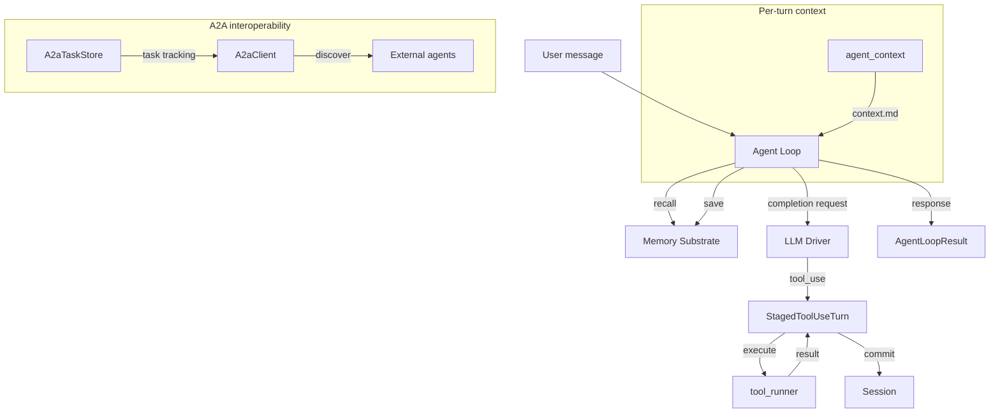

# Agent Runtime

# Agent Runtime

The agent runtime is the execution engine at the heart of LibreFang. It orchestrates the full lifecycle of an agent turn: receiving a user message, recalling memories, calling the LLM, executing tool calls, persisting state, and returning a response. Three subsystems compose the runtime:

| Subsystem | File | Purpose |
|---|---|---|
| **Agent Loop** | `agent_loop.rs` | Core iterative LLM ↔ tool execution cycle |
| **Agent Context** | `agent_context.rs` | Per-turn loading of external `context.md` files |
| **A2A Protocol** | `a2a.rs` | Cross-framework agent interoperability via Google's A2A spec |

## Architecture Overview



---

## Agent Loop

### Core Loop Flow

The agent loop (`run_agent_loop` / `run_agent_loop_streaming`) is an iterative cycle bounded by `MAX_ITERATIONS` (default 100, configurable via manifest or operator override):

1. **Prepare messages** — load session history, inject system prompt with memory context, apply PII filtering and group-chat sender prefixes
2. **Trim history** — enforce `max_history_messages` cap at safe turn boundaries (never splitting ToolUse/ToolResult pairs)
3. **Call LLM** — acquire a global concurrency semaphore (cap: 5 simultaneous calls), send `CompletionRequest`
4. **Handle response** based on stop reason:
   - **`EndTurn`** — return text to caller (unless it's a silent reply or progress-text leak)
   - ****`ToolUse`** — stage a `StagedToolUseTurn`, execute each tool, commit results atomically
   - **`MaxTokens`** — continue generation (up to `MAX_CONTINUATIONS = 5`)
5. **Finalize** — auto-memorize, save session, fire hooks, extract reply directives

### Key Types

#### `LoopOptions`

Non-default invocations (forks, auto-dream, sub-agent calls) pass `LoopOptions` to modify behavior:

| Field | Type | Effect |
|---|---|---|
| `is_fork` | `bool` | Derivative turn: skip session persistence, mark hooks `is_fork: true` |
| `allowed_tools` | `Option<Vec<String>>` | Runtime tool allowlist enforced at execute time (not request schema) |
| `interrupt` | `Option<SessionInterrupt>` | Per-session cancellation handle for long-running tools |
| `max_iterations` | `Option<u32>` | Operator override for iteration cap |
| `max_history_messages` | `Option<usize>` | Operator override for history trim cap (floored at 4) |
| `aux_client` | `Option<Arc<AuxClient>>` | Cheap-tier LLM for side tasks (compression, title gen) |

Fork turns share the parent session prefix for Anthropic prompt cache alignment. Setting `is_fork` does not change the request body — only post-response persistence.

#### `AgentLoopResult`

Returned from every loop invocation:

```
AgentLoopResult {
    response: String,           // Final text response
    total_usage: TokenUsage,    // Accumulated token counts
    iterations: u32,            // Loop iterations consumed
    silent: bool,               // Agent chose not to reply
    directives: ReplyDirectives, // Reply-to, thread routing
    decision_traces: Vec<DecisionTrace>,  // Tool call audit trail
    memories_saved: Vec<String>,
    memories_used: Vec<String>,
    memory_conflicts: Vec<MemoryConflict>,
    owner_notice: Option<String>,  // From notify_owner tool
    new_messages_start: usize,     // Index for slicing turn messages
    skill_evolution_suggested: bool,
    experiment_context: Option<ExperimentContext>,
    ...
}
```

### StagedToolUseTurn — Atomic Tool-Use Commits

The `StagedToolUseTurn` struct is the structural fix for issue #2381. Previously, the assistant's `tool_use` message was eagerly pushed to `session.messages` before tools executed. Any control-flow exit between push and finalization left orphan `tool_use_id`s that caused provider 400 errors.

**Staged commits fix this**: the assistant message and all tool-result blocks are buffered locally. Only `commit()` writes to `session.messages` and the LLM working copy, atomically pushing both the assistant message and the user `{tool_results}` message together.

```
stage_tool_use_turn()     // creates buffer, no mutation
  → append_result()       // per-tool, accumulates ContentBlock::ToolResult
  → pad_missing_results() // fills stubs for interrupted tools
  → commit()              // atomic push to session + working copy
```

If a staged turn is dropped without commit (e.g., `?` propagation), `session.messages` is untouched.

### Tool Execution

Each tool call passes through these guards in `execute_single_tool_call`:

1. **Loop guard** — circuit breaker, block, or warn based on repetition detection
2. **Fork allowlist** — synthetic error for tools outside `LoopOptions::allowed_tools`
3. **Before hook** — `HookEvent::BeforeToolCall` can block execution
4. **Timeout** — per-tool timeout (default 600s), producing `ToolExecutionStatus::Expired`
5. **Execution** — dispatched via `tool_runner::execute_tool`
6. **Transform hook** — `HookEvent::TransformToolResult` can rewrite result content
7. **Sanitization** — strip injection markers, truncate to context budget

After all tools in a turn execute, `finalize_tool_use_results` applies:
- **Tool budget enforcement** — aggregate per-turn output budget
- **Guidance blocks** — system messages appended for denied tools, parameter errors, and execution errors to steer LLM self-correction

### Consecutive Failure Tracking

`MAX_CONSECUTIVE_ALL_FAILED = 3` — if every tool in a turn fails with hard errors (not soft errors like sandbox rejections or parameter mistakes) for 3 consecutive iterations, the loop aborts with `RepeatedToolFailures`. Soft errors are excluded so the LLM can self-correct.

### History Management

**Resolution order** for `max_history`:
1. `manifest.max_history_messages`
2. `opts.max_history_messages`
3. `DEFAULT_MAX_HISTORY_MESSAGES` (40)

Values are clamped up to `MIN_HISTORY_MESSAGES` (4) — below this the safe-trim heuristic can't guarantee at least one full tool round-trip survives.

`safe_trim_messages` trims both the LLM working copy and the persistent session store at turn boundaries. After trimming, `validate_and_repair` and `ensure_starts_with_user` guarantee structural validity. If fewer than 2 messages survive, a minimal user message is synthesized.

### Context Window Protection

- **Image stripping** — `strip_processed_image_data` replaces base64 image blocks with text placeholders after the LLM processes them. `strip_prior_image_data` preserves only the last user message's images.
- **Tool result truncation** — `sanitize_tool_result_content` delegates to the context engine (plugin-customizable) or falls back to built-in head+tail truncation.
- **Accumulated text buffer** — capped at 64 KiB (`ACCUMULATED_TEXT_MAX_BYTES`) to prevent unbounded growth from intermediate text across many iterations.

### A/B Experiments

When a prompt experiment is active for an agent, `select_running_experiment` deterministically assigns a variant based on `session.id % 100` against cumulative traffic split weights. The selected variant's system prompt additions are injected, and `ExperimentContext` is returned in `AgentLoopResult` for tracking.

### Lazy Tool Loading

Agents with > 30 granted tools and `tool_load` available enter lazy mode: only native tools + session-loaded tools are shipped in the request schema. The LLM can discover and load additional tools on demand via `tool_load(name)`. This reduces prompt size for agents with the full ~75 builtin catalog.

### Provider Prefix Stripping

`strip_provider_prefix` normalizes model IDs for multi-provider routing:
- Strips `provider/` or `provider:` prefixes
- For providers requiring `org/model` format (OpenRouter, Together, Fireworks, Replicate, HuggingFace), bare names like `gemini-2.5-flash` are auto-qualified to `google/gemini-2.5-flash`

---

## Agent Context

The agent context loader provides per-turn refreshable context from `context.md` files updated by external tools (cron jobs, scripts).

### File Resolution

```
resolve_context_path(workspace)
  → workspace/.identity/context.md   (preferred, new layout)
  → workspace/context.md              (legacy fallback)
```

The first candidate that exists wins, even if empty — so failures are attributed to the canonical location.

### Loading Behavior

`load_context_md(workspace, cache_context)`:

- **`cache_context = false`** (default): re-reads from disk every turn. If the read fails after a previous success, falls back to cached content with a warning. If the file is deleted, returns `None`.
- **`cache_context = true`**: returns the first successful read for the lifetime of the process, freezing the agent's view of the file.

### Security

- **Symlink rejection** — `symlink_metadata` is used instead of `metadata`; symlinks are explicitly refused to prevent an attacker from pointing `.identity/context.md` at sensitive files and having their contents injected into the LLM prompt.
- **Size cap** — reads are capped at 32 KiB (`MAX_CONTEXT_BYTES`) to prevent prompt size blowup.
- **UTF-8 validation** — reads are capped at `MAX_CONTEXT_BYTES + 4` bytes, then trimmed to the last valid UTF-8 boundary. Files with zero valid UTF-8 prefix are treated as I/O errors to trigger cache fallback rather than serving empty content.

---

## A2A Protocol

Implements Google's Agent-to-Agent protocol for cross-framework interoperability via Agent Cards and Task-based coordination.

### Agent Card

`AgentCard` is the JSON capability manifest served at `/.well-known/agent.json`:

```
AgentCard {
    name, description, url, version,
    capabilities: AgentCapabilities { streaming, push_notifications, state_transition_history },
    skills: Vec<AgentSkill>,
    default_input_modes, default_output_modes,
}
```

`build_agent_card(manifest, base_url)` converts a LibreFang `AgentManifest` into an `AgentCard`, mapping tool names to A2A skill descriptors.

### Task Model

`A2aTask` represents a unit of work:

```
A2aTask {
    id: String,
    session_id: Option<String>,
    status: A2aTaskStatusWrapper,
    messages: Vec<A2aMessage>,
    artifacts: Vec<A2aArtifact>,
}
```

Task statuses: `Submitted → Working → Completed | Failed | Cancelled | InputRequired`

`A2aTaskStatusWrapper` handles both encoding forms in the wild — bare string (`"completed"`) and object (`{"state": "completed", "message": ...}`) — via `#[serde(untagged)]`.

Messages use `A2aPart` content parts (tagged enum): `Text`, `File` (base64), or `Data` (structured JSON).

### Task Store

`A2aTaskStore` is an in-memory bounded store tracking task lifecycle:

- **Capacity**: configurable `max_tasks` (default 1000)
- **TTL**: default 24 hours; expired tasks are swept lazily on every insert
- **Eviction policy** (applied when at capacity after TTL sweep):
  1. Oldest terminal-state task (Completed/Failed/Cancelled)
  2. Fallback: oldest task overall

Key operations:
- `insert(task)` — sweep + evict + store
- `get(task_id)` → `Option<A2aTask>`
- `update_status(task_id, status)` — returns `false` if not found
- `complete(task_id, response, artifacts)` — append message, set Completed
- `fail(task_id, error_message)` — append message, set Failed
- `cancel(task_id)` — delegate to `update_status(Cancelled)`

### A2A Client

`A2aClient` discovers and interacts with external A2A agents:

| Method | Protocol | Description |
|---|---|---|
| `discover(url)` | `GET /.well-known/agent.json` | Fetch and parse an Agent Card |
| `send_task(url, message, session_id)` | JSON-RPC `tasks/send` | Create a new task with a user message |
| `get_task(url, task_id)` | JSON-RPC `tasks/get` | Poll task status |

`discover_external_agents` is called during kernel boot to populate the list of known external agents from configuration. Failed discoveries log warnings but don't prevent boot.

### Configuration

A2A is configured via `A2aConfig` in the kernel config:

```
A2aConfig {
    enabled: bool,
    name: String,
    description: String,
    listen_path: String,         // e.g. "/a2a"
    external_agents: Vec<ExternalAgent { name, url }>,
}
```

---

## Error Handling Patterns

The runtime uses several layered defenses:

- **Loop guard** — circuit breaker after repeated identical tool calls; block for dangerous patterns; warn for borderline cases
- **Context overflow recovery** — `recover_from_overflow` applies staged message pruning when the LLM returns a context-length error
- **Retry with backoff** — rate-limited and overloaded API calls retry up to `MAX_RETRIES = 3` with exponential backoff (base 1s)
- **Provider cooldown** — `ProviderCooldown` tracks per-provider failure rates and temporarily blacklists degraded providers
- **Safe error classification** — `is_soft_error_content` distinguishes recoverable errors (sandbox rejections, parameter mistakes) from hard failures, preventing premature loop abort

## Hooks Integration

The agent loop fires hooks at these points via `HookRegistry`:

| Hook Event | Timing | Can Block? |
|---|---|---|
| `BeforeToolCall` | Before tool execution | Yes — returns error reason |
| `AfterToolCall` | After tool execution | No (best-effort) |
| `TransformToolResult` | After tool, before LLM sees result | Transforms content |
| `AgentLoopEnd` | After loop completes | No (best-effort) |

Hook failures in critical paths (tool execution) produce warn logs but don't abort the loop. Hook failures in best-effort paths (post-loop save) are silently absorbed.