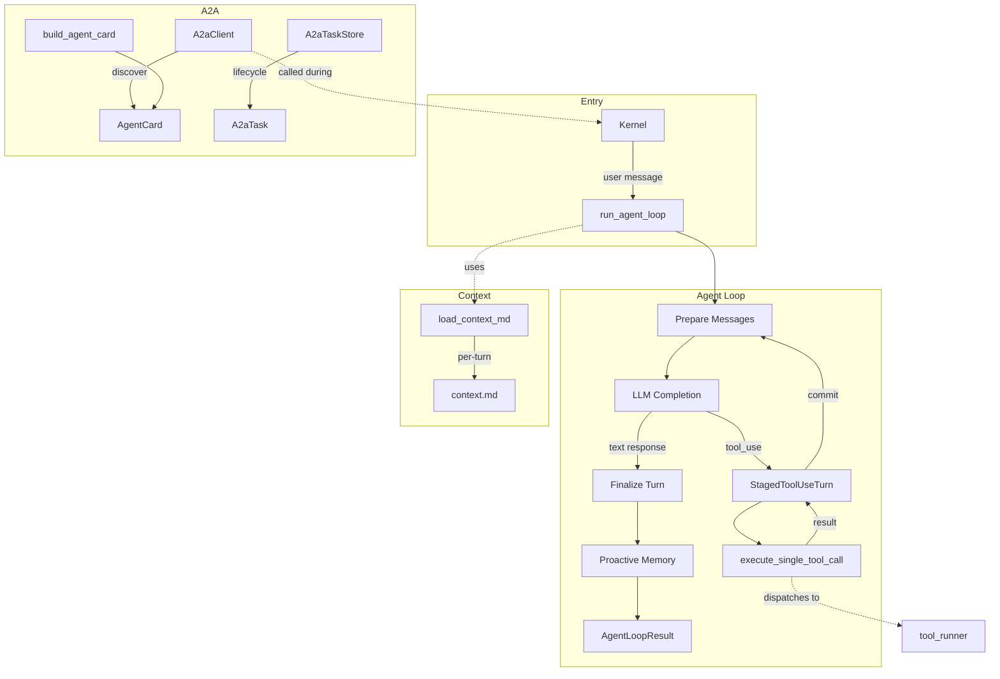

# Agent Runtime

# Agent Runtime

The Agent Runtime is the execution engine at the heart of LibreFang. It governs how agents receive messages, interact with LLMs, execute tools, manage conversation state, and interoperate with external agents. The runtime lives in `librefang-runtime` and is structured around three primary concerns: the **agent execution loop**, **A2A protocol interoperability**, and **per-turn context loading**.

## Architecture Overview

## The Agent Execution Loop (`agent_loop.rs`)

The agent loop is the central state machine that drives every agent turn. It handles the full lifecycle: receiving a user message, recalling memories, calling the LLM, executing tool calls in sequence, persisting state, and returning a result.

### Entry Points

- **`run_agent_loop`** — Non-streaming execution. Blocks until the agent produces a final response.
- **`run_agent_loop_streaming`** — Streaming variant. Emits `StreamEvent` values over an `mpsc` channel as the LLM generates tokens and tools execute.

Both share the same internal logic, differing only in how the LLM response is consumed and how results are delivered back to the caller.

### Loop Lifecycle

Each iteration of the agent loop follows this sequence:

1. **Prepare messages** — The conversation history is trimmed, repaired, and assembled into the format expected by the LLM provider. Images from prior turns are stripped to save tokens. The system prompt is built, incorporating recalled memories, workspace metadata, and any active A/B experiment variants.

2. **Call the LLM** — A `CompletionRequest` is sent via the `LlmDriver`. A process-global semaphore (`LLM_CONCURRENCY`, cap of 5) gates concurrent API calls to prevent memory spikes on constrained deployments.

3. **Handle the response**:
   - **`stop_reason: EndTurn`** — The agent's text response is finalized. Silent responses (NO_REPLY tokens) and progress-text leaks (dangling `"..."` preambles) are detected and handled.
   - **`stop_reason: ToolUse`** — Tool calls are staged, executed, and their results are committed back into the conversation. The loop then returns to step 1 with the updated history.
   - **`stop_reason: MaxTokens`** — The response is continued by sending the partial output back to the LLM (up to `MAX_CONTINUATIONS = 5`).

4. **Finalize the turn** — Proactive memory extraction runs, session state is persisted, hooks fire, and an `AgentLoopResult` is returned.

### Staged Tool Execution (`StagedToolUseTurn`)

Tool execution uses a staging pattern to prevent a critical bug (upstream #2381) where orphaned `ToolUse` blocks without paired `ToolResult` blocks could brick an agent session.

The `StagedToolUseTurn` struct accumulates:
- The assistant message containing `ToolUse` blocks
- Tool result blocks as each `execute_single_tool_call` completes
- Metadata for padding any unexecuted calls

The turn is only committed to `session.messages` and the LLM working copy via `commit()`, which atomically pushes both the assistant message and the paired user `{tool_result}` message. If the staged turn is dropped without committing (e.g., due to error propagation with `?`), `session.messages` remains untouched — no orphan blocks can leak.

### Tool Execution (`execute_single_tool_call`)

Each tool call passes through several gates before execution:

| Gate | Purpose |
|------|---------|
| `LoopGuard` | Circuit breaker / rate limiter for repetitive tool calls |
| Fork allowlist | Restricts tools in derivative (fork) turns |
| Hook registry (`BeforeToolCall`) | Plugins can block tool calls |
| `tool_runner::execute_tool` | Actual dispatch to the tool implementation |
| Hook registry (`AfterToolCall`, `TransformToolResult`) | Plugins can observe or rewrite results |

Tool execution is bounded by a configurable timeout (default 600s). Results are sanitized (injection markers stripped, content truncated to fit the context budget) before being appended to the staged turn.

### Message History Management

Conversation history grows unbounded without intervention, so the runtime trims it at safe boundaries:

- **`safe_trim_messages`** — Trims at conversation-turn boundaries so `ToolUse`/`ToolResult` pairs are never split. Applied to both the LLM working copy and the persistent session store.
- **`resolve_max_history`** — Determines the trim cap from manifest overrides → kernel config → compiled default (40 messages). Values below 4 are clamped up.
- **`strip_prior_image_data`** — Removes base64 image data from all messages except the last user message, preventing token bloat from stale images.

### Memory Integration

The loop integrates with the memory subsystem at several points:

- **Recall** (`setup_recalled_memories`) — Before each turn, relevant memories are retrieved via the context engine (semantic search over embeddings) and injected into the system prompt.
- **Proactive memory** — The `ProactiveMemoryHooks` system can extract facts, decisions, and preferences from the conversation automatically.
- **Episodic memory** — Interaction summaries are persisted asynchronously via `remember_interaction_best_effort`.
- **Conflict detection** — New memories are checked against existing ones for contradictions.

### Loop Options (`LoopOptions`)

`LoopOptions` controls non-standard invocation modes:

| Field | Purpose |
|-------|---------|
| `is_fork` | Marks derivative turns (e.g., auto-dream). Session state is not persisted. |
| `allowed_tools` | Runtime tool allowlist enforced at execute time (not schema time) to preserve Anthropic prompt cache alignment. |
| `interrupt` | Per-session interrupt handle for long-running tools to observe `/stop` signals. |
| `max_iterations` | Operator-level override for the iteration cap. |
| `max_history_messages` | Operator-level override for the history trim cap. |

### Result (`AgentLoopResult`)

The loop returns a structured result containing:

- `response` — Final text output
- `total_usage` — Aggregate token counts across all LLM calls
- `iterations` — How many loop iterations ran
- `decision_traces` — Structured records of every tool call (input, rationale, timing, outcome)
- `memories_saved` / `memories_used` / `memory_conflicts` — Memory system activity
- `directives` — Reply routing directives (reply-to, thread, silent)
- `owner_notice` — Private messages to the operator via `notify_owner`
- `silent` — Whether the agent chose not to reply
- `new_messages_start` — Index into `session.messages` where this turn's messages begin

### Key Constants

| Constant | Value | Purpose |
|----------|-------|---------|
| `MAX_ITERATIONS` | 100 | Loop iteration cap |
| `MAX_CONCURRENT_LLM_CALLS` | 5 | Process-global LLM call semaphore |
| `DEFAULT_MAX_HISTORY_MESSAGES` | 40 | Message history trim cap |
| `MIN_HISTORY_MESSAGES` | 4 | Floor for history cap |
| `TOOL_TIMEOUT_SECS` | 600 | Per-tool execution timeout |
| `MAX_CONTINUATIONS` | 5 | MaxTokens continuation limit |
| `MAX_CONSECUTIVE_ALL_FAILED` | 3 | Consecutive hard-failure abort threshold |
| `LAZY_TOOLS_THRESHOLD` | 30 | Tool count that triggers lazy loading |
| `ACCUMULATED_TEXT_MAX_BYTES` | 64 KB | Cap on intermediate text buffer |

### Lazy Tool Loading

When an agent's granted tool set exceeds `LAZY_TOOLS_THRESHOLD` (30 tools), the runtime switches to lazy mode. Instead of shipping all tool definitions in every request, only the always-native subset plus any tools the LLM has explicitly loaded via `tool_load` are included. This keeps the request payload small for agents with large tool catalogs while giving the LLM an escape hatch to discover and pull in additional tools on demand.

`resolve_request_tools` handles the logic: if `tool_load` is not in the agent's allowlist, lazy mode is disabled entirely — the LLM would have no way to recover stripped tools.

### Provider Prefix Handling (`strip_provider_prefix`)

Model IDs are often stored as `provider/org/model` but APIs expect just `org/model`. The `strip_provider_prefix` function handles this stripping and also normalizes bare model names (e.g., `gemini-2.5-flash` → `google/gemini-2.5-flash`) for providers that require qualified `org/model` format (OpenRouter, Together, Fireworks, Replicate, HuggingFace).

### Group Chat Support

For group-chat agents (identified by `is_group: true` in manifest metadata), the runtime prepends a sanitized `[sender]: ` prefix to user messages. The `sanitize_sender_label` function strips characters that could spoof other senders (brackets, colons, newlines, control characters) and truncates to 64 characters.

---

## A2A Protocol (`a2a.rs`)

Implements Google's Agent-to-Agent protocol for cross-framework agent interoperability. A2A enables LibreFang agents to discover and interact with external agents, and exposes LibreFang agents to external systems via Agent Cards.

### Agent Cards (`AgentCard`)

An `AgentCard` is a JSON capability manifest served at `/.well-known/agent.json`. It describes:

- **Identity** — name, description, URL, version
- **Capabilities** — streaming, push notifications, state transition history
- **Skills** — `AgentSkill` descriptors mapping LibreFang tools to A2A skill entries
- **Content modes** — supported input/output MIME types

`build_agent_card` constructs an `AgentCard` from a LibreFang `AgentManifest`, converting each tool into an A2A skill descriptor and setting the endpoint to `{base_url}/a2a`.

### Tasks (`A2aTask`)

Tasks are the unit of work exchanged between agents. Each task has:

- An ID and optional session ID for conversation continuity
- A status (`A2aTaskStatus`): `Submitted`, `Working`, `InputRequired`, `Completed`, `Cancelled`, `Failed`
- Messages (`A2aMessage`) with content parts (`A2aPart` — text, file, or structured data)
- Artifacts (`A2aArtifact`) produced by the task

The `A2aTaskStatusWrapper` handles a serialization quirk: some A2A implementations encode status as a bare string (`"completed"`), others as an object (`{"state": "completed", "message": null}`). The `#[serde(untagged)]` enum transparently accepts both forms.

### Task Store (`A2aTaskStore`)

An in-memory, bounded store for tracking A2A task lifecycle. Tasks are created by `tasks/send`, polled by `tasks/get`, and cancelled by `tasks/cancel`.

**Eviction policy** (applied lazily on each `insert`):

1. **TTL sweep** — Any task older than the configured TTL (default 24 hours) is removed regardless of state. This prevents `Working`/`InputRequired` tasks from accumulating indefinitely.
2. **Capacity eviction** — If still at capacity after the TTL sweep, the oldest terminal-state task (Completed/Failed/Cancelled) is evicted first. If no terminal tasks exist, the oldest task overall is evicted.

The store is thread-safe via an internal `Mutex`. The poisoned-mutex recovery pattern (`unwrap_or_else(|e| e.into_inner())`) ensures a panic in one thread doesn't permanently deadlock the store.

### A2A Client (`A2aClient`)

HTTP client for discovering and interacting with external A2A agents:

- **`discover(url)`** — Fetches the Agent Card from `{url}/.well-known/agent.json`
- **`send_task(url, message, session_id)`** — Sends a JSON-RPC `tasks/send` request to an external agent
- **`get_task(url, task_id)`** — Polls task status via `tasks/get`

The client uses a proxied HTTP client builder with a 30-second timeout and a custom `User-Agent` header identifying the LibreFang version.

### Discovery

`discover_external_agents` is called during kernel boot. It iterates over configured `ExternalAgent` entries, fetches each one's Agent Card, and returns successfully discovered agents. Failures are logged but do not block boot.

---

## Agent Context (`agent_context.rs`)

Handles per-turn loading of `context.md` files — Markdown files that external tools (cron jobs, scripts) update with live data that the agent should see in its prompt.

### Resolution Order

`resolve_context_path` looks for context files in this order:

1. `{workspace}/.identity/context.md` (new layout)
2. `{workspace}/context.md` (legacy / unmigrated workspaces)

The first candidate that exists on disk wins.

### Caching Behavior

The `cache_context` flag on `AgentManifest` controls behavior:

- **`cache_context = false`** (default) — The file is re-read from disk every turn, so external updates reach the LLM immediately.
- **`cache_context = true`** — The first successful read is cached and returned verbatim on every subsequent call.

### Failure Handling

When a re-read fails (e.g., an external writer is mid-rewrite and the file contains invalid UTF-8), the system falls back to the last successfully cached content with a warning. This prevents context from disappearing mid-conversation. If no cache exists, `None` is returned.

### Security

- **Symlink rejection** — Uses `symlink_metadata` (not `metadata`) to detect and refuse symlinks. This prevents a prompt-injection vector where an attacker could point `context.md` at sensitive system files (e.g., `/etc/passwd`) and have their contents injected into the LLM prompt.
- **Size cap** — Files are capped at 32 KB (`MAX_CONTEXT_BYTES`). Reads are bounded at the I/O level so multi-GB files are never fully loaded into memory. Truncation preserves valid UTF-8 boundaries.
- **Binary rejection** — Files with zero valid UTF-8 prefix bytes are treated as errors, triggering the cache fallback path.

---

## Integration Points

### Kernel

The kernel (`librefang-kernel`) is the primary consumer of the runtime. It:
- Calls `run_agent_loop` / `run_agent_loop_streaming` when a user message arrives
- Populates `LoopOptions` from `KernelConfig` (max iterations, history cap, interrupt handles)
- Calls `discover_external_agents` during boot
- Serves Agent Cards via the HTTP API

### Tool Runner (`tool_runner.rs`)

`execute_single_tool_call` delegates to `tool_runner::execute_tool` for actual tool dispatch. The tool runner handles:
- Capability enforcement (agents can only use tools in their manifest)
- MCP connection management
- Skill registry lookups
- Sandbox enforcement (workspace isolation, command allowlists)
- Approval workflows (human-in-the-loop gating)

### Memory Subsystem (`librefang-memory`)

The loop depends on `MemorySubstrate` and `ProactiveMemoryStore` for:
- Semantic memory recall (embedding-based search)
- Episodic memory persistence
- Proactive fact extraction
- Memory conflict detection

### Context Engine (`context_engine.rs`)

An optional plugin interface that customizes:
- Tool result truncation strategy
- Memory recall and ingestion
- Context window budget management

When no context engine is registered, built-in head+tail truncation and default recall behavior apply.

### Hooks (`hooks.rs`)

The hook registry provides extension points at:
- `BeforeToolCall` / `AfterToolCall` — Observe or block tool execution
- `TransformToolResult` — Rewrite tool results before they enter the conversation
- `AgentLoopEnd` — React to turn completion (used by auto-dream triggers)