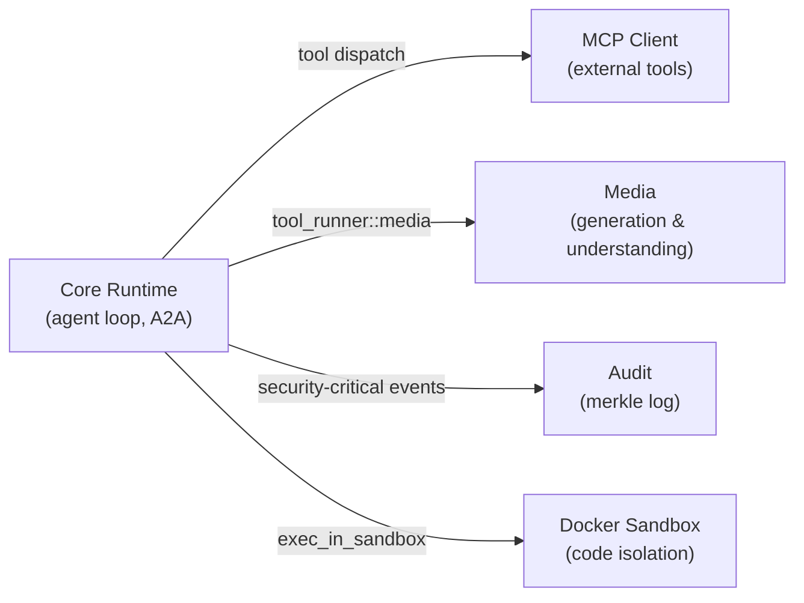

# Agent Runtime

# Agent Runtime

The Agent Runtime is the execution layer that drives LibreFang agents. It encompasses the core agent loop, audit logging, external tool integration, media capabilities, and sandboxed code execution.

## Sub-modules

| Sub-module | Purpose |
|---|---|
| [Core Runtime](librefang-runtime.md) | Agent loop, A2A protocol, context loading, message history, security boundaries, plugin management, provider health |
| [Audit](librefang-runtime-audit.md) | Merkle hash chain audit trail for tamper-evident logging of security-critical agent actions |
| [MCP Client](librefang-runtime-mcp.md) | Model Context Protocol client — transport lifecycle, tool discovery, argument validation, taint scanning, and dispatch |
| [Media](librefang-runtime-media.md) | Provider-agnostic media generation (image, TTS, video, music) and understanding (image description, audio transcription) |
| [Docker Sandbox](librefang-runtime-sandbox-docker.md) | OS-level isolation for untrusted agent code execution via Docker containers |

## How they fit together

```mermaid
graph LR
    Core["Core Runtime<br/>(agent loop, A2A)"]
    Audit["Audit<br/>(merkle log)"]
    MCP["MCP Client<br/>(external tools)"]
    Media["Media<br/>(generation & understanding)"]
    Sandbox["Docker Sandbox<br/>(code isolation)"]

    Core -->|"tool dispatch"| MCP
    Core -->|"tool_runner::media"| Media
    Core -->|"security-critical events"| Audit
    Core -->|"exec_in_sandbox"| Sandbox
```

The **Core Runtime** orchestrates everything. During each agent turn, the loop loads per-turn context, assembles prompts (with hook-driven section collection and experiment selection), calls the LLM provider (with retry logic), and processes the response — which may include tool calls. Tool dispatch routes to the appropriate handler:

- **MCP Client** handles calls to external tool servers over stdio, SSE, or HTTP transports, with taint scanning and caller-context injection.
- **Media** handles image generation, TTS, video, and music requests through a driver cache that selects the right provider (ElevenLabs, Gemini, OpenAI, etc.).
- **Docker Sandbox** executes untrusted code in isolated containers with network isolation, capability dropping, and resource limits.

Every security-critical action flows into the **Audit** module, which appends it to a SHA-256 hash chain backed by SQLite — surviving restarts and detectable if tampered.

## Key cross-module workflows

- **Provider listing and health probing** flows from API routes through the core's `probe_provider_cached` into the shared HTTP/TLS layer, used by both LLM providers and media drivers.
- **Plugin hooks** are loaded and version-checked by the core's plugin manager, then tested via API routes — the hook system feeds into prompt assembly during the agent loop.
- **Tool budget enforcement** in the core governs how many tool calls an agent turn can make, applying equally to MCP tools and media tools.
- **Sandbox validation** is configured through the core's `SandboxConfig`, with the Docker crate enforcing the actual container boundaries.