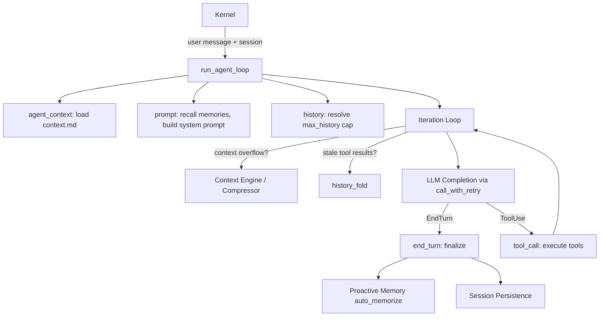

# Agent Runtime

# Agent Runtime

The agent runtime is the execution engine at the core of LibreFang. It manages the lifecycle of a single agent turn: loading context, recalling memories, building the prompt, calling the LLM in a tool-use loop, executing tools, and persisting the updated session.

## Architecture Overview

```mermaid
graph TD
    K[Kernel] -->|user message + session| RAL[run_agent_loop]
    RAL --> AC[agent_context: load context.md]
    RAL --> P[prompt: recall memories, build system prompt]
    RAL --> H[history: resolve max_history cap]
    RAL --> LOOP[Iteration Loop]
    LOOP -->|context overflow?| CE[Context Engine / Compressor]
    LOOP -->|stale tool results?| HF[history_fold]
    LOOP --> LLM[LLM Completion via call_with_retry]
    LLM -->|EndTurn| ET[end_turn: finalize]
    LLM -->|ToolUse| TE[tool_call: execute tools]
    TE --> LOOP
    ET --> MEM[Proactive Memory auto_memorize]
    ET --> SESS[Session Persistence]
```

## Entry Points

### `run_agent_loop`

The primary synchronous entry point. Called by the kernel's messaging layer for each inbound user message. Returns an `AgentLoopResult` containing the final response text, token usage, decision traces, saved/used memories, and provider metadata.

### `run_agent_loop_streaming`

The streaming variant. Used by channel adapters that deliver tokens incrementally to the user. Shares the same iteration structure and end-turn finalization, but emits `StreamEvent` payloads through an `mpsc::Sender` as text is produced.

Both entry points accept a large parameter surface (agent manifest, session, LLM driver, tool definitions, kernel handle, memory substrate, etc.) plus a `LoopOptions` struct that carries operator-level overrides (max iterations, max history, ephemeral flags, compression config).

## Iteration Loop

The loop runs up to `max_iterations` (default from `AutonomousConfig::DEFAULT_MAX_ITERATIONS`, overridable per-agent or via `LoopOptions`). Each iteration:

1. **Interrupt check** — polls `opts.interrupt` for a session-scoped cancel signal
2. **Context engine compaction** — if `should_compress` fires (based on previous turn's prompt token count vs. context window), runs LLM-based summarisation of older messages
3. **History fold** — rewrites stale tool-result blocks via `maybe_fold_stale_tool_results` to prevent context bloat from old payloads
4. **Context assembly** — either through the pluggable `ContextEngine` or the inline path (soft compression → hard trim → context guard)
5. **LLM completion** — builds a `CompletionRequest` with resolved model, tools, system prompt, and assembled messages; calls via `call_with_retry`
6. **Response handling** — branches on `stop_reason`:
   - `EndTurn` / `StopSequence` → classify retry (empty response, hallucinated action, action intent), then finalize
   - `ToolUse` → execute tool group, append results, continue
   - `MaxTokens` → accumulate partial text, attempt continuation (up to `MAX_CONTINUATIONS = 5`)

The loop exits on: final text response, circuit breaker (`LoopGuard`), max iterations exceeded, timeout, consecutive tool failures (`MAX_CONSECUTIVE_ALL_FAILED = 3`), or interrupt signal.

## Submodules

### `agent_context` — Per-Turn Context Loading

Loads an optional `context.md` file from the agent's workspace into the prompt. Designed for agents that depend on externally refreshed data (cron jobs, scripts).

**Resolution order:** `{workspace}/.identity/context.md` (new layout) → `{workspace}/context.md` (legacy).

**Behaviour modes:**
- **Default (`cache_context = false`):** Reads from disk every turn. If the read fails (e.g. external writer mid-replace), falls back to the last successfully cached content.
- **Cached (`cache_context = true`):** First successful read is frozen and returned on every subsequent call. External updates are never seen.

**Security:** Uses `symlink_metadata` to reject symlinks — prevents an attacker who can write to the workspace from pointing `context.md` at sensitive files (e.g. `/etc/passwd`) and having their contents injected into the LLM prompt. Files are capped at 32 KB (`MAX_CONTEXT_BYTES`).

**Async variant:** `load_context_md_async` performs the same logic via `tokio::fs` to avoid parking the executor. The sync version is retained for the non-async streaming entry point.

### `end_turn` — Turn Finalization

Handles everything that happens after the LLM produces its final text response.

**Key structures:**
- `FinalizeEndTurnContext` — bundles all state needed for finalization (manifest, session, memory, hooks, sender context, loop options)
- `FinalizeEndTurnResultData` — collects the turn's output (response text, token usage, decision traces, memories, directives)

**Retry classification** (`classify_end_turn_retry`):
- `EmptyResponse` — model returned no text and no tool calls (with a silent-failure flag for zero-token responses)
- `HallucinatedAction` — response looks like the model claimed to do something without calling the tool
- `ActionIntent` — user message contains action intent but model responded with prose only

**Finalization path** (`finalize_successful_end_turn`):
1. Appends assistant response to session
2. Prunes heartbeat turns
3. Persists session (skipped for fork/incognito turns)
4. Writes episodic memory (`remember_interaction_best_effort`)
5. Fires context engine `after_turn` hook
6. Extracts proactive memories via `auto_memorize` (skipped for fork/incognito)
7. Fires `AgentLoopEnd` hook

**Proactive memory gating** (`gated_proactive_memory_for_retrieve`, `gated_proactive_memory_for_memorize`): Per-agent overrides in `manifest.proactive_memory` can disable retrieval or memorization independently, primarily used for cron sub-agents that should not pollute long-term memory.

### `history` — History Cap Configuration

Manages the message-history trim limit with a three-tier resolution and safety clamping.

**Constants:**
| Constant | Value | Purpose |
|---|---|---|
| `DEFAULT_MAX_HISTORY_MESSAGES` | 60 | ~7–10 real turns; keeps prompt-cache prefix stable |
| `MAX_HISTORY_MESSAGES` | 500 | Hard ceiling; operator/manifest values above this are clamped |
| `MIN_HISTORY_MESSAGES` | 4 | Floor; lower values defeat the safe-trim heuristic |

**Resolution order** (`resolve_max_history`): `manifest.max_history_messages` → `opts.max_history_messages` → `DEFAULT_MAX_HISTORY_MESSAGES`. The result is clamped by `clamp_max_history`.

### `message` — Message Utilities

A collection of helpers for message processing used across the loop:

**Text accumulation:** `push_accumulated_text` maintains a bounded buffer (64 KB cap via `ACCUMULATED_TEXT_MAX_BYTES`) of intermediate text emitted alongside `tool_use` blocks. Used as a fallback when the final iteration returns empty text.

**Safe trimming** (`safe_trim_messages`): Trims both the working message list and the persistent session messages to the configured cap. Cuts at turn boundaries (never splits ToolUse/ToolResult pairs). Rescues pinned messages (e.g. delegation results) from the trim range. Runs `validate_and_repair` + `ensure_starts_with_user` on both copies to prevent reload failures with strict providers. Synthesizes a minimal user message if trimming leaves fewer than 2 messages.

**Sanitization:**
- `sanitize_for_memory` — strips channel-envelope prefixes (WhatsApp gateway markers) before persisting episodic memory. Returns `None` when nothing meaningful remains.
- `sanitize_tool_result_content` — strips injection markers then truncates via context engine or built-in head+tail strategy.
- `sanitize_sender_label` — removes bracket/colon/newline/control characters from group-chat sender names, collapses whitespace, truncates to 64 chars.

**Classifiers:**
- `is_no_reply` — detects `NO_REPLY` / `[no reply needed]` markers
- `is_progress_text_leak` — catches short ellipsis-terminated preambles the model emits before tool calls it never makes
- `is_cascade_leak` — detects prompt-scaffolding bullets recalled from memory
- `is_soft_error_content` — identifies recoverable tool errors (sandbox rejections, parameter issues)
- `is_parameter_error_content` — detects LLM parameter mistakes that should not count toward the failure abort threshold

**Image handling:**
- `strip_processed_image_data` — replaces base64 image data in already-processed turns with text placeholders
- `strip_prior_image_data` — cleans stale images from previous turns, preserving the last user message's images

**Token usage:** `accumulate_token_usage` adds per-iteration usage to the running total with overflow protection (clamps to `u64::MAX` with a warning).

## Key Behaviours

### Sender Context

The loop distinguishes human and automated turns:
- `build_sender_prefix` — produces a `[name]: ` prefix for group chats and channel DMs with real sender identity. Skipped for internal channels (`webui`, `cron`, `autonomous`) to preserve prompt-cache stability.
- `build_automation_marker_prefix` — prepends `[Scheduled trigger]` or `[Autonomous trigger]` for cron/loop fires so the model can distinguish them from human turns.

Both are applied after PII filtering so display names that look like emails/phones are not redacted into the stored content.

### Injection Guard

User messages are scanned for prompt-injection indicators before reaching the LLM. Threats are logged and a warning prefix is prepended — the message is never silently dropped.

### Lazy Tool Loading

By default (`lazy_tools = true` in manifest metadata), the LLM receives a trimmed "always native" toolset plus `tool_load` / `tool_search`, and pulls in additional schemas on demand. Set `lazy_tools = false` to restore eager loading of all tools.

### Prompt Caching

Prompt caching is enabled by default (`prompt_caching` metadata flag). The cache strategy is resolved from `prompt_cache_strategy` metadata (supports `disabled`, `system_only`, `system_and_N`). A `cache_ttl` hint maps to Anthropic's discrete cache windows (≥1800s → 1h beta cache, otherwise default 5m ephemeral).

### Block-Stall Degrade

When the loop detects consecutive block-only iterations (tool calls with no text output), it can force a single "tools stripped" completion after `block_stall_degrade_after` iterations (default from `AutonomousConfig`), forcing the model to produce prose.

### Fork and Incognito Modes

`LoopOptions` carries `is_fork` and `incognito` flags that suppress side effects:
- **Fork** — ephemeral derivative calls (auto-dream consolidation). No session persistence, no memory writes, no context engine updates.
- **Incognito** — full read access to existing memories, but all writes (session save, episodic memory, proactive memory) are silently dropped.

### Session Repair

On failure exits (circuit breaker, max iterations, timeout), `repair_session_before_save` runs `validate_and_repair_with_stats` to fix orphaned ToolUse/ToolResult pairs, empty messages, and misordered results — preventing strict providers from rejecting the session on next load.

## Integration Points

| Component | Interface | Purpose |
|---|---|---|
| `MemorySubstrate` | `save_session_async`, memory recall | Session persistence and episodic memory |
| `ProactiveMemoryStore` | `auto_memorize`, `auto_retrieve` | Automatic memory extraction/recall |
| `LlmDriver` | `complete`, `stream` | LLM completion (with fallback chains) |
| `ContextEngine` | `should_compress`, `compact`, `assemble`, `after_turn` | Pluggable context management |
| `KernelHandle` | `fire_agent_step`, `touch_heartbeat`, catalog lookups | Kernel integration hooks |
| `HookRegistry` | `fire(AgentLoopEnd)` | Extensible event hooks |
| `SkillRegistry` | Tool resolution | Dynamic skill-based tools |
| `CheckpointManager` | Session checkpointing | Crash recovery |

## Configuration Reference

Agent behaviour is configured through `AgentManifest` fields and `LoopOptions`:

| Setting | Location | Default | Description |
|---|---|---|---|
| `max_history_messages` | Manifest / `LoopOptions` | 60 | History trim cap (clamped to 4–500) |
| `max_iterations` | `manifest.autonomous.max_iterations` / `LoopOptions` | 25 | Loop iteration limit |
| `cache_context` | Manifest | `false` | Freeze `context.md` after first read |
| `lazy_tools` | `manifest.metadata` | `true` | On-demand tool loading |
| `prompt_caching` | `manifest.metadata` | `true` | Enable provider prompt caching |
| `prompt_cache_strategy` | `manifest.metadata` | Provider default | Cache placement strategy |
| `block_stall_degrade_after` | `manifest.autonomous` | Config default | Force prose after N block-only turns |
| `is_fork` | `LoopOptions` | `false` | Ephemeral fork mode |
| `incognito` | `LoopOptions` | `false` | Read-only memory mode |
| `gateway_compression` | `LoopOptions` | — | Pre-loop safety-net compression |
| `compaction_config` | `LoopOptions` | Built-in defaults | LLM-based context compression settings |
| `tool_results_config` | `LoopOptions` | Built-in defaults | Tool result size limits and fold timing |