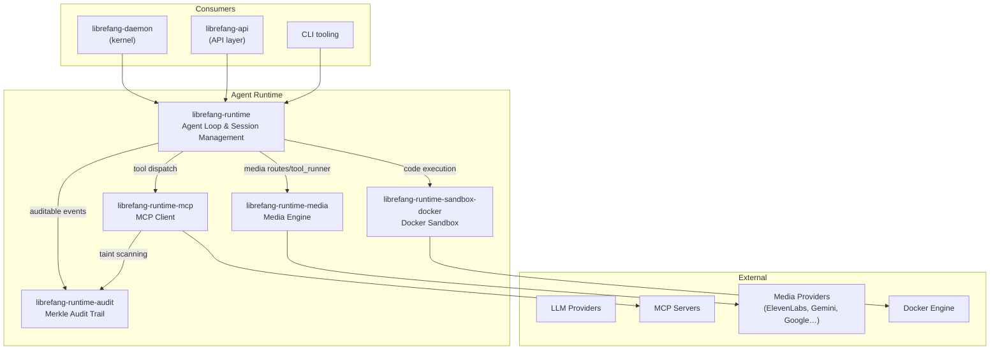

# Agent Runtime

# Agent Runtime

The Agent Runtime module group is the execution backbone of LibreFang. It provides everything needed to run autonomous agent sessions: the core agent loop, audit logging, external tool connectivity via MCP, multi-modal media processing, and sandboxed code execution.

## Architecture

```mermaid
graph TB
    subgraph "Consumers"
        Kernel["librefang-daemon<br/>(kernel)"]
        API["librefang-api<br/>(API layer)"]
        CLI["CLI tooling"]
    end

    subgraph "Agent Runtime"
        Core["librefang-runtime<br/>Agent Loop & Session Management"]
        Audit["librefang-runtime-audit<br/>Merkle Audit Trail"]
        MCP["librefang-runtime-mcp<br/>MCP Client"]
        Media["librefang-runtime-media<br/>Media Engine"]
        Sandbox["librefang-runtime-sandbox-docker<br/>Docker Sandbox"]
    end

    subgraph "External"
        LLM["LLM Providers"]
        MCPS["MCP Servers"]
        Prov["Media Providers<br/>(ElevenLabs, Gemini, Google…)"]
        Docker["Docker Engine"]
    end

    Kernel --> Core
    API --> Core
    CLI --> Core

    Core -->|"tool dispatch"| MCP
    Core -->|"media routes/tool_runner"| Media
    Core -->|"code execution"| Sandbox
    Core -->|"auditable events"| Audit

    MCP --> MCPS
    MCP -->|"taint scanning"| Audit
    Media --> Prov
    Sandbox --> Docker
```

## How the Sub-Modules Fit Together

The [core runtime](librefang-runtime-src.md) (`librefang-runtime`) owns the agent loop—the cycle of receiving a user message, dispatching to an LLM, executing tools, and returning a response. It handles session health concerns like history trimming, context overflow recovery via the `compactor`, per-turn context loading, and SSRF-hardened outbound networking. The kernel and API layer consume this crate directly; CLI tooling calls into specific subsystems (catalog sync, registry sync, provider health probes) without running the agent loop.

When the agent loop executes a tool, it may route through one of three specialized subsystems:

- **[MCP Client](librefang-runtime-mcp-src.md)** (`librefang-runtime-mcp`) — connects the runtime to external MCP tool servers over stdio, SSE, Streamable HTTP, or plain HTTP transports. It handles tool discovery, argument validation, caller context injection, and outbound taint scanning before invoking any external tool.

- **[Media Engine](librefang-runtime-media-src.md)** (`librefang-runtime-media`) — provides a trait-based driver abstraction for image generation, text-to-speech, video, and music generation across providers (ElevenLabs, Gemini, Google TTS, etc.), plus a media understanding engine for image description and audio transcription. A `MediaDriverCache` manages driver instances keyed by provider alias.

- **[Docker Sandbox](librefang-runtime-sandbox-docker-src.md)** (`librefang-runtime-sandbox-docker`) — isolates agent code execution inside hardened Docker containers with resource limits, network isolation, dropped capabilities, and read-only root filesystems.

The [audit module](librefang-runtime-audit-src.md) (`librefang-runtime-audit`) is the cross-cutting security layer. It maintains a Merkle hash chain where every auditable event—tool calls, sandbox operations, security-sensitive actions—is appended with a SHA-256 hash linking to the previous entry. The chain persists to SQLite (`audit_entries` table, schema V8+) with an optional external anchor file storing the chain tip to detect full table rewrites. The MCP taint scanner feeds into this audit trail via `TaintSink::mcp_tool_call()`.

## Key Workflows

**Agent loop streaming with compression** — `run_agent_loop_streaming` drives the turn cycle. When token estimates (via `estimate_token_count` / `estimate_message_tokens` in the `compactor`) exceed limits, `gateway_compression` applies `drop_oldest_until_under` to trim history while preserving session integrity.

**Plugin hook execution** — Routes call `get_plugin_info` → `load_plugin_manifest` → `version_satisfies` to resolve and validate plugins before invoking hooks.

**MCP tool invocation** — `tool_runner::dispatch` routes to `McpConnection`, which selects a transport, runs arguments through the taint scanner, injects `CallerContext`, and invokes the external tool.

**Sandboxed code execution** — `create_sandbox` validates the image name, config, network, and capabilities, then launches a hardened container. `exec_in_sandbox` validates commands for shell metacharacters before executing inside the container. `destroy_sandbox` tears it down.

**Media generation and understanding** — The `MediaEngine` resolves a provider alias through `MediaDriverCache::get_or_create`, then dispatches to the appropriate driver. For understanding tasks (image description, audio transcription), it handles transcoding (e.g., OGA → OGG Opus) before sending to the provider.

## Consumers

| Consumer | Usage |
|---|---|
| `librefang-daemon` | Runs the full agent loop |
| `librefang-api` | Exposes runtime via HTTP routes |
| CLI / extensions | Catalog sync, registry sync, provider health probes (no agent loop) |