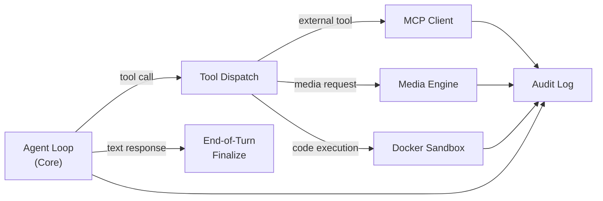

# Agent Runtime

# Agent Runtime

The Agent Runtime is the execution engine of LibreFang. It orchestrates the core agent loop — the iterative cycle of prompt assembly, LLM completion, tool execution, and response finalization — while providing the infrastructure for secure, observable, and extensible agent behavior.

## Sub-Modules

| Module | Responsibility |
|--------|---------------|
| [Agent Core](librefang-runtime-src.md) | Agent loop, prompt assembly, message history, context loading, A2A interop, end-of-turn finalization |
| [Audit](librefang-runtime-audit-src.md) | Append-only, Merkle-hashed audit trail for all security-relevant runtime actions |
| [MCP Client](librefang-runtime-mcp-src.md) | Model Context Protocol client — discovers and calls external tool servers with taint scanning and argument validation |
| [Media](librefang-runtime-media-src.md) | Provider-agnostic media generation (image, speech, video, music) and understanding (describe, transcribe) |
| [Docker Sandbox](librefang-runtime-sandbox-docker-src.md) | OS-level code execution isolation in hardened Docker containers |

## How They Fit Together

```mermaid
graph LR
    LOOP["Agent Loop<br/>(Core)"]
    LOOP -->|tool call| DISPATCH["Tool Dispatch"]
    DISPATCH -->|external tool| MCP["MCP Client"]
    DISPATCH -->|media request| MEDIA["Media Engine"]
    DISPATCH -->|code execution| SANDBOX["Docker Sandbox"]
    MCP --> LOG["Audit Log"]
    MEDIA --> LOG
    SANDBOX --> LOG
    LOOP --> LOG
    LOOP -->|text response| FINALIZE["End-of-Turn<br/>Finalize"]
```

The **Agent Core** drives everything. Each iteration of `run_agent_loop` (or its streaming variant) assembles a prompt from loaded context, sends it to the LLM, and inspects the response. When the LLM returns `tool_calls`, the core dispatches them through the appropriate backend:

- **MCP Client** handles calls to external tool servers — negotiating transport (Stdio, SSE, HTTP), scanning arguments for taint, validating against schemas, and managing OAuth for protected servers.
- **Media Engine/Driver** serves tool calls and HTTP API endpoints that need image generation, TTS, transcription, or video analysis, routing to the correct provider via `MediaDriverCache`.
- **Docker Sandbox** provides isolated containers for agents that execute arbitrary code, enforcing capability drops, read-only filesystems, and resource limits.

The **Audit** module observes the entire runtime. Every tool invocation, lifecycle event, authentication attempt, and budget enforcement action is appended to a tamper-evident Merkle hash chain, optionally persisted to SQLite so the trail survives restarts.

## Key Cross-Module Workflows

**Tool call lifecycle.** The agent loop emits a tool call → `tool_runner::dispatch` routes it → if it targets an MCP server, the MCP client validates arguments, runs taint checks, injects caller context, and transports the call → the result flows back through the loop → the audit log records the invocation and outcome.

**End-of-turn pipeline.** When the LLM produces a text response (no further tool calls), the core runs finalization: persisting memories, folding stale tool results, and gating proactive memory retrieval (`gated_proactive_memory_for_retrieve`). This is where conversation state is condensed and persisted for the next turn.

**Provider health and media resolution.** Listing providers triggers a health probe chain (`probe_provider_cached` → TLS config) shared between the core runtime and media subsystem, ensuring that media tool calls only route to healthy, reachable endpoints.

**Plugin and A2A integration.** The core loads plugin manifests via `plugin_manager` (with semver validation) and discovers external agents through the A2A layer, enabling inter-agent task delegation that itself is audited and sandboxed.