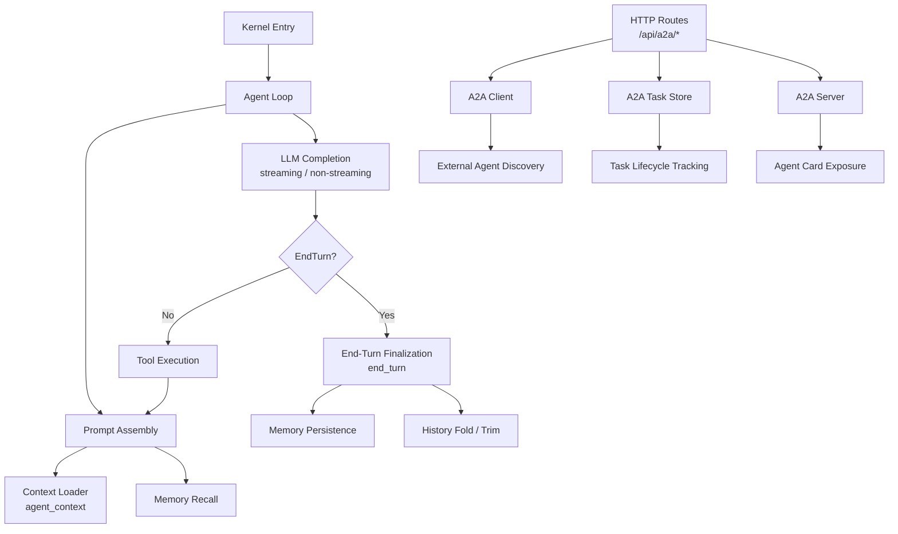

# Agent Runtime

# Agent Runtime

The Agent Runtime is the execution core of LibreFang. It orchestrates every agent turn from prompt assembly through LLM completion to post-turn persistence. The runtime is split into several cooperating subsystems: the agent loop itself (with streaming and non-streaming entry points), A2A inter-agent communication, per-turn context loading, message-history management, and end-of-turn finalization.

## Architecture Overview

```mermaid
graph TD
    A[Kernel Entry] --> B[Agent Loop]
    B --> C[Prompt Assembly]
    C --> D[Context Loader<br/>agent_context]
    C --> E[Memory Recall]
    B --> F[LLM Completion<br/>streaming / non-streaming]
    F --> G{EndTurn?}
    G -- No --> H[Tool Execution]
    H --> C
    G -- Yes --> I[End-Turn Finalization<br/>end_turn]
    I --> J[Memory Persistence]
    I --> K[History Fold / Trim]
    
    L[A2A Client] --> M[External Agent Discovery]
    N[A2A Task Store] --> O[Task Lifecycle Tracking]
    P[A2A Server] --> Q[Agent Card Exposure]
    
    R[HTTP Routes<br/>/api/a2a/*] --> L
    R --> N
    R --> P
```

---

## A2A Protocol (`a2a.rs`)

Implements Google's Agent-to-Agent protocol for cross-framework interoperability. LibreFang agents can both *expose* capabilities to external systems and *consume* capabilities from external A2A-compliant agents.

### Agent Card

`AgentCard` is a JSON capability manifest served at `/.well-known/agent.json`. It describes:

- **Identity**: `name`, `description`, `url`, `version`
- **Capabilities**: `AgentCapabilities` — streaming, push notifications, state transition history
- **Skills**: `Vec<AgentSkill>` — each skill has an `id`, `name`, `description`, discovery `tags`, and example `prompts`
- **I/O modes**: `default_input_modes` / `default_output_modes` (e.g. `["text"]`)

`build_agent_card(manifest, base_url)` converts an `AgentManifest` into an `AgentCard`, mapping tool names to A2A skill descriptors. The card URL is `{base_url}/a2a`.

### A2A Task Lifecycle

An `A2aTask` is the unit of work exchanged between agents. Key fields:

| Field | Purpose |
|---|---|
| `id` | Unique task identifier |
| `session_id` | Optional conversation continuity key |
| `status` | Current state (see below) |
| `messages` | Conversation turns (`Vec<A2aMessage>`) |
| `artifacts` | Produced artifacts (`Vec<A2aArtifact>`) |
| `agent_id` | Local agent this task dispatched to |
| `caller_a2a_agent_id` | External caller's identity (audit/ACL) |

Status transitions follow: `Submitted → Working → Completed | Failed | Cancelled`. An `InputRequired` state allows the agent to request more input.

`A2aTaskStatusWrapper` handles interoperability by accepting both the bare string form (`"completed"`) and the object form (`{"state": "completed", "message": ...}`) used by different A2A implementations. Use `.state()` to extract the underlying `A2aTaskStatus` regardless of encoding.

### A2aTaskStore

In-memory task store with optional SQLite persistence. Created via:

- **`A2aTaskStore::new(max_tasks)`** — in-memory only, 24-hour TTL
- **`A2aTaskStore::with_ttl(max_tasks, duration)`** — custom TTL
- **`A2aTaskStore::with_persistence(max_tasks, db_path)`** — SQLite-backed

**Eviction policy** (applied lazily on `insert`):

1. **TTL sweep**: all tasks whose `updated_at` exceeds `task_ttl` are removed, regardless of state. This prevents `Working`/`InputRequired` tasks from accumulating indefinitely.
2. **Capacity eviction**: if still at capacity after the TTL sweep, evict the oldest terminal-state task (`Completed`/`Failed`/`Cancelled`). If none exist, evict the oldest task overall.

**SQLite persistence** (`with_persistence`):

- Schema: `a2a_tasks_v2` table with full `messages_json` and `artifacts_json` columns
- On startup: prunes rows older than 7 days, then loads the most recent `max_tasks` rows into memory
- `get()` falls back to SQLite when a task has been evicted from memory — pollers never receive 404 for recently-evicted tasks
- Persistence is best-effort: SQLite write failures log a warning but don't fail the caller

Key methods:

- `insert(task)` — persist + insert with eviction
- `get(task_id)` — memory-first, then SQLite fallback
- `update_status(task_id, status)` — mutate in-memory + upsert
- `complete(task_id, response, artifacts)` — append response, set `Completed`
- `fail(task_id, error_message)` — append error, set `Failed`
- `cancel(task_id)` — set `Cancelled`

### A2aClient

HTTP client for discovering and interacting with external A2A agents. Created via `A2aClient::new()` (empty SSRF allowlist) or `A2aClient::new_with_allowlist(hosts)`.

Each outbound request builds a fresh `reqwest::Client` to pin DNS resolution to SSRF-validated IPs (see Security below).

Methods:

- **`discover(url)`** — fetches `{url}/.well-known/agent.json`, returns `AgentCard`
- **`send_task(url, message, session_id)`** — sends a JSON-RPC `tasks/send` request
- **`get_task(url, task_id)`** — sends a JSON-RPC `tasks/get` request

All responses are capped via `read_capped_body`: 256 KiB for agent cards (`MAX_AGENT_CARD_BYTES`), 1 MiB for task responses (`MAX_A2A_TASK_BYTES`).

### Security Model

The A2A subsystem implements several hardening measures:

- **SSRF prevention** (#3563): `build_client_for_url` runs `web_fetch::check_ssrf` on every outbound URL, pins the validated IPs via `resolve()`, and disables redirects entirely (`Policy::none()`)
- **DNS rebinding protection** (#3563): DNS pinning ensures the validated IPs are used for the actual connection, closing the TOCTOU window
- **Redirect blocking**: 3xx responses are explicitly rejected to prevent redirect-based SSRF via DNS rebinding on the redirect target
- **Body size caps** (#3785): remote responses are streamed with per-chunk accounting; decompression is disabled to prevent gzip bombs from slipping past `Content-Length` checks
- **URL canonicalization** (`canonicalize_a2a_url`): normalizes scheme, host, port, trailing slash, and strips fragments/empty queries so trust-list comparisons are consistent

### Discovery

`discover_external_agents(agents)` is called during kernel boot. It fetches Agent Cards for all configured `ExternalAgent` entries, stores them keyed by canonicalized URL, and logs results.

---

## Agent Context Loader (`agent_context.rs`)

Loads per-turn `context.md` files that external tools (cron jobs, scripts) maintain to inject live data into agent prompts.

### Resolution Order

1. `{workspace}/.identity/context.md` (new layout)
2. `{workspace}/context.md` (legacy fallback)

The first candidate that exists wins, even if empty or unreadable.

### Caching Modes

Controlled by `AgentManifest::cache_context`:

- **`false` (default)**: reads from disk on every turn, picking up external updates in real-time
- **`true`**: freezes the first successful read for the lifetime of the process

### Fallback Behavior

On re-read failure (e.g. external writer mid-rewrite), the loader falls back to the previously cached content with a `warn!` log rather than dropping context mid-conversation.

### Safety Constraints

- **Size cap**: 32 KiB (`MAX_CONTEXT_BYTES`). Oversized files are truncated to the last valid UTF-8 boundary.
- **Symlink rejection**: uses `symlink_metadata` to detect and refuse symlinks — prevents prompt-injection exfiltration (e.g. pointing `context.md` at `/etc/passwd`)
- **UTF-8 validation**: files with no valid UTF-8 prefix surface as I/O errors, triggering the cache fallback

### API

- `load_context_md(workspace, cache_context)` — synchronous, used by the streaming entry point
- `load_context_md_async(workspace, cache_context)` — async variant using `tokio::fs`, functionally identical

Both share the same global `OnceLock<Mutex<HashMap<PathBuf, String>>>` cache.

---

## Agent Loop — End-Turn Finalization (`agent_loop/end_turn.rs`)

Handles everything that happens after the LLM produces a final `EndTurn` response: session persistence, memory writes, history folding, proactive memory extraction, and hook firing.

### Retry Classification (`classify_end_turn_retry`)

Before accepting an `EndTurn`, the runtime checks whether the response should be retried:

| Retry Reason | Trigger |
|---|---|
| `EmptyResponse` | Empty text + no tool calls; retries on iteration 0 or when both token counts are 0 (silent API failure) |
| `HallucinatedAction` | Non-empty text, no tool calls, tools available, text matches `looks_like_hallucinated_action` |
| `ActionIntent` | User message has action intent, no tool was executed, no prior hallucination retry |

### Finalization Pipeline (`finalize_successful_end_turn`)

1. **Append response** to session messages
2. **Prune heartbeat turns** — removes stale autonomous heartbeat messages (configurable via `autonomous.heartbeat_keep_recent`, default 10)
3. **Session persistence** — `memory.save_session_async(session)` (skipped for fork/incognito turns)
4. **Episodic memory** — sanitizes user message and response, persists as `[Past exchange]` via `remember_interaction_best_effort` (skipped for fork/incognito)
5. **Context engine** — calls `engine.after_turn()` to update internal state (skipped for fork/incognito)
6. **Proactive memory** — extracts facts and relations from the turn's messages via `auto_memorize` (gated by per-agent `proactive_memory` config)
7. **Hook fire** — emits `AgentLoopEnd` event
8. **Metrics** — logs prompt-cache hit ratio per turn

### Text Fallback (`finalize_end_turn_text`)

When the final response text is empty:
1. Falls back to `accumulated_text` — intermediate text emitted alongside tool calls during earlier iterations
2. If both are empty and tools were executed: returns `"[Task completed — the agent executed tools but did not produce a text summary.]"`
3. If both are empty and no tools: returns a diagnostic message about possible API issues

### History Folding (`maybe_fold_stale_tool_results`)

Periodically summarizes old tool results to keep the context window viable. Uses `FoldConfig` settings (minimum turn count, batch size). Fold rewrites are replayed onto the durable `session.messages` by `tool_use_id` so subsequent turns skip already-folded results.

### Proactive Memory Gating

Two gate functions control whether an agent participates in proactive memory:

- `gated_proactive_memory_for_retrieve(manifest, store)` — controls auto-retrieval of extracted facts
- `gated_proactive_memory_for_memorize(manifest, store)` — controls auto-extraction of new facts from conversations

Both check the per-agent `manifest.proactive_memory` override against the global config. Agents with an empty config pass through; agents with explicit opt-out return `None`.

---

## Message History Management (`agent_loop/history.rs`)

### Constants

| Constant | Value | Purpose |
|---|---|---|
| `DEFAULT_MAX_HISTORY_MESSAGES` | 60 | ~7–10 real turns, balances prompt-cache stability with context freshness |
| `MAX_HISTORY_MESSAGES` | 500 | Hard ceiling; operator overrides above this are clamped with a warning |
| `MIN_HISTORY_MESSAGES` | 4 | Floor; caps below this defeat the safe-trim heuristic |

### Resolution

`resolve_max_history(manifest, opts)` determines the effective trim cap:

1. `manifest.max_history_messages` (per-agent override)
2. `opts.max_history_messages` (operator/kernel config)
3. `DEFAULT_MAX_HISTORY_MESSAGES` (compiled fallback)

The result is clamped into `[MIN_HISTORY_MESSAGES, MAX_HISTORY_MESSAGES]`.

---

## Message Helpers (`agent_loop/message.rs`)

### Accumulated Text Buffer

`push_accumulated_text` appends intermediate LLM text (emitted alongside tool calls) to a fallback buffer capped at 64 KiB (`ACCUMULATED_TEXT_MAX_BYTES`). When the cap is reached, the buffer is sealed with a sentinel and subsequent appends are dropped. This prevents unbounded memory growth in long-running autonomous loops.

### Classifiers

| Function | Purpose |
|---|---|
| `is_no_reply(text)` | Detects silent-response markers (`NO_REPLY`, `[no reply needed]`, etc.) — delegates to `silent_response::is_silent_response` |
| `is_progress_text_leak(text)` | Catches short ellipsis-terminated preambles (≤120 chars) that the model emits before a tool call that never materializes |
| `sanitize_for_memory(text)` | Strips channel-envelope prefixes before persisting to long-term memory; returns `None` when nothing meaningful remains |

### Safe Trim

`safe_trim_messages` trims conversation history on turn boundaries while ensuring the resulting window passes `validate_and_repair` (which synthesizes a minimal user message if fewer than 2 messages survive). This prevents sending malformed history to the LLM.

### Tool Result Sanitization

Tool result content is dynamically truncated via `truncate_tool_result_dynamic` from the `context_budget` module, accounting for the remaining prompt budget rather than applying a fixed cutoff.

---

## Integration Points

### Entry Points

The runtime is invoked from two agent loop entry points:

- **`run_agent_loop`** (non-streaming, `agent_loop/mod.rs`) — used by cron, API, and internal tool calls
- **`run_agent_loop_streaming`** (`agent_loop/run_streaming.rs`) — used by chat channels (Telegram, WhatsApp, etc.)

Both share the same prompt assembly, retry logic, tool execution, and end-turn finalization path, differing only in how the LLM response is consumed.

### HTTP Routes

The A2A subsystem is wired into the kernel's HTTP layer via `src/routes/network.rs`:

- `a2a_discover_external` → `A2aClient::discover`
- `a2a_send_external_inner` → `A2aClient::send_task` / `A2aClient::get_task`
- `a2a_send_task` → `A2aTaskStore::complete`
- `a2a_approve_external` / `a2a_external_task_status` → `canonicalize_a2a_url`

### Configuration

- **A2A**: `A2aConfig` in `librefang_types::config` — `enabled`, `name`, `description`, `listen_path`, `external_agents[]`
- **History**: `AgentManifest.max_history_messages` or `KernelConfig.max_history_messages`
- **Context caching**: `AgentManifest.cache_context`
- **Proactive memory**: `AgentManifest.proactive_memory` (per-agent override of global config)
- **History folding**: `FoldConfig` — `fold_after_turns`, `min_batch_size`