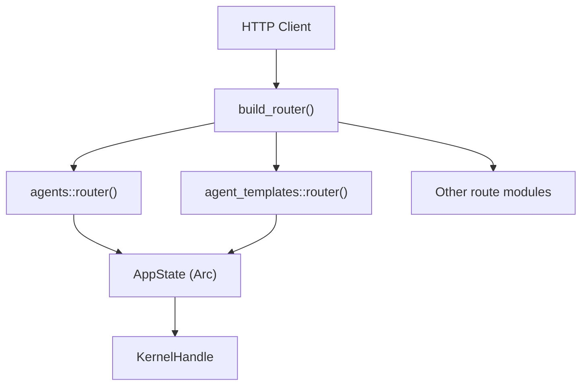

# API Routes

# API Routes

The `routes` module implements the HTTP/REST layer of LibreFang. It defines all Axum route handlers, wires them into the application router, and translates kernel operations into JSON responses. The two largest submodules are `agents.rs` (agent lifecycle, messaging, sessions, and files) and `agent_templates.rs` (tool profiles and agent template discovery).

## Architecture

Every route module exposes a single `router()` function returning `axum::Router<Arc<AppState>>`. The top-level `build_router()` in `server.rs` merges all sub-routers into one. Handlers receive `State(state)` to access the kernel, idempotency store, model catalog, and configuration.

## Agent Routes (`agents.rs`)

### Router Registration

`agents::router()` registers ~50 routes covering the full agent lifecycle. Routes are ordered so literal path segments (e.g., `/agents/identities`, `/agents/bulk`) are matched before the parameterized `/agents/{id}`.

### Agent Spawning

**`POST /api/agents`** — `spawn_agent`

Accepts a `SpawnRequest` body containing either inline `manifest_toml` or a `template` name referencing a file under `$LIBREFANG_HOME/workspaces/agents/<name>/agent.toml`. The shared `resolve_manifest()` function handles:

1. **Template lookup** — sanitizes the template name (alphanumeric + `-` + `_` only) and reads from disk using `tokio::fs` to avoid blocking the async runtime.
2. **Size guard** — rejects manifests exceeding `MAX_MANIFEST_SIZE` (1 MB).
3. **Signed manifest verification** — when `signed_manifest` is provided, verifies the Ed25519 signature against the manifest content via `kernel.verify_signed_manifest()`. Failures are audit-logged.
4. **TOML parsing** — deserializes into `AgentManifest`.
5. **Name override** — callers may set `req.name` to spawn multiple agents from the same template under distinct names.

The handler supports **idempotency** via the `Idempotency-Key` header (#3637). The key + request body are cached in `state.idempotency_store`. A replay with the same key and body returns the cached response; a different body under the same key returns 409 Conflict.

The inner handler (`spawn_agent_inner`) returns `(StatusCode, Vec<u8>)` so JSON is encoded exactly once, shared between the live path and cache replays.

### Bulk Operations

Four endpoints operate on arrays of agent IDs or spawn requests:

| Endpoint | Method | Purpose |
|---|---|---|
| `/api/agents/bulk` | POST | Create up to `BULK_LIMIT` (50) agents |
| `/api/agents/bulk` | DELETE | Delete up to 50 agents |
| `/api/agents/bulk/start` | POST | Set multiple agents to Full mode |
| `/api/agents/bulk/stop` | POST | Cancel active runs on multiple agents |

All bulk handlers call `validate_bulk_size()` (defined in `routes/mod.rs`) before allocating, preventing `Vec::with_capacity` abuse. Results include per-item success/failure with aggregate counts.

Hand-spawned agents cannot be deleted via bulk delete — they must be removed by deactivating the owning hand.

### Agent Listing

**`GET /api/agents`** — `list_agents`

Returns a paginated, filterable, sortable list. Key behaviors:

- **Owner scoping**: Non-admin authenticated users only see agents where `manifest.author` matches their username. The filter is injected server-side when `?owner=` is absent.
- **Hand exclusion**: Hand-spawned agents are excluded by default; pass `?include_hands=true` to include.
- **Pagination**: `limit` defaults to `DEFAULT_AGENT_LIST_LIMIT` (500) and caps at `MAX_AGENT_LIST_LIMIT` (500). `offset` is 0-based.
- **Sorting**: Fields `name`, `created_at`, `last_active`, `state`. Order defaults to ascending; `?order=desc` reverses.
- **Performance**: Uses `list_arcs()` to share `Arc<AgentEntry>` pointers with the registry instead of deep-cloning manifests (#3569). Bulk 24h stats are fetched in one call via `memory_substrate().agents_stats_24h_bulk()`.

Each agent row is enriched by `enrich_agent_json()`, which resolves the effective model provider/name (falling back to `DefaultModelConfig`), looks up tier/auth-status/thinking-support from the model catalog, computes the `ready` flag, and embeds identity/session/scheduling metadata.

### Agent Detail and Lifecycle

**`GET /api/agents/{id}`** — `get_agent`  
Returns the enriched JSON for a single agent. 404 if not found.

**`DELETE /api/agents/{id}`** — `kill_agent`  
Requires `?confirm=true` (#4614). Without confirmation, returns 409 with a data-loss warning. With confirmation, kills the agent **and** purges its canonical UUID binding from `agent_identities.toml`. Idempotent: deleting an already-absent agent returns `{"status": "already-deleted"}` per RFC 9110 §9.2.2. Hand-owned agents cannot be deleted directly.

**`PUT /api/agents/{id}/suspend`** / **`PUT /api/agents/{id}/resume`**  
Suspends (stops cron, keeps in registry) or resumes an agent.

**`PUT /api/agents/{id}/mode`** — `set_agent_mode`  
Changes the agent's operational mode via `AgentRegistry::set_mode()`.

**`POST /api/agents/{id}/stop`** — `stop_agent`  
Cancels the agent's current run.

**`PATCH /api/agents/{id}`** — `patch_agent`  
Partial update of agent manifest fields.

**`POST /api/agents/{id}/clone`** — `clone_agent`  
Creates a new agent from an existing one's manifest.

### Messaging

**`POST /api/agents/{id}/message`** — `send_message`

The primary conversational endpoint. Flow:

1. Validates agent ID and checks existence.
2. Enforces message size limits via `validation::check_message_size()` (byte + char caps).
3. Checks the provider's auth status; rejects with 412 if the API key is missing.
4. Resolves file attachments (see [Attachment Resolution](#attachment-resolution)).
5. Detects ephemeral mode (`req.ephemeral` or `/btw ` prefix).
6. Parses optional `session_id` override.
7. Calls the kernel inside `run_cancel_on_disconnect()`, which spawns the kernel call on a tokio task and aborts it if the client disconnects (#3464).

**Response shape** includes `response` text, token usage, iteration count, cost, optional `thinking` trace, `decision_traces`, memory stats, and an optional `session_id` (auto-resolved when the caller didn't pin one).

The `AbortOnDrop` RAII guard holds the task's `AbortHandle`. Calling `disarm()` releases the guard without aborting — used by the streaming path once content has reached the client.

**`POST /api/agents/{id}/message/stream`** — `send_message_stream`  
SSE streaming variant. Produces the same kernel call but streams partial tokens and tool events.

**`POST /api/agents/{id}/inject`** — `inject_message`  
Injects a message without triggering a response turn.

**`POST /api/agents/{id}/push`** — `push_message`  
Pushes a message through the channel subsystem.

### Session Management

| Endpoint | Method | Handler | Description |
|---|---|---|---|
| `/api/agents/{id}/session` | GET | `get_agent_session` | Active session history (with optional `?session_id=` override) |
| `/api/agents/{id}/sessions` | GET | `list_agent_sessions` | List all sessions for an agent |
| `/api/agents/{id}/sessions` | POST | `create_agent_session` | Create a new session |
| `/api/agents/{id}/sessions/{session_id}/switch` | POST | `switch_agent_session` | Switch active session |
| `/api/agents/{id}/sessions/{session_id}/export` | GET | `export_session` | Export session data |
| `/api/agents/{id}/sessions/{session_id}/trajectory` | GET | `export_session_trajectory` | Export session trajectory |
| `/api/agents/{id}/sessions/import` | POST | `import_session` | Import a session |
| `/api/agents/{id}/session/reset` | POST | `reset_session` | Reset session state |
| `/api/agents/{id}/session/reboot` | POST | `reboot_session` | Reboot session |
| `/api/agents/{id}/session/compact` | POST | `compact_session` | Trigger LLM compaction |
| `/api/agents/{id}/sessions/{session_id}/stream` | GET | `attach_session_stream` | SSE stream for session events |
| `/api/agents/{id}/sessions/{session_id}/stop` | POST | `stop_session` | Stop a specific session |

`get_agent_session` performs a two-pass approach to reconstruct tool use/result pairs: pass 1 collects tool invocations; pass 2 attaches tool results to their matching invocations. Images are persisted to the upload directory and registered in `UPLOAD_REGISTRY`. Thinking blocks from extended thinking are joined and surfaced under a `thinking` key.

Cross-agent session access is rejected with a `session_agent_mismatch` error.

### Attachment Resolution

`resolve_attachments()` processes `AttachmentRef` entries into `ContentBlock` values the agent loop can consume:

- **Images** (`image/*`) → `ContentBlock::Image` (base64 inline)
- **PDFs** (`application/pdf`) → `ContentBlock::Text` with extracted text, truncated at 200K chars. Failed extractions surface as a note so the LLM knows the file exists.
- **Text-like files** → `ContentBlock::Text` with a header. Detection uses `is_text_like_attachment()`, which checks MIME type and file extension against a comprehensive set covering code, config, markup, and data formats.
- **Others** → skipped with a warning log.

File IDs are validated as UUIDs to prevent path traversal. All file reads are synchronous (the upload directory is local disk).

**URL attachments** (`resolve_url_attachments()`) download remote images with SSRF protection: URLs are validated against loopback, RFC 1918, link-local, IPv6 ULA, and cloud-metadata addresses via `validate_webhook_url_resolved()`. DNS results are pinned to the validated IP using reqwest's `.resolve()` to prevent DNS rebind attacks (#3701). Downloads are capped at 20 MB.

### Monitoring Endpoints

**`GET /api/agents/{id}/stats`** — `get_agent_stats`  
Returns an `AgentStats24hView` with sessions, cost, P95 latency, active-now count, and a previous-period window for trend deltas. Owner-scoped.

**`GET /api/agents/{id}/events`** — `list_agent_events`  
Recent turn-level events from `usage_events` (model, tokens, cost, latency, tool calls). Capped at 200 rows. Owner-scoped.

**`GET /api/agents/{id}/metrics`** — `agent_metrics`  
Aggregate metrics for the agent.

**`GET /api/agents/{id}/logs`** — `agent_logs`  
Agent log entries with optional level filtering.

**`GET /api/agents/{id}/traces`** — `get_agent_traces`  
OpenTelemetry-style traces.

### Configuration Endpoints

| Endpoint | Method | Description |
|---|---|---|
| `/api/agents/{id}/model` | PUT | Change model provider/model |
| `/api/agents/{id}/tools` | GET/PUT | Get or set tool list |
| `/api/agents/{id}/skills` | GET/PUT | Get or set skills |
| `/api/agents/{id}/mcp_servers` | GET/PUT | Get or set MCP server bindings |
| `/api/agents/{id}/identity` | PATCH | Update emoji/avatar/color |
| `/api/agents/{id}/config` | PATCH | Partial config update |
| `/api/agents/{id}/hand-runtime-config` | PATCH/DELETE | Hand-specific runtime config |
| `/api/agents/{id}/reload` | POST | Reload manifest from disk |

### File and Upload Endpoints

**`GET /api/agents/{id}/files`** / **`GET /api/agents/{id}/files/{filename}`** / **`PUT ...`** / **`DELETE ...`**  
CRUD for per-agent workspace files.

**`GET /api/uploads/{file_id}`** — `serve_upload`  
Serves previously uploaded files from the upload directory.

### Identity Registry

**`GET /api/agents/identities`** — `list_agent_identities`  
Lists canonical name→UUID bindings.

**`POST /api/agents/identities/{name}/reset`** — `reset_agent_identity`  
Resets the canonical UUID for a name, allowing a fresh spawn.

### WebSocket

**`GET /api/agents/{id}/ws`** — `agent_ws`  
Upgraded to a WebSocket for real-time bidirectional communication (defined in `ws.rs`).

## Agent Template Routes (`agent_templates.rs`)

Mounted as a sibling under `routes::` via `.merge(crate::routes::agent_templates::router())` from `system::router()`.

### Template Name Validation

`validate_template_name()` is a security gate before any filesystem access. It permits only `[A-Za-z0-9_-]`, rejects empty names and anything over 64 chars. This prevents path traversal via `..`, `/`, `\`, or null bytes — all confirmed by the inline test suite covering traversal, separators, empty/oversized, and special characters.

### Tool Profiles

**`GET /api/profiles`** — `list_profiles`  
Returns all six predefined tool profiles (minimal, coding, research, messaging, automation, full) with their tool lists.

**`GET /api/profiles/{name}`** — `get_profile`  
Returns a single profile by name. 404 with i18n message if not found.

### Agent Templates

**`GET /api/templates`** — `list_agent_templates`  
Scans `$LIBREFANG_HOME/workspaces/agents/` for directories containing `agent.toml`. Returns name and description for each.

**`GET /api/templates/{name}`** — `get_agent_template`  
Returns parsed manifest details (name, description, module, tags, model config, capabilities) plus the raw `manifest_toml` string. Validates the name, checks file existence, and returns i18n errors for not-found or invalid manifests.

**`GET /api/templates/{name}/toml`** — `get_agent_template_toml`  
Returns the raw TOML as `text/plain; charset=utf-8`. Useful for CLI tools or editors that need the unprocessed manifest.

## Shared Patterns

### Error Handling

Handlers use `ApiErrorResponse` for structured error JSON. Two helper patterns:

- **`ApiErrorResponse::internal_scrub(e)`** — used when the raw error (`rusqlite` messages, internal paths) must not leak to the client. The full error goes to `tracing::error!`; a generic message goes to the client.
- **`into_json_tuple()`** / **`into_response()`** — converts the error into the appropriate `(StatusCode, Json(...))` response.

### i18n

All user-facing errors use `ErrorTranslator` with the language resolved from the `RequestLanguage` middleware extension. `ErrorTranslator::new()` wraps a `FluentBundle` which is `!Send`, so translators must be constructed and consumed before any `.await` point.

### Structured Logging

The `extensions::with_agent_id()` and `with_session_id()` wrappers attach identifiers to the response extensions so the `request_logging` middleware can emit them as structured fields on access-log lines (#3511).

### Owner Scoping

Multi-tenant deployments scope agent data by the authenticated user. The pattern:

1. Extract `AuthenticatedApiUser` from middleware.
2. If `role < Admin`, inject the caller's username as the `owner` filter.
3. In detail endpoints (stats, events, sessions), reject if the agent's `manifest.author` doesn't match.

### Constants

| Constant | Value | Purpose |
|---|---|---|
| `MAX_MANIFEST_SIZE` | 1 MB | Prevent parser memory exhaustion |
| `BULK_LIMIT` | 50 | Max agents per bulk request |
| `DEFAULT_AGENT_LIST_LIMIT` | 500 | Default page size for agent listing |
| `MAX_AGENT_LIST_LIMIT` | 500 | Hard cap on agent listing page size |
| `MAX_TEXT_ATTACHMENT_CHARS` | 200,000 | Inline text truncation threshold |
| `DELETE_AGENT_WARNING` | static string | Warning when DELETE lacks confirmation |