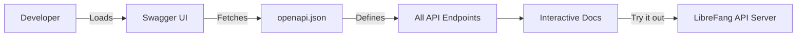

# API Server — api-docs

# LibreFang API Documentation (`api-docs`)

## Overview

The `api-docs` module serves as the interactive API documentation portal for LibreFang. It provides a self-contained documentation site powered by Swagger UI that loads the OpenAPI 3.1.0 specification and renders it as a browsable, interactive reference for all REST API endpoints.



## Purpose

This module solves two problems:

1. **Documentation as Code** — The `openapi.json` file is the single source of truth for the API surface. It documents every endpoint, parameter, request body, and response without duplicating information in external docs.

2. **Interactive Exploration** — Developers can open `index.html` in a browser, browse endpoints by tag, expand request/response schemas, and send live requests (when pointed at a running API server).

## Components

### `index.html` — Swagger UI Host

This file bootstraps the Swagger UI 5.x interface:

```html
SwaggerUIBundle({
    url: "openapi.json",
    dom_id: '#swagger-ui',
    deepLinking: true,
    presets: [
        SwaggerUIBundle.presets.apis,
        SwaggerUIBundle.SwaggerUIStandalonePreset
    ],
    layout: "BaseLayout"
})
```

Key configuration choices:

| Option | Value | Purpose |
|--------|-------|---------|
| `url` | `"openapi.json"` | Loads the local OpenAPI spec file |
| `deepLinking` | `true` | Enables URL-based navigation to specific endpoints |
| `presets.apis` | default | Core API documentation preset |
| `SwaggerUIStandalonePreset` | default | Full UI with sidebar, topbar, and operations pane |
| `layout` | `"BaseLayout"` | Standard three-panel layout |

The Swagger UI assets are loaded from the unpkg CDN (`unpkg.com/swagger-ui-dist@5`), making this module fully static — no build step or server-side rendering required.

### `openapi.json` — API Specification

The specification file defines the complete LibreFang REST API using OpenAPI 3.1.0. It is organized into the following tags, each grouping related endpoints:

| Tag | Description |
|-----|-------------|
| `a2a` | Agent-to-Agent (A2A) protocol — discovery, task submission, status |
| `agents` | Agent lifecycle — spawn, kill, message, clone, file management |
| `sessions` | Conversation session management |
| `memory` | Agent KV memory export/import |
| `approvals` | Approval workflow for restricted actions |
| `auth` | OAuth2/OIDC authentication endpoints |
| `budget` | Global and per-agent cost tracking |
| `models` | Model catalog synchronization |
| `channels` | Messaging channels (WhatsApp, Discord, Slack, Telegram, etc.) |
| `skills` | ClawHub marketplace and skill installation |
| `workflows` | Cron job scheduling and management |
| `extensions` | Extension lifecycle management |
| `hands` | Browser automation hands (playwright-based agents) |
| `webhooks` | External triggers for agent hooks and system events |
| `integrations` | Integration templates and MCP connections |
| `mcp` | MCP server configuration and tooling |
| `proactive-memory` | Shared proactive memory system |
| `network` | Inter-agent communication and topology |
| `system` | Health checks, audit logs, config management, backups |

#### Notable Endpoint Patterns

**Agent Management**
- `GET /api/agents` — List with filtering (`q`, `status`), pagination (`limit`, `offset`), and sorting (`sort`, `order`)
- `POST /api/agents` — Spawn new agent from manifest
- `PATCH /api/agents/{id}` — Partial update of name, description, system prompt
- `POST /api/agents/{id}/message` — Send message to agent
- `POST /api/agents/{id}/message/stream` — SSE streaming response

**File Workspace**
- `GET /api/agents/{id}/files/{filename}` — Read workspace identity file
- `PUT /api/agents/{id}/files/{filename}` — Write workspace identity file
- `POST /api/agents/{id}/upload` — Upload raw file attachments with `Content-Type` and `X-Filename` headers

**Session Management**
- `GET /api/agents/{id}/session` — Get current session (conversation history)
- `POST /api/agents/{id}/session/reset` — Reset session with summary
- `POST /api/agents/{id}/session/reboot` — Hard reset (no summary)
- `POST /api/agents/{id}/session/compact` — Trigger LLM-based compaction

**A2A Protocol**
- `GET /.well-known/agent.json` — Agent card for A2A discovery
- `POST /a2a/tasks/send` — Submit task to local A2A agent
- `POST /api/a2a/send` — Send task to external remote A2A agent

**Budget Tracking**
- `GET /api/budget` — Global budget status with spend percentage
- `GET /api/budget/agents/{id}` — Per-agent quota status
- `PUT /api/budget/agents/{id}` — Runtime budget limit updates

**System Operations**
- `GET /api/health` — Public liveness probe (no auth, minimal info)
- `GET /api/health/detail` — Full diagnostics (requires auth)
- `POST /api/backup` — Create timestamped backup archive
- `GET /api/logs/stream` — SSE log stream with filtering

## How It Works

The module is entirely static and requires no runtime dependencies:

1. **Load `index.html`** — Browser fetches Swagger UI bundle from unpkg CDN
2. **Swagger UI initializes** — Reads `openapi.json` from the same directory
3. **Spec is parsed** — Swagger UI extracts tags, paths, schemas, and parameters
4. **UI renders** — Endpoints appear grouped by tag in the sidebar; each endpoint can be expanded to show documentation
5. **Try it out** — If the API server is running (CORS permitting), developers can send live requests directly from the browser

## Relationship to the API Server

The `openapi.json` specification is consumed by:

- **This module (Swagger UI)** — Renders interactive documentation
- **OpenAPI client generators** — Tools like `openapi-generator` can produce typed client libraries from the spec
- **API validation tooling** — Servers can validate incoming requests against the spec

The API server itself implements all endpoints defined in `openapi.json`. When the server starts, it should serve this `api-docs/` directory as static files, typically at a path like `/docs` or `/api-docs`, so the interactive docs are available alongside the API.

## Usage

To view the documentation:

```bash
# Serve the api-docs directory statically
# (or open index.html directly in a browser)

# Example with Python's built-in server
cd api-docs
python -m http.server 8080

# Then open http://localhost:8080
```

To update the API documentation when endpoints change, edit `openapi.json` directly — Swagger UI will pick up the changes on the next page load.