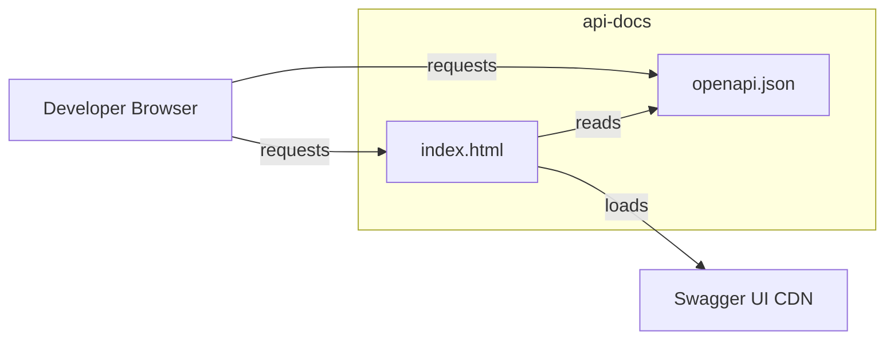

# API Server — api-docs

# API Server — `api-docs` Module

## Overview

The `api-docs` module provides interactive API documentation for the service. It is a **static, standalone module** consisting of two files that together deliver a Swagger UI interface driven by an OpenAPI specification.

| File | Purpose |
|---|---|
| `index.html` | Host page that loads and renders the Swagger UI widget |
| `openapi.json` | Machine-readable OpenAPI specification describing all API endpoints, request/response schemas, and authentication requirements |

This module has **no runtime dependencies** on other modules in the codebase and exposes no callable functions or classes. It is a documentation artifact consumed directly by browsers.

## Architecture

## How It Works

1. **`index.html`** is served as a static page (typically at a path like `/docs` or `/api-docs`). It embeds or loads Swagger UI from a CDN or bundled asset and configures it to fetch `openapi.json` from the same directory.

2. **`openapi.json`** conforms to the [OpenAPI Specification](https://swagger.io/specification/). It defines:
   - All available API paths and HTTP methods
   - Request parameters, request body schemas, and response schemas
   - Authentication/authorization requirements
   - Data models referenced across endpoints

3. Swagger UI renders the spec as an interactive page where developers can explore endpoints, review expected payloads, and in some configurations, send test requests directly from the browser.

## Integration with the Codebase

- **No code coupling.** This module does not import or export anything. No other module calls into it at runtime.
- **Served as static assets.** The API server's static-file middleware or reverse proxy configuration is responsible for mounting this directory at the desired URL path.
- **`openapi.json` is the single source of truth** for the API contract. It should be updated whenever endpoints are added, removed, or their schemas change. Keeping it in sync with the actual route handlers is a manual (or tool-assisted) responsibility.

## Maintenance Guidelines

- **When adding or modifying API endpoints**, update `openapi.json` to reflect the new paths, parameters, request bodies, and response schemas.
- **Schema consistency** — ensure model definitions in `openapi.json` match the validation schemas and response shapes used by the route handlers in the main API module.
- **Versioning** — if the API is versioned, update the `info.version` field in `openapi.json` accordingly.
- **Serving** — confirm the server or proxy is configured to serve this directory with the correct `Content-Type` (`application/json` for the spec, `text/html` for the page).
- **Security** — in production, consider whether the docs endpoint should be publicly accessible or restricted to authenticated/internal users.