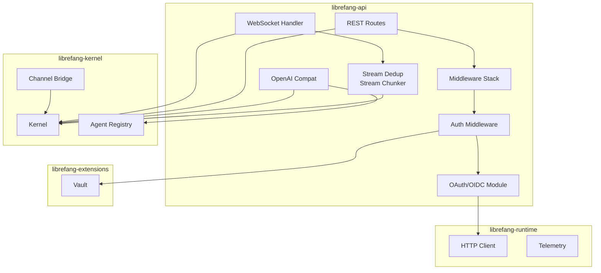

# API Server — librefang-api

# librefang-api — HTTP/WebSocket API Server

The `librefang-api` crate provides the HTTP and WebSocket API layer for the LibreFang Agent OS daemon. It exposes agent management, status queries, chat interaction, OAuth authentication, and OpenAI-compatible endpoints as JSON REST APIs.

## Overview

LibreFang runs as a long-lived daemon with an in-process kernel. The API server provides the primary interface for all clients:

- **CLI clients** — authenticate via bearer token or API key
- **Dashboard SPA** — browser-based UI served by the same process
- **External integrations** — OpenAI-compatible clients, webhook consumers
- **Terminal sessions** — WebSocket-based interactive sessions

The server is built on [Axum](https://github.com/tokio-rs/axum), Tokio's most mature web framework, and integrates with the kernel's actor model for agent messaging.

## Architecture



## Middleware Stack

The middleware module (`middleware.rs`) handles cross-cutting concerns applied to every request.

### Authentication (`auth`)

The `auth` middleware validates requests against multiple credential sources:

```rust
pub struct AuthState {
    pub api_key_lock: Arc<tokio::sync::RwLock<String>>,
    pub active_sessions: Arc<tokio::sync::RwLock<HashMap<String, SessionToken>>>,
    pub dashboard_auth_enabled: bool,
    pub user_api_keys: Arc<Vec<ApiUserAuth>>,
}
```

**Credential sources** (checked in order):
1. **Static API key** — configured in `config.toml`, supports multiple keys separated by newlines
2. **Bearer token** — `Authorization: Bearer <token>` header
3. **Query parameter** — `?token=` for SSE clients that cannot set custom headers
4. **Active sessions** — randomly generated tokens from dashboard login
5. **Per-user API keys** — hashed credentials with role-based access

**Public endpoints** bypass authentication entirely. These include dashboard assets, health checks, model/provider listings, and OAuth entry points (login, callback):

```rust
let is_public = path == "/"
    || path == "/api/health"
    || (path.starts_with("/dashboard/") && is_get)
    || (path == "/api/agents" && is_get)  // GET only
    || path == "/api/auth/callback"       // OAuth entry point
    // ... more paths
```

### Role-Based Access Control

Per-user API keys support three roles defined in `librefang_kernel::auth::UserRole`:

| Role | Access |
|------|--------|
| `Viewer` | GET requests only |
| `User` | GET + limited POST (agent messages, clone, approvals) |
| `Admin` | Full access |

```rust
fn user_role_allows_request(role: UserRole, method: &Method, path: &str) -> bool {
    if role >= UserRole::Admin || *method == Method::GET {
        return true;
    }
    if role < UserRole::User {
        return false;
    }
    // User role: only specific POST endpoints
    if *method == Method::POST {
        return path.starts_with("/api/agents/")
            && (path.ends_with("/message") || path.ends_with("/message/stream"))
            || /* clone, approvals */;
    }
    false
}
```

### Security Headers

Applied to all responses:

```http
X-Content-Type-Options: nosniff
X-Frame-Options: DENY
Content-Security-Policy: default-src 'self'; script-src 'self' 'unsafe-inline'; ...
Strict-Transport-Security: max-age=63072000; includeSubDomains
Referrer-Policy: strict-origin-when-cross-origin
Cache-Control: no-store, no-cache, must-revalidate
```

### Request Logging

Routine `GET 2xx` requests log at `DEBUG` level to reduce noise. All other requests log at `INFO` with request ID, method, path, status, and latency in milliseconds.

### API Versioning

Responses include `X-API-Version` headers. The server supports both versioned paths (`/api/v1/agents`) and an unversioned alias (`/api/agents`) that routes to the latest version. Content-type negotiation via `Accept: application/vnd.librefang.v1+json` is also supported.

## OAuth2/OIDC Authentication

The `oauth.rs` module enables external identity provider integration for single sign-on.

### Provider Resolution

Providers are resolved either from explicit configuration or via OIDC discovery:

```rust
pub(crate) async fn resolve_providers(
    config: &ExternalAuthConfig,
) -> Vec<ResolvedProvider> {
    // 1. Multi-provider mode: each provider in config.providers
    for provider in &config.providers {
        if !provider.auth_url.is_empty() {
            // Use explicit URLs (e.g., GitHub OAuth2)
        } else {
            // OIDC discovery via issuer_url
        }
    }
    // 2. Legacy fallback for single-provider config
}
```

### Supported Providers

| Provider | Discovery | Auth Method |
|----------|-----------|-------------|
| Generic OIDC | `.well-known/openid-configuration` | Authorization Code + PKCE |
| Google Workspace | OIDC | Authorization Code |
| GitHub | Explicit URLs | OAuth2 |
| Azure AD | OIDC | Authorization Code |
| Keycloak | OIDC | Authorization Code |

### OAuth Flow

```
┌─────────┐                    ┌──────────────┐                    ┌─────────────┐
│  User   │──GET /auth/login──▶│   LibreFang  │──302 Redirect─────▶│  IdP        │
│ Browser │                    │   API Server │                    │             │
└─────────┘                    └──────────────┘                    └─────────────┘
     │                               ▲                                   │
     │                               │                                   │
     │◀───302 /auth/callback─────────┼───────────────────────────────────┘
     │     ?code=xxx&state=yyy       │     code + state (GET) or POST body
     │                               │
     │                               ▼
     │                    ┌──────────────────┐
     │                    │ Validate state   │
     │                    │ Exchange code    │
     │                    │ Store tokens     │
     │                    │ Return JWT      │
     │                    └──────────────────┘
```

### State Token (CSRF Protection)

State tokens are HMAC-signed to prevent CSRF:

```rust
struct OAuthStatePayload {
    provider: String,
    nonce: String,
    ts: u64,  // Timestamp for expiry
}

fn build_state_token(provider_id: &str) -> String {
    // payload = base64url(JSON) . base64url(HMAC-SHA256)
}

fn verify_state_token(state: &str) -> Result<OAuthStatePayload, String> {
    // 1. Split on "."
    // 2. Verify HMAC signature
    // 3. Decode and parse JSON
    // 4. Check expiry (10 minute TTL)
}
```

### JWKS Caching

JWT validation uses cached JWKS keysets:

```rust
static JWKS_CACHE: LazyLock<JwksCache> = LazyLock::new(JwksCache::default);
const JWKS_CACHE_TTL: Duration = Duration::from_secs(3600);
```

Keys are cached per JWKS URI for one hour, then refreshed on the next validation attempt.

### Token Refresh

When access tokens expire, clients exchange refresh tokens for new credentials:

```
POST /api/auth/refresh
{
    "refresh_token": "...",
    "provider": "google"  // optional if single provider
}
```

The server maintains an in-memory token store (`TokenStore`) keyed by user subject (`sub`) for automatic refresh without requiring the client to store the refresh token.

## OpenAI-Compatible API

The `openai_compat.rs` module provides a `/v1/chat/completions` endpoint compatible with OpenAI client libraries.

### Model Resolution

The `model` field in requests resolves to an agent:

```rust
fn resolve_agent(state: &AppState, model: &str) -> Option<(AgentId, String)> {
    // 1. "librefang:<name>" → find by name
    if let Some(name) = model.strip_prefix("librefang:") {
        return state.kernel.agent_registry().find_by_name(name);
    }
    // 2. Valid UUID → find by ID
    if let Ok(id) = model.parse::<AgentId>() {
        return state.kernel.agent_registry().get(id);
    }
    // 3. Plain string → try as agent name
    state.kernel.agent_registry().find_by_name(model)
}
```

### Message Conversion

OpenAI message format converts to internal `Message` format:

```rust
fn convert_messages(oai_messages: &[OaiMessage]) -> Vec<Message> {
    // role: "user" → User, "assistant" → Assistant, "system" → System
    // content: text → MessageContent::Text
    //          parts → MessageContent::Blocks (with ContentBlock::Text/Image)
}
```

### Streaming Response

Streaming responses use Server-Sent Events:

```rust
async fn stream_response(...) -> Result<Sse<...>, String> {
    let (mut rx, _handle) = kernel.send_message_streaming_with_routing(...).await?;
    
    // Stream events:
    // - role delta (initial)
    // - text delta
    // - tool_use_start → tool_call chunk
    // - tool_input_delta → arguments chunk
    // - content_complete → finish_reason="stop"
}
```

Each chunk follows the OpenAI SSE format:

```json
{"id":"chatcmpl-xxx","object":"chat.completion.chunk","created":123,"model":"agent","choices":[{"index":0,"delta":{"content":"Hello"},"finish_reason":null}]}
```

## WebSocket Sessions

WebSocket connections enable real-time interactive sessions. The `ws.rs` module handles:

- **Agent messaging** — streaming message exchange
- **Terminal sessions** — PTY-based shell access
- **Event streaming** — SSE logs and status updates

### Authentication

WebSocket connections authenticate via query parameter (headers unavailable in native WS):

```
ws://localhost:18789/ws?token=<api_key>
```

### Stream Deduplication

In multi-replica scenarios, the `stream_dedup.rs` module prevents duplicate events from reaching clients using a sliding window approach:

```rust
pub struct StreamDedup {
    window: VecDeque<SentEvent>,
    seen: HashSet<String>,
}

impl StreamDedup {
    pub fn record_sent(&mut self, event_id: &str);
    pub fn is_duplicate(&mut self, event_id: &str) -> bool;
}
```

## Rate Limiting

The `rate_limiter.rs` module implements rate limiting using the Generalized Cell Rate Algorithm (GCRA):

```rust
pub fn gcra_rate_limit(
    event_name: &str,
    calls_per_window: u32,
    window_secs: u32,
) -> Result<(), RateLimitError>
```

## Integration Points

### With Kernel

The API server holds a reference to the kernel and routes requests:

```
┌────────────────┐    ┌─────────────────────────────────────┐
│ API Routes     │───▶│ librefang_kernel::Kernel            │
│                │    │                                     │
│ GET /api/agents│───▶│ agent_registry().list()            │
│ POST /message  │───▶│ send_message_with_handle()          │
│ /ws            │───▶│ send_message_streaming_with_routing│
└────────────────┘    └─────────────────────────────────────┘
```

### With Vault

Dashboard credentials and machine fingerprints are stored in the vault:

```rust
// Authentication flow
resolve_dashboard_credential() 
    → vault.unlock() 
    → vault.load() 
    → vault.resolve_master_key()
```

### With Webhook Store

Webhooks are stored encrypted and decoded on demand:

```rust
// Tool execution
tool_image_analyze()
    → webhook_store.encode()
    → send webhook
```

## Configuration

API server behavior is controlled via `config.toml`:

```toml
[api]
host = "127.0.0.1"      # Bind address
port = 18789            # Default port
api_key = ""            # Static API key (empty = auth disabled)
max_request_size = 10485760  # 10MB

[api.external_auth]
enabled = false
issuer_url = "https://accounts.google.com"
client_id = "..."
client_secret_env = "LIBREFANG_OAUTH_CLIENT_SECRET"

[api.external_auth.providers]
# Multiple providers supported
[[api.external_auth.providers]]
id = "github"
display_name = "GitHub"
auth_url = "https://github.com/login/oauth/authorize"
token_url = "https://github.com/login/oauth/access_token"
client_id = "..."
client_secret_env = "GH_SECRET"
scopes = ["read:user"]
```

## Testing

The middleware includes comprehensive integration tests:

```bash
# Run middleware tests
cargo test -p librefang-api middleware::tests

# Run OAuth tests
cargo test -p librefang-api oauth::tests

# Run OpenAI compat tests
cargo test -p librefang-api openai_compat::tests
```

Key test scenarios covered:
- Role-based access control enforcement
- Path normalization preventing ACL bypass via trailing slashes
- CSRF protection via state token validation
- JWKS caching behavior
- OIDC discovery with fallback