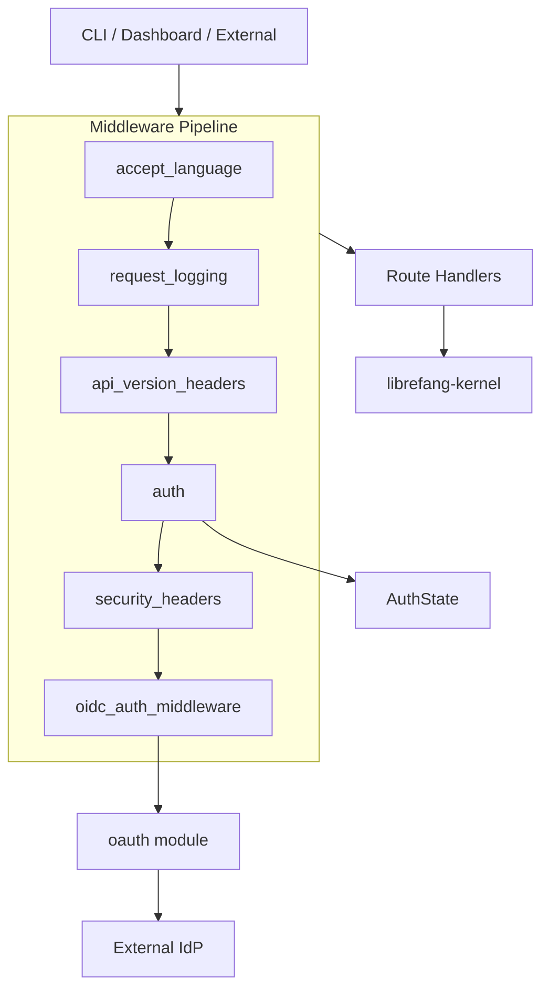

# API Server — librefang-api

# LibreFang API Server (`librefang-api`)

## Overview

The `librefang-api` crate is the HTTP/WebSocket API server for the LibreFang Agent OS daemon. It runs the kernel in-process and exposes agent management, status monitoring, chat, and configuration through JSON REST endpoints and WebSocket connections. The CLI, dashboard SPA, and external integrations all communicate through this layer.

The crate is built on [Axum](https://github.com/tokio-rs/axum) and provides production-grade middleware for authentication, rate limiting, structured logging, internationalized error messages, and security headers.

## Architecture



## Module Organization

| Module | Purpose |
|---|---|
| `server` | Server bootstrap, router construction, graceful shutdown |
| `routes` | HTTP route handlers (agents, config, budget, sessions, etc.) |
| `middleware` | Auth, logging, version headers, security headers, i18n |
| `oauth` | OAuth2/OIDC login, callback, token refresh, introspection |
| `ws` | WebSocket handler for real-time agent chat |
| `openai_compat` | OpenAI-compatible chat completion endpoint |
| `webchat` | Embedded chat UI page rendering |
| `webhook_store` | Webhook subscription CRUD and persistence |
| `channel_bridge` | External channel (WeChat, WhatsApp, etc.) message bridging |
| `stream_chunker` | Splits streaming LLM output into SSE-compatible chunks |
| `stream_dedup` | Deduplication for concurrent stream consumers |
| `terminal` | PTY/process management for terminal features |
| `rate_limiter` | In-memory per-IP rate limiting |
| `password_hash` | Argon2 password hashing and session token management |
| `validation` | Request body validation helpers |
| `versioning` | API version negotiation from path and `Accept` headers |
| `openapi` | OpenAPI 3.0 spec generation (via `utoipa`) |
| `types` | Shared API types (request/response structs) |
| `telemetry` | Optional (`telemetry` feature) Prometheus metrics and tracing export |

## Authentication & Authorization

The API supports four authentication mechanisms that are evaluated in a single pass by the `auth` middleware:

### 1. Static API Keys

Configured via `api_key` in `config.toml`. Multiple keys are supported by separating them with `\n`. Accepted as either `Authorization: Bearer <key>` or `X-API-Key: <key>` header, or as a `?token=<key>` query parameter (for SSE/WebSocket clients that cannot set headers).

When the key is empty or whitespace-only, authentication is disabled entirely (local development mode).

### 2. Per-User API Keys

Role-based API access via `user_api_keys` configuration. Each key is an Argon2 hash that maps to a named user with a specific `UserRole`:

| Role | GET | POST (limited) | POST (all) | Owner-only writes |
|---|---|---|---|---|
| `Viewer` | ✅ | ❌ | ❌ | ❌ |
| `User` | ✅ | ✅ (message, clone, approvals) | ❌ | ❌ |
| `Admin` | ✅ | ✅ | ✅ | ❌ |
| `Owner` | ✅ | ✅ | ✅ | ✅ |

**Owner-only write endpoints** (`/api/config`, `/api/config/set`, `/api/config/reload`, `/api/auth/change-password`, `/api/shutdown`) are locked to `Owner` role regardless of method. This list is exact-match only — new endpoints are not silently locked down.

The `AuthenticatedApiUser` struct is inserted into request extensions when a per-user key matches, so downstream handlers can inspect `name` and `role`.

### 3. Dashboard Session Tokens

The dashboard login flow generates random session tokens stored in `AuthState::active_sessions`. These tokens are checked after static keys, with expired sessions pruned on each validation.

### 4. OAuth2/OIDC Tokens

When external auth is enabled, Bearer tokens are validated against configured provider JWKS endpoints. See [OAuth2/OIDC Integration](#oauth2oidc-integration) below.

### Path Normalization

Before any ACL check, paths are normalized:
- Version prefix stripped: `/api/v1/agents` → `/api/agents`
- Trailing slashes removed: `/api/agents/` → `/api/agents`
- Root path preserved: `/` stays `/` (not empty string)

### Public Endpoints

**Always public** (regardless of configuration):
- `/`, `/logo.png`, `/favicon.ico`
- `/api/health`, `/api/version`, `/api/versions`
- `/api/auth/callback`, `/api/auth/dashboard-login`, `/api/auth/dashboard-check`
- `/api/providers/github-copilot/oauth/*`
- `/api/mcp/servers/{name}/auth/callback` (GET only)
- Static assets under `/dashboard/`, `/a2a/`, `/api/uploads/`
- `/api/auth/login`, `/api/auth/providers`, `/.well-known/agent.json`, `/api/config/schema`

**Dashboard reads** (public unless `require_auth_for_reads` is set):
- `/api/agents`, `/api/profiles`, `/api/config`, `/api/status`, `/api/models`, `/api/budget`, `/api/approvals`, `/api/skills`, `/api/sessions`, `/api/workflows`, `/api/hands`, etc.
- `/api/logs/stream` (SSE, read-only)

**Always requires auth**:
- `/api/health/detail` — returns operational data (panic counts, model IDs, config warnings)
- All POST/PUT/DELETE/PATCH to non-public endpoints

### `require_auth_for_reads`

When enabled in configuration and any authentication method is configured, the dashboard read endpoints require a valid token. This prevents remote enumeration of agents, config, and budget on publicly reachable deployments. `/api/health` remains public for load balancer probes.

The flag only engages when authentication is actually configured (API key, user API keys, or dashboard username/password). Setting the flag without configuring any auth is a no-op.

## Middleware Pipeline

Requests pass through the middleware stack in order:

```
accept_language → request_logging → api_version_headers → auth → security_headers → oidc_auth_middleware → handler
```

### `accept_language`

Parses the `Accept-Language` header via `librefang_types::i18n::parse_accept_language` and stores the resolved language code in `RequestLanguage` request extension. Sets `Content-Language` on the response.

### `request_logging`

Generates a UUID request ID, logs method/path/status/latency, records HTTP metrics via `librefang_telemetry::metrics::record_http_request`, and injects `x-request-id` into the response.

Successful GET requests log at `DEBUG` level to reduce noise; all other requests log at `INFO`.

### `api_version_headers`

Adds `X-API-Version` to every response. Version is resolved from:
1. Explicit path prefix (`/api/v1/...`)
2. `Accept: application/vnd.librefang.<version>+json` header
3. Default (latest version)

Unknown vendor versions on unversioned paths return `406 Not Acceptable`.

### `auth`

Full authentication and authorization middleware. See [Authentication & Authorization](#authentication--authorization) above.

Security properties:
- **Constant-time comparison** for all token checks (via `subtle::ConstantTimeEq`) to prevent timing attacks
- **Loopback-only enforcement** for `/api/shutdown` — checks `ConnectInfo<SocketAddr>` and requires `ip().is_loopback()`
- **Expired session cleanup** — prunes expired sessions from `active_sessions` on each token check

### `security_headers`

Applied to **all** responses unconditionally:

| Header | Value |
|---|---|
| `X-Content-Type-Options` | `nosniff` |
| `X-Frame-Options` | `DENY` |
| `X-XSS-Protection` | `1; mode=block` |
| `Content-Security-Policy` | Restrictive CSP (self + inline for bundled JS/CSS, Google Fonts) |
| `Referrer-Policy` | `strict-origin-when-cross-origin` |
| `Cache-Control` | `no-store, no-cache, must-revalidate` |
| `Strict-Transport-Security` | `max-age=63072000; includeSubDomains` |

### `oidc_auth_middleware`

Extracts Bearer JWT tokens and validates them against configured provider JWKS endpoints. When validation succeeds, `IdTokenClaims` is injected into request extensions. This middleware does **not** block requests — access control is handled by `auth`.

## OAuth2/OIDC Integration

The `oauth` module provides full OAuth2/OIDC login flows supporting multiple providers (Google, GitHub, Azure AD, Keycloak, or any OIDC-compliant provider).

### Provider Resolution

Providers are resolved from `ExternalAuthConfig`:

1. **Multi-provider mode**: Iterate `config.providers`, resolving each via OIDC discovery or explicit URLs.
2. **Legacy fallback**: If no providers are defined but `issuer_url` + `client_id` are set, use those.

Resolution results are `ResolvedProvider` structs containing all endpoints, client ID, scopes, and domain restrictions.

### Caching

| Cache | TTL | Scope |
|---|---|---|
| OIDC discovery | 1 hour | Per issuer URL |
| JWKS keys | 1 hour | Per JWKS URI |
| Token store | 24 hours | Per user `sub` |

All caches use `tokio::sync::RwLock<HashMap<...>>` with lazy static initialization.

### CSRF Protection

State tokens are HMAC-SHA256-signed payloads containing provider ID, nonce, and timestamp:

```
base64url(json_payload).base64url(hmac_signature)
```

- Signing key: `LIBREFANG_STATE_SECRET` env var, or a random per-process key
- TTL: 10 minutes
- Verified on callback before code exchange

### Login Flow

```
GET /api/auth/login/{provider}
  → build_state_token(provider_id)
  → 302 redirect to provider authorization URL

GET/POST /api/auth/callback?code=...&state=...
  → verify_state_token(state)
  → exchange_code(token_endpoint, code, ...)
  → validate_jwt_cached(id_token, jwks_uri, audience)
  → verify nonce matches state token
  → check allowed_domains
  → store tokens in TokenStore
  → return {token, refresh_token, user}
```

### Token Refresh

`POST /api/auth/refresh` accepts a refresh token (from request body or token store lookup) and exchanges it for new access/refresh tokens. When multiple providers are configured, the `provider` field must be specified.

### Token Introspection

`POST /api/auth/introspect` follows RFC 7662 conventions, returning `{"active": true/false, ...}` with full claims for valid tokens.

### JWT Validation

Tokens are validated using `jsonwebtoken` with:
- RSA keys (RS256/RS384/RS512) from JWKS `n`/`e` components
- EC keys (ES256/ES384) from JWKS `x`/`y` components
- Audience validation against configured `audience` (or `client_id` as fallback)
- Expiration enforcement

### Key Types

- **`IdTokenClaims`**: Standard OIDC claims (`sub`, `email`, `name`, `picture`, `roles`, `iss`, `aud`, `nonce`, `exp`, `iat`)
- **`OidcAudience`**: Supports both single-string and array `aud` values with `contains()` helper
- **`ResolvedProvider`**: Fully resolved provider with endpoints, client config, and domain restrictions
- **`TokenStore`**: In-memory store keyed by user `sub`, holding access/refresh tokens with 24h TTL eviction

### Domain Restriction

When `allowed_domains` is configured on a provider:
- Users without an `email` claim are **rejected** (both in callback and middleware)
- Email domain must match an entry in the allowlist
- Applied during both login callback and OIDC middleware validation

## Connecting to the Kernel

The API server runs the kernel in the same process. Route handlers receive an `Arc<AppState>` via Axum's `State` extractor, which provides access to `state.kernel` — the kernel instance. From there, handlers call kernel methods like:

- `agent_registry()` — agent CRUD and messaging
- `config_ref()` / `config_snapshot()` — configuration reads
- `model_catalog_ref()` — model resolution
- `metering_ref()` — usage tracking
- `budget_config()` — budget queries
- `running_tasks_ref()` — task management

WebSocket handlers (`ws` module) maintain persistent connections for real-time agent chat, calling `inject_attachments_into_session`, `resolve_attachments`, and kernel messaging methods.

## Feature Flags

| Flag | Effect |
|---|---|
| `telemetry` | Enables the `telemetry` module (Prometheus metrics, tracing export, observability stack) |

## Error Responses

All error responses are JSON (`application/json`) with i18n-aware messages. The error structure is:

```json
{"error": "message"}
```

Error message language is determined by the `accept_language` middleware and resolved via `librefang_types::i18n::ErrorTranslator`. Two primary auth error keys:
- `api-error-auth-missing-header` — no credentials provided
- `api-error-auth-invalid-key` — credentials provided but incorrect

The `WWW-Authenticate: Bearer` header is set on 401 responses.