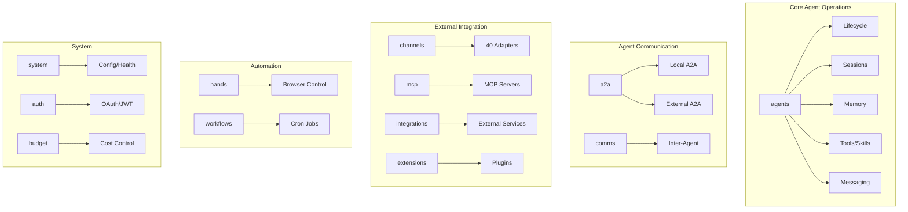

# API Server — openapi.json

# LibreFang API Specification

## Overview

The LibreFang API is a RESTful interface for the LibreFang Agent Operating System. It provides comprehensive endpoints for managing AI agents, their lifecycles, communication, memory, workflows, integrations, and system operations. The API follows the OpenAPI 3.1.0 specification.

**API Version**: 2026.4.10-beta17  
**Specification Version**: OpenAPI 3.1.0  
**License**: Apache-2.0

## API Organization

The API is organized into functional areas using tags. Understanding these groupings helps navigate the 130+ available endpoints.



## Authentication

### OAuth2 Login Flow

The API supports multi-provider OAuth2 authentication.

| Endpoint | Method | Purpose |
|----------|--------|---------|
| `/api/auth/login` | GET | Redirect to default OAuth provider |
| `/api/auth/login/{provider}` | GET | Redirect to specific OAuth provider |
| `/api/auth/callback` | GET/POST | Handle OAuth callback (browser or programmatic) |
| `/api/auth/providers` | GET | List configured OAuth/OIDC providers |

### Token Management

| Endpoint | Method | Purpose |
|----------|--------|---------|
| `/api/auth/introspect` | POST | Validate token, return claims (RFC 7662) |
| `/api/auth/userinfo` | GET | Get current user info from JWT or provider |

The `auth_introspect` endpoint follows RFC 7662 conventions, returning `{"active": true/false, ...}` with decoded claims.

### Health Endpoint

The `/api/health` endpoint is public and requires no authentication, returning only status and version to prevent information leakage. Use `/api/health/detail` for full diagnostics (requires auth).

## Agent Management

Agent management constitutes the largest portion of the API. Agents are the core abstraction in LibreFang.

### Agent Lifecycle

| Endpoint | Method | Operation |
|----------|--------|-----------|
| `/api/agents` | GET | List agents with filtering, pagination, sorting |
| `/api/agents` | POST | Spawn a new agent |
| `/api/agents/{id}` | GET | Get agent details |
| `/api/agents/{id}` | PATCH | Partially update agent fields |
| `/api/agents/{id}` | DELETE | Kill an agent |

**List Filtering Parameters:**
- `q` — Free-text search on name/description
- `status` — Filter by lifecycle state
- `limit`/`offset` — Pagination
- `sort` — Sort by: name, created_at, last_active, state
- `order` — asc (default) or desc

### Bulk Operations

For managing multiple agents simultaneously:

| Endpoint | Method | Purpose |
|----------|--------|---------|
| `/api/agents/bulk` | POST | Create multiple agents |
| `/api/agents/bulk` | DELETE | Delete multiple agents |
| `/api/agents/bulk/start` | POST | Set multiple agents to Full mode |
| `/api/agents/bulk/stop` | POST | Stop multiple agents' current runs |

### Agent Configuration

Hot-update agent configuration without restarting:

| Endpoint | Method | Purpose |
|----------|--------|---------|
| `/api/agents/{id}/config` | PATCH | Hot-update name, description, system prompt, identity, model |
| `/api/agents/{id}/identity` | PATCH | Update visual identity fields |
| `/api/agents/{id}/model` | PUT | Change the LLM model |

### Cloning and Duplication

```http
POST /api/agents/{id}/clone
```

Clones an agent including its workspace files. Requires a new name in the request body.

## Messaging

Send messages to agents and receive responses with optional streaming support.

### Single Message

```http
POST /api/agents/{id}/message
```

Accepts a `MessageRequest` body and returns a `MessageResponse`. Returns 404 if the agent doesn't exist.

### Streaming Response

```http
POST /api/agents/{id}/message/stream
```

Returns Server-Sent Events (SSE) for streaming responses, useful for long-running agent operations.

### File Uploads

```http
POST /api/agents/{id}/upload
```

Uploads raw file bytes with required headers:
- `Content-Type` — MIME type (e.g., `image/png`, `application/pdf`)
- `X-Filename` — Original filename

## Session Management

Agents maintain conversation history through sessions.

### Session Operations

| Endpoint | Method | Purpose |
|----------|--------|---------|
| `/api/agents/{id}/session` | GET | Get current session history |
| `/api/agents/{id}/sessions` | GET | List all sessions for an agent |
| `/api/agents/{id}/sessions` | POST | Create a new session |
| `/api/agents/{id}/sessions/{session_id}/switch` | POST | Switch to a different session |
| `/api/agents/{id}/sessions/by-label/{label}` | GET | Find session by label (scoped to agent) |

### Session Reset and Compaction

Three levels of session management:

| Endpoint | Method | Behavior |
|----------|--------|----------|
| `/api/agents/{id}/session/reset` | POST | Reset session with summary |
| `/api/agents/{id}/session/reboot` | POST | Hard-reboot (full clear, no summary) |
| `/api/agents/{id}/session/compact` | POST | Trigger LLM session compaction |

### Session Import/Export

For session migration and hibernation:

```http
GET  /api/agents/{id}/sessions/{session_id}/export
POST /api/agents/{id}/sessions/import
```

## Memory Management

### Agent KV Memory

Key-value memory operations for individual agents:

| Endpoint | Method | Purpose |
|----------|--------|---------|
| `/api/agents/{id}/memory/export` | GET | Export all KV memory as JSON |
| `/api/agents/{id}/memory/import` | POST | Import KV memory from JSON |

Import accepts `{"kv": {...}, "clear_existing": true}` to wipe existing memory first.

### Proactive Memory

A separate memory system for proactive agent behavior:

| Endpoint | Method | Purpose |
|----------|--------|---------|
| `/api/memory` | GET | List memories with category filter and pagination |
| `/api/memory` | POST | Add memories via extraction pipeline |
| `/api/memory/agents/{id}` | GET | List memories for specific agent |
| `/api/memory/agents/{id}` | DELETE | Reset all memories for an agent |
| `/api/memory/agents/{id}/consolidate` | POST | Merge duplicates, cleanup stale entries |

**Pagination parameters**: `offset` (default 0), `limit` (default 10, max 100).

## Agent Capabilities

### Tool Allowlists and Blocklists

```http
GET /api/agents/{id}/tools
PUT /api/agents/{id}/tools
```

Controls which tools an agent can access. Accepts `allowlist` and/or `blocklist` arrays.

### Skill Allowlists

```http
GET /api/agents/{id}/skills
PUT /api/agents/{id}/skills
```

Restricts which skills an agent may invoke.

### MCP Server Assignment

Model Context Protocol server access control:

```http
GET /api/agents/{id}/mcp_servers
PUT /api/agents/{id}/mcp_servers
```

Accepts an array of MCP server names.

### Workspace Files

Identity files stored in agent workspaces:

| Endpoint | Method | Purpose |
|----------|--------|---------|
| `/api/agents/{id}/files` | GET | List workspace identity files |
| `/api/agents/{id}/files/{filename}` | GET | Read a file |
| `/api/agents/{id}/files/{filename}` | PUT | Write a file |
| `/api/agents/{id}/files/{filename}` | DELETE | Delete a file |

### Agent Traces

```http
GET /api/agents/{id}/traces
```

Returns decision traces from the agent's most recent message, showing why each tool was selected. Useful for debugging and auditing.

## Agent-to-Agent Communication (A2A)

LibreFang implements the A2A protocol for inter-agent communication.

### Local A2A Endpoints

These operate on the local task store:

| Endpoint | Method | Purpose |
|----------|--------|---------|
| `/.well-known/agent.json` | GET | Get the A2A agent card |
| `/a2a/agents` | GET | List all A2A agent cards |
| `/a2a/tasks/send` | POST | Submit a task to an agent |
| `/a2a/tasks/{id}` | GET | Get task status |
| `/a2a/tasks/{id}/cancel` | POST | Cancel a tracked task |

### External A2A Endpoints

For communicating with agents on remote systems:

| Endpoint | Method | Purpose |
|----------|--------|---------|
| `/api/a2a/agents` | GET | List discovered external A2A agents |
| `/api/a2a/agents/{id}` | GET | Get specific external agent (by index, URL, or name) |
| `/api/a2a/discover` | POST | Discover new external agent by URL |
| `/api/a2a/send` | POST | Send task to external A2A agent |
| `/api/a2a/tasks/{id}/status` | GET | Get status from external agent (requires `url` query param) |

## Inter-Agent Communication

Beyond A2A, the API provides broader communication primitives:

| Endpoint | Method | Purpose |
|----------|--------|---------|
| `/api/comms/send` | POST | Send message from one agent to another |
| `/api/comms/task` | POST | Post task to agent task queue |
| `/api/comms/topology` | GET | Build agent topology graph |
| `/api/comms/events` | GET | Get recent inter-agent events |
| `/api/comms/events/stream` | GET | SSE stream of inter-agent events |

The `/api/comms/events/stream` endpoint polls the audit log every 500ms for new events.

## Messaging Channels

LibreFang supports 40 channel adapters for connecting agents to external messaging platforms.

### Channel Management

| Endpoint | Method | Purpose |
|----------|--------|---------|
| `/api/channels` | GET | List all channel adapters with status |
| `/api/channels/reload` | POST | Hot-reload channels from disk config |
| `/api/channels/{name}/configure` | POST | Save channel secrets and config |
| `/api/channels/{name}/configure` | DELETE | Remove channel configuration |
| `/api/channels/{name}/test` | POST | Connectivity check + optional live test |

The test endpoint accepts optional `channel_id` (Discord/Slack) or `chat_id` (Telegram) for live message testing.

### WeChat Integration

| Endpoint | Method | Purpose |
|----------|--------|---------|
| `/api/channels/wechat/qr/start` | POST | Request QR code from iLink for WeChat login |
| `/api/channels/wechat/qr/status` | GET | Poll iLink for QR scan confirmation |

### WhatsApp Integration

| Endpoint | Method | Purpose |
|----------|--------|---------|
| `/api/channels/whatsapp/qr/start` | POST | Start WhatsApp Web QR login session |
| `/api/channels/whatsapp/qr/status` | GET | Poll for QR scan completion |

WhatsApp requires a running gateway (e.g., Baileys-based bridge). Returns setup instructions if no gateway is available.

## Skill Marketplace

### ClawHub

Browse and install skills from ClawHub:

| Endpoint | Method | Purpose |
|----------|--------|---------|
| `/api/clawhub/browse` | GET | Browse skills by sort order |
| `/api/clawhub/search` | GET | Vector/semantic search for skills |
| `/api/clawhub/skill/{slug}` | GET | Get skill details |
| `/api/clawhub/skill/{slug}/code` | GET | Fetch skill source (SKILL.md) |
| `/api/clawhub/install` | POST | Install with security pipeline |

**Browse parameters**: `sort` (trending, downloads, stars, updated, rating), `limit`, `cursor`.

**Install Security Pipeline**: ClawHub installs run full verification:
1. SHA256 verification
2. Format detection
3. Manifest security scan
4. Prompt injection scan
5. Binary dependency check

### FangHub Marketplace

```http
GET /api/marketplace/search?q=query
```

Searches the FangHub marketplace.

## Budget and Cost Control

### Global Budget

| Endpoint | Method | Purpose |
|----------|--------|---------|
| `/api/budget` | GET | Get current budget status |
| `/api/budget` | PUT | Update global limits (runtime only) |

### Per-Agent Budget

| Endpoint | Method | Purpose |
|----------|--------|---------|
| `/api/budget/agents` | GET | Per-agent cost ranking (top spenders) |
| `/api/budget/agents/{id}` | GET | Per-agent budget/quota status |
| `/api/budget/agents/{id}` | PUT | Update per-agent limits at runtime |

Budget updates via PUT are in-memory only and not persisted to config.toml.

## Workflows and Scheduling

### Cron Jobs

| Endpoint | Method | Purpose |
|----------|--------|---------|
| `/api/cron/jobs` | GET | List cron jobs (optional `agent_id` filter) |
| `/api/cron/jobs` | POST | Create a new cron job |
| `/api/cron/jobs/{id}` | PUT | Update cron job configuration |
| `/api/cron/jobs/{id}` | DELETE | Delete a cron job |
| `/api/cron/jobs/{id}/enable` | PUT | Enable or disable a job |
| `/api/cron/jobs/{id}/status` | GET | Get specific job status |

## Hands (Browser Automation)

"Hands" are browser automation capabilities. Each hand has a definition (marketplace) and instances (running agents).

### Hand Definitions

| Endpoint | Method | Purpose |
|----------|--------|---------|
| `/api/hands` | GET | List all hand definitions |
| `/api/hands/{hand_id}` | GET | Get hand with requirements check |
| `/api/hands/reload` | POST | Reload definitions from disk |

### Hand Activation

| Endpoint | Method | Purpose |
|----------|--------|---------|
| `/api/hands/{hand_id}/activate` | POST | Activate hand (spawns agent) |
| `/api/hands/{hand_id}/check-deps` | POST | Check dependency status |
| `/api/hands/{hand_id}/install-deps` | POST | Auto-install missing dependencies |
| `/api/hands/instances/{id}` | DELETE | Deactivate (kills agent) |

### Hand Instances

| Endpoint | Method | Purpose |
|----------|--------|---------|
| `/api/hands/active` | GET | List active hand instances |
| `/api/hands/instances/{id}/browser` | GET | Get live browser state |
| `/api/hands/instances/{id}/pause` | POST | Pause instance |
| `/api/hands/instances/{id}/resume` | POST | Resume paused instance |
| `/api/hands/instances/{id}/stats` | GET | Dashboard stats |

### Hand Settings

| Endpoint | Method | Purpose |
|----------|--------|---------|
| `/api/hands/{hand_id}/settings` | GET | Get schema and current values |
| `/api/hands/{hand_id}/settings` | PUT | Update instance settings |

## MCP Server Management

Model Context Protocol servers extend agent capabilities.

| Endpoint | Method | Purpose |
|----------|--------|---------|
| `/api/mcp/servers` | GET | List MCP servers and their tools |
| `/api/mcp/servers` | POST | Add new MCP server configuration |
| `/api/mcp/servers/{name}` | GET | Get server + live connection status + tools |
| `/api/mcp/servers/{name}` | PUT | Update server configuration |
| `/api/mcp/servers/{name}` | DELETE | Remove server configuration |

The `add_mcp_server` and `update_mcp_server` endpoints expect JSON matching `McpServerConfigEntry` (name, transport, timeout_secs, env).

## Extensions and Integrations

### Extensions

Plugin-style extensions:

| Endpoint | Method | Purpose |
|----------|--------|---------|
| `/api/extensions` | GET | List installed extensions with status |
| `/api/extensions/{name}` | GET | Get extension details |
| `/api/extensions/install` | POST | Install by name |
| `/api/extensions/uninstall` | POST | Uninstall by name |

### Integrations

External service integrations:

| Endpoint | Method | Purpose |
|----------|--------|---------|
| `/api/integrations` | GET | List installed integrations |
| `/api/integrations/available` | GET | List available templates |
| `/api/integrations/add` | POST | Install integration |
| `/api/integrations/{id}` | GET | Get integration details |
| `/api/integrations/{id}` | DELETE | Remove integration |
| `/api/integrations/{id}/reconnect` | POST | Reconnect MCP server |
| `/api/integrations/reload` | POST | Hot-reload configs and reconnect MCP |
| `/api/integrations/health` | GET | Health status for all |

## System Operations

### Configuration Management

| Endpoint | Method | Purpose |
|----------|--------|---------|
| `/api/config` | GET | Get config (secrets redacted) |
| `/api/config/schema` | GET | Get config structure schema |
| `/api/config/set` | POST | Set single config value and persist |
| `/api/config/reload` | POST | Reload from disk, apply hot-reloadable changes |

The `config_set` endpoint accepts `{"path": "section.key", "value": "..."}` and persists to config.toml.

The `config_reload` endpoint diffs against current config, validates, and applies hot-reloadable actions (approval policy, cron limits, etc.).

### Health and Diagnostics

| Endpoint | Method | Purpose |
|----------|--------|---------|
| `/api/health` | GET | Minimal liveness probe (public, no auth) |
| `/api/health/detail` | GET | Full diagnostics (requires auth) |

### Audit and Logging

| Endpoint | Method | Purpose |
|----------|--------|---------|
| `/api/audit/recent` | GET | Get recent audit log entries |
| `/api/audit/verify` | GET | Verify audit chain integrity |
| `/api/logs/stream` | GET | SSE stream of audit logs |

The logs stream endpoint filters by:
- `level` — info, warn, error
- `filter` — text substring in action/detail/agent_id
- `token` — auth token for EventSource clients

Heartbeat pings every 15 seconds; polls every second for new entries.

### Backup Management

| Endpoint | Method | Purpose |
|----------|--------|---------|
| `/api/backup` | POST | Create backup archive of kernel state |
| `/api/backups` | GET | List existing backups |
| `/api/backups/{filename}` | DELETE | Delete specific backup |

Backups are stored in `<home_dir>/backups/` with timestamped filenames.

### Key Bindings

```http
GET  /api/bindings    # List all agent bindings
POST /api/bindings    # Add new binding
```

```http
DELETE /api/bindings/{index}  # Remove binding by index
```

### Commands

Dynamic slash menu commands:

```http
GET /api/commands           # List available commands
GET /api/commands/{name}    # Lookup single command
```

### Initialization

```http
POST /api/init
```

Quick initialization that detects provider, writes config, and reloads. Skips if config.toml exists.

## Webhooks

External systems can trigger agent operations via webhooks:

| Endpoint | Method | Purpose |
|----------|--------|---------|
| `/api/hooks/agent` | POST | Run isolated agent turn |
| `/api/hooks/wake` | POST | Inject system event |

**Agent Webhook**: Sends message directly to specified agent, enables CI/CD and Slack integration.

**Wake Webhook**: Publishes custom event to kernel event system for triggering proactive agents.

## Approvals

For workflows requiring human authorization:

| Endpoint | Method | Purpose |
|----------|--------|---------|
| `/api/approvals` | GET | List pending and recent approvals |
| `/api/approvals` | POST | Create approval request |
| `/api/approvals/{id}` | GET | Get single approval |
| `/api/approvals/{id}/approve` | POST | Approve request |
| `/api/approvals/{id}/reject` | POST | Reject request |

The list endpoint transforms field names for dashboard compatibility: `action_summary` → `action`, `agent_id` → `agent_name`, `requested_at` → `created_at`.

## Agent Deliveries

```http
GET /api/agents/{id}/deliveries
```

Lists recent delivery receipts for an agent.

## Model Catalog

```http
GET /api/catalog/status   # Check last sync time
POST /api/catalog/update  # Sync from remote (GitHub)
```

The update downloads latest TOML files and refreshes the kernel's in-memory catalog.

## Error Responses

Standard HTTP status codes:

| Code | Meaning |
|------|---------|
| 200 | Success |
| 201 | Created (memory operations) |
| 302 | Redirect (OAuth flows) |
| 400 | Bad request / Invalid manifest |
| 401 | Not authenticated |
| 404 | Resource not found |
| 500 | Internal server error |