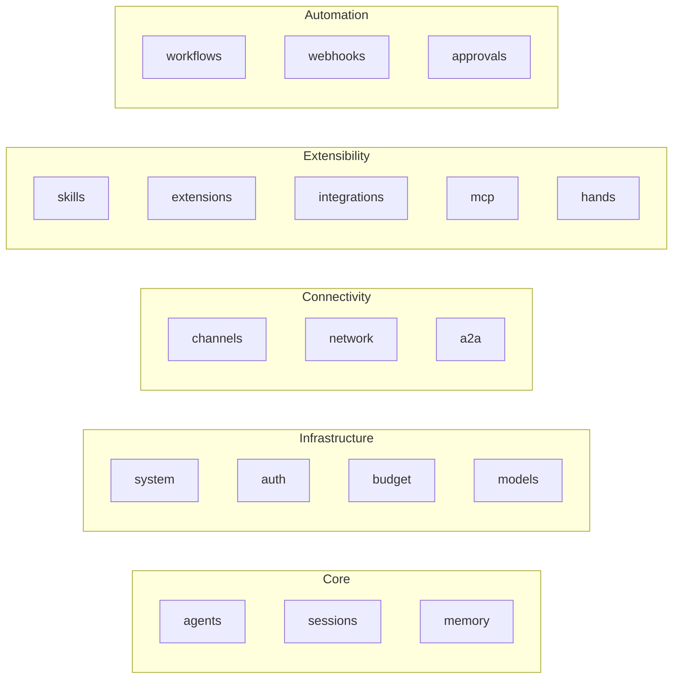

# API Server — openapi.json

# LibreFang API — OpenAPI Specification

## Overview

This is the **OpenAPI 3.1.0 specification** for LibreFang Agent Operating System's REST API. It defines every HTTP endpoint the server exposes for managing AI agents, tools, workflows, external integrations, and more. The spec lives at `openapi.json` in the API server module root and serves as the single source of truth for route definitions, request/response shapes, and operation IDs.

- **Version:** `2026.4.13-beta19`
- **License:** Apache-2.0
- **Spec version:** OpenAPI 3.1.0

### How this file is used

The spec is consumed by:
- **Route handlers** — operation IDs (e.g. `spawn_agent`, `list_agents`) map to handler function names in the server code.
- **Auto-generated client SDKs** — external consumers generate typed clients from this file.
- **Dashboard frontend** — the web UI discovers available endpoints and their parameters from this spec.
- **Validation middleware** — request bodies tagged with `$ref` schemas are validated at runtime against the definitions in `components/schemas`.

## API Surface by Domain

The spec organizes endpoints into the following tag groups:

---

### Agents (`agents`)

All CRUD, lifecycle, and per-agent configuration endpoints share the `/api/agents` prefix.

| Method | Path | Operation ID | Purpose |
|--------|------|-------------|---------|
| `GET` | `/api/agents` | `list_agents` | List agents with filtering, pagination, sorting (`q`, `status`, `limit`, `offset`, `sort`, `order`) |
| `POST` | `/api/agents` | `spawn_agent` | Spawn a new agent from a `SpawnRequest` manifest |
| `GET` | `/api/agents/{id}` | `get_agent` | Get single agent details |
| `DELETE` | `/api/agents/{id}` | `kill_agent` | Kill an agent |
| `PATCH` | `/api/agents/{id}` | `patch_agent` | Partial update (name, description, model, system prompt) |
| `PUT` | `/api/agents/{id}/update` | `update_agent` | Replace manifest (TOML-based `AgentUpdateRequest`) |
| `POST` | `/api/agents/{id}/clone` | `clone_agent` | Clone agent + workspace files (`CloneAgentRequest`) |
| `PATCH` | `/api/agents/{id}/config` | `patch_agent_config` | Hot-update config fields (`PatchAgentConfigRequest`) |
| `PATCH` | `/api/agents/{id}/identity` | `update_agent_identity` | Update visual identity (`UpdateIdentityRequest`) |

**Bulk operations** under `/api/agents/bulk`:

| Method | Path | Operation ID |
|--------|------|-------------|
| `POST` | `/api/agents/bulk` | `bulk_create_agents` |
| `DELETE` | `/api/agents/bulk` | `bulk_delete_agents` |
| `POST` | `/api/agents/bulk/start` | `bulk_start_agents` |
| `POST` | `/api/agents/bulk/stop` | `bulk_stop_agents` |

Bulk requests use `BulkCreateRequest` or `BulkAgentIdsRequest` schemas depending on the operation.

**Messaging & streaming:**

| Method | Path | Operation ID | Notes |
|--------|------|-------------|-------|
| `POST` | `/api/agents/{id}/message` | `send_message` | Synchronous message (`MessageRequest` → `MessageResponse`) |
| `POST` | `/api/agents/{id}/message/stream` | `send_message_stream` | SSE streaming response (same `MessageRequest` body) |
| `POST` | `/api/agents/{id}/upload` | `upload_file` | Raw binary upload; requires `Content-Type` and `X-Filename` headers |

**Session management:**

| Method | Path | Operation ID |
|--------|------|-------------|
| `GET` | `/api/agents/{id}/session` | `get_agent_session` |
| `GET` | `/api/agents/{id}/sessions` | `list_agent_sessions` |
| `POST` | `/api/agents/{id}/sessions` | `create_agent_session` |
| `POST` | `/api/agents/{id}/sessions/{session_id}/switch` | `switch_agent_session` |
| `GET` | `/api/agents/{id}/sessions/{session_id}/export` | `export_session` |
| `POST` | `/api/agents/{id}/sessions/import` | `import_session` |
| `GET` | `/api/agents/{id}/sessions/by-label/{label}` | `find_session_by_label` |
| `POST` | `/api/agents/{id}/session/reset` | `reset_session` |
| `POST` | `/api/agents/{id}/session/reboot` | `reboot_session` |
| `POST` | `/api/agents/{id}/session/compact` | `compact_session` |

`reset` saves a summary before clearing. `reboot` does a hard clear with no summary. `compact` triggers LLM-based session summarization.

**Per-agent resource assignments:**

| Method | Path | Operation ID | What it manages |
|--------|------|-------------|----------------|
| `GET`/`PUT` | `/api/agents/{id}/tools` | `get_agent_tools` / `set_agent_tools` | Tool allowlist/blocklist |
| `GET`/`PUT` | `/api/agents/{id}/skills` | `get_agent_skills` / `set_agent_skills` | Skill allowlist |
| `GET`/`PUT` | `/api/agents/{id}/mcp_servers` | `get_agent_mcp_servers` / `set_agent_mcp_servers` | MCP server allowlist |
| `PUT` | `/api/agents/{id}/mode` | `set_agent_mode` | Operational mode (`SetModeRequest`) |
| `PUT` | `/api/agents/{id}/model` | `set_model` | LLM model override |
| `POST` | `/api/agents/{id}/stop` | `stop_agent` | Cancel current LLM run |

**Workspace & diagnostics:**

| Method | Path | Operation ID |
|--------|------|-------------|
| `GET` | `/api/agents/{id}/files` | `list_agent_files` |
| `GET`/`PUT`/`DELETE` | `/api/agents/{id}/files/{filename}` | `get_agent_file` / `set_agent_file` / `delete_agent_file` |
| `GET` | `/api/agents/{id}/deliveries` | `get_agent_deliveries` |
| `DELETE` | `/api/agents/{id}/history` | `clear_agent_history` |
| `GET` | `/api/agents/{id}/traces` | `get_agent_traces` |

`get_agent_traces` returns structured decision traces showing why each tool was selected in the last agent loop — useful for debugging and auditing.

---

### Agent-to-Agent Protocol (`a2a`)

Two sub-prefixes: `/a2a/` for the local agent's A2A protocol interface, and `/api/a2a/` for managing external A2A agents.

**Local A2A interface:**

| Method | Path | Operation ID |
|--------|------|-------------|
| `GET` | `/.well-known/agent.json` | `a2a_agent_card` |
| `GET` | `/a2a/agents` | `a2a_list_agents` |
| `POST` | `/a2a/tasks/send` | `a2a_send_task` |
| `GET` | `/a2a/tasks/{id}` | `a2a_get_task` |
| `POST` | `/a2a/tasks/{id}/cancel` | `a2a_cancel_task` |

**External A2A management:**

| Method | Path | Operation ID |
|--------|------|-------------|
| `GET` | `/api/a2a/agents` | `a2a_list_external_agents` |
| `GET` | `/api/a2a/agents/{id}` | `a2a_get_external_agent` |
| `POST` | `/api/a2a/discover` | `a2a_discover_external` |
| `POST` | `/api/a2a/send` | `a2a_send_external` |
| `GET` | `/api/a2a/tasks/{id}/status` | `a2a_external_task_status` |

The `a2a_external_task_status` endpoint requires a `?url=` query parameter identifying which external agent to query.

---

### Authentication (`auth`)

| Method | Path | Operation ID | Notes |
|--------|------|-------------|-------|
| `GET` | `/api/auth/providers` | `auth_providers` | List configured OAuth/OIDC providers |
| `GET` | `/api/auth/login` | `auth_login` | Redirect to default provider (302) |
| `GET` | `/api/auth/login/{provider}` | `auth_login_provider` | Redirect to named provider (302) |
| `GET`/`POST` | `/api/auth/callback` | `auth_callback` / `auth_callback_post` | OAuth code exchange (browser vs programmatic) |
| `POST` | `/api/auth/introspect` | `auth_introspect` | RFC 7662 token validation (`{active: true/false}`) |
| `GET` | `/api/auth/userinfo` | `auth_userinfo` | Decoded JWT claims or provider userinfo fallback |

The POST callback variant accepts a `CallbackBody` schema for API clients that can't follow browser redirects.

---

### Memory (`memory`, `proactive-memory`)

**Agent KV memory:**

| Method | Path | Operation ID |
|--------|------|-------------|
| `GET` | `/api/agents/{id}/memory/export` | `export_agent_memory` |
| `POST` | `/api/agents/{id}/memory/import` | `import_agent_memory` |

Import accepts a `kv` object and an optional `clear_existing: true` flag.

**Proactive memory system:**

| Method | Path | Operation ID |
|--------|------|-------------|
| `GET` | `/api/memory` | `memory_list` |
| `POST` | `/api/memory` | `memory_add` |
| `GET` | `/api/memory/agents/{id}` | `memory_list_agent` |
| `DELETE` | `/api/memory/agents/{id}` | `memory_reset_agent` |
| `POST` | `/api/memory/agents/{id}/consolidate` | `memory_consolidate` |

All list endpoints support `category`, `offset`, and `limit` query parameters. `memory_add` routes through the extraction pipeline. `memory_consolidate` merges duplicates and cleans stale entries.

---

### Budget & Cost Tracking (`budget`)

| Method | Path | Operation ID |
|--------|------|-------------|
| `GET`/`PUT` | `/api/budget` | `budget_status` / `update_budget` |
| `GET` | `/api/budget/agents` | `agent_budget_ranking` |
| `GET`/`PUT` | `/api/budget/agents/{id}` | `agent_budget_status` / `update_agent_budget` |

Budget updates are in-memory only — they are not persisted to `config.toml`.

---

### Channels (`channels`)

| Method | Path | Operation ID |
|--------|------|-------------|
| `GET` | `/api/channels` | `list_channels` |
| `POST` | `/api/channels/reload` | `reload_channels` |
| `POST`/`DELETE` | `/api/channels/{name}/configure` | `configure_channel` / `remove_channel` |
| `POST` | `/api/channels/{name}/test` | `test_channel` |

**QR login flows:**

| Method | Path | Operation ID |
|--------|------|-------------|
| `POST` | `/api/channels/wechat/qr/start` | `wechat_qr_start` |
| `GET` | `/api/channels/wechat/qr/status` | `wechat_qr_status` |
| `POST` | `/api/channels/whatsapp/qr/start` | `whatsapp_qr_start` |
| `GET` | `/api/channels/whatsapp/qr/status` | `whatsapp_qr_status` |

The test endpoint accepts optional `channel_id` or `chat_id` in the body for live message delivery verification.

---

### Inter-Agent Networking (`network`)

| Method | Path | Operation ID |
|--------|------|-------------|
| `GET` | `/api/comms/topology` | `comms_topology` |
| `GET` | `/api/comms/events` | `comms_events` |
| `GET` | `/api/comms/events/stream` | `comms_events_stream` |
| `POST` | `/api/comms/send` | `comms_send` |
| `POST` | `/api/comms/task` | `comms_task` |

`comms_events_stream` is an SSE endpoint polling the audit log every 500ms. `comms_events` merges data from both the event bus and the audit log.

---

### Workflows / Cron (`workflows`)

| Method | Path | Operation ID |
|--------|------|-------------|
| `GET`/`POST` | `/api/cron/jobs` | `list_cron_jobs` / `create_cron_job` |
| `GET`/`PUT`/`DELETE` | `/api/cron/jobs/{id}` | `cron_job_status` / `update_cron_job` / `delete_cron_job` |
| `PUT` | `/api/cron/jobs/{id}/enable` | `toggle_cron_job` |

---

### Model Catalog (`models`)

| Method | Path | Operation ID |
|--------|------|-------------|
| `GET` | `/api/catalog/status` | `catalog_status` |
| `POST` | `/api/catalog/update` | `catalog_update` |

`catalog_update` downloads the latest TOML catalog files from GitHub, caches them locally, and refreshes the kernel's in-memory catalog.

---

### MCP Servers (`mcp`)

| Method | Path | Operation ID |
|--------|------|-------------|
| `GET`/`POST` | `/api/mcp/servers` | `list_mcp_servers` / `add_mcp_server` |
| `GET`/`PUT`/`DELETE` | `/api/mcp/servers/{name}` | `get_mcp_server` / `update_mcp_server` / `delete_mcp_server` |

Adding a server expects `McpServerConfigEntry` (name, transport, timeout_secs, env), persists to `config.toml`, and triggers a config reload. The GET on a single server returns live connection status and available tools.

---

### Skills & Marketplace (`skills`)

| Method | Path | Operation ID |
|--------|------|-------------|
| `GET` | `/api/clawhub/browse` | `clawhub_browse` |
| `GET` | `/api/clawhub/search` | `clawhub_search` |
| `GET` | `/api/clawhub/skill/{slug}` | `clawhub_skill_detail` |
| `GET` | `/api/clawhub/skill/{slug}/code` | `clawhub_skill_code` |
| `POST` | `/api/clawhub/install` | `clawhub_install` |
| `GET` | `/api/marketplace/search` | `marketplace_search` |

`clawhub_browse` supports `sort` (trending, downloads, stars, updated, rating), `limit`, and `cursor`. `clawhub_install` runs the full security pipeline: SHA256 verification, manifest scan, prompt injection scan, and binary dependency check.

---

### Hands (`hands`)

Hands are autonomous agent instances with their own lifecycle:

| Method | Path | Operation ID |
|--------|------|-------------|
| `GET` | `/api/hands` | `list_hands` |
| `GET` | `/api/hands/{hand_id}` | `get_hand` |
| `POST` | `/api/hands/install` | `install_hand` |
| `POST` | `/api/hands/reload` | `reload_hands` |
| `POST` | `/api/hands/{hand_id}/activate` | `activate_hand` |
| `POST` | `/api/hands/{hand_id}/check-deps` | `check_hand_deps` |
| `POST` | `/api/hands/{hand_id}/install-deps` | `install_hand_deps` |
| `GET`/`PUT` | `/api/hands/{hand_id}/settings` | `get_hand_settings` / `update_hand_settings` |
| `GET` | `/api/hands/active` | `list_active_hands` |
| `GET` | `/api/hands/instances/{id}/browser` | `hand_instance_browser` |
| `GET` | `/api/hands/instances/{id}/stats` | `hand_stats` |
| `POST` | `/api/hands/instances/{id}/pause` | `pause_hand` |
| `POST` | `/api/hands/instances/{id}/resume` | `resume_hand` |
| `DELETE` | `/api/hands/instances/{id}` | `deactivate_hand` |

Activating a hand spawns an agent; deactivating kills it.

---

### Integrations (`integrations`)

| Method | Path | Operation ID |
|--------|------|-------------|
| `GET` | `/api/integrations` | `list_integrations` |
| `GET` | `/api/integrations/available` | `list_available_integrations` |
| `GET` | `/api/integrations/health` | `integrations_health` |
| `POST` | `/api/integrations/add` | `add_integration` |
| `POST` | `/api/integrations/reload` | `reload_integrations` |
| `GET`/`DELETE` | `/api/integrations/{id}` | `get_integration` / `remove_integration` |
| `POST` | `/api/integrations/{id}/reconnect` | `reconnect_integration` |

`reload_integrations` hot-reloads configs and reconnects MCP servers.

---

### Extensions (`extensions`)

| Method | Path | Operation ID |
|--------|------|-------------|
| `GET` | `/api/extensions` | `list_extensions` |
| `GET` | `/api/extensions/{name}` | `get_extension` |
| `POST` | `/api/extensions/install` | `install_extension` |
| `POST` | `/api/extensions/uninstall` | `uninstall_extension` |

---

### Approvals (`approvals`)

Human-in-the-loop gating for agent actions:

| Method | Path | Operation ID |
|--------|------|-------------|
| `GET` | `/api/approvals` | `list_approvals` |
| `POST` | `/api/approvals` | `create_approval` |
| `GET` | `/api/approvals/{id}` | `get_approval` |
| `POST` | `/api/approvals/{id}/approve` | `approve_request` |
| `POST` | `/api/approvals/{id}/reject` | `reject_request` |

The list endpoint transforms field names for dashboard compatibility: `action_summary` → `action`, `agent_id` → `agent_name`, `requested_at` → `created_at`.

---

### Webhooks (`webhooks`)

| Method | Path | Operation ID |
|--------|------|-------------|
| `POST` | `/api/hooks/agent` | `webhook_agent` |
| `POST` | `/api/hooks/wake` | `webhook_wake` |

`webhook_agent` runs an isolated agent turn. `webhook_wake` injects a custom event into the kernel's event system to trigger proactive agents.

---

### System & Configuration (`system`)

**Health:**

| Method | Path | Operation ID | Auth |
|--------|------|-------------|------|
| `GET` | `/api/health` | `health` | Public |
| `GET` | `/api/health/detail` | `health_detail` | Required |

The public health endpoint returns only `status` and `version` to prevent information leakage.

**Configuration:**

| Method | Path | Operation ID |
|--------|------|-------------|
| `GET` | `/api/config` | `get_config` |
| `GET` | `/api/config/schema` | `config_schema` |
| `POST` | `/api/config/reload` | `config_reload` |
| `POST` | `/api/config/set` | `config_set` |

`config_set` accepts `{"path": "section.key", "value": "..."}`, writes to `config.toml`, and triggers a reload. `config_reload` diffs current vs on-disk config, validates, and applies hot-reloadable changes.

**Audit:**

| Method | Path | Operation ID |
|--------|------|-------------|
| `GET` | `/api/audit/recent` | `audit_recent` |
| `GET` | `/api/audit/verify` | `audit_verify` |

**Backups:**

| Method | Path | Operation ID |
|--------|------|-------------|
| `POST` | `/api/backup` | `create_backup` |
| `GET` | `/api/backups` | `list_backups` |
| `DELETE` | `/api/backups/{filename}` | `delete_backup` |

Backups are stored in `<home_dir>/backups/` with timestamped filenames.

**Other:**

| Method | Path | Operation ID |
|--------|------|-------------|
| `GET` | `/api/commands` | `list_commands` |
| `GET` | `/api/commands/{name}` | `get_command` |
| `GET` | `/api/bindings` | `list_bindings` |
| `POST` | `/api/bindings` | `add_binding` |
| `DELETE` | `/api/bindings/{index}` | `remove_binding` |
| `POST` | `/api/init` | `quick_init` |
| `GET` | `/api/logs/stream` | `logs_stream` |

`logs_stream` is an SSE endpoint with optional `level`, `filter`, and `token` query parameters. It sends a heartbeat every 15 seconds and backfills existing entries on first connect.

---

## Schema References

The spec defines the following named schemas in `#/components/schemas/` (referenced by `$ref` throughout):

| Schema | Used by |
|--------|---------|
| `SpawnRequest` | `spawn_agent` |
| `SpawnResponse` | `spawn_agent` (200) |
| `BulkCreateRequest` | `bulk_create_agents` |
| `BulkAgentIdsRequest` | `bulk_delete_agents`, `bulk_start_agents`, `bulk_stop_agents` |
| `CloneAgentRequest` | `clone_agent` |
| `PatchAgentConfigRequest` | `patch_agent_config` |
| `UpdateIdentityRequest` | `update_agent_identity` |
| `MessageRequest` | `send_message`, `send_message_stream` |
| `MessageResponse` | `send_message` (200) |
| `SetModeRequest` | `set_agent_mode` |
| `AgentUpdateRequest` | `update_agent` |
| `SetAgentFileRequest` | `set_agent_file` |
| `CallbackBody` | `auth_callback_post` |

Many endpoints have empty `schema: {}` for their request/response bodies, indicating schemas that are defined at the handler level rather than in this spec file. When extending the API, prefer adding explicit schemas to `components/schemas` and referencing them via `$ref`.

## Path Conventions

- **Public endpoints** — no authentication required: `/.well-known/agent.json`, `/api/health`
- **API endpoints** — prefixed with `/api/`, require authentication via JWT in the `Authorization` header
- **Protocol endpoints** — prefixed with `/a2a/`, follow the Agent-to-Agent protocol standard
- **Webhook endpoints** — prefixed with `/api/hooks/`, designed for external system integration
- **SSE streams** — identified by `/stream` suffix, return `text/event-stream` content type

## Contributing to the Spec

When adding a new endpoint:

1. Choose the correct tag from the existing set. Create a new tag only if the domain is genuinely distinct.
2. Set the `operationId` to match the handler function name (snake_case).
3. Define request/response schemas explicitly in `components/schemas` — avoid empty `schema: {}` entries.
4. Include all query parameters with `required` and type constraints.
5. Document error responses (400, 401, 404, 500) where applicable.
6. For SSE endpoints, note the `text/event-stream` response type and any heartbeat/polling behavior in the `description` field.