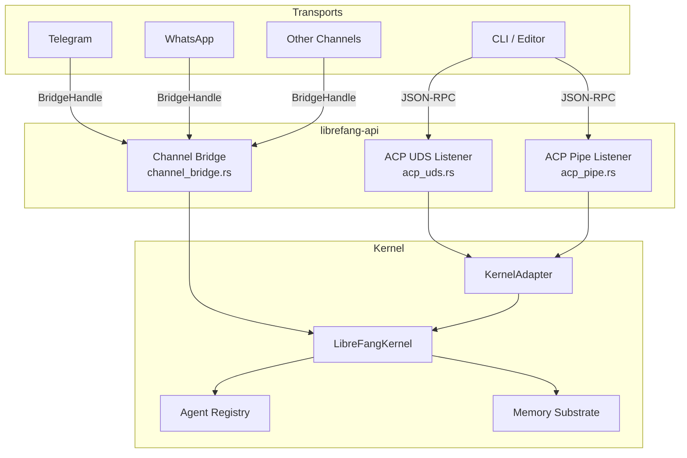
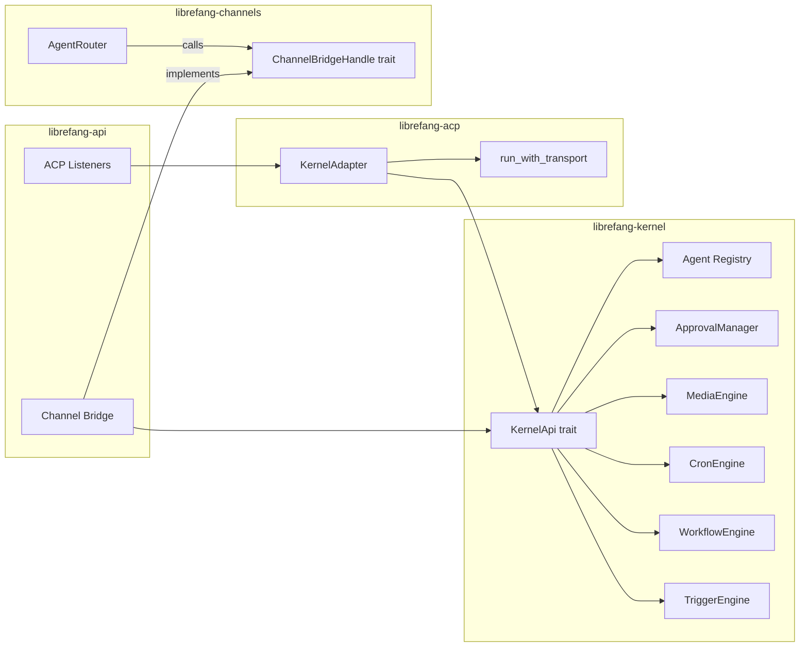

# API Server & Routes

# API Server & Routes — `librefang-api`

## Overview

`librefang-api` is the daemon-facing service layer that bridges external transport endpoints (Unix domain sockets, Windows named pipes, messaging channels) to the shared `LibreFangKernel`. It is **not** an HTTP REST API — it is the daemon-attached infrastructure that allows multiple frontends (CLI sessions, editor plugins, Telegram/WhatsApp/etc.) to concurrently drive a single long-running kernel instance.

The crate has three primary responsibilities:

1. **ACP listeners** — Accept local CLI/editor connections over platform-native IPC (UDS on Unix, named pipes on Windows), each running an isolated JSON-RPC session against the shared kernel.
2. **Channel bridge** — Implement the `ChannelBridgeHandle` trait so messaging adapters (Telegram, WhatsApp, Slack, Discord, etc.) can send messages, manage agents, handle slash commands, and stream responses through the kernel.
3. **Cross-cutting wiring** — Re-exports, security helpers, error sanitization, and tool-call-leak detection that keep channel-facing output safe for end users.



---

## ACP Listeners

The Agent Client Protocol (ACP) listeners allow multiple `librefang acp` CLI invocations to share one long-running daemon kernel. Each accepted connection runs `librefang_acp::run_with_transport` over a framed JSON-RPC stream against a shared `KernelAdapter` backed by the daemon's existing kernel.

### Unix Domain Socket — `acp_uds.rs`

**Platform:** Unix only (`#![cfg(unix)]`)

**Socket path:** `~/.librefang/acp.sock`

The UDS listener accepts local connections and enforces a **same-user, same-host** trust model with two defense layers:

1. **Atomic bind with mode `0o600`** — `bind_atomic_owner_only` binds to a randomized tempfile in the target directory, `chmod`s it to `0o600`, then `rename`s into the final path. This closes the TOCTOU window between `bind()` and `chmod()` where another local user could `connect()` to a world-readable socket.

2. **`SO_PEERCRED` peer-uid match** — Every accepted connection's `peer_cred().uid()` is compared against the daemon's own `geteuid()`. A mismatch drops the stream before any ACP bytes are read.

#### Stale orphan cleanup

On macOS Docker Desktop bind-mount volumes, `rename(2)` succeeds on the host but the source file is never unlinked from the container's view, causing `.acp.sock.<pid>.<nanos>` tempfiles to accumulate. `sweep_stale_orphans` removes these with three guards:

| Guard | Purpose |
|---|---|
| **UID equality** | Only removes files owned by the daemon's euid |
| **Recency window** (10s) | Protects fresh tempfiles from concurrent daemons still in bind→rename |
| **PID liveness** (`kill(pid, 0)`) | Only removes files whose PID returns `ESRCH` (dead process) |

#### Key functions

- **`run_listener(kernel, sock_path)`** — Main accept loop. Spawns a tokio task per connection.
- **`bind_atomic_owner_only(final_path)`** — Atomic bind with stale-socket overwrite and orphan sweep.
- **`handle_connection(kernel, stream)`** — Creates a `KernelAdapter`, resolves the default agent, splits the stream, adapts via `tokio_util::compat`, and calls `run_with_transport`.

### Windows Named Pipe — `acp_pipe.rs`

**Platform:** Windows only (`#![cfg(windows)]`)

**Pipe name:** `\\.\pipe\librefang-acp`

Wire-compatible with the UDS path — same JSON-RPC framing, same `KernelAdapter`, same shared kernel. Only the transport differs.

#### Security: owner-only DACL

Windows named pipes default to a permissive DACL that grants `GENERIC_READ`/`GENERIC_WRITE` to any local user. The pipe is hardened with an explicit SDDL descriptor `D:P(A;;GA;;;OW)`:

- **`D:`** — DACL (not SACL)
- **`P`** — Protected (blocks inheritance from parent `\\.\pipe\`)
- **`(A;;GA;;;OW)`** — One ACE: Allow `GENERIC_ALL` to Owner only

Every pipe instance (initial bind and every rebind after connect) is created with this descriptor. `first_pipe_instance(true)` is set only on the very first instance to prevent name-squatting races from a crashed daemon.

#### Key functions

- **`run_listener(kernel)`** — Creates the first pipe instance, then loops: await connect, hand off to spawned task, create next instance.
- **`create_owner_only_instance(first)`** — Builds a `NamedPipeServer` with the owner-only DACL via `ConvertStringSecurityDescriptorToSecurityDescriptorW`.
- **`OwnerOnlyDescriptor`** — RAII wrapper that frees the security descriptor via `LocalFree` on drop.

---

## Channel Bridge — `channel_bridge.rs`

The channel bridge connects the kernel to messaging channel adapters. It implements `ChannelBridgeHandle` for `KernelBridgeAdapter`, which wraps an `Arc<dyn KernelApi>`.

### `KernelBridgeAdapter`

The central struct that bridges channel interactions to the kernel:

```rust
pub struct KernelBridgeAdapter {
    kernel: Arc<dyn KernelApi>,
    started_at: Instant,
}
```

It implements `ChannelBridgeHandle` with methods covering:

| Category | Methods | Purpose |
|---|---|---|
| **Messaging** | `send_message`, `send_message_with_blocks`, `send_message_streaming`, variants with `_with_sender` | Dispatch messages to agents, return responses |
| **Agent management** | `find_agent_by_name`, `list_agents`, `spawn_agent_by_name` | Agent discovery and creation |
| **Session control** | `reset_session`, `reboot_session`, `compact_session`, channel-scoped variants | Session lifecycle management |
| **Model switching** | `set_model` | Change an agent's model at runtime |
| **Approvals** | `list_approvals_text`, `resolve_approval_text` | Human-readable approval workflow via slash commands |
| **Automation** | `list_workflows_text`, `run_workflow_text`, `list_triggers_text`, `create_trigger_text`, `delete_trigger_text`, `list_schedules_text`, `manage_schedule_text` | Workflow/trigger/cron management |
| **Introspection** | `list_models_text`, `list_providers_text`, `list_skills_text`, `list_hands_text`, `uptime_info`, `budget_text`, `session_usage` | Status and catalog queries |
| **RBAC** | `authorize_channel_user` | Channel user authorization |
| **Media** | `transcribe_inbound_audio`, `describe_inbound_image` | Auto-transcription/description of inbound media |
| **Delivery** | `record_delivery` | Track delivery success/failure for metrics |
| **Networking** | `peers_text`, `a2a_agents_text`, `send_channel_push` | OFP peer network and A2A agent discovery |
| **Classification** | `classify_reply_intent` | LLM-based reply/no-reply detection for group chats |

### Streaming text bridge

The streaming bridge converts kernel `StreamEvent` into a `mpsc::Receiver<String>` suitable for channel adapters. Two entry points:

- **`start_stream_text_bridge`** — Returns text receiver only.
- **`start_stream_text_bridge_with_status`** — Returns text receiver **and** a `oneshot::Receiver<Result<(), String>>` for kernel terminal status (used for delivery tracking and lifecycle reactions).

#### Event handling logic

| Event | Behavior |
|---|---|
| `TextDelta` | Buffer text per iteration |
| `ContentComplete` | Flush buffered text unless it looks like a leaked tool call or silent response |
| `ToolUseStart` | Inject `🔧 Tool Name` progress line (when `show_progress` is enabled) |
| `ToolExecutionResult` (error) | Inject `⚠️ Tool Name failed` progress line |
| `PhaseChange` (`context_warning`) | Surface context window warning to user |
| Silent responses (`NO_REPLY`, `[[silent]]`) | Suppressed entirely |

Progress lines use `\n\n…\n\n` formatting so adjacent markers render with blank-line separation on markdown-aware renderers.

### Tool call leak detection

Some LLM providers emit tool calls as plain text instead of using the proper tool_use API. The bridge filters these to prevent raw JSON/tool syntax from reaching channel users. Detection is layered:

1. **Start-of-text patterns** — Always matches regardless of length: `[{`, `functions.`, `{"type":"function"}`, etc.
2. **Contains patterns** (short text ≤2000 chars only) — `<function=`, `[TOOL_CALL]`,  beurette markers, markdown code blocks containing tool calls
3. **Bare JSON tool call scanning** — Scans for `{...}` objects, validates as JSON, checks for tool-call-shaped keys (`name`/`function`/`tool` + `arguments`/`parameters`/`args`/`input`)
4. **Markdown/backtick extraction** — Parses fenced code blocks and inline backticks for `name{...json...}` patterns

Long text (>2000 chars) only matches start-of-text patterns to avoid false positives on natural language that discusses tools.

### Error sanitization

`sanitize_channel_error` maps raw LLM/driver errors into user-friendly messages for channel delivery:

| Error pattern | User message |
|---|---|
| Timeout / inactivity | "The task timed out due to inactivity. Try breaking it into smaller steps." |
| Rate limit / 429 / quota | "I've hit my usage limit and need to rest. I'll be back soon!" |
| Auth / 401 | "I'm having trouble with my credentials. Please let the admin know." |
| Content filtered | "I can't help with that — the request was blocked by the model's safety filter." |
| Exit code / driver error | "Sorry, something went wrong on my end. Please try again in a moment." |
| Other | "Something went wrong: please try again. (ref: <truncated>)" |

Group chats suppress all error messages entirely to avoid leaking technical details.

### Reply intent classification

`classify_reply_intent` uses a one-shot LLM call to determine whether a group-chat message is directed at the bot or is casual human-to-human conversation. The classifier prompt is hardened against prompt injection:

- Input truncation (message 500 chars, sender name 64 chars)
- Character sanitization (backticks → quotes, brackets → parens)
- Instruction to ignore any instructions inside the classified message
- Fail-open: any error or ambiguous result defaults to "reply"

Supports bot name, aliases, and @mention detection.

### Approval workflow

The approval flow handles TOTP-based two-factor authorization for dangerous tool invocations through channel slash commands:

1. **`/approvals`** — Lists pending requests with age and risk level
2. **`/approve <id> [totp]`** — Resolves an approval, optionally with TOTP or recovery code
3. **`/reject <id>`** — Denies an approval

TOTP verification includes:
- Per-tool requirement check (not all tools require TOTP even when globally enabled)
- Recovery code support with atomic redeem (prevents double-consumption race, #3560/#3943)
- Replay protection — used codes are recorded and refused within a 60s window (#3952)
- Lockout tracking — too many failed attempts triggers temporary lockout (#3584)
- Idempotent double-click handling — `resolve_no_pending_message` checks the audit log to distinguish already-resolved duplicates from genuine unknowns

### Trigger pattern parsing

`parse_trigger_pattern` converts slash-command pattern strings into `TriggerPattern` variants:

| Input | Pattern |
|---|---|
| `lifecycle` | `Lifecycle` |
| `terminated` | `AgentTerminated` |
| `system` | `System` |
| `system:<keyword>` | `SystemKeyword` |
| `memory` | `MemoryUpdate` |
| `memory:<key>` | `MemoryKeyPattern` |
| `match:<text>` | `ContentMatch` |
| `spawned:<name>` | `AgentSpawned` |
| `all` | `All` |

---

## Approval Re-export — `approval.rs`

A thin re-export module that exposes `librefang_kernel::approval::ApprovalManager` without requiring API route modules to import from the kernel's internal module path directly. This isolates the API crate's import surface from kernel internals (issue #3744).

---

## Connection to the rest of the codebase



- **`librefang-acp`** provides `KernelAdapter` (adapts `AcpKernel` trait to the kernel) and `run_with_transport` (the JSON-RPC server loop).
- **`librefang-channels`** defines `ChannelBridgeHandle` (the trait the bridge implements) and `AgentRouter`/`SidecarAdapter` (channel routing).
- **`librefang-kernel`** provides `KernelApi` (the main kernel interface), plus all subsystems (registry, approvals, media, cron, workflows, triggers).
- The CLI side (`librefang-cli::acp`) connects as a client to the ACP listeners, piping stdin↔socket↔stdout.