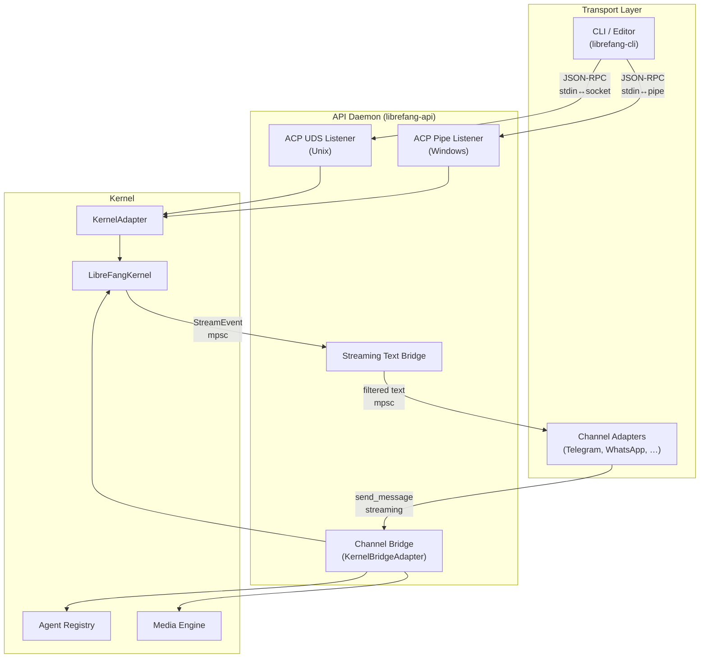

# API Server & Routes

# API Server & Routes — `librefang-api`

The `librefang-api` crate is the HTTP/WebSocket daemon surface for LibreFang. It hosts the REST routes, SSE streams, WebSocket sessions, and—critically for long-running daemon mode—the **Agent Client Protocol (ACP)** listeners and **channel bridge** that let external editors and messaging platforms share a single kernel instance.

## Architecture

## ACP Listeners — Daemon-Attached Editor Protocol

The ACP listeners let multiple editor sessions (VS Code, Neovim, etc.) connect to a long-running daemon and share one kernel. Each connection gets an isolated `KernelAdapter` backed by the daemon's shared `LibreFangKernel`. The wire format is JSON-RPC over a framed byte stream — identical on both platforms.

### Unix Domain Sockets (`acp_uds.rs`)

**Entry point:** `run_listener(kernel, sock_path)`

Binds a UDS at `~/.librefang/acp.sock` and accepts connections in a loop. Each connection is handed to a spawned task running `handle_connection`, which:

1. Creates a `KernelAdapter` wrapping the shared kernel
2. Resolves the default agent (`"assistant"`)
3. Splits the stream into read/write halves, adapts them via `tokio_util::compat`
4. Runs `librefang_acp::run_with_transport` to serve ACP frames

#### Atomic bind with TOCTOU hardening

The socket is bound through `bind_atomic_owner_only` to close the race window between `bind()` and `chmod()`:

1. Bind to a randomized tempfile (`.acp.sock.<pid>.<nanos>`) in the parent directory
2. `chmod` to `0o600`
3. `rename` into the final path (atomically overwrites any stale socket)

#### Stale orphan cleanup — `sweep_stale_orphans`

On macOS Docker Desktop bind-mount volumes, `rename(2)` succeeds on the host but the source file persists in the container view. The sweep removes orphan tempfiles matching `.<stem>.<pid>.<nanos>` with three guards:

| Guard | Purpose |
|-------|---------|
| **UID equality** | `metadata.uid() == self_euid()` — never delete another user's file |
| **Recency window** | Files with mtime < 10 seconds ago are skipped — protects in-flight binds |
| **PID liveness** | `kill(pid, 0)` — only remove if `ESRCH` (process dead). `EPERM` means alive, owned by another user |

#### Peer credential enforcement

Every accepted connection is checked via `stream.peer_cred()`. If the peer UID doesn't match the daemon's euid, the stream is dropped before any ACP bytes are read. This is defense-in-depth against a permissive umask or a container running as root with host filesystem mounted.

### Windows Named Pipes (`acp_pipe.rs`)

**Entry point:** `run_listener(kernel)`

Windows named pipes have a different lifecycle than UDS — there's no single listener. Instead, the server creates one pipe instance, awaits a connect, then creates the next instance. The loop in `run_listener`:

1. Creates the initial instance with `first_pipe_instance(true)` (prevents name-squatting by a second daemon)
2. Awaits `server.connect().await`
3. Hands the connected pipe to a spawned task
4. Immediately creates the next instance so subsequent CLI invocations aren't blocked

#### Owner-only DACL

Pipe name: `\\.\pipe\librefang-acp` (host-local namespace).

The default Windows named-pipe DACL grants `GENERIC_READ`/`GENERIC_WRITE` to any local user — unacceptable on Terminal Server / shared workstations. The code installs an explicit DACL via SDDL `D:P(A;;GA;;;OW)`:

- `D:` — DACL (not SACL)
- `P` — protected (blocks inheritance from parent `\\.\pipe\`)
- `(A;;GA;;;OW)` — one ACE: allow `GENERIC_ALL` to owner only

The `OwnerOnlyDescriptor` struct wraps the raw `PSECURITY_DESCRIPTOR`, created via `ConvertStringSecurityDescriptorToSecurityDescriptorW` and freed in `Drop` via `LocalFree`. The `SecurityAttributes` wrapper borrows the descriptor and provides `as_raw_mut()` for the `create_with_security_attributes_raw` call.

Every pipe instance — initial and rebind — is created with this descriptor, not just the first.

## Channel Bridge (`channel_bridge.rs`)

The channel bridge connects the LibreFang kernel to messaging channel adapters (Telegram, WhatsApp, Slack, etc.). It implements the `ChannelBridgeHandle` trait from `librefang_channels::bridge` on `KernelBridgeAdapter`, which wraps an `Arc<dyn KernelApi>`.

### Streaming Text Bridge

`start_stream_text_bridge` and `start_stream_text_bridge_with_status` consume a `mpsc::Receiver<StreamEvent>` from the kernel and produce a `mpsc::Receiver<String>` of filtered, user-ready text.

The bridge processes these events:

| Event | Action |
|-------|--------|
| `TextDelta` | Buffer in `iter_buf` |
| `ContentComplete` | Flush buffer if not tool-call-like, not `NO_REPLY`, and not adjacent to a tool use |
| `ToolUseStart` | Emit progress line `🔧 <pretty_name>` (if `show_progress` enabled and not already seen this iteration) |
| `ToolExecutionResult` (error) | Emit `⚠️ <pretty_name> failed` (localized) |
| `PhaseChange` (`context_warning`) | Emit warning about context window trimming |

The `show_progress` flag is read from the agent manifest. Group chats and agents whose output is consumed by parsers set this to `false`.

**Status channel:** `start_stream_text_bridge_with_status` also returns a `oneshot::Receiver<Result<(), String>>` that resolves with the kernel task's terminal result. Callers use this for lifecycle reactions and delivery tracking. Timeout-with-partial-output is reported as `Ok(())` to avoid regressing the UX.

### Tool Call Filtering

Some LLM providers emit tool calls as plain text instead of using the proper `tool_use` API. The bridge filters these before they reach channel users. Detection in `looks_like_tool_call`:

- **Start-of-text patterns** (applied at any length): `[{`, `functions.`, `{"type":"function"}`, `{"tool_calls":`, `[TOOL_CALL]`, `essional`
- **Body patterns** (only for text ≤ 2000 chars): bare JSON tool-call objects, `<function=` tags, `<tool>` tags, markdown code blocks containing tool calls, backtick-wrapped tool calls

The JSON object detection (`contains_bare_json_tool_call`, `find_json_object_end`, `looks_like_tool_call_object`) properly tracks string/brace nesting to avoid false positives on natural language containing braces.

### Error Sanitization

`sanitize_channel_error` maps raw driver errors to user-friendly messages:

- Timeouts → "task timed out due to inactivity"
- Rate limits → "hit my usage limit"
- Auth failures → "trouble with my credentials"
- Content filtered → "blocked by the model's safety filter"
- Crashes → generic "something went wrong"
- Unknown → "Something went wrong (ref: …)" with truncated detail

### Silent Response Detection

When the agent chooses not to reply (`NO_REPLY`, `[[silent]]`), `librefang_kernel::silent_response::is_silent_response` matches it, and the bridge suppresses the output entirely — the channel adapter never sends a message.

### Slash Command Operations

`KernelBridgeAdapter` implements channel-facing slash commands through the `ChannelBridgeHandle` trait. These are the text-form interfaces users see in Telegram/WhatsApp/Slack:

**Agent management:**
- `find_agent_by_name`, `list_agents`, `spawn_agent_by_name`
- `reset_session`, `reboot_session`, `compact_session`
- `set_model`, `stop_run`, `session_usage`

**Automation:**
- `list_workflows_text`, `run_workflow_text` — list and execute workflows by name
- `list_triggers_text`, `create_trigger_text`, `delete_trigger_text` — CRUD on trigger patterns
- `list_schedules_text`, `manage_schedule_text` — cron job management with `add`/`del`/`run` subcommands

**Approvals with TOTP:**
- `list_approvals_text` — shows pending approval requests with age
- `resolve_approval_text` — approve/reject with optional TOTP or recovery code

The approval flow includes replay protection (`is_totp_code_used` / `record_totp_code_used`), lockout tracking (`check_and_record_totp_failure`), and atomic recovery code redemption (`vault_redeem_recovery_code`). When a user double-taps an inline approve button, `resolve_no_pending_message` checks the audit log and returns an idempotent ack instead of a confusing "not found" error.

**Infrastructure:**
- `uptime_info`, `list_models_text`, `list_providers_text`, `list_skills_text`, `list_hands_text`
- `budget_text` — hourly/daily/monthly spend vs. limits
- `peers_text`, `a2a_agents_text` — OFP network and external A2A agent status
- `record_delivery` — delivery receipt tracking with thread persistence for cron `LastChannel`

### Reply Intent Classification

`classify_reply_intent` uses a one-shot LLM call to determine whether a group-chat message is directed at the bot. It sanitizes inputs (truncates, strips backticks and brackets) to reduce injection surface, and fail-opens — if the classifier errors, the message is treated as requiring a reply.

### Media Processing

| Method | Config Flag | Default | Behavior |
|--------|------------|---------|----------|
| `transcribe_inbound_audio` | `[media] audio_transcription` | OFF | Whisper transcription of voice messages |
| `describe_inbound_image` | `[media] image_description` | ON | Vision-model description for text-only agents |

Both methods check their config flag first and return `Ok(None)` when disabled, letting the bridge fall back to delivering the raw attachment.

### RBAC Authorization

`authorize_channel_user` checks the kernel's `auth_manager` for per-user permissions. When RBAC is not configured, all access is allowed. Actions mapped: `chat` → `ChatWithAgent`, `spawn` → `SpawnAgent`, `kill` → `KillAgent`, `install_skill` → `InstallSkill`.

## Trust Model Summary

| Layer | Unix (UDS) | Windows (Named Pipe) |
|-------|-----------|---------------------|
| Filesystem | `0o600` mode + atomic rename | Owner-only DACL (`D:P(A;;GA;;;OW)`) |
| Transport | `SO_PEERCRED` uid match | `reject_remote_clients(true)` + DACL |
| Scope | Same-user, same-host | Same-user, same-host |

The ACP path is not designed for multi-user hosts where users distrust each other. The hardening layers prevent casual hijacking but a root user or admin can always bypass them. Channel adapters use their own authentication (bot tokens, OAuth) and optionally RBAC via `authorize_channel_user`.

## Approval Re-export (`approval.rs`)

A thin re-export of `librefang_kernel::approval::ApprovalManager`. API route modules import from `crate::approval` rather than reaching into the kernel directly, keeping the kernel's internal module path out of the API crate's import surface. This matters because API routes only call associated functions (e.g. `verify_totp_code_with_issuer`) rather than owning the manager.

## Trigger Pattern Parsing

`parse_trigger_pattern` converts slash-command strings into `TriggerPattern` variants:

| Input | Pattern |
|-------|---------|
| `lifecycle` | `Lifecycle` |
| `spawned:<name>` | `AgentSpawned { name_pattern }` |
| `terminated` | `AgentTerminated` |
| `system` | `System` |
| `system:<keyword>` | `SystemKeyword { keyword }` |
| `memory` | `MemoryUpdate` |
| `memory:<key>` | `MemoryKeyPattern { key_pattern }` |
| `match:<text>` | `ContentMatch { substring }` |
| `all` | `All` |