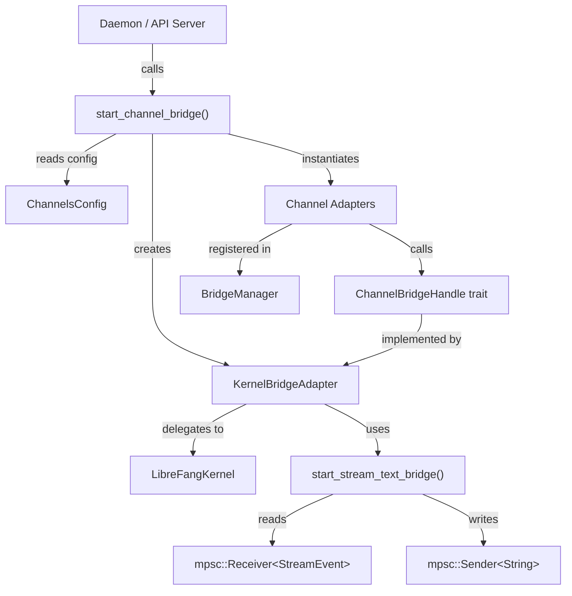

# API Server

# Channel Bridge (`channel_bridge.rs`)

The channel bridge is the wiring layer that connects the LibreFang kernel to external messaging platforms. It implements the `ChannelBridgeHandle` trait on `KernelBridgeAdapter`, provides the streaming text pipeline that converts kernel `StreamEvent`s into channel-deliverable strings, and exposes `start_channel_bridge()` — the entry point called by the daemon at startup to spin up every configured adapter.

## Architecture

The daemon calls `start_channel_bridge()`, which reads the `ChannelsConfig`, instantiates feature-gated adapters (Telegram, Discord, Slack, etc.), wraps the kernel in a `KernelBridgeAdapter`, and hands everything to `BridgeManager`. From that point on, inbound messages from any adapter flow through `ChannelBridgeHandle` → `KernelBridgeAdapter` → `LibreFangKernel`, and outbound responses flow back through the streaming bridge pipeline.

---

## Key Components

### `KernelBridgeAdapter`

Wraps an `Arc<LibreFangKernel>` and an `Instant` (for uptime reporting). Implements `ChannelBridgeHandle`, which is the trait that channel adapters call into. Every method on this struct is a thin delegation to the kernel with two additions:

- **Silent response handling** — when `result.silent` is true (the agent returned `NO_REPLY` or `[[silent]]`), the adapter returns an empty string so the bridge skips the channel send.
- **Error stringification** — kernel `KernelResult` errors are converted to `String` via `map_err(|e| format!("{e}"))` to match the trait's `Result<_, String>` signature.

The trait methods fall into several categories:

| Category | Methods | Purpose |
|---|---|---|
| **Messaging** | `send_message`, `send_message_with_blocks`, `send_message_streaming`, `send_message_with_sender`, `send_message_ephemeral`, etc. | Route messages to the kernel with optional sender context |
| **Agent management** | `find_agent_by_name`, `list_agents`, `spawn_agent_by_name` | Lookup and create agents |
| **Session control** | `reset_session`, `reboot_session`, `compact_session`, `set_model`, `stop_run`, `session_usage`, `set_thinking` | Manage conversation state |
| **Introspection** | `uptime_info`, `list_models_text`, `list_providers_text`, `list_skills_text`, `list_hands_text`, `budget_text`, `peers_text`, `a2a_agents_text` | Human-readable status reports for `/commands` |
| **Automation** | `list_workflows_text`, `run_workflow_text`, `list_triggers_text`, `create_trigger_text`, `delete_trigger_text`, `list_schedules_text`, `manage_schedule_text` | Workflows, triggers, cron |
| **Approvals** | `list_approvals_text`, `resolve_approval_text` | Human-in-the-loop tool gating |
| **Security** | `authorize_channel_user`, `channel_overrides`, `agent_channel_overrides` | RBAC and per-channel config |
| **Delivery tracking** | `record_delivery`, `check_auto_reply`, `send_channel_push` | Metrics, auto-reply, outbound push |
| **Reply classification** | `classify_reply_intent` | LLM-based group-chat reply detection |
| **Events** | `subscribe_events` | Broadcast event bus subscription |

### Streaming Text Bridge

`start_stream_text_bridge_with_status()` is the core streaming pipeline. It consumes a `mpsc::Receiver<StreamEvent>` from the kernel and produces a `mpsc::Receiver<String>` that channel adapters read from.

**Event handling rules:**

| Event | Behavior |
|---|---|
| `TextDelta` | Buffer text in `iter_buf` |
| `ContentComplete` | Flush `iter_buf` unless suppressed (see below), reset iteration state |
| `ToolUseStart` | Set `saw_tool_use` flag; emit `🔧 Pretty Tool Name` progress line if `show_progress` is true |
| `ToolExecutionResult` (error) | Emit `⚠️ Pretty Tool Name failed` if `show_progress` is true |
| `PhaseChange` (`context_warning`) | Emit `⚠️ detail` warning |

**Suppression logic at flush time:**

1. If `saw_tool_use` is true — the buffered text is a tool call echoed as content; suppress it.
2. If `looks_like_tool_call()` matches — the text is a leaked raw tool call; suppress it.
3. If `is_silent_response()` matches — the agent chose silence (`NO_REPLY`); suppress it.

A second spawned task monitors the kernel's `JoinHandle`. On error, it sanitizes the error (see below) and sends it through the text channel before the bridge task drains. On success, it logs token usage. The `oneshot::Receiver<Result<(), String>>` returned by `_with_status` lets callers (e.g., public-feed adapters) distinguish successful delivery from failure for lifecycle reactions.

### Error Sanitization

`sanitize_channel_error()` maps raw driver/LLM errors into user-friendly messages:

| Pattern | User Message |
|---|---|
| `timed out` / `inactivity` | "The task timed out due to inactivity..." |
| `rate limit` / `429` / `quota` / `resource exhausted` | "I've hit my usage limit and need to rest..." |
| `auth` / `401` / `not logged in` | "I'm having trouble with my credentials..." |
| `exited with code` / `llm driver` | "Sorry, something went wrong..." |
| Default | "Something went wrong..." with truncated reference |

In group chats, all errors are suppressed entirely. In DMs, rate-limit messages that contain useful timing information (`hit your limit`, `resets`) are passed through with the original provider text.

Timeouts that produced partial output are treated as soft success — the `oneshot` status resolves `Ok(())` so the lifecycle reaction doesn't show a failure indicator for content the user already saw.

### Tool Call Leak Detection

Some LLM providers emit tool calls as plain text instead of using the proper tool_use API. The `looks_like_tool_call()` function checks for:

- **JSON-style**: starts with `[{`, `{"type":"function"}`, or arrays containing `'type': 'text'`
- **Tag-based**: contains `<function=>`, `<function>`, `<tool>`, `[TOOL_CALL]`, or `pecta` (Unicode tool marker)
- **Markdown-wrapped**: code blocks containing named JSON tool calls (via `contains_markdown_tool_call`)
- **Backtick-wrapped**: inline code containing tool calls (via `contains_backtick_tool_call`)
- **Bare JSON**: any embedded JSON object with `name`/`function`/`tool` + `arguments`/`parameters`/`args`/`input` keys (via `contains_bare_json_tool_call`)

The `looks_like_tool_name()` helper validates that potential tool names contain only ASCII alphanumerics and `_-.:/` characters, preventing false positives on natural language.

### Progress Line Formatting

- `prettify_tool_name("web_search")` → `"Web Search"` — splits on `_`, `-`, `.`, capitalizes first char of each word, preserves existing casing after (so `MCP_call` → `"MCP Call"`).
- `tr_progress_failed(language)` — localized "failed" suffix for tool-failure lines. Supports `zh-CN`, `es`, `ja`, `de`, `fr`; falls back to English.
- All progress lines use `\n\n…\n\n` spacing so adjacent markers render with blank lines on markdown-aware renderers.

### Reply Intent Classification

`classify_reply_intent()` uses a one-shot LLM call to decide whether a group-chat message is directed at the bot. It:

1. Sanitizes inputs (truncates to 500/64 chars, strips backticks, brackets, newlines).
2. Builds a prompt that includes bot identity (name + aliases) and classification rules.
3. Uses `kernel.one_shot_llm_call()` with the configured default model (or override).
4. Returns `false` only when the response contains `NO_REPLY`; anything else is treated as a reply (fail-open).

Bot aliases from the agent manifest's `routing.aliases` and `routing.weak_aliases` are automatically merged into `group_trigger_patterns` via `channel_overrides()`.

### Channel Adapter Startup

`start_channel_bridge_with_config()` is the main startup function:

1. Checks which channels have configuration entries using the `check_channel!` macro.
2. Emits warnings for configured-but-not-feature-enabled channels.
3. Returns `(None, [], empty router)` if no channels are configured.
4. Creates a `KernelBridgeAdapter` wrapping the kernel.
5. Iterates through all channel configs, reads tokens from env vars via `read_token()`, and constructs adapters. Each adapter is pushed to a `Vec<(Arc<dyn ChannelAdapter>, Option<String>, Option<String>)>` (adapter, default_agent_name, account_id).
6. Constructs sidecar adapters from `sidecar_channels` config.
7. Passes all adapters to `BridgeManager`.
8. Returns the `BridgeManager`, a list of started channel names, and an `axum::Router` containing webhook routes for webhook-based channels.

Each adapter construction block is feature-gated with `#[cfg(feature = "channel-<name>")]`. Multi-account support is handled by iterating `config.<channel>` (which is a `Vec`).

### Approval Resolution with TOTP

`resolve_approval_text()` handles the approval workflow:

1. Matches pending approvals by ID prefix.
2. If approving and the tool requires TOTP (`policy.tool_requires_totp`):
   - Checks TOTP lockout (`is_totp_locked_out`).
   - Accepts either a 6-digit TOTP code (verified via `verify_totp_code_with_issuer`) or a recovery code (verified via `verify_recovery_code`).
   - Records failures with `record_totp_failure`.
3. Calls `kernel.approvals().resolve()` with the decision and TOTP verification status.
4. Returns human-readable confirmation or error.

---

## Channel Feature Flags

All channel adapters are behind Cargo feature flags. The five waves are:

| Wave | Channels |
|---|---|
| **1** | `channel-telegram`, `channel-discord`, `channel-slack`, `channel-whatsapp`, `channel-signal`, `channel-matrix`, `channel-email`, `channel-teams`, `channel-mattermost`, `channel-irc`, `channel-google-chat`, `channel-twitch`, `channel-rocketchat`, `channel-zulip`, `channel-xmpp`, `channel-webhook`, `channel-voice` |
| **2** | `channel-bluesky`, `channel-feishu`, `channel-line`, `channel-mastodon`, `channel-messenger`, `channel-reddit`, `channel-revolt`, `channel-viber` |
| **3** | `channel-flock`, `channel-guilded`, `channel-keybase`, `channel-nextcloud`, `channel-nostr`, `channel-pumble`, `channel-threema`, `channel-twist`, `channel-webex` |
| **4** | `channel-dingtalk`, `channel-discourse`, `channel-gitter`, `channel-gotify`, `channel-linkedin`, `channel-mumble`, `channel-ntfy`, `channel-qq`, `channel-wechat`, `channel-wecom` |

Sidecar channels (`SidecarAdapter`) are always available and not feature-gated.

---

## Adding a New Channel Adapter

1. Create the adapter in `librefang-channels` implementing `ChannelAdapter`.
2. Add a `channel-<name>` feature flag to the `Cargo.toml`.
3. Add the config struct to `ChannelsConfig` in `librefang-types`.
4. In this file, add:
   - A `#[cfg(feature = "channel-<name>")] use` import.
   - A `check_channel!` macro call.
   - An adapter construction block following the existing pattern (iterate configs, read tokens, construct adapter, push to `adapters`).
5. Add the channel type string to `channel_overrides()` match arm.

---

## Important Behavioral Details

- **Tool progress deduplication**: Within a single iteration, repeated calls to the same tool collapse into one `🔧 ToolName` line. The `iter_tools_seen` set is cleared at each `ContentComplete`, so retries in subsequent iterations still get their own line.
- **Timeout partial output**: When the kernel returns an error containing `TIMEOUT_PARTIAL_OUTPUT_MARKER`, the bridge treats it as success for the status channel (the user already saw streamed content).
- **WeChat token requirement**: The WeChat adapter only starts when a bot token is available. Without one, it skips startup (users obtain tokens via the dashboard QR flow).
- **DingTalk dual mode**: Supports both `Stream` mode (app_key + app_secret) and `Webhook` mode (access_token + secret), selected by `receive_mode` in config.
- **Feishu regions**: The adapter handles both CN (Feishu) and international (Lark) regions, with `FeishuRegion::Cn` / `FeishuRegion::Intl`.
- **Group error suppression**: In group chats (`sender.is_group`), all kernel errors are suppressed to avoid leaking technical details to public channels.