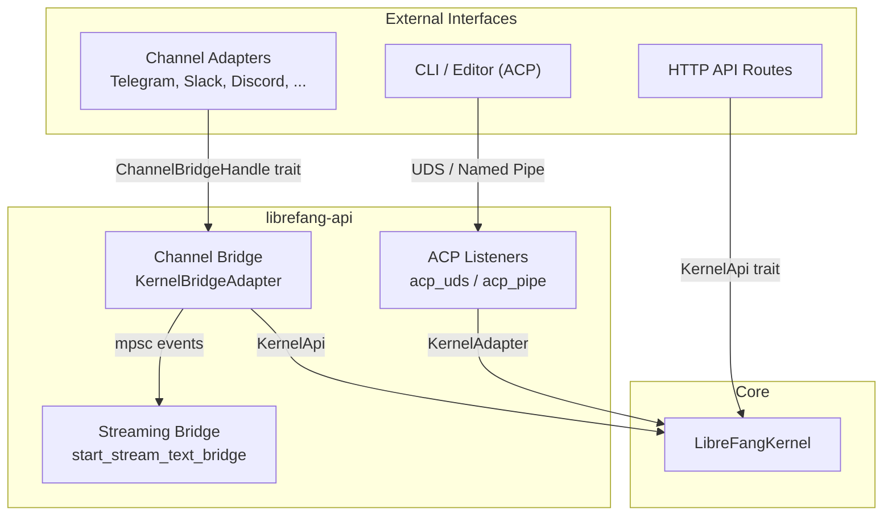

# API Server

# API Server (`librefang-api`)

The API server is the gateway between external interfaces—channel adapters, the ACP protocol, and HTTP routes—and the core `LibreFangKernel`. It owns transport-layer security, connection lifecycle, streaming event adaptation, and user-facing error sanitization.

## Architecture Overview



---

## ACP Listeners — Daemon-Attached Protocol

ACP lets multiple CLI/editor sessions share a single long-running daemon kernel. Each connection gets its own `KernelAdapter` backed by the same `LibreFangKernel`, so approval decisions, agent state, and `allow_always` rules persist across sessions.

Both implementations use identical JSON-RPC framing over their respective transports. Only the I/O layer differs.

### Unix Domain Socket (`acp_uds.rs`)

**Entry point:** `run_listener(kernel, sock_path)`

Socket path defaults to `~/.librefang/acp.sock`. The listener loop accepts connections, validates peer credentials, and spawns a per-connection task running `librefang_acp::run_with_transport`.

#### Trust model: same-user, same-host

Two layered defenses prevent cross-user hijacking on multi-user hosts:

1. **Atomic `0o600` bind** — `bind_atomic_owner_only()` binds to a randomized tempfile in the parent directory, `chmod`s it to `0o600`, then `rename`s into the final path. This closes the TOCTOU window between `bind()` and `chmod()` where another local user could `connect()`.

2. **`SO_PEERCRED` UID match** — Every accepted connection's `peer_cred().uid()` is compared against the daemon's `geteuid()`. Mismatches are dropped before any ACP bytes are read.

#### Stale orphan cleanup

On macOS Docker Desktop bind-mount volumes, `rename(2)` succeeds on the host but the source file persists in the container view. `sweep_stale_orphans()` removes `.<stem>.<pid>.<nanos>` tempfiles from previous daemon runs, guarded by:

- **UID equality** — file must be owned by daemon's euid
- **Recency window** — files modified within the last 10 seconds are skipped (protects concurrent bind→rename)
- **PID liveness** — `kill(pid, 0)` probe; only files whose PID returns `ESRCH` are removed

### Windows Named Pipe (`acp_pipe.rs`)

**Entry point:** `run_listener(kernel)`

Pipe name: `\\.\pipe\librefang-acp` (local-only namespace). The CLI side (`librefang-cli::acp::run_pipe_proxy`) hard-codes the same name.

#### Trust model: owner-only DACL

`create_owner_only_instance(first)` builds each pipe instance with SDDL `D:P(A;;GA;;;OW)` — a protected DACL granting `GENERIC_ALL` to the owner only. The `P` flag blocks inheritance from `\\.\pipe\`.

Key details:
- `first_pipe_instance(true)` is set only on the very first instance to prevent name-squatting races during daemon restart
- Every subsequent rebind (after handing a connected pipe to a worker) passes `false`
- `reject_remote_clients(true)` is explicitly set

#### Connection lifecycle

```
create_owner_only_instance(true) → loop {
    await connect()
    spawn handle_connection(connected)
    create_owner_only_instance(false)  // next listener
}
```

### Per-connection handling (both platforms)

`handle_connection` creates a `KernelAdapter`, resolves the default agent (`"assistant"`), splits the stream, adapts tokio↔futures via `tokio_util::compat`, and runs `librefang_acp::run_with_transport`.

---

## Channel Bridge (`channel_bridge.rs`)

The channel bridge connects the kernel to ~40+ messaging platform adapters. `KernelBridgeAdapter` wraps `Arc<dyn KernelApi>` and implements `ChannelBridgeHandle`.

### Streaming Text Bridge

`start_stream_text_bridge_with_status` adapts the kernel's `StreamEvent` channel into a consumer-friendly `mpsc::Receiver<String>`. It handles:

**Tool call filtering** — Some providers emit tool calls as plain text. The bridge detects and suppresses these using `looks_like_tool_call()`, which checks:
- Start-of-text patterns (`[{`, `functions.`, `{"type":"function"}`, etc.)
- Bare JSON tool call objects (`contains_bare_json_tool_call`)
- Tag-based patterns (`<function=`, `<tool>`, `[TOOL_CALL]`, `_PROTO_`)
- Markdown code blocks and backtick-wrapped tool calls

For responses longer than 2000 characters, only start-of-text patterns are applied—natural language that discusses tools shouldn't be suppressed.

**Progress injection** — When `show_progress` is enabled on the agent manifest:
- `🔧 {Pretty Tool Name}` lines appear at each `ToolUseStart`
- `⚠️ {Pretty Tool Name} {localized "failed"}` appears on tool execution errors
- `⚠️ {context warning detail}` appears on `context_warning` phase changes

Progress lines use `\n\n…\n\n` formatting so adjacent markers render with blank-line separation. Tool names within one iteration are deduplicated—repeated calls to the same tool collapse into a single progress line.

**Silent response suppression** — `is_silent_response()` catches `NO_REPLY` / `[[silent]]` sentinels and suppresses them from the output stream.

**Error handling flow** — The status bridge distinguishes:
- **Timeout with partial output** — treated as soft success (user already saw streamed content)
- **Group context errors** — fully suppressed (no leaked internals)
- **DM errors** — sanitized via `sanitize_channel_error()` which maps timeouts, rate limits, auth failures, and content filters to user-friendly messages
- **Kernel panic** — generic "something went wrong" message

### `ChannelBridgeHandle` trait implementation

The `KernelBridgeAdapter` implements the full bridge trait, delegating to kernel APIs:

| Method group | Purpose |
|---|---|
| `send_message*` | Synchronous and streaming message dispatch, with optional `SenderContext` and `ContentBlock` support |
| `find_agent_by_name` / `list_agents` / `spawn_agent_by_name` | Agent registry queries |
| `reset_session` / `reboot_session` / `compact_session` | Session lifecycle, scoped by agent or channel session |
| `set_model` / `stop_run` / `session_usage` | Runtime controls |
| `list_models_text` / `list_providers_text` / `list_skills_text` | Human-readable catalog summaries |
| `list_workflows_text` / `run_workflow_text` | Workflow engine access |
| `list_triggers_text` / `create_trigger_text` / `delete_trigger_text` | Trigger CRUD |
| `list_schedules_text` / `manage_schedule_text` | Cron job management |
| `list_approvals_text` / `resolve_approval_text` | Approval queue with TOTP verification |
| `classify_reply_intent` | LLM-based reply/no-reply classifier for group chats |
| `channel_overrides` / `agent_channel_overrides` | Per-channel and per-agent configuration |
| `authorize_channel_user` | RBAC check via `auth_manager` |
| `record_delivery` | Delivery tracking and last-channel persistence |
| `budget_text` / `peers_text` / `a2a_agents_text` | Budget, OFP network, and A2A status |

### TOTP approval flow (channel path)

`resolve_approval_text` handles approval/rejection through channel commands (`/approve`, `/reject`). When TOTP is required for a tool:

1. Check lockout status (`is_totp_locked_out`)
2. If recovery code format matches → `vault_redeem_recovery_code` (atomic consume under mutex, prevents #3560/#3943 double-spend)
3. If TOTP code → replay check (`is_totp_code_used`, #3952), then verify, then record consumption
4. Failed attempts atomically check+record via `check_and_record_totp_failure` (#3584)

### Supported channel adapters

All adapters are feature-gated:

- **Wave 1:** Discord, Email, Google Chat, IRC, Matrix, Mattermost, RocketChat, Signal, Slack, Teams, Telegram, Twitch, Voice, Webhook, WhatsApp, XMPP, Zulip
- **Wave 2:** Bluesky, Feishu, Line, Mastodon, Messenger, Reddit, Revolt, Viber
- **Wave 3:** Flock, Guilded, Keybase, Nextcloud, Nostr, Pumble, Threema, Twist, Webex
- **Wave 4:** DingTalk, Discourse, Gitter, Gotify, LinkedIn, Mumble, Ntfy, QQ, WeChat, WeCom

### Reply intent classification

`classify_reply_intent` uses a one-shot LLM call to decide whether a group message is directed at the bot. It constructs a classification prompt with:
- Sanitized message text (truncated to 500 chars, backticks/newlines/brackets stripped)
- Sanitized sender name (64 char limit)
- Bot identity section (name + aliases from agent manifest routing metadata)
- Regex-escaped alias patterns merged into `group_trigger_patterns`

The classifier fails open—if the LLM call errors, the message is treated as requiring a reply.

---

## Supporting Modules

### Approval Re-export (`approval.rs`)

Re-exports `librefang_kernel::approval::ApprovalManager` so API route modules don't depend on kernel internal paths directly. The kernel owns the manager; API routes only call static helpers like `verify_totp_code_with_issuer`.

### Integration Points (from call graph)

The API server connects outward to:

- **`librefang-kernel`** — `KernelApi` trait, `LibreFangKernel`, registries, auth, metering
- **`librefang-acp`** — `KernelAdapter`, `AcpKernel`, `run_with_transport`
- **`librefang-channels`** — `BridgeManager`, `ChannelBridgeHandle`, adapter types, `AgentRouter`, `SidecarAdapter`
- **`librefang-types`** — Agent/Session/Model types, i18n, config structs, event types
- **`librefang-http`** — TLS config, proxy-aware HTTP client builders
- **`librefang-runtime`** — Provider health probing, plugin management, silent response detection

### Key design invariants

1. **No raw error leakage to channels** — All kernel/LLM errors pass through `sanitize_channel_error` before reaching end users
2. **TOCTOU-free socket creation** — Atomic bind-chmod-rename on Unix; owner-only DACL on Windows
3. **TOTP atomicity** — Recovery code redemption and lockout recording are mutex-protected to prevent concurrent double-spend
4. **Fail-open classification** — Reply intent and provider probing default to permissive on errors, avoiding silent message drops
5. **Streaming deduplication** — Tool progress lines are deduplicated within an iteration but re-emit across iteration boundaries