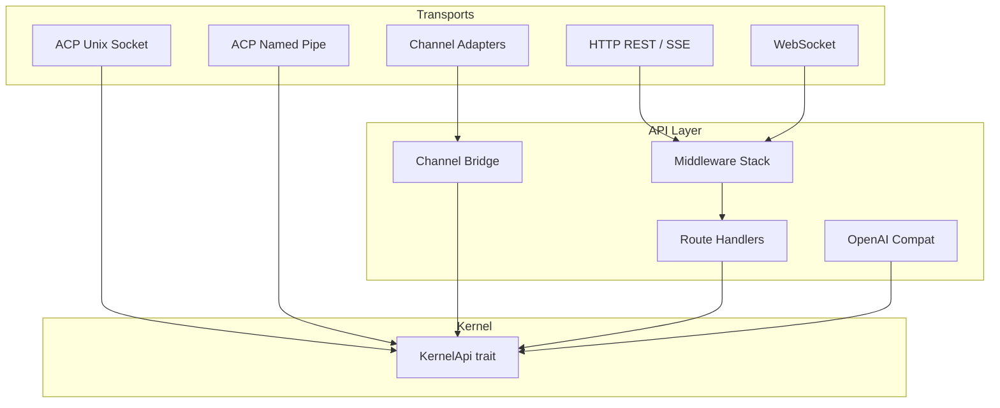

# API Server

# librefang-api — API Server

The API server crate exposes the LibreFang kernel to external clients through multiple transport mechanisms: HTTP REST routes, WebSocket connections, OpenAI-compatible streaming endpoints, channel adapters (Telegram, Slack, Discord, etc.), and Agent Client Protocol (ACP) sockets for daemon-attached editor integration.

## Architecture



The crate does not own any business logic. Every route handler and bridge method delegates to `librefang_kernel` through the `KernelApi` trait, keeping the API layer a thin transport and serialization boundary.

## Transport Layers

### HTTP REST + SSE

Route handlers in `src/routes/` cover agent management, messaging (synchronous and streaming via SSE), configuration, skills, triggers, schedules, workflows, users, webhooks, backups, and network peers. Routes extract an `AppState` (containing an `Arc<dyn KernelApi>`) and an optional `AuthenticatedApiUser` from middleware, then call kernel methods and serialize responses.

### WebSocket (`ws.rs`)

Bidirectional WebSocket connections support real-time chat with streaming responses. The handler classifies errors via `classify_streaming_error` and manages text message routing through the kernel's streaming API.

### OpenAI-Compatible Endpoint (`openai_compat.rs`)

Provides an `/v1/chat/completions`-style streaming endpoint that maps LibreFang's streaming events into OpenAI SSE chunks (`OaiToolCallFunction` structures), enabling third-party tooling to drive the kernel without bespoke integration.

### ACP Listeners

ACP enables editor integrations (VS Code, Neovim, etc.) to connect to a long-running daemon process, sharing a single kernel across multiple editor tabs. The wire protocol is JSON-RPC over a byte-stream transport, handled by `librefang_acp::run_with_transport`.

Two platform-specific implementations exist, both sharing the same trust model: **same-user, same-host**.

#### Unix Domain Sockets (`acp_uds.rs`, `cfg(unix)`)

Listens on `~/.librefang/acp.sock`. Each accepted connection gets an isolated `KernelAdapter` backed by the shared kernel.

**Security layers:**

1. **Atomic bind with mode `0o600`** — Binds to a randomized tempfile (`.acp.sock.<pid>.<nanos>`), `chmod`s to `0o600`, then `rename`s into place. This closes the TOCTOU window between `bind()` and `chmod()` where another local user could connect to a world-readable socket.

2. **`SO_PEERCRED` peer-uid match** — Every accepted connection's `peer_cred().uid()` is compared against the daemon's `geteuid()`. Mismatches are dropped before any ACP bytes are read.

**Stale socket cleanup** (`sweep_stale_orphans`):

On macOS Docker Desktop bind-mount volumes, `rename(2)` can leave orphan tempfiles visible in the container. The sweep runs after each successful bind and removes matching `.acp.sock.<pid>.<nanos>` files under three guards:

| Guard | Purpose |
|-------|---------|
| UID equality | Never delete files owned by another user |
| Recency window (10s) | Protect concurrent daemon's in-flight tempfile |
| PID liveness (`kill(pid, 0)`) | Only remove files whose process is dead (`ESRCH`) |

#### Windows Named Pipes (`acp_pipe.rs`, `cfg(windows)`)

Listens on `\\.\pipe\librefang-acp`. Windows named pipes require a different accept pattern: the server creates one pipe instance, awaits a connect, then immediately creates the next instance so subsequent connections aren't blocked.

**Security:**

An explicit DACL built from SDDL `D:P(A;;GA;;;OW)` grants `GENERIC_ALL` only to the pipe's owner (the daemon's user SID). The `P` flag blocks DACL inheritance from the parent `\\.\pipe\` namespace. This is stricter than the default DACL, which grants `GENERIC_READ`/`GENERIC_WRITE` to any local user.

`first_pipe_instance(true)` is set only on the very first instance after process start. This prevents a name-squatting race where a local attacker creates a pipe with the same name between the old daemon crashing and the new one starting. Subsequent rebinds pass `false` because the flag would reject an already-bound name.

## Channel Bridge (`channel_bridge.rs`)

`KernelBridgeAdapter` wraps `Arc<dyn KernelApi>` to implement the `ChannelBridgeHandle` trait from `librefang_channels`. This is the glue between channel adapters (Telegram, Slack, Discord, WhatsApp, and 30+ others) and the kernel.

### Streaming Bridge

`start_stream_text_bridge_with_status` bridges the kernel's `mpsc::Receiver<StreamEvent>` into a consumer-friendly `mpsc::Receiver<String>` suitable for channel delivery. It handles:

- **Tool call leak suppression** — Some providers emit tool calls as plain text. The bridge buffers text per iteration and flushes at `ContentComplete` only if `looks_like_tool_call` returns false. Detection covers JSON arrays/objects, XML-style function tags (`<function=...>`), markdown code blocks containing tool calls, and backtick-wrapped invocations. Long responses (>2000 chars) only match start-of-text patterns to avoid false positives on natural language that references tools.

- **Progress indicators** — When `show_progress` is enabled (per-agent manifest), tool invocations inject `🔧 Tool Name` lines and failures inject `⚠️ Tool Name failed` (localized). Tool names are deduplicated within a single iteration so batch agents making parallel calls to the same tool show one line, not twenty.

- **Context warnings** — `PhaseChange` events with phase `"context_warning"` are surfaced inline so users know quality may degrade.

- **Silent response handling** — `NO_REPLY` / `[[silent]]` markers from the kernel are suppressed entirely.

- **Error sanitization** — `sanitize_channel_error` maps raw driver errors (timeouts, rate limits, auth failures, content filters) into user-friendly messages. In group contexts, all errors are suppressed to avoid leaking technical details.

- **Status reporting** — Returns a `oneshot::Receiver<Result<(), String>>` so callers can drive lifecycle reactions and `record_delivery` metrics. Timeout-with-partial-output is treated as soft success to avoid flipping a useful streamed response to a failure state.

### Tool Call Detection

The `looks_like_tool_call` family of functions provides multi-layer heuristic detection:

| Pattern | Example |
|---------|---------|
| Start-of-text JSON array | `[{...` or `{"type":"function"...` |
| Tag-based | `<function=...>`, `<tool>`, `[TOOL_CALL]`, `lette` (Unicode) |
| Named JSON in markdown blocks | ````tool_name\n{...}``` |
| Named JSON in backticks | `` `tool_name {...}` ` |
| Bare JSON objects with tool keys | `{"name": "...", "arguments": {...}}` |

`looks_like_named_json_tool_call` validates that the prefix before `{` looks like a tool name (alphanumeric + `_-.:/`) and that the JSON body parses with recognizable keys (`name`, `function`, `arguments`, `parameters`, etc.).

### Slash Command Surface

`KernelBridgeAdapter` exposes a large text-based command surface for channel interactions:

- **Agent management**: `find_agent_by_name`, `list_agents`, `spawn_agent_by_name`, `set_model`, `stop_run`
- **Session management**: `reset_session`, `reboot_session`, `compact_session`, `session_usage` (with per-channel scoped variants)
- **Automation**: `list_workflows_text`, `run_workflow_text`, `list_triggers_text`, `create_trigger_text`, `delete_trigger_text`, `list_schedules_text`, `manage_schedule_text`
- **Approvals**: `list_approvals_text`, `resolve_approval_text` — with TOTP verification, recovery code redemption (atomic via `vault_redeem_recovery_code` to prevent concurrent double-spend), replay protection (`record_totp_code_used`), and lockout tracking
- **System**: `uptime_info`, `list_models_text`, `list_providers_text`, `list_skills_text`, `list_hands_text`, `budget_text`, `peers_text`, `a2a_agents_text`

### Reply Intent Classification

`classify_reply_intent` uses a one-shot LLM call to determine whether a group message is directed at the bot. Inputs are truncated and sanitized (backticks, brackets, newlines stripped) to reduce injection surface. The classifier fails open — if the LLM call fails, the message is treated as directed at the bot.

### Channel Overrides

`channel_overrides` looks up per-channel configuration (message debounce, group trigger patterns, default agent) and merges routing aliases from the default agent's manifest into `group_trigger_patterns`. Aliases are regex-escaped with word boundaries for ASCII names and plain substring matching for CJK.

## Supporting Modules

| Module | Purpose |
|--------|---------|
| `middleware.rs` | `AuthenticatedApiUser` and `ApiUserAuth` extract and validate API key / session credentials |
| `rate_limiter.rs` | `AuthRateLimitState` enforces per-user request throttling |
| `oauth.rs` | `ResolvedProvider` handles OAuth provider resolution and token storage |
| `validation.rs` | `check_identifier`, `check_json_depth` — input validation for route parameters |
| `stream_chunker.rs` | `try_flush` handles SSE chunking with code-fence force-close at max length |
| `stream_dedup.rs` | Deduplicates concurrent stream events |
| `client_ip.rs` | `resolve_real_client_ip` parses `X-Forwarded-For` and `Forwarded` headers with configurable trusted hops |
| `password_hash.rs` | `hash_password` / `verify_password` for user credential management |
| `webhook_store.rs` | `CreateWebhookRequest` validation and storage |
| `server.rs` | `DaemonInfo` — daemon lifecycle state (PID, socket path, startup time) for stale-daemon detection |
| `terminal.rs` | Process lifecycle management for terminal sessions |
| `webchat.rs` | Embedded dashboard asset resolution |
| `approval.rs` | Re-exports `ApprovalManager` from the kernel so API routes don't depend on internal kernel module paths |

## Feature Flags

Channel adapters are compiled conditionally. The `channel_bridge` module imports each adapter behind its feature flag (`channel-telegram`, `channel-slack`, `channel-discord`, etc.), with wave-based expansion covering 35+ channel types across five waves. The bridge itself is feature-agnostic — it works against the `ChannelBridgeHandle` trait regardless of which adapters are compiled in.

## Testing Patterns

The test suite uses integration tests in `librefang-api/tests/` that spin up full test servers (`start_test_server_with_full_user_configs`, `start_test_server_with_rbac_users`) seeded with hashed user credentials. ACP tests verify atomic bind semantics, stale-file overwrite, orphan sweep with dead/live PID discrimination, and recency-window protection.