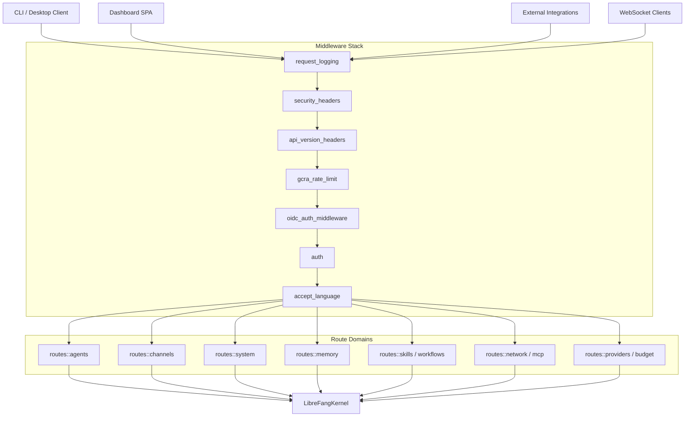

# API Server

# API Server (`librefang-api`)

The HTTP/WebSocket API server that exposes the LibreFang Agent OS daemon to CLI clients, dashboard SPAs, channel adapters, and external integrations. It runs the kernel in-process and serves all management, status, and chat endpoints over JSON REST and WebSocket.

## Architecture



## Entry Points

### `run_daemon()`

The primary entry point called by the CLI's `cmd_start`. It:

1. Parses the listen address and wraps the kernel in `Arc`
2. Starts background agents via `kernel.start_background_agents()`
3. Optionally initializes OpenTelemetry tracing (feature-gated)
4. Calls `build_router()` to construct the full Axum app
5. Spawns background tasks: dashboard asset sync, provider key validation, approval expiry sweep, config hot-reload watcher, model catalog sync, cache GC
6. Writes a `daemon.json` file so the CLI can discover the running daemon
7. Optionally starts the observability stack (Prometheus + Grafana via Docker Compose)
8. Binds with `SO_REUSEADDR` and serves with graceful shutdown

On shutdown (SIGINT, SIGTERM, or API-triggered), it aborts background tasks, removes the daemon info file, stops channel bridges and observability, cleans up tmux sessions, and shuts down the kernel.

### `build_router()`

Constructs the full `Router` without starting the server. Used by `run_daemon()` internally and by `librefang-desktop` for embedded deployments. Returns `(Router, Arc<AppState>)` so callers can access `state.bridge_manager` for cleanup.

## Request Lifecycle

Requests pass through the middleware stack in this order (outermost first):

| Layer | Purpose |
|---|---|
| `CorsLayer` | Allows configured origins (localhost + explicit `cors_origin` from config) |
| `TraceLayer` | Tower-HTTP tracing for request spans |
| `CompressionLayer` | gzip/deflate response compression |
| `request_logging` | Generates `x-request-id`, logs method/path/status/latency, records HTTP metrics |
| `security_headers` | Injects CSP, HSTS, X-Frame-Options, nosniff, no-cache headers |
| `api_version_headers` | Adds `X-API-Version` response header; rejects unknown vendor media types with 406 |
| `gcra_rate_limit` | Per-IP GCRA rate limiting (configurable `api_requests_per_minute`) |
| `oidc_auth_middleware` | External OAuth/OIDC token validation |
| `auth` | Bearer token, session cookie, and per-user API key validation |
| `accept_language` | Parses `Accept-Language`, sets `Content-Language` response header |

## Authentication and Authorization

The auth system supports multiple methods that can be combined:

### Static API Key

The `api_key` field in `config.toml`. Passed via `Authorization: Bearer <key>` or `X-API-Key` header. Validated with constant-time comparison (`subtle`). When empty, auth is disabled entirely (open development mode).

### Dashboard Session Tokens

Username/password login at `POST /api/auth/dashboard-login` returns a randomly generated session token. Tokens are stored in memory (`active_sessions`) and persisted to `sessions.json` for restart survival. Session cookies are scoped to `Path=/dashboard` and get the `Secure` attribute automatically when the request arrives over HTTPS (detected via `X-Forwarded-Proto`).

### Per-User API Keys

Individual users with hashed API keys and assigned roles. The middleware verifies the key against Argon2id hashes and enforces role-based ACL:

| Role | GET | Agent messages/clone/approvals | All other writes | Config/users/shutdown |
|---|---|---|---|---|
| `Owner` | ✅ | ✅ | ✅ | ✅ |
| `Admin` | ✅ | ✅ | ✅ | ❌ |
| `User` | ✅ | ✅ | ❌ | ❌ |
| `Viewer` | ✅ | ❌ | ❌ | ❌ |

### OAuth/OIDC

External identity provider integration with endpoints for login redirect, callback, userinfo, introspection, and token refresh.

### `require_auth_for_reads`

When any auth method is configured, the server auto-enables read authentication for dashboard data endpoints (agents, config, budget, sessions, approvals, etc.) unless the operator explicitly sets `require_auth_for_reads = false`. The derivation logic in `derive_require_auth_for_reads()`:

- `None` (default) → `true` if any auth is configured, `false` otherwise
- `Some(true)` → always require auth (even without auth configured — warns on startup)
- `Some(false)` → never require auth for reads (for external auth proxy setups)

Always-public endpoints that bypass this flag: `/api/health`, static assets, auth flow entry points, `/api/versions`.

### Credential Resolution

`resolve_dashboard_credential()` resolves config values with this priority:

1. Environment variable (e.g. `LIBREFANG_DASHBOARD_USER`)
2. `vault:KEY` syntax — reads from the encrypted credential vault
3. Literal value from `config.toml`

## Route Structure

All API routes are defined in `api_v1_routes()` and mounted at both `/api` and `/api/v1` for backward compatibility. Future versions can be added as separate routers.

| Route Domain | Prefix | Module |
|---|---|---|
| Configuration | `/api/config` | `routes::config` |
| Agents | `/api/agents` | `routes::agents` |
| Channels | `/api/channels` | `routes::channels` |
| System | `/api/system` | `routes::system` |
| Memory | `/api/memory` | `routes::memory` |
| Workflows | `/api/workflows` | `routes::workflows` |
| Skills | `/api/skills` | `routes::skills` |
| Network/A2A | `/api/network`, `/a2a` | `routes::network` |
| Plugins | `/api/plugins` | `routes::plugins` |
| Providers | `/api/providers` | `routes::providers` |
| Budget | `/api/budget` | `routes::budget` |
| Auto-dream | `/api/auto-dream` | `routes::auto_dream` |
| Goals | `/api/goals` | `routes::goals` |
| Inbox | `/api/inbox` | `routes::inbox` |
| Media | `/api/media` | `routes::media` |
| Prompts | `/api/prompts` | `routes::prompts` |
| Terminal | `/api/terminal` | `routes::terminal` |
| Auth | `/api/auth/*` | inline in `server.rs` + `oauth` |

Non-API routes:
- `GET /` — WebChat dashboard SPA
- `GET /dashboard/*` — React dashboard assets
- `POST /v1/chat/completions`, `GET /v1/models` — OpenAI-compatible API
- `POST /hooks/wake`, `POST /hooks/agent` — Webhook triggers (unversioned)
- `POST /mcp` — MCP HTTP endpoint
- `* /channels/*` — Dynamic channel webhook routes (bypass auth; external platforms verify signatures)

## Background Tasks

Spawned during `run_daemon()`, tracked via `JoinHandle` and aborted on shutdown:

| Task | Interval | Purpose |
|---|---|---|
| Dashboard asset sync | Once | Downloads/updates SPA bundle from release |
| Provider key validation | Once | Validates API keys so dashboard shows status |
| Approval expiry sweep | 10s | Resolves expired pending approval requests |
| Config hot-reload | 30s | Polls `config.toml` mtime, reloads on change, restarts channel bridges if needed |
| Model catalog sync | 24h | Syncs community model catalog, reloads catalog in memory |
| API cache GC | 5m | Evicts expired clawhub/skillhub cache entries (120s TTL) and expired session tokens |

## Session Persistence

Sessions are stored in `sessions.json` in the home directory. On load, expired sessions are pruned. On write (login, logout, GC), the full map is serialized. The file is deleted on password change to force re-login.

Key functions:
- `load_sessions()` — reads and filters expired tokens
- `save_sessions()` — serializes current sessions
- `clear_sessions_file()` — removes the file entirely

## Daemon Discovery

`DaemonInfo` is written to `~/.librefang/daemon.json` on startup with PID, listen address, start time, version, and platform. The CLI reads this via `read_daemon_info()` to find running daemons. On startup, stale PID files are detected by checking if the process is alive (`kill -0` on Unix, `tasklist` on Windows) and the port is responding (TCP connect). File permissions are restricted to owner-only (0600 on Unix).

## OpenAPI Specification

Auto-generated via `utoipa` from handler annotations and schema derives. Available at `GET /api/openapi.json`. The `ApiDoc` struct in `openapi.rs` collects all annotated handlers into an OpenAPI 3.1 document.

## Password Change Flow

`POST /api/auth/change-password` verifies the current password, validates the new credentials (password ≥ 8 chars, username ≥ 2 chars), writes updated fields to `config.toml`, triggers a kernel config reload, updates the in-memory API key lock, and invalidates all sessions.

## Observability Stack

When `telemetry.enabled = true` in config and Docker is available, `run_daemon()` attempts to start Prometheus (port 9090) and Grafana (port 3000) via `docker compose`. The compose file is located relative to the executable at `deploy/docker-compose.observability.yml`.

## Submodule Overview

| Module | Responsibility |
|---|---|
| `channel_bridge` | Starts/manages channel adapters (Telegram, etc.); webhook-based adapters register routes |
| `middleware` | Auth, logging, security headers, rate limiting, i18n, version headers |
| `oauth` | OAuth/OIDC provider configuration, login flow, callback handling |
| `openai_compat` | OpenAI-compatible `/v1/chat/completions` and `/v1/models` endpoints |
| `openapi` | utoipa-based OpenAPI spec generation |
| `password_hash` | Argon2id hashing, session token derivation, verification with legacy fallback |
| `rate_limiter` | GCRA-based per-IP rate limiting |
| `routes` | All route handlers organized by domain |
| `stream_chunker` | Splits streaming LLM output into logical chunks |
| `stream_dedup` | Deduplicates streaming chunks across retries/reconnects |
| `terminal` | PTY-based terminal session management |
| `terminal_tmux` | tmux-backed terminal multiplexing |
| `types` | Shared API types (request/response structs) |
| `validation` | Input validation helpers with i18n error responses |
| `versioning` | API version resolution from path and Accept headers |
| `webchat` | Dashboard SPA serving, asset sync, locale files |
| `webhook_store` | Persistent webhook registration with URL validation and SSRF protection |
| `ws` | WebSocket handler for agent chat with origin validation and slot limits |
| `telemetry` | OpenTelemetry OTLP tracing init and Prometheus metrics (feature-gated) |

## Adding New Routes

1. Create a `router()` function in the appropriate submodule under `routes/`
2. Add `Router::new().merge(routes::your_domain::router())` to `api_v1_routes()` in `server.rs`
3. Annotate handlers with `#[utoipa::path]` and add them to the `paths()` list in `openapi.rs`
4. The route will automatically be available at both `/api/your-endpoint` and `/api/v1/your-endpoint`

## Embedding

Desktop and test consumers use `build_router()` directly instead of `run_daemon()`:

```rust
let kernel = Arc::new(kernel);
let (router, state) = build_router(kernel, addr).await;
// Use `state.bridge_manager` for cleanup on exit
```