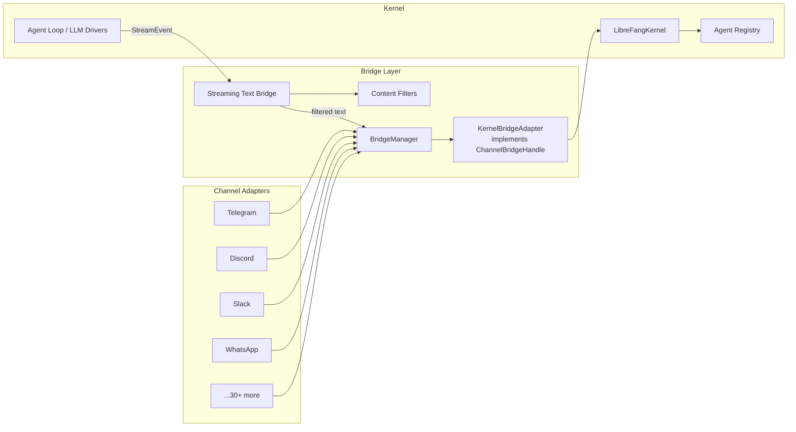

# API Server

# Channel Bridge (`channel_bridge.rs`)

The channel bridge is the glue layer between the LibreFang kernel (the core agent runtime) and the outside world. It translates kernel operations — sending messages, streaming tokens, managing sessions — into calls that channel adapters (Telegram, Discord, Slack, WhatsApp, and 30+ others) can consume, and it shields end users from leaking raw technical details like stack traces, internal tool-call JSON, or driver error codes.

## Architecture



The daemon calls `start_channel_bridge()` at boot. That function reads the `ChannelsConfig`, instantiates every adapter whose feature flag is enabled and whose credentials are present, wraps the kernel in `KernelBridgeAdapter`, and hands everything to `BridgeManager` which runs the adapters' event loops.

## Key Components

### `KernelBridgeAdapter`

A thin wrapper around `Arc<LibreFangKernel>` that implements the `ChannelBridgeHandle` trait defined in `librefang_channels::bridge`. It is the single point where channel adapters touch the kernel.

**Core messaging methods:**

| Method | Purpose |
|--------|---------|
| `send_message` | Non-streaming turn. Returns the agent's full response. Returns empty string for silent/NO_REPLY turns. |
| `send_message_streaming` | Streaming turn. Returns an `mpsc::Receiver<String>` of filtered text chunks. |
| `send_message_streaming_with_sender` | Same, but carries `SenderContext` (is_group, sender identity). |
| `send_message_streaming_with_sender_status` | Streaming with a `oneshot::Receiver<Result<(), String>>` for the kernel's terminal status — used by adapters that need lifecycle reactions and accurate delivery metrics. |
| `send_message_with_blocks` | Handles multimodal input (images, files) by extracting text for memory/logging and passing `ContentBlock`s to the kernel. |
| `send_message_ephemeral` | Sends a message that is excluded from session history. |
| `send_channel_push` | Pushes a message outbound to a specific channel/recipient — used by cron delivery and workflow outputs. |

**Administrative methods** (all return human-readable text for channel `/commands`):

- `list_agents`, `find_agent_by_name`, `spawn_agent_by_name`
- `list_models_text`, `list_providers_text`, `list_models_by_provider`
- `list_skills_text`, `list_hands_text`
- `list_workflows_text`, `run_workflow_text`
- `list_triggers_text`, `create_trigger_text`, `delete_trigger_text`
- `list_schedules_text`, `manage_schedule_text` (add/del/run)
- `list_approvals_text`, `resolve_approval_text`
- `budget_text`, `session_usage`
- `reset_session`, `reboot_session`, `compact_session`
- `set_model`, `stop_run`
- `uptime_info`, `peers_text`, `a2a_agents_text`

### Streaming Text Bridge

`start_stream_text_bridge_with_status` spawns two concurrent tasks:

1. **Bridge task** — reads `StreamEvent`s from the kernel, buffers text per iteration, applies content filters, and forwards clean text through an `mpsc::Sender<String>`.
2. **Status task** — awaits the kernel's `JoinHandle`, then sends a sanitized error message through the text channel if the kernel failed, and reports terminal status through a `oneshot` channel.

The streaming bridge is where most of the user-facing intelligence lives. It handles:

- **Iteration buffering**: Text is held until `ContentComplete` fires, then flushed only if it passes the tool-call filter.
- **Tool progress markers**: `🔧 Tool Name` lines injected when `show_progress` is true. Duplicate tool invocations within a single iteration are collapsed into one marker.
- **Tool failure markers**: `⚠️ Tool Name failed` (localized via `tr_progress_failed`).
- **Context warnings**: `⚠️ Context window trimmed` surfaced inline when the kernel emits a `context_warning` phase change.
- **Timeout partial output**: When the kernel hits the inactivity timer after producing partial output, a `[Task timed out. The output above may be incomplete.]` footer is appended and status is reported as `Ok(())` (soft success) to avoid a false ❌ lifecycle reaction.

### Content Filtering

The bridge applies three layers of filtering before text reaches a channel:

#### 1. Tool-call leak detection (`looks_like_tool_call`)

Some LLM providers emit tool calls as plain text instead of using the proper tool_use API. The `agent_loop` module recovers these into structured calls, but the text stream would still contain the raw JSON if not filtered.

Detection patterns (applied at `ContentComplete`):

| Pattern | Example |
|---------|---------|
| Start-of-text JSON array | `[{...` |
| `functions.` prefix | `functions.web_search(...)` |
| XML-style tool tags | `<function=...>`, `<tool>`, `[TOOL_CALL]` |
| Gemini-style separators | `ardia` (U+FF62) |
| Markdown code blocks with tool JSON | ````name\n{"name":"..."}``` |
| Backtick-wrapped tool JSON | `` `name {"name":"..."}` `` |
| Bare JSON objects with tool-call shape | `{"name":"web_search","arguments":{...}}` |

Long text (>2000 chars) only matches start-of-text patterns, because natural language that *discusses* tools legitimately contains tool-call-like substrings.

Supporting functions:
- `contains_bare_json_tool_call` — scans for `{...}` spans and checks if they parse as tool-call objects.
- `find_json_object_end` — tracks brace depth and string escapes to find balanced JSON boundaries.
- `looks_like_tool_call_object` — validates that a JSON object has a `name`/`function`/`tool` field with tool-name characters and an `arguments`/`parameters`/`args`/`input` field.
- `looks_like_tool_name` — allows alphanumeric, `_`, `-`, `.`, `:`, `/`.

#### 2. Silent response suppression

Text matching `NO_REPLY` or `[no reply needed]` sentinels (detected by `librefang_runtime::silent_response::is_silent_response`) is silently dropped so the channel adapter skips sending anything.

#### 3. Error sanitization (`sanitize_channel_error`)

All kernel/driver errors pass through this function before reaching users:

| Error pattern | User-facing message |
|---------------|-------------------|
| Timeout / inactivity | "The task timed out due to inactivity. Try breaking it into smaller steps." |
| Rate limit / 429 / quota | "I've hit my usage limit and need to rest. I'll be back soon!" |
| Auth / 401 | "I'm having trouble with my credentials. Please let the admin know." |
| Content filter / safety | "I can't help with that — the request was blocked by the model's safety filter." |
| Driver crash / exit code | "Sorry, something went wrong on my end. Please try again in a moment." |
| Other | "Something went wrong: please try again. (ref: {first 80 chars})" |

Group chats suppress **all** error messages to avoid leaking any technical detail publicly.

### Channel Adapter Startup

`start_channel_bridge_with_config` is the main entry point. It:

1. Checks each channel config field against the compiled feature flags. Configured channels whose feature is not enabled emit a warning and are skipped.
2. Creates a `KernelBridgeAdapter` wrapping the kernel.
3. Instantiates adapters for each configured channel, reading tokens from environment variables via `read_token`.
4. Collects all adapters into a `Vec<(Arc<dyn ChannelAdapter>, Option<String>, Option<String>)>` — adapter, default_agent_name, account_id.
5. Returns `(Option<BridgeManager>, Vec<String>, axum::Router)` where the router contains webhook routes for webhook-based channels (Feishu, Teams, LINE, etc.).

**Multi-account support**: Many channel configs are `Vec<ChannelConfig>` — each entry can have a different `account_id`, `default_agent`, and token. The bridge instantiates a separate adapter for each.

**Sidecar channels**: Channels defined in `sidecar_channels` config are loaded separately via `SidecarAdapter` and are not feature-gated.

### Reply Intent Classification (`classify_reply_intent`)

For group chats where the bot shouldn't respond to every message, the bridge can run an LLM-based classifier. It constructs a prompt asking the model to output `REPLY` or `NO_REPLY`, then:

- Sanitizes both `message_text` and `sender_name` (user-editable on most platforms) to reduce prompt injection surface — strips backticks, brackets, newlines, and truncates.
- Includes bot name and aliases from agent manifest `routing.aliases` / `routing.weak_aliases`.
- Fails open: if the LLM call errors, the message is treated as `REPLY`.

### Authorization (`authorize_channel_user`)

When the RBAC auth manager is enabled, channel actions are gated:

| Action string | `auth::Action` |
|---------------|----------------|
| `chat` | `ChatWithAgent` |
| `spawn` | `SpawnAgent` |
| `kill` | `KillAgent` |
| `install_skill` | `InstallSkill` |

The auth manager maps `(channel_type, platform_id)` to an internal user ID, then checks the action against that user's permissions.

### Approval Workflow (`resolve_approval_text`)

When an agent requests a gated tool (e.g., file deletion, shell execution), the approval must be resolved through the channel. The bridge:

1. Looks up the pending approval by ID prefix.
2. If the tool requires TOTP:
   - Checks lockout status first (`is_totp_locked_out`).
   - Validates TOTP codes with replay protection (`is_totp_code_used` / `record_totp_code_used`).
   - Validates recovery codes via atomic redemption (`vault_redeem_recovery_code`) to prevent concurrent double-use.
   - Records failures atomically (`check_and_record_totp_failure`) — fail-secure: if the DB is wedged, the user is locked out rather than granted unlimited tries.
3. Calls `kernel.approvals().resolve()` with the decision and TOTP verification status.

### Delivery Tracking (`record_delivery`)

After a channel adapter sends a response, it calls back with success/failure. The bridge:

- Records the delivery receipt via `kernel.delivery().record()` for metrics.
- On success, persists the last channel + recipient + thread_id to `delivery.last_channel` in structured memory, so cron jobs with `CronDelivery::LastChannel` can target the right destination after restarts.

### Channel Overrides

`channel_overrides` resolves per-channel configuration (trigger patterns, default agents) by looking up the channel config entry matching the given `channel_type` and optional `account_id`. It also merges routing aliases from the default agent's manifest into `group_trigger_patterns`, with proper regex escaping and ASCII-aware word boundary handling.

### Utility Functions

- **`prettify_tool_name`**: Converts `web_search_v2` → "Web Search V2", `MCP_call` → "MCP Call" (preserves existing uppercase after the first character).
- **`tr_progress_failed`**: Returns the localized word for "failed" in tool-failure progress lines (supports zh-CN, es, ja, de, fr, en).
- **`parse_trigger_pattern`**: Converts chat-friendly pattern strings (`lifecycle`, `spawned:name`, `memory:key`, `match:text`, `all`) into `TriggerPattern` enums.

## Error Handling Strategy

The bridge implements a layered error strategy:

1. **Kernel errors** are caught by the status task, sanitized via `sanitize_channel_error`, and appended to the text stream as a final message.
2. **Group vs DM**: In group chats, all error messages are suppressed to prevent leaking technical details publicly. In DMs, rate-limit messages with reset times are shown verbatim when they contain actionable information.
3. **Timeout with partial output** is treated as soft success (`Ok(())`) — the user already saw streamed content, so flipping to an error state would be a UX regression.
4. **Kernel panics** produce a generic "something went wrong" message and are reported as `Err` in the status channel.

## Feature Flags

Every channel adapter is behind a Cargo feature flag (`channel-telegram`, `channel-discord`, etc.). At compile time, only adapters whose features are enabled are included. At runtime, the `check_channel!` macro emits a warning for any channel that is configured in `config.toml` but whose feature was not compiled in. This ensures the binary can be slimmed down to only the channels actually needed.

## Adding a New Channel Adapter

1. Create the adapter in `librefang-channels` implementing `ChannelAdapter`.
2. Add a `channel-<name>` feature flag to `Cargo.toml`.
3. Add the config struct to `ChannelsConfig` in `librefang-types`.
4. Add a `#[cfg(feature = "channel-<name>")]` import block and instantiation block in `start_channel_bridge_with_config`, following the existing pattern (read token, build adapter, push to `adapters` vec).
5. Add the channel name to the `channel_overrides` match statement.