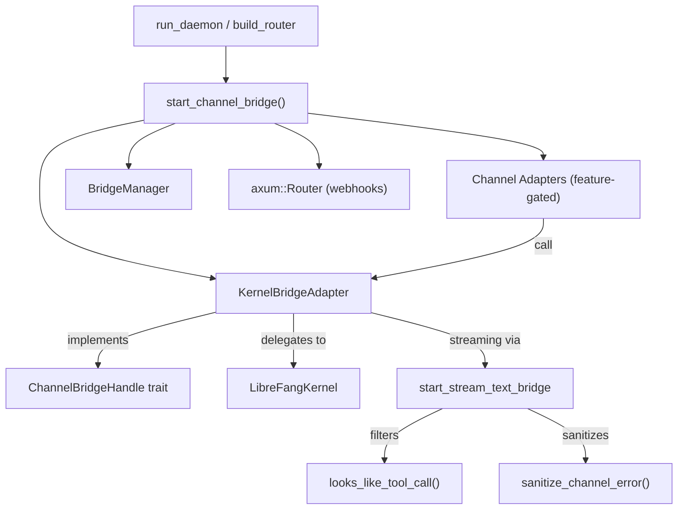

# API Server

# Channel Bridge (`channel_bridge.rs`)

## Purpose

The channel bridge connects the LibreFang kernel to external messaging platforms. It translates kernel operations—agent message handling, session management, automation, authorization—into a unified interface that channel adapters consume, and it transforms raw kernel/LLM output into user-safe text suitable for delivery over WhatsApp, Telegram, Slack, and dozens of other channels.

The daemon calls `start_channel_bridge()` during startup (from `build_router` in `server.rs`). That function reads the configuration, instantiates the appropriate adapters behind feature gates, wires them into a `BridgeManager`, and returns an `axum::Router` for webhook-based channels.

## Architecture



## Key Components

### `KernelBridgeAdapter`

Wraps an `Arc<LibreFangKernel>` and implements the `ChannelBridgeHandle` trait from `librefang_channels::bridge`. Every method delegates to the kernel and formats the result for channel delivery:

- **Message sending** — `send_message`, `send_message_with_blocks`, `send_message_with_sender`, and their streaming counterparts all route through the kernel's agent loop. Silent responses (`result.silent == true`) return an empty string so the bridge skips delivery.
- **Streaming** — `send_message_streaming` and `send_message_streaming_with_sender` open a kernel streaming session and pipe `StreamEvent`s through `start_stream_text_bridge`, which filters leaked tool calls and injects progress markers.
- **Agent management** — `find_agent_by_name`, `list_agents`, `spawn_agent_by_name` (loads `agent.toml` from `~/.librefang/workspaces/agents/{name}/`).
- **Session control** — `reset_session`, `reboot_session`, `compact_session`, `set_model`, `stop_run`, `session_usage`.
- **Automation** — workflow listing/execution, trigger CRUD, schedule CRUD, approval resolution with TOTP support.
- **Introspection** — `list_models_text`, `list_providers_text`, `list_skills_text`, `list_hands_text`, `budget_text`, `peers_text`, `a2a_agents_text`.
- **Authorization** — `authorize_channel_user` checks RBAC via `kernel.auth_manager()`.
- **Delivery tracking** — `record_delivery` persists success/failure and stores the last channel for cron's `CronDelivery::LastChannel`.

### Streaming Text Bridge

`start_stream_text_bridge` and `start_stream_text_bridge_with_status` create an async pipeline that consumes `StreamEvent`s from the kernel and produces a `mpsc::Receiver<String>` of user-facing text chunks.

**Event handling logic:**

| Event | Behavior |
|---|---|
| `TextDelta` | Accumulates into `iter_buf` |
| `ContentComplete` | Flushes `iter_buf` unless it's a leaked tool call, silent sentinel, or tool-use-adjacent text |
| `ToolUseStart` | Marks `saw_tool_use`, optionally emits `🔧 Tool Name` progress line (controlled by `show_progress`) |
| `ToolExecutionResult` (error) | Emits `⚠️ Tool Name failed` with localized "failed" suffix |
| `PhaseChange` (`context_warning`) | Emits `⚠️ <detail>` to warn about context trimming |

**Error handling after stream drain:**

The spawned monitor task awaits the kernel's `JoinHandle` and:
- For **timeouts with partial output**: appends an incomplete-output notice and reports `Ok(())` status (soft success).
- For **group chats**: suppresses all error messages entirely.
- For **DMs**: shows rate-limit messages verbatim when possible, otherwise passes through `sanitize_channel_error`.
- For **panics**: sends a generic error message.

### Tool Call Detection

`looks_like_tool_call(text)` detects text that leaked from providers that emit tool calls as plain content rather than using proper tool_use APIs. Detection covers:

- JSON-style calls: `[{…}]`, `{"type":"function"…}`
- Tag-based: `<function=…>`, `<tool>`, `[TOOL_CALL]`, Antrophic-style `TbuD` tags
- Backtick-wrapped: `` `tool_name {args}` ``
- Markdown code blocks containing tool JSON

Helper functions `contains_bare_json_tool_call`, `contains_markdown_tool_call`, `contains_backtick_tool_call`, `looks_like_tool_call_object`, and `looks_like_named_json_tool_call` handle the recursive scanning and JSON validation.

### Error Sanitization

`sanitize_channel_error(err)` maps raw technical errors to user-friendly messages:

- Timeout/inactivity → "The task timed out due to inactivity. Try breaking it into smaller steps."
- Rate limits (429, quota, "too many requests") → "I've hit my usage limit and need to rest."
- Auth failures (401) → "I'm having trouble with my credentials."
- Driver crashes ("exited with code", "llm driver") → "Sorry, something went wrong."
- Unknown → "Something went wrong" with first 80 chars as a reference ID.

### Reply Intent Classification

`classify_reply_intent` uses a one-shot LLM call to determine whether a group message is directed at the bot. It sanitizes inputs (truncates, strips backticks/newlines/brackets) to reduce injection surface and fails open (returns `true` on any error). Supports bot name, aliases, and @mentions.

### Channel Override Resolution

`channel_overrides` looks up per-channel configuration (from `ChannelsConfig`) and merges the default agent's routing aliases into `group_trigger_patterns` so aliases trigger the bot in group chats without a formal @mention. Uses `\b` word boundaries for ASCII aliases and plain substring matching for CJK/non-ASCII.

### Localization

`tr_progress_failed(language)` returns the localized word for "failed" in tool-failure progress lines, with support for Chinese, Spanish, Japanese, German, and French. Falls back to English.

`prettify_tool_name(name)` converts `snake_case`, `kebab-case`, and `dotted.tool.ids` into human-readable display names ("Web Search" instead of "web_search"), preserving acronyms.

## Entry Point: `start_channel_bridge`

```rust
pub async fn start_channel_bridge(
    kernel: Arc<LibreFangKernel>,
) -> (Option<BridgeManager>, axum::Router)
```

Called by `build_router` in `server.rs`. Delegates to `start_channel_bridge_with_config` using the kernel's configured `ChannelsConfig`.

`start_channel_bridge_with_config`:

1. Checks which channels have configuration entries and whether the corresponding Cargo feature is enabled. Emits warnings for configured-but-disabled channels.
2. Creates a `KernelBridgeAdapter` wrapping the kernel.
3. For each configured channel with valid credentials (read from env vars via `read_token`), instantiates the feature-gated adapter and pushes it onto the adapter list.
4. Passes all adapters to `BridgeManager` and returns `(Some(BridgeManager), Vec<started_channel_names>, webhook_router)`.

Returns `(None, Vec::new(), empty_router)` when no channels are configured.

## Feature-Gated Adapters

All channel adapters are behind Cargo feature flags. The full set across five waves:

| Wave | Channels |
|---|---|
| 1 | Telegram, Discord, Slack, WhatsApp, Signal, Matrix, Email, Teams, Mattermost, IRC, Google Chat, Twitch, Rocket.Chat, Zulip, XMPP, Voice, Webhook |
| 2 | Bluesky, Feishu/Lark, LINE, Mastodon, Messenger, Reddit, Revolt, Viber |
| 3 | Flock, Guilded, Keybase, Nextcloud, Nostr, Pumble, Threema, Twist, Webex |
| 4 | DingTalk, Discourse, Gitter, Gotify, LinkedIn, Mumble, ntfy, QQ, WeChat, WeCom |

Each adapter follows the same pattern: read token from env var, construct with config parameters, attach `account_id` and `default_agent`, push to adapter list. Sidecar channels are not feature-gated and are always available.

## Trigger Pattern Parsing

`parse_trigger_pattern(s)` converts user-entered pattern strings into `TriggerPattern` variants:

| Input | Pattern |
|---|---|
| `lifecycle` | `TriggerPattern::Lifecycle` |
| `terminated` | `TriggerPattern::AgentTerminated` |
| `spawned:<name>` | `TriggerPattern::AgentSpawned { name_pattern }` |
| `system` | `TriggerPattern::System` |
| `system:<keyword>` | `TriggerPattern::SystemKeyword { keyword }` |
| `memory` | `TriggerPattern::MemoryUpdate` |
| `memory:<key>` | `TriggerPattern::MemoryKeyPattern { key_pattern }` |
| `match:<text>` | `TriggerPattern::ContentMatch { substring }` |
| `all` | `TriggerPattern::All` |

## Approval Resolution with TOTP

`resolve_approval_text` handles the full approval/denial flow:

1. Matches the ID prefix against pending approvals (ambiguous matches are rejected).
2. If the tool requires TOTP (per `policy().tool_requires_totp()`):
   - Checks lockout from too many failed attempts.
   - Accepts either a 6-digit TOTP code (verified against `totp_secret` in vault) or a recovery code (format-detected, verified against `totp_recovery_codes` in vault, single-use invalidation).
3. Calls `kernel.approvals().resolve()` with the decision and TOTP verification state.

## Schedule Management

`manage_schedule_text` handles three sub-actions:

- **`add`** — Expects `<agent> <min> <hour> <dom> <month> <dow> <message...>`, creates a `CronJob` with `CronSchedule::Cron`.
- **`del`** — Removes by ID prefix match.
- **`run`** — Immediately executes the job's action (`AgentTurn`, `SystemEvent`, or `Workflow`), resolving workflow IDs by UUID or name.

## Contributing

When adding a new channel adapter:

1. Add the adapter implementation in `librefang-channels`.
2. Add a feature flag (`channel-<name>`) and conditional import block in this file.
3. Add the config struct field to `ChannelsConfig` in `librefang-types`.
4. Add a `check_channel!` macro invocation and an adapter construction block in `start_channel_bridge_with_config`.
5. Add the channel type string to the `channel_overrides` match block.
6. Ensure the adapter implements `ChannelAdapter` from `librefang_channels::types`.