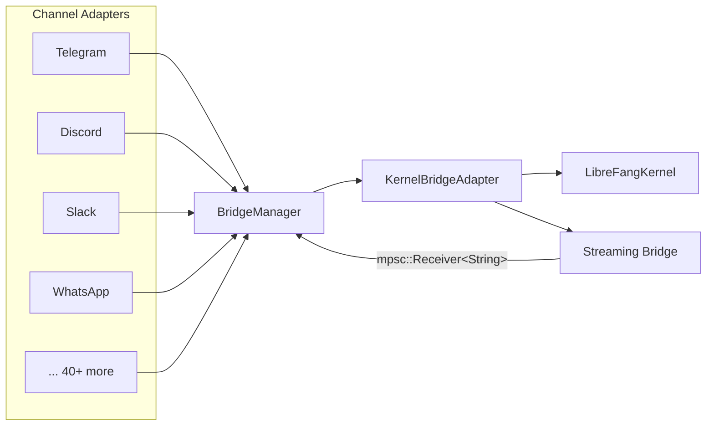
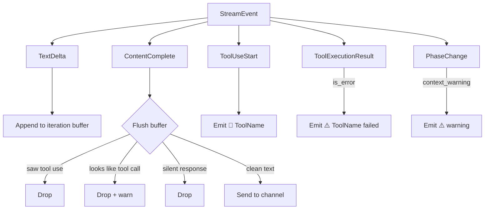

# API Server

# API Server — Channel Bridge

The channel bridge is the wiring layer that connects the LibreFang kernel to external messaging platforms (Telegram, Discord, Slack, WhatsApp, and 40+ others). It translates kernel responses into channel-appropriate messages and insulates end users from internal error details, leaked tool calls, and other LLM artifacts.

## Architecture Overview



The daemon calls `start_channel_bridge()` at startup. This function reads the kernel's `ChannelsConfig`, instantiates an adapter for every configured+enabled channel, and hands them all to a `BridgeManager`. The manager routes inbound messages to the kernel and outbound responses back to the correct channel.

`KernelBridgeAdapter` wraps `Arc<LibreFangKernel>` and implements the `ChannelBridgeHandle` trait — the contract that `BridgeManager` uses to interact with the kernel without depending on kernel internals.

## Entry Points

### `start_channel_bridge(kernel) -> (Option<BridgeManager>, Router)`

Called by the daemon once during startup. Returns:

- `Some(BridgeManager)` if at least one channel was successfully started, `None` otherwise.
- An `axum::Router` containing webhook routes for channels that receive messages via HTTP callbacks (Feishu, Teams, DingTalk, etc.). This router should be mounted under `/channels` on the main API server.

### `start_channel_bridge_with_config(kernel, config) -> (Option<BridgeManager>, Vec<String>, Router)`

Used by hot-reload. Accepts an explicit `ChannelsConfig` rather than reading from the kernel's current config. Also returns a `Vec<String>` of started channel names.

## KernelBridgeAdapter

The central struct implementing `ChannelBridgeHandle`. Every method delegates to `LibreFangKernel` and formats the result for channel delivery.

### Message Sending Methods

| Method | Purpose |
|---|---|
| `send_message` | Basic text send. Returns empty string for silent/NO_REPLY responses. |
| `send_message_with_sender` | Text send with `SenderContext` (includes `is_group` flag). |
| `send_message_with_blocks` | Multi-modal send (text + images). Extracts text from content blocks for memory/logging. |
| `send_message_with_blocks_and_sender` | Blocks + sender context combined. |
| `send_message_ephemeral` | Sends a message that won't be persisted in conversation history. |
| `send_message_streaming` | Returns `mpsc::Receiver<String>` for real-time text delivery. |
| `send_message_streaming_with_sender` | Streaming with sender context (group/DM awareness). |
| `send_message_streaming_with_sender_status` | Streaming with sender context **and** a oneshot channel that resolves to the kernel's final `Result`. Used for accurate delivery tracking and lifecycle reactions. |

All methods return `Ok("")` when the agent chooses silence (`result.silent == true`), preventing literal "NO_REPLY" text from reaching users.

### Agent Management

| Method | Purpose |
|---|---|
| `find_agent_by_name` | Look up an `AgentId` by display name. |
| `list_agents` | List all non-hand agents. |
| `spawn_agent_by_name` | Load an `agent.toml` manifest from `~/.librefang/workspaces/agents/{name}/` and spawn it. |
| `get_agent_group_trigger_patterns` | Returns regex patterns from agent manifest's `channel_overrides.group_trigger_patterns`. |

### Session Control

| Method | Purpose |
|---|---|
| `reset_session` | Clear chat history. |
| `reboot_session` | Clear full context (stronger than reset). |
| `compact_session` | Summarize and compress context to free token budget. |
| `set_model` | Switch agent's active model at runtime. With empty arg, shows current model. |
| `stop_run` | Cancel an in-progress agent turn. |
| `session_usage` | Report token counts and estimated cost for current session. |
| `set_thinking` | Toggle extended thinking (stored preference, model-dependent). |

### Automation

| Method | Purpose |
|---|---|
| `list_workflows_text` | Human-readable workflow listing. |
| `run_workflow_text` | Execute a workflow by name with input text. |
| `list_triggers_text` / `create_trigger_text` / `delete_trigger_text` | CRUD for event triggers. |
| `list_schedules_text` / `manage_schedule_text` | List and manage cron jobs (add/del/run). |
| `list_approvals_text` / `resolve_approval_text` | View and approve/reject pending tool approvals with optional TOTP. |

### Observability & Configuration

| Method | Purpose |
|---|---|
| `uptime_info` | Uptime duration and active agent count. |
| `list_models_text` / `list_providers_text` | Model and provider catalogs grouped by provider. |
| `list_skills_text` | Installed skills with runtime type and tool count. |
| `list_hands_text` | Available hand definitions and active instances. |
| `budget_text` | Hourly/daily/monthly spend against configured limits. |
| `peers_text` | Connected OFP peer network nodes. |
| `a2a_agents_text` | Discovered external A2A (agent-to-agent) endpoints. |
| `channel_overrides` | Channel-type-specific overrides (debounce timing, trigger patterns, etc.). Merges agent routing aliases into `group_trigger_patterns` so bot nicknames trigger responses without @mentions. |
| `agent_channel_overrides` | Per-agent channel overrides from agent manifest. |

### Other

| Method | Purpose |
|---|---|
| `authorize_channel_user` | RBAC check for chat/spawn/kill/install_skill actions. |
| `record_delivery` | Track delivery success/failure and persist last-channel for cron `CronDelivery::LastChannel`. |
| `check_auto_reply` | Check if auto-reply rules fire for a given message and execute if so. |
| `subscribe_events` | Subscribe to the kernel event bus for SSE/dashboard delivery. |
| `record_consumer_lag` | Report event consumer backlog to the event bus. |
| `classify_reply_intent` | One-shot LLM call to determine if a group message is directed at the bot. Fail-open: on error, assumes REPLY. |
| `send_channel_push` | Proactively push a message to a specific channel recipient (used by cron delivery). |
| `channels_download_dir` / `channels_download_max_bytes` | File download configuration for channels that receive attachments. |

## Streaming Bridge

The streaming bridge (`start_stream_text_bridge` / `start_stream_text_bridge_with_status`) converts the kernel's `StreamEvent` channel into a simple `mpsc::Receiver<String>` that channel adapters can consume for real-time message delivery.

### Event Processing



Key behaviors:

1. **Iteration buffering.** Text deltas accumulate per iteration. Only at `ContentComplete` does the bridge decide whether to forward or suppress the buffered text.

2. **Tool call suppression.** If `ToolUseStart` was seen in the current iteration, all text is dropped (it's the provider echoing the tool call as content). The bridge also applies heuristic detection for providers that emit tool calls as plain text.

3. **Progress markers.** When `show_progress` is `true` (controlled by `AgentManifest.show_progress`), the bridge emits `🔧 ToolName` on tool invocation and `⚠️ ToolName failed` on tool errors. Tool names are prettified (`web_search` → `Web Search`). Duplicate tool names within a single iteration are collapsed; the set resets at each `ContentComplete`.

4. **Context warnings.** `PhaseChange` events with `phase == "context_warning"` are surfaced to the user so they know quality may degrade and can run `/reset` or `/compact`.

5. **Error handling.** When the kernel task fails:
   - **Timeouts with partial output** are treated as soft success (status = `Ok(())`), appending a `[Task timed out. The output above may be incomplete.]` marker.
   - **Group chats** suppress all error messages to avoid leaking technical details.
   - **DMs** show sanitized errors via `sanitize_channel_error()`, with special handling for rate-limit messages that include reset times.

6. **Language-aware failure text.** The `tr_progress_failed()` function returns localized "failed" suffixes for progress lines (zh-CN, es, ja, de, fr, with English fallback).

### Status Channel

`start_stream_text_bridge_with_status` additionally returns a `oneshot::Receiver<Result<(), String>>` that resolves after the text stream has fully drained. The adapter uses this to:
- Drive proper lifecycle reactions (✅ vs ❌ in the channel UI)
- Record accurate `record_delivery` metrics
- Honor `suppress_error_responses` for public-feed adapters

Timeout-with-partial-output reports `Ok(())` to preserve the pre-V2 UX where these turns were treated as successful.

## Tool Call Detection

Some LLM providers emit tool calls as plain text instead of using proper tool_use APIs. The bridge filters these out to prevent raw JSON or function-call syntax from reaching end users on messaging platforms.

### Detection Heuristics

`looks_like_tool_call(text)` applies a layered approach:

1. **Start-of-text patterns** (always checked, regardless of length):
   - `[{`, `functions.`, `{"type":"function"`, `{"tool_calls":`, `{"tool_calls" :`
   - Array starting with `[` containing `'type': 'text'`

2. **Contains-based patterns** (only for text ≤ 2000 chars):
   - XML tags: `<function=`, `<function>`, `<function `, `<tool>`, `[TOOL_CALL]`
   - Special token: ` tantos` (Claude-style)
   - Markdown/backtick-wrapped tool calls

3. **Structural JSON detection** (`contains_bare_json_tool_call`):
   - Scans for `{...}` objects
   - Parses each as JSON and checks for tool-call shape: has a `name`/`function`/`tool` field that looks like a tool name, plus `arguments`/`parameters`/`args`/`input` with valid JSON content.

4. **Named JSON detection** (`looks_like_named_json_tool_call`):
   - Looks for `toolName{...}` patterns (name followed by JSON object)
   - Used inside markdown code blocks and backtick spans

The 2000-char threshold for deep heuristics prevents false positives on long responses that naturally discuss tools (e.g., explaining how `agent_send` works).

## Error Sanitization

`sanitize_channel_error()` maps internal error strings to user-friendly messages:

| Error Pattern | User Message |
|---|---|
| `timed out`, `inactivity` | "The task timed out due to inactivity. Try breaking it into smaller steps." |
| `rate limit`, `429`, `quota`, `too many requests`, `resource exhausted` | "I've hit my usage limit and need to rest. I'll be back soon!" |
| `auth`, `not logged in`, `401` | "I'm having trouble with my credentials. Please let the admin know." |
| `content filtered by provider`, `content_filter` | "I can't help with that — the request was blocked by the model's safety filter." |
| `exited with code`, `llm driver` | "Sorry, something went wrong on my end. Please try again in a moment." |
| (fallback) | "Something went wrong: please try again. (ref: {first 80 chars})" |

## Channel Adapter Feature Flags

Each channel adapter is behind a Cargo feature flag (`channel-telegram`, `channel-discord`, etc.). The bridge emits a warning at startup when a channel is configured in `ChannelsConfig` but its feature is not enabled.

### Multi-Account Support

Most channels support multiple accounts (e.g., two Telegram bots). Configuration is an array; the bridge iterates and creates one adapter per entry. Each adapter is tagged with an `account_id` for routing and override resolution.

### Adapter Construction Pattern

Adapters follow a builder pattern:

```rust
// Simplified example
let adapter = TelegramAdapter::new(token, allowed_users, poll_interval, api_url)
    .with_account_id(account_id)
    .with_thread_routes(thread_routes)
    .with_backoff(initial_backoff_secs, max_backoff_secs);
```

Common builder methods:
- `.with_account_id(id)` — Tag for multi-account routing
- `.with_backoff(initial, max)` — Exponential backoff for connection errors
- `.with_clear_done_reaction(bool)` — Channel-specific behavior (Telegram)

### Webhook-Based Channels

Channels like Feishu, Teams, DingTalk, LINE, Viber, and Messenger receive messages via HTTP webhooks. Their adapters register routes on the returned `axum::Router`, which must be mounted on the API server.

### Polling Channels

Channels like Telegram (in long-poll mode), IRC, and Matrix actively poll or maintain persistent connections. These adapters run their own background tasks managed by `BridgeManager`.

### Special Cases

- **WhatsApp**: Supports both Cloud API mode (access token) and Web/QR gateway mode (gateway URL). Either is sufficient to start.
- **WeChat**: Requires a bot token obtained via dashboard QR login. Skipped gracefully with a warning if no token is available.
- **WeCom**: Supports WebSocket mode and Callback mode. Callback mode requires optional `token` and `encoding_aes_key` for signature verification.
- **Teams**: When `signature_required = true`, the adapter refuses to start if the security token is missing or invalid base64, preventing unsigned webhook acceptance.
- **Signal**: Constructed via `SignalAdapter::with_options()` with explicit API URL, phone number, and optional API key.

## Approval Flow with TOTP

The `resolve_approval_text` method handles tool approval/rejection via channel commands (e.g., `/approve <id> <totp-code>`). The flow:

1. Match pending approval by ID prefix (first 8 chars shown to users).
2. If the tool requires TOTP (per `policy().tool_requires_totp()`):
   - **Recovery code path**: Atomically redeems via `kernel.vault_redeem_recovery_code()` to prevent double-use races (#3560, #3943).
   - **TOTP code path**: Checks replay via `is_totp_code_used()` (#3952), verifies against vault secret, then records consumption.
   - **Lockout**: Uses `check_and_record_totp_failure()` for atomic lockout check + failure recording (#3584). Fail-secure: DB errors result in lockout, not unlimited tries.
3. Calls `approvals().resolve()` with the decision and TOTP verification status.

## Reply Intent Classification

`classify_reply_intent()` determines whether a group-chat message is directed at the bot. It:

1. Sanitizes inputs (truncates message to 500 chars, sender name to 64 chars, strips backticks, brackets, newlines).
2. Constructs a classifier prompt that includes bot identity (name + aliases from agent manifest routing metadata).
3. Makes a one-shot LLM call. If the response contains "NO_REPLY", the message is ignored.
4. **Fails open**: any error or non-"NO_REPLY" response triggers a reply.

## Re-exported Types

### `approval.rs`

Re-exports `ApprovalManager` from `librefang_kernel::approval`. API route modules should import from this re-export rather than reaching into the kernel's internal module path directly (Issue #3744). The underlying type is constructed and owned by the kernel; API routes only call associated functions on it (e.g., the static `verify_totp_code_with_issuer`).