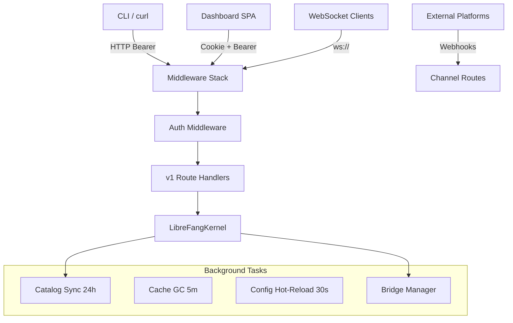

# API Server

# API Server (`librefang-api`)

The HTTP/WebSocket server that exposes the LibreFang Agent OS daemon to CLI clients, the dashboard SPA, channel integrations, and external callers. It boots an in-process `LibreFangKernel`, wires up authentication, rate limiting, and middleware, then serves a versioned JSON API over Axum.

## Architecture



## Server Lifecycle

`run_daemon()` in `server.rs` is the primary entry point. It:

1. **Boots the kernel** — wraps `LibreFangKernel` in `Arc`, sets the self-handle, starts background agents.
2. **Builds the router** — calls `build_router()` which assembles all routes, middleware layers, CORS, and shared state.
3. **Writes `daemon.json`** — stores PID, listen address, start time, and version so the CLI can discover the running daemon. Detects stale PID files (dead process or non-responding port) and cleans them up.
4. **Spawns background tasks** — dashboard asset sync, provider key validation, approval expiry sweep, config hot-reload watcher, model catalog sync, API cache GC.
5. **Starts the observability stack** — optionally launches Prometheus + Grafana via Docker Compose if `telemetry.enabled = true`.
6. **Binds and serves** — uses `socket2` with `SO_REUSEADDR` to avoid `TIME_WAIT` issues, listens with a backlog of 1024, and runs graceful shutdown on SIGINT/SIGTERM or API-triggered shutdown.
7. **Tears down** — aborts background tasks, stops channel bridges, kills tmux sessions, shuts down the observability stack, removes the PID file, and calls `kernel.shutdown()`.

### Embedding

`build_router()` is extracted as a public function so embedders (e.g., `librefang-desktop`) can create the Axum router and shared state without running the full daemon lifecycle. It returns `(Router, Arc<AppState>)`.

## Route Organization

Routes are built in `api_v1_routes()` and mounted at **both** `/api` and `/api/v1` for backward compatibility:

```rust
// server.rs — simplified
let v1_routes = api_v1_routes();  // all domain routers merged
app.nest("/api/v1", v1_routes.clone())
   .nest("/api", v1_routes)
```

Each domain lives in its own submodule under `routes/`:

| Submodule | Prefix | Purpose |
|---|---|---|
| `routes::agents` | `/agents` | Agent CRUD, messaging, upload |
| `routes::channels` | `/channels` | Channel adapter management |
| `routes::config` | `/config` | Configuration read/write/reload |
| `routes::system` | `/system` | Health, status, TOTP management |
| `routes::memory` | `/memory` | Agent memory inspection |
| `routes::workflows` | `/workflows` | Workflow management |
| `routes::skills` | `/skills` | Skill install/uninstall |
| `routes::network` | `/network` | A2A protocol, network status |
| `routes::plugins` | `/plugins` | Plugin lifecycle |
| `routes::providers` | `/providers` | LLM provider configuration |
| `routes::budget` | `/budget` | Token budget tracking |
| `routes::auto_dream` | `/auto_dream` | Auto-dream scheduling |
| `routes::goals` | `/goals` | Goal tracking |
| `routes::inbox` | `/inbox` | Inbox management |
| `routes::media` | `/media` | Media upload/processing |
| `routes::prompts` | `/prompts` | Prompt template management |
| `routes::terminal` | `/terminal` | Terminal session management |

Additional non-versioned routes:

- **Dashboard SPA**: `/`, `/dashboard/*`, static assets
- **OpenAI compat**: `/v1/chat/completions`, `/v1/models`
- **Webhooks**: `/hooks/wake`, `/hooks/agent`
- **A2A protocol**: merged via `routes::network::protocol_router()`
- **MCP**: `/mcp` (HTTP transport)
- **Channel webhooks**: `/channels/{adapter_name}/*` (dynamic, hot-reloadable)

## Authentication

The server supports multiple auth mechanisms that can operate independently or together:

### Auth Modes

The `/api/auth/dashboard-check` endpoint (unauthenticated) returns the current mode:
- **`none`** — no credentials configured, everything is open
- **`credentials`** — dashboard username/password only
- **`api_key`** — static API key or per-user API keys only
- **`hybrid`** — both credentials and API keys configured

### Static API Key

Set `api_key` in `config.toml`. Sent via `Authorization: Bearer <key>` or `X-API-Key` header. Supports multiple keys separated by newlines in the composite key string.

### Per-User API Keys

Users defined in `config.toml` with `api_key_hash` fields. Each user has a `role` that controls access:

| Role | GET | POST (limited) | POST (full) | Owner-only writes |
|---|---|---|---|---|
| `Viewer` | ✅ | ❌ | ❌ | ❌ |
| `User` | ✅ | ✅ (messages, approvals, clone) | ❌ | ❌ |
| `Admin` | ✅ | ❌ | ✅ | ❌ |
| `Owner` | ✅ | ❌ | ✅ | ✅ |

Owner-only write endpoints: `/api/config`, `/api/config/set`, `/api/config/reload`, `/api/auth/change-password`, `/api/shutdown`.

### Dashboard Credentials

Username/password auth via `POST /api/auth/dashboard-login`. Passwords are verified with Argon2id with transparent fallback from legacy plaintext (which produces an upgrade hash for migration). Supports TOTP second factor when enrolled.

On success, a random session token is:
- Returned in the JSON response body
- Set as an `HttpOnly; SameSite=Lax` cookie scoped to `Path=/dashboard`
- Persisted to `data/sessions.json` for restart survival
- The `Secure` flag is added automatically when the request arrives over HTTPS (detected via `X-Forwarded-Proto`)

### OAuth2/OIDC

External identity provider support (`src/oauth.rs`) with:
- Multi-provider support (Google, GitHub, Azure AD, Keycloak, generic OIDC)
- OIDC discovery with caching
- PKCE-protected authorization code flow
- JWT validation with JWKS caching and nonce verification
- Token introspection and refresh endpoints

### Loopback Bypass

Requests from loopback addresses (`127.0.0.1`, `::1`) bypass all auth. This allows the CLI to operate on the same machine without token configuration.

### `require_auth_for_reads`

When `None` (default), the flag is auto-derived: if *any* auth is configured, dashboard read endpoints (agent listing, config, budget, sessions, approvals, etc.) require authentication. Set `require_auth_for_reads = false` explicitly to keep reads public behind an external auth proxy.

## Middleware Pipeline

Middleware layers are applied bottom-to-top (last listed = outermost, runs first):

```
CorsLayer
TraceLayer
CompressionLayer
security_headers        — X-Content-Type-Options, X-Frame-Options, CSP, HSTS, no-cache
request_logging         — UUID per request, structured logging, HTTP metrics
api_version_headers     — X-API-Version response header, Accept negotiation
gcra_rate_limit         — Per-IP GCRA rate limiting
oidc_auth_middleware     — OAuth/OIDC claim injection
accept_language         — Accept-Language parsing into request extensions
auth                    — Bearer/API-key/session authentication + role-based ACL
```

### Security Headers

Applied to **all** responses: `X-Content-Type-Options: nosniff`, `X-Frame-Options: DENY`, CSP (inline scripts allowed for SPA), `Strict-Transport-Security`, `Cache-Control: no-store`.

### Rate Limiting

GCRA-based rate limiting per IP, configured via `rate_limit.api_requests_per_minute` and `rate_limit.retry_after_secs` in `config.toml`.

### API Versioning

Every response includes `X-API-Version`. Clients can negotiate via:
- Explicit path: `/api/v1/...`
- Accept header: `application/vnd.librefang.v1+json`
- Unversioned `/api/...` alias returns the latest version

Unknown versions in the Accept header produce `406 Not Acceptable`.

## Session Management

Sessions are managed in `server.rs` with persistence:

- **Storage**: `HashMap<String, SessionToken>` behind `Arc<RwLock<>>` in `AppState`
- **Persistence**: Serialized to `data/sessions.json`, loaded on startup with expired tokens pruned
- **Expiry**: `DEFAULT_SESSION_TTL_SECS` from `password_hash` module
- **GC**: Background task sweeps every 5 minutes, evicting expired sessions and persisting
- **Invalidation**: Password changes clear all sessions and delete the persistence file

## Credential Resolution

`resolve_dashboard_credential()` resolves config values through a priority chain:

1. **Environment variable** — e.g., `LIBREFANG_DASHBOARD_USER`, `LIBREFANG_DASHBOARD_PASS`
2. **Vault reference** — `vault:KEY_NAME` syntax reads from the encrypted credential vault at `~/vault.enc`
3. **Literal value** — the string as-is from `config.toml`

## Background Tasks

| Task | Interval | Purpose |
|---|---|---|
| Dashboard sync | Once at boot | Downloads/updates SPA bundle from release |
| Provider key validation | Once at boot | Validates API keys against providers |
| Approval sweep | Every 10s | Expires pending approval requests |
| Config hot-reload | Every 30s | Polls `config.toml` mtime, triggers kernel reload + channel bridge restart |
| Model catalog sync | Every 24h | Syncs from community registry mirror |
| Cache GC | Every 5m | Evicts expired clawhub/skillhub cache entries (120s TTL) and expired sessions |

## Channel Bridge System

`channel_bridge::start_channel_bridge()` starts polling-based adapters (Telegram, Discord, etc.) and returns webhook-based router mounts (Feishu, Teams). Webhook routes are mounted at `/channels/{adapter_name}/*` and bypass auth/rate-limit layers since external platforms handle their own signature verification. The webhook router is behind an `RwLock<Arc<Router>>` for hot-reload when channel config changes.

## Key Submodules

- **`ws`** — WebSocket handler for agent chat sessions with origin validation and locality detection
- **`openai_compat`** — OpenAI-compatible `/v1/chat/completions` and `/v1/models` endpoints
- **`password_hash`** — Argon2id password hashing, session token generation, verification with legacy fallback
- **`rate_limiter`** — GCRA (Generic Cell Rate Algorithm) implementation
- **`stream_chunker`** — Splits streaming LLM output into sentence-boundary chunks
- **`stream_dedup`** — Deduplication for concurrent streams
- **`validation`** — Input validation helpers (identifier checks, JSON depth limits, path traversal prevention)
- **`webhook_store`** — CRUD for outgoing webhook registrations with URL validation (blocks private IPs, link-local addresses) and HMAC signature computation
- **`webchat`** — Dashboard SPA serving, asset resolution, locale files, dashboard sync from release artifacts
- **`terminal` / `terminal_tmux`** — Terminal session management via tmux
- **`versioning`** — API version constants and path/header parsing
- **`openapi`** — Auto-generated OpenAPI specification endpoint
- **`telemetry`** *(feature-gated)* — Prometheus metrics recorder init and OpenTelemetry OTLP tracing setup

## Shared State (`AppState`)

The `Arc<AppState>` is shared across all route handlers and middleware:

```rust
pub struct AppState {
    pub kernel: Arc<LibreFangKernel>,
    pub started_at: Instant,
    pub peer_registry: Option<Arc<PeerRegistry>>,
    pub bridge_manager: Mutex<ChannelBridge>,
    pub channels_config: RwLock<ChannelsConfig>,
    pub shutdown_notify: Arc<Notify>,
    pub clawhub_cache: DashMap<String, (Instant, Value)>,
    pub skillhub_cache: DashMap<String, (Instant, Value)>,
    pub provider_probe_cache: ProbeCache,
    pub provider_test_cache: DashMap<...>,
    pub webhook_store: WebhookStore,
    pub active_sessions: Arc<RwLock<HashMap<String, SessionToken>>>,
    pub api_key_lock: Arc<RwLock<String>>,
    pub media_drivers: MediaDriverCache,
    pub webhook_router: Arc<RwLock<Arc<Router>>>,
    pub config_write_lock: Mutex<()>,
    #[cfg(feature = "telemetry")]
    pub prometheus_handle: Option<PrometheusHandle>,
}
```

The `api_key_lock` is shared between `AppState` and `AuthState` so that credential changes (via `/api/auth/change-password`) immediately update the live key set without a server restart.

## Daemon Discovery

`DaemonInfo` is written to `~/.librefang/daemon.json`:

```rust
pub struct DaemonInfo {
    pub pid: u32,
    pub listen_addr: String,
    pub started_at: String,  // RFC 3339
    pub version: String,
    pub platform: String,
}
```

The CLI reads this file to find the running daemon. Stale files (dead PID or non-responding port) are automatically cleaned up on startup. File permissions are restricted to owner-only (`0600` on Unix).