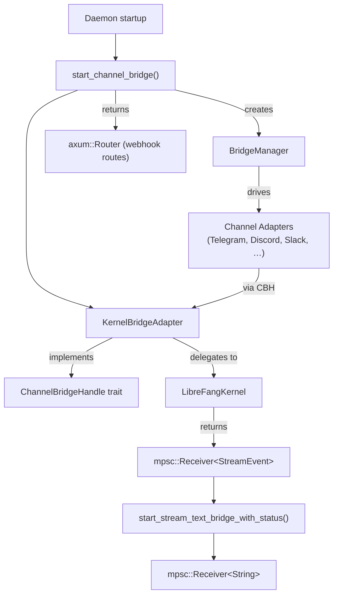

# API Server

# Channel Bridge (`channel_bridge.rs`)

The channel bridge is the wiring layer that connects the LibreFang kernel to messaging platform adapters. It implements the `ChannelBridgeHandle` trait on `LibreFangKernel`, translates kernel streaming events into plain-text channel output, sanitizes errors for end users, and provides the `start_channel_bridge()` entry point that the daemon calls at startup.

## Architecture



## Key Components

### `KernelBridgeAdapter`

A struct wrapping `Arc<LibreFangKernel>` that implements the `ChannelBridgeHandle` trait from `librefang_channels::bridge`. Every channel adapter calls methods on this handle to send messages, list agents, manage sessions, and execute administrative commands.

It records `started_at: Instant` for uptime reporting and delegates all real work to the kernel.

### `start_channel_bridge()`

```rust
pub async fn start_channel_bridge(
    kernel: Arc<LibreFangKernel>,
) -> (Option<BridgeManager>, axum::Router)
```

Called by the daemon at startup. Reads `ChannelsConfig` from the kernel, instantiates feature-gated adapters (see [Feature-gated adapters](#feature-gated-adapters)), collects them with their `default_agent` and `account_id`, and passes them to `BridgeManager`.

Returns a tuple of:
- `Option<BridgeManager>` — `None` if no channels are configured
- `axum::Router` — webhook routes for adapters that receive messages via HTTP callbacks (Feishu, Teams, DingTalk, etc.)

The companion `start_channel_bridge_with_config()` accepts an explicit `ChannelsConfig` and is used for hot-reload scenarios.

### Streaming Text Bridge

Two functions convert kernel `StreamEvent` streams into plain `mpsc::Receiver<String>`:

| Function | Returns | Use case |
|---|---|---|
| `start_stream_text_bridge` | `Receiver<String>` only | Simple streaming |
| `start_stream_text_bridge_with_status` | `Receiver<String>` + `oneshot::Receiver<Result<(), String>>` | Lifecycle-aware adapters that need to know the kernel's terminal status |

#### Event processing logic

The bridge spawns two tasks:

1. **Bridge task** — consumes `StreamEvent` values from the kernel and emits text:
   - `TextDelta` → buffers text per iteration
   - `ContentComplete` → flushes buffered text, clearing iteration state
   - `ToolUseStart` → emits a `🔧 Pretty Tool Name` progress line (if `show_progress` is enabled)
   - `ToolExecutionResult` (errors only) → emits `⚠️ Pretty Tool Name failed`
   - `PhaseChange` with `context_warning` → emits `⚠️ <detail>`

2. **Status task** — awaits the kernel `JoinHandle`, then:
   - On panic or error: sends a sanitized error message through the text channel, then reports `Err` on the status oneshot
   - On timeout with partial output: appends an incomplete-output marker but reports `Ok` (soft success to preserve pre-V2 UX)
   - On success: reports `Ok`

#### Content filtering

Three kinds of content are suppressed before reaching the channel:

| Filter | What it catches | Mechanism |
|---|---|---|
| Tool-use-adjacent text | Text emitted alongside `ToolUseStart` | `saw_tool_use` flag set on `ToolUseStart`, checked at `ContentComplete` |
| Leaked tool calls | Raw JSON/XML tool syntax providers emit as text | `looks_like_tool_call()` checks multiple patterns |
| Silent responses | `NO_REPLY` / `[[silent]]` markers | `is_silent_response()` check |

The `looks_like_tool_call()` function detects tool calls in several formats: JSON arrays, `functions.` prefixes, `<function=…>` tags, `[TOOL_CALL]` markers, ͷ/假装 symbols, markdown code blocks containing tool JSON, and backtick-wrapped tool calls.

#### Deduplication

Within a single iteration, repeated calls to the same tool collapse into one `🔧` progress line. The `iter_tools_seen` `HashSet` is cleared at each `ContentComplete` so tools retried across iteration boundaries still get visible progress lines.

### Error Sanitization

`sanitize_channel_error()` maps raw error strings to user-friendly messages before they reach messaging platforms:

| Error pattern | User message |
|---|---|
| Timeout / inactivity | "The task timed out due to inactivity. Try breaking it into smaller steps." |
| Rate limit / 429 / quota | "I've hit my usage limit and need to rest. I'll be back soon!" |
| Auth / 401 | "I'm having trouble with my credentials. Please let the admin know." |
| Driver crash / exit code | "Sorry, something went wrong on my end. Please try again in a moment." |
| Other | "Something went wrong: please try again. (ref: …)" |

In group chats, all errors are suppressed entirely (no message sent). In DMs, rate-limit messages with reset times are passed through with minimal cleanup.

### Reply Intent Classification

`classify_reply_intent()` uses a one-shot LLM call to decide whether a group-chat message is directed at the bot. It constructs a classifier prompt with the sender name, message text, bot name, and aliases, then asks the model to output `REPLY` or `NO_REPLY`. It fails open (returns `true`) on any error.

Inputs are truncated and sanitized to reduce injection surface: backticks become quotes, brackets become parentheses, newlines become spaces.

### Channel Overrides

`channel_overrides()` looks up per-channel configuration from `ChannelsConfig`, matching by `channel_type` and optional `account_id`. It merges routing aliases from the default agent's manifest into `group_trigger_patterns` so aliases trigger the bot in group chats without formal @mentions.

`agent_channel_overrides()` reads overrides directly from an agent manifest's `channel_overrides` field.

### Feature-gated Adapters

Each channel adapter is behind a Cargo feature flag. When a channel is configured in `ChannelsConfig` but the corresponding feature is disabled, a warning is logged at startup and the adapter is skipped.

| Wave | Channels |
|---|---|
| Core | Telegram, Discord, Slack, WhatsApp, Signal, Matrix, Email, Teams, Mattermost, IRC, Google Chat, Twitch, Rocket.Chat, Zulip, XMPP |
| Wave 3 | LINE, Viber, Messenger, Reddit, Mastodon, Bluesky, Feishu, Revolt |
| Wave 4 | Nextcloud, Guilded, Keybase, Threema, Nostr, Webex, Pumble, Flock, Twist |
| Wave 5 | DingTalk, QQ, Discourse, Gitter, ntfy, Gotify, Webhook, Voice, LinkedIn, WeChat, WeCom, Mumble |

Multiple accounts per channel are supported (each config entry in the vec gets its own adapter instance with a distinct `account_id`).

## Administrative Commands

`KernelBridgeAdapter` implements text-based administrative commands that channel adapters expose as `/` commands:

### Agent Management

- **`send_message` / `send_message_with_sender`** — synchronous message to an agent, returns response text or empty string for silent replies
- **`send_message_streaming` / `send_message_streaming_with_sender`** — streaming variant, returns `Receiver<String>`
- **`send_message_streaming_with_sender_status`** — streaming with terminal status for lifecycle-aware adapters
- **`send_message_with_blocks` / `send_message_with_blocks_and_sender`** — handles multimodal content blocks (images, etc.); extracts text for memory/logging, falls back to `"[Image]"` when no text is present
- **`send_message_ephemeral`** — sends without persisting to conversation history
- **`find_agent_by_name`** / **`list_agents`** — agent discovery (excludes hand agents)
- **`spawn_agent_by_name`** — reads `agent.toml` from `~/.librefang/workspaces/agents/{name}/`, parses the manifest, and spawns a new agent
- **`reset_session` / `reboot_session` / `compact_session`** — session lifecycle management
- **`set_model`** — switch an agent's model at runtime
- **`stop_run`** — cancel an in-progress agent run
- **`session_usage`** — report token usage and estimated cost for the current session
- **`set_thinking`** — toggle extended thinking (future-ready, stores preference)

### Automation

- **`list_workflows_text` / `run_workflow_text`** — list and execute named workflows
- **`list_triggers_text` / `create_trigger_text` / `delete_trigger_text`** — manage event triggers (lifecycle, system, memory, content match patterns)
- **`list_schedules_text` / `manage_schedule_text`** — manage cron jobs (add, delete, manual run); supports `Cron`, `Every`, and `At` schedule types
- **`list_approvals_text` / `resolve_approval_text`** — manage pending tool approval requests, with TOTP verification for high-risk tools

### System Information

- **`uptime_info`** — human-readable uptime and agent count
- **`list_models_text` / `list_providers_text` / `list_models_by_provider`** — model catalog queries grouped by provider with cost info
- **`list_skills_text`** — installed skills with runtime type and tool count
- **`list_hands_text`** — available hands with requirement status
- **`budget_text`** — hourly/daily/monthly spend vs limits
- **`peers_text`** — OFP peer network status
- **`a2a_agents_text`** — discovered external A2A agents

### Security & Delivery

- **`authorize_channel_user`** — RBAC check against `AuthManager` (no-op when RBAC is disabled)
- **`record_delivery`** — tracks delivery success/failure in the `DeliveryTracker` and persists `last_channel` for cron delivery
- **`check_auto_reply`** — checks if an auto-reply rule fires for a message
- **`subscribe_events`** — subscribes to the kernel event bus for real-time event streaming
- **`send_channel_push`** — outbound push to a specific channel recipient (used by cron delivery)
- **`channels_download_dir` / `channels_download_max_bytes`** — file download configuration for channel media

## Utility Functions

### `prettify_tool_name(name: &str) -> String`

Converts `snake_case`, `kebab-case`, or `dotted` tool IDs into display names. Words with existing uppercase after the first character preserve their casing (e.g., `MCP_call` → "MCP Call").

### `tr_progress_failed(language: &str) -> &'static str`

Returns a localized "failed" suffix for tool-failure progress lines. Supported: zh-CN, es, ja, de, fr. Falls back to English.

### `parse_trigger_pattern(s: &str) -> Option<TriggerPattern>`

Parses user-facing pattern strings like `"spawned:my_agent"`, `"system:keyword"`, `"memory:key_pattern"`, `"match:substring"`, or bare keywords (`lifecycle`, `terminated`, `system`, `memory`, `all`).

### `read_token(env_var: &str, adapter_name: &str) -> Option<String>`

Reads a bot token from an environment variable. Returns `None` with a warning log if the variable is missing or empty.

## Adding a New Channel Adapter

1. Implement `ChannelAdapter` in `librefang-channels`
2. Add a `channel-<name>` feature flag to `Cargo.toml`
3. Add the config struct to `ChannelsConfig` in `librefang-types`
4. Add a `check_channel!` macro call and an adapter instantiation block in `start_channel_bridge_with_config()`
5. Add the channel type string to the `channel_overrides()` match block
6. Add any webhook routes to the returned `axum::Router`