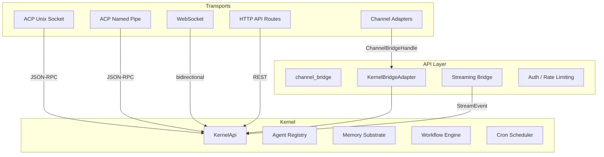

# API Server

# API Server (`librefang-api`)

The API server is the daemon's external interface layer. It exposes the LibreFang kernel to editors, messaging platforms, web dashboards, and programmatic consumers through multiple transport protocols, all backed by a shared kernel instance.

## Architecture Overview

## Core Submodules

### ACP Listeners — Editor-to-Daemon Protocol

ACP (Agent Client Protocol) allows editors and CLI tools to connect to a long-running daemon, sharing one kernel across multiple sessions. The protocol uses JSON-RPC framing with a `KernelAdapter` per connection, backed by the daemon's shared `LibreFangKernel`.

Two platform-specific transports exist with identical wire protocol:

**Unix Domain Socket** (`acp_uds.rs`, `#[cfg(unix)]`):
- Listens on `~/.librefang/acp.sock`
- Entry point: `run_listener(kernel, sock_path)`
- Atomic bind with mode `0o600` via `bind_atomic_owner_only()` — binds to a randomized tempfile, chmods, then renames into place to eliminate the TOCTOU window between `bind()` and `chmod()`
- `SO_PEERCRED` peer-uid validation on every accepted connection — mismatches are dropped before any ACP bytes are read

**Windows Named Pipe** (`acp_pipe.rs`, `#[cfg(windows)]`):
- Listens on `\\.\pipe\librefang-acp` (`PIPE_NAME`)
- Entry point: `run_listener(kernel)`
- Owner-only DACL via SDDL `D:P(A;;GA;;;OW)` — only the daemon's own user SID gets access, with the `P` flag blocking inheritance from the parent pipe directory
- `first_pipe_instance(true)` on initial bind prevents name-squatting races from crashed daemon remnants
- `reject_remote_clients(true)` enforced explicitly

**Trust model**: same-user, same-host. Both transports harden against multi-user host scenarios — Unix via filesystem permissions + peer credentials, Windows via explicit DACL.

Each connection spawns a background task calling `librefang_acp::run_with_transport` with a `KernelAdapter` that resolves the default agent `"assistant"`.

### Channel Bridge — Messaging Platform Integration

`channel_bridge.rs` connects the kernel to 30+ messaging platforms (Telegram, Discord, Slack, WhatsApp, Signal, Matrix, IRC, Teams, and many more). Each platform is feature-gated (`channel-telegram`, `channel-discord`, etc.).

**Entry points**:
- `start_channel_bridge(kernel)` — reads kernel config, returns `(Option<BridgeManager>, axum::Router)` where the router holds webhook routes
- `start_channel_bridge_with_config(kernel, config)` — for hot-reload scenarios

**`KernelBridgeAdapter`** implements `ChannelBridgeHandle` and is the central dispatch for all channel operations:

- **Messaging**: `send_message`, `send_message_with_blocks`, `send_message_streaming`, `send_message_with_sender` — all route through `KernelApi` methods. Silent responses (NO_REPLY) return empty strings so the bridge skips sending.
- **Streaming**: `send_message_streaming_with_sender_status` returns both an `mpsc::Receiver<String>` and a oneshot status channel. The streaming bridge (`start_stream_text_bridge_with_status`) translates `StreamEvent` variants into user-facing text.
- **Agent management**: `find_agent_by_name`, `list_agents`, `spawn_agent_by_name`
- **Workflow execution**: `run_workflow_text` — resolves workflow by name, creates a run, and executes steps through the kernel's workflow engine
- **Cron/scheduling**: `manage_schedule_text` handles add/del/run for cron jobs
- **Approvals**: `resolve_approval_text` — supports TOTP verification with replay protection and lockout
- **Budget**: `budget_text` — displays hourly/daily/monthly spend against limits
- **RBAC**: `authorize_channel_user` — gates actions by channel user identity
- **Reply intent classification**: `classify_reply_intent` — uses a one-shot LLM call to determine if a group message is directed at the bot

### Streaming Bridge Internals

The `start_stream_text_bridge_with_status` function translates kernel `StreamEvent`s into a text channel:

| Event | Behavior |
|-------|----------|
| `TextDelta` | Buffered per iteration |
| `ContentComplete` | Flushes buffer; suppresses tool-call leaks, NO_REPLY sentinels |
| `ToolUseStart` | Emits `🔧 Pretty Tool Name` progress line (if `show_progress`) |
| `ToolExecutionResult` (error) | Emits `⚠️ Tool Name failed` (localized) |
| `PhaseChange` (`context_warning`) | Emits context window warning |

**Tool call leak detection** (`looks_like_tool_call` and helpers) prevents raw LLM tool-call syntax from being forwarded to users. This includes JSON arrays/objects starting with `[{`, `<function=` tags, `[TOOL_CALL]` markers, markdown code blocks containing tool calls, and backtick-wrapped tool invocations. Long responses (>2000 chars) only match start-of-text patterns to avoid false positives on natural language that discusses tools.

**Error sanitization** (`sanitize_channel_error`) converts technical error messages into user-friendly text for channel delivery, preventing stack traces and driver internals from leaking to end users on WhatsApp, Telegram, etc.

### Approval Module

`approval.rs` re-exports `librefang_kernel::approval::ApprovalManager` to keep kernel internals out of the API crate's import surface. Route modules should use this re-export rather than importing from the kernel directly.

## Supporting Infrastructure

### WebSocket Layer (`ws.rs`)
- `WsConnectionGuard` manages connection slot limits via `try_acquire_ws_slot`
- Origin validation through `validate_ws_origin` → `normalize_origin_host`
- Agent WebSocket handler `handle_agent_ws` subscribes to kernel changes and streams updates
- Bearer token authentication via `ws_bearer_protocol` / `ws_auth_token`
- Think-tag stripping (`strip_think_tags`) for extended thinking model output

### HTTP Server (`server.rs`)
- `build_router` assembles the full Axum router from all route modules
- `DaemonInfo` serialization for daemon lifecycle management (PID, bind address, startup time)
- `evaluate_bind_auth_safety` / `resolve_dashboard_credential` for bind-address security checks
- Dashboard authentication, password management (`hash_password` / `verify_password` via `password_hash.rs`)

### Rate Limiting (`rate_limiter.rs`)
- Token-bucket rate limiter for API and auth endpoints
- `create_rate_limiter` / `request_from` for per-identity throttling

### Versioning (`versioning.rs`)
- API version negotiation via `requested_version_from_accept_header` and `version_from_path`
- Supports both header-based (`Accept`) and path-based (`/v1/...`, `/v2/...`) versioning

### Validation (`validation.rs`)
- `check_identifier` for sanitizing user-supplied identifiers
- JSON depth checking (`check_json_depth`) to prevent deeply nested payload attacks

### Webhook Store (`webhook_store.rs`)
- CRUD for outgoing webhook registrations
- Private IP / localhost URL rejection (`is_private_ip` → `canonical_ip`) to prevent SSRF
- Secret redaction (`redact_webhook_secret`) in responses

### Web Chat / Dashboard (`webchat.rs`)
- Embedded dashboard asset serving
- `embedded_only_mode` for locked-down deployments
- Dashboard sync via `proxied_client_builder` for remote dashboard proxying

### Streaming Utilities
- `stream_dedup.rs` — deduplication of streamed text chunks (`record_sent`)
- `stream_chunker.rs` — sentence-boundary-aware chunking for streaming delivery

### Telemetry (`telemetry.rs`)
- Prometheus metrics initialization (`init_prometheus`)

### Types (`types.rs`)
- Shared API types: `PaginationQuery`, error envelopes (`not_found`, `with_code`, `with_request_id`)
- `WorkflowId` and `StepAgent` for workflow execution routing

### Triggers (`triggers.rs`)
- `TriggerPattern` enum: `Lifecycle`, `AgentSpawned`, `AgentTerminated`, `System`, `SystemKeyword`, `MemoryUpdate`, `MemoryKeyPattern`, `ContentMatch`, `All`
- Parsed from chat commands via `parse_trigger_pattern`

## Adding a New Channel Adapter

1. Gate the adapter with a Cargo feature (e.g., `channel-foobar`)
2. Add the config struct to `ChannelsConfig` in `librefang-types`
3. In `channel_bridge.rs`:
   - Add a `#[cfg(feature = "channel-foobar")] use librefang_channels::foobar::FoobarAdapter;`
   - Add a `check_channel!` macro call for feature-gate warnings
   - Add an initialization block reading config and constructing the adapter with `read_token`
   - Push `(adapter, default_agent, account_id)` into the `adapters` vector
4. Implement `ChannelAdapter` for the adapter in `librefang-channels`

## Platform-Specific Compilation

- `acp_uds.rs` compiles only on `#[cfg(unix)]`
- `acp_pipe.rs` compiles only on `#[cfg(windows)]`
- Channel adapters compile only when their feature flag is enabled
- At runtime, channels configured but missing their feature flag emit a warning and are skipped