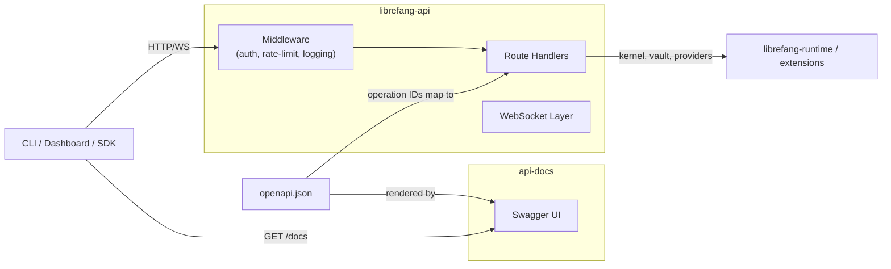

# API Server

# API Server

The API Server module group provides the HTTP/WebWebSocket interface for LibreFang Agent OS. It exposes agent management, chat, status monitoring, configuration, and external integrations through JSON REST endpoints and WebSocket connections. The CLI, dashboard SPA, and third-party consumers all communicate through this layer.

## Sub-modules

| Module | Role |
|---|---|
| [librefang-api](librefang-api.md) | The live server — Axum-based HTTP/WS handlers, middleware pipeline, and supporting infrastructure (OAuth, webhooks, WebSocket management, versioning) |
| [api-docs](api-docs.md) | Static Swagger UI host (`index.html`) that renders the interactive documentation page in browsers |
| [openapi.json](openapi.json.md) | OpenAPI 3.1.0 specification — the single source of truth for every route, request/response schema, and operation ID |

## How they fit together

The **spec** (`openapi.json`) is the contract. Operation IDs such as `spawn_agent` and `list_agents` map directly to handler function names inside `librefang-api`. The **docs** module is a zero-dependency artifact that simply serves that spec through Swagger UI — it has no runtime coupling to the server. The **server** implements the contract and wires every request through a shared middleware pipeline (authentication, rate limiting, structured logging, i18n error messages, security headers) before dispatching to route handlers.

## Key cross-cutting workflows

- **Provider health checks** — `list_providers` in the routes layer calls through provider health probing → kernel boot → vault unlock → master key resolution, ensuring every provider listing reflects live connectivity status.
- **WebSocket lifecycle** — Connection acquisition (`try_acquire_ws_slot` / `WsConnectionGuard`) enforces concurrency limits. Inbound text messages are classified for streaming errors and deduplicated via `stream_dedup`. Origin validation rejects cross-host connections while permitting loopback and configured extras.
- **Webhook delivery** — Creation flows through SSRF protection (`is_private_ip`), URL/length validation, and HMAC signature computation. Updates support secret rotation and selective field clearing.
- **API versioning** — The `Accept` header is parsed by `versioning` helpers to route requests to the correct handler revision, enabling backward-compatible API evolution.
- **Channel integrations** (e.g. WeChat QR) — Route handlers bootstrap the kernel and vault on first use, following the same boot → unlock → key resolution path as provider flows.

For implementation details, see the individual sub-module pages linked above.