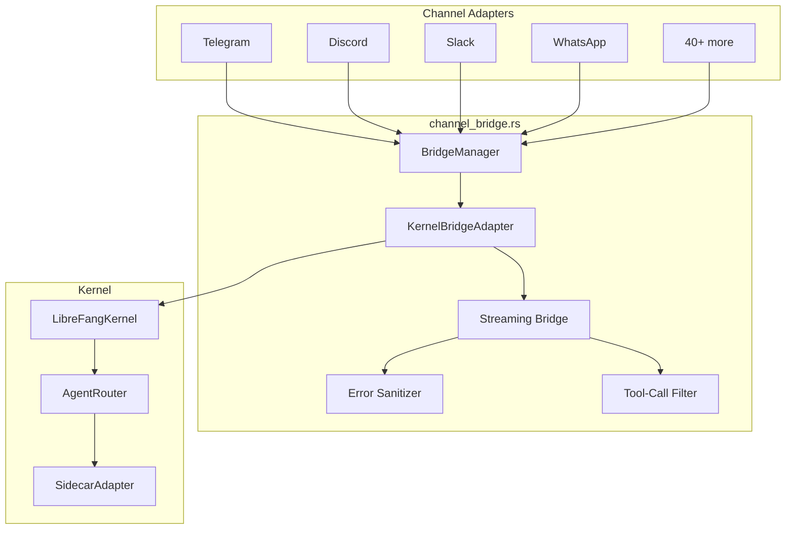

# API Server

# Channel Bridge (`channel_bridge.rs`)

## Purpose

The channel bridge is the glue layer between the **LibreFang kernel** (the AI agent runtime) and the **channel adapters** (Telegram, Discord, Slack, WhatsApp, and 40+ other platforms). It:

- Implements the `ChannelBridgeHandle` trait, exposing kernel operations to every channel adapter through a uniform interface.
- Starts all configured channel adapters at daemon boot, reading credentials from environment variables and wiring each adapter into a `BridgeManager`.
- Translates streaming `StreamEvent`s from the kernel into plain-text strings suitable for delivery over chat channels.
- Sanitizes errors and filters leaked tool-call syntax before it reaches end users.
- Provides text-based management commands (`/models`, `/workflows`, `/schedule`, `/approvals`, etc.) that channel adapters invoke via slash-command handlers.

## Architecture

## Key Components

### `KernelBridgeAdapter`

Wraps an `Arc<LibreFangKernel>` and implements `ChannelBridgeHandle`. Every channel adapter calls methods on this single handle to send messages, list agents, manage sessions, and execute management commands.

The adapter is constructed inside `start_channel_bridge_with_config()` with a `started_at: Instant` for uptime reporting, then passed to the `BridgeManager`.

### Streaming Bridge

Two entry points convert kernel streaming events into a channel-friendly `mpsc::Receiver<String>`:

- **`start_stream_text_bridge()`** — returns only the text receiver. Used by simpler adapters that don't need to know the kernel's terminal status.
- **`start_stream_text_bridge_with_status()`** — additionally returns a `oneshot::Receiver<Result<(), String>>` that resolves after the stream has fully drained. Adapters use this for accurate delivery tracking and lifecycle decisions (e.g., whether to show ✅ or ❌).

#### Event processing flow

Two concurrent tokio tasks are spawned:

1. **Bridge task** — reads `StreamEvent`s from the kernel and writes text to the output channel:
   - `TextDelta` → buffers text
   - `ContentComplete` → flushes buffered text (after filtering)
   - `ToolUseStart` → emits a `🔧 Tool Name` progress line (when `show_progress` is enabled)
   - `ToolExecutionResult` (errors only) → emits `⚠️ Tool Name failed` (localized via `tr_progress_failed`)
   - `PhaseChange` with `context_warning` → emits a warning about context window trimming

2. **Status task** — awaits the kernel's `JoinHandle`, then:
   - Sends any error message through the text channel before the bridge task finishes
   - Reports terminal status through the oneshot channel
   - Timeout-with-partial-output is treated as soft success (`Ok(())`) so the upstream lifecycle shows ✅ rather than ❌

#### Iteration semantics

Tool progress tracking uses per-iteration deduplication. A `HashSet` tracks tool names seen within one iteration (cleared at each `ContentComplete`). This means the same tool invoked multiple times in one model turn shows only one `🔧` line, but if retried across iterations, it gets a fresh line each time.

### Content Sanitization

#### `sanitize_channel_error()`

Maps raw LLM/driver error strings into user-friendly messages before delivery to channels. Recognized patterns:

| Pattern | User Message |
|---|---|
| Timeout / inactivity | "The task timed out due to inactivity. Try breaking it into smaller steps." |
| Rate limit / 429 / quota | "I've hit my usage limit and need to rest." |
| Auth / 401 | "I'm having trouble with my credentials. Please let the admin know." |
| Exit code / LLM driver crash | "Sorry, something went wrong on my end." |
| Anything else | "Something went wrong: please try again. (ref: …)" with truncated detail |

Group chats suppress all error messages entirely to avoid leaking any technical detail.

#### `looks_like_tool_call()`

Some LLM providers emit tool calls as plain text instead of using the proper tool_use API. This function detects leaked tool-call syntax across multiple formats:

- JSON arrays/objects starting with `[{` or `{"type":"function"`
- Tag-based patterns: `<function=…>`, `<tool>`, `[TOOL_CALL]`, ` Tigers` (Unicode tags)
- Markdown code blocks and backtick-wrapped tool calls containing `name { … }` JSON structures
- Bare JSON objects with `name`/`function`/`tool` + `arguments`/`parameters`/`args`/`input` keys

Text matching any of these patterns is silently dropped at `ContentComplete` and during the final flush.

### Channel Adapter Wiring

`start_channel_bridge_with_config()` is the main entry point. It:

1. Scans `ChannelsConfig` for configured channels, emitting warnings for any channel whose Cargo feature is disabled.
2. For each configured channel, reads credentials from environment variables via `read_token()`.
3. Constructs the appropriate adapter (e.g., `TelegramAdapter`, `DiscordAdapter`) with config-driven options like allowed users, backoff settings, and account IDs.
4. Collects all adapters into a `Vec<(Arc<dyn ChannelAdapter>, Option<String>, Option<String>)>` alongside the default agent name and account ID.
5. Creates a `KernelBridgeAdapter` wrapping the kernel.
6. Passes adapters and handle to `BridgeManager::start()` and `AgentRouter::start()`.
7. Also starts `SidecarAdapter` instances for any configured sidecar channels.
8. Returns the `BridgeManager`, a list of started channel names, and an `axum::Router` of webhook routes for webhook-based channels.

All channel adapters are feature-gated via `#[cfg(feature = "channel-<name>")]`. The full list of supported features across five waves:

- **Wave 1**: telegram, discord, slack, whatsapp, signal, matrix, email, teams, mattermost, irc, google-chat, twitch, rocketchat, zulip, xmpp
- **Wave 2**: (voice, webhook)
- **Wave 3**: line, viber, messenger, reddit, mastodon, bluesky, feishu, revolt
- **Wave 4**: nextcloud, guilded, keybase, threema, nostr, webex, pumble, flock, twist
- **Wave 5**: mumble, dingtalk, qq, discourse, gitter, ntfy, gotify, webhook, voice, linkedin, wechat, wecom

### Management Commands

`KernelBridgeAdapter` exposes numerous text-returning methods that channel adapters call in response to slash commands. Key groups:

| Domain | Methods | Description |
|---|---|---|
| **Agent management** | `list_agents`, `find_agent_by_name`, `spawn_agent_by_name` | List, locate, and dynamically spawn agents from manifest files |
| **Session control** | `reset_session`, `reboot_session`, `compact_session`, `set_model`, `stop_run`, `session_usage` | Per-agent session lifecycle |
| **Models & providers** | `list_models_text`, `list_providers_text`, `list_providers_interactive`, `list_models_by_provider` | Catalog introspection |
| **Skills** | `list_skills_text` | Installed skill registry |
| **Hands** | `list_hands_text` | Physical/manipulation hands and their readiness |
| **Workflows** | `list_workflows_text`, `run_workflow_text` | Multi-step agent workflows |
| **Triggers** | `list_triggers_text`, `create_trigger_text`, `delete_trigger_text` | Event-driven trigger rules |
| **Schedules** | `list_schedules_text`, `manage_schedule_text` (add/del/run) | Cron-based scheduled jobs |
| **Approvals** | `list_approvals_text`, `resolve_approval_text` | Human-in-the-loop tool approval with TOTP support |
| **Budget** | `budget_text` | Hourly/daily/monthly spend tracking |
| **Network** | `peers_text`, `a2a_agents_text` | OFP peer network and A2A agent discovery |
| **Auth** | `authorize_channel_user` | RBAC gating per channel user |
| **Delivery** | `record_delivery` | Track message delivery success/failure for metrics and cron `LastChannel` persistence |

### Reply Intent Classification

`classify_reply_intent()` is used by group-chat adapters to decide whether an incoming message is directed at the bot. It:

1. Sanitizes and truncates the message text (max 500 chars) and sender name (max 64 chars), stripping dangerous characters.
2. Sends a one-shot LLM call with a strict classification prompt.
3. Returns `false` only if the response contains `NO_REPLY`; otherwise returns `true` (fail-open).

### TOTP-Protected Approvals

`resolve_approval_text()` handles tool-approval requests that may require TOTP verification:

- Checks if the specific tool requires TOTP via `policy().tool_requires_totp()`.
- Supports both 6-digit TOTP codes and single-use recovery codes.
- Enforces lockout after too many failed TOTP attempts via `record_totp_failure()`.
- When TOTP is required but not provided, the kernel's `resolve()` may still allow it during a grace period.

### Channel Overrides & Alias Routing

`channel_overrides()` looks up per-channel configuration (from `ChannelsConfig`) and merges the default agent's routing aliases into `group_trigger_patterns`. This means aliases configured in an agent's manifest routing metadata automatically work as group-chat triggers without explicit @mentions. The method:

1. Reads the agent manifest's `routing.aliases` and `routing.weak_aliases`.
2. Escapes regex metacharacters in each alias.
3. Uses `\b` word boundaries for ASCII aliases and plain substring matching for CJK/non-ASCII.
4. Deduplicates against existing patterns.

## Adding a New Channel Adapter

To add support for a new messaging platform:

1. **Create the adapter** in `librefang-channels/src/<platform>.rs` implementing `ChannelAdapter`.
2. **Add a Cargo feature** `channel-<platform>` to `librefang-channels` and `librefang-api`.
3. **Add config fields** to `ChannelsConfig` in `librefang-types`.
4. **Wire it in `start_channel_bridge_with_config()`**:
   - Add a `check_channel!()` macro call for feature-disabled warnings.
   - Add a `#[cfg(feature = "channel-<platform>")]` block that reads config, calls `read_token()`, constructs the adapter, and pushes it to `adapters`.
   - Add the channel type string to `channel_overrides()` match block.
5. **Import the adapter type** at the top of the file with `#[cfg(feature = "channel-<platform>")]`.

## Key Design Decisions

- **Fail-open classification**: `classify_reply_intent()` defaults to replying when the LLM call fails, ensuring the bot never silently ignores users due to a transient error.
- **Soft timeout handling**: Streaming timeouts that produced partial output report `Ok(())` status, preserving the pre-V2 UX where partial responses were shown as successful.
- **Group chat error suppression**: All errors are suppressed in group contexts to prevent technical detail leakage in public/shared channels.
- **Per-iteration tool dedup**: Prevents UI noise from agents that fan out parallel tool calls to the same tool within a single model turn.
- **Feature-gated compilation**: Channels not needed at compile time add zero binary size and zero runtime overhead.