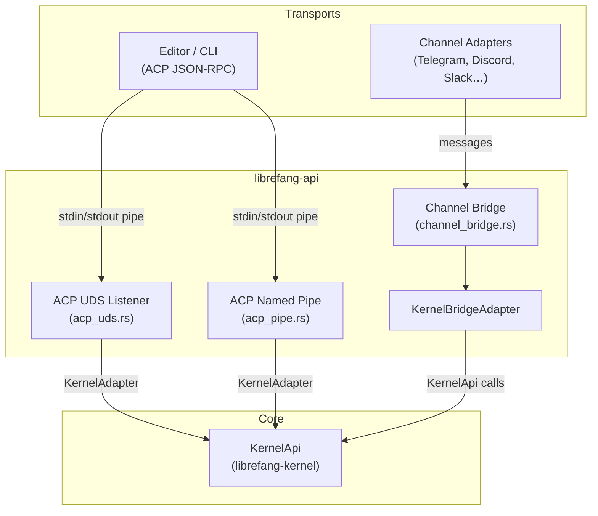
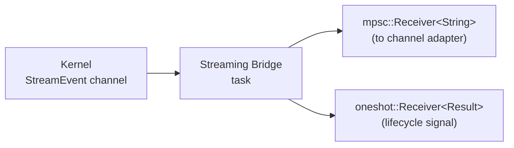

# API Server

# API Server (`librefang-api`)

The API server is the daemon-facing layer that exposes LibreFang's kernel to external consumers — editors via the Agent Client Protocol (ACP), and end users via chat channels (Telegram, Discord, Slack, WhatsApp, etc.). It translates between transport-specific wire formats and the shared `KernelApi` trait, handling authentication, streaming, error sanitization, and approval workflows along the way.

## Architecture


```mermaid
graph TD
    subgraph "Transports"
        EDITOR["Editor / CLI<br/>(ACP JSON-RPC)"]
        CHANNEL["Channel Adapters<br/>(Telegram, Discord, Slack…)"]
    end

    subgraph "librefang-api"
        UDS["ACP UDS Listener<br/>(acp_uds.rs)"]
        PIPE["ACP Named Pipe<br/>(acp_pipe.rs)"]
        BRIDGE["Channel Bridge<br/>(channel_bridge.rs)"]
        KBA["KernelBridgeAdapter"]
    end

    subgraph "Core"
        KERNEL["KernelApi<br/>(librefang-kernel)"]
    end

    EDITOR -->|stdin/stdout pipe| UDS
    EDITOR -->|stdin/stdout pipe| PIPE
    CHANNEL -->|messages| BRIDGE
    UDS -->|KernelAdapter| KERNEL
    PIPE -->|KernelAdapter| KERNEL
    BRIDGE --> KBA
    KBA -->|KernelApi calls| KERNEL
```

## ACP Listeners

The ACP listeners allow editor integrations (VS Code, JetBrains, etc.) to drive a long-running daemon kernel instead of spawning a new process per invocation. This means approval decisions persist across editor restarts, agent state is shared between all open tabs, and `allow_always` decisions outlive any single editor session.

Both listeners are wire-compatible: same JSON-RPC framing, same `KernelAdapter`, same shared kernel. Only the transport differs.

### Unix Domain Socket (`acp_uds.rs`)

Listens on `~/.librefang/acp.sock`. Only compiled on `#[cfg(unix)]`.

**Connection lifecycle:**

1. `run_listener(kernel, sock_path)` binds the socket and enters an accept loop
2. Each accepted connection is validated via `SO_PEERCRED` — the peer's UID must match the daemon's EUID
3. The stream is split, wrapped in `tokio_util::compat` adapters, and handed to `librefang_acp::run_with_transport`
4. Each connection runs in an independent `tokio::spawn` task

**Atomic bind with TOCTOU hardening:**

`bind_atomic_owner_only` avoids the classic `bind() → chmod()` race window where another local user could connect between the two syscalls. It binds to a randomised tempfile (`.acp.sock.{pid}.{nanos}`), `chmod`s it to `0o600`, then `rename`s into the final path. The rename atomically overwrites any stale socket left by a crashed daemon.

**Stale orphan cleanup:**

On macOS Docker Desktop bind-mount volumes, `rename(2)` can succeed on the host but leave the source file visible inside the container. `sweep_stale_orphans` cleans up these leftover tempfiles with three guards:

| Guard | Purpose |
|-------|---------|
| UID equality | Never delete files owned by another user |
| Recency window (10s) | Don't race with a concurrent daemon's bind→rename |
| PID liveness (`kill(pid, 0)`) | Don't delete a live daemon's in-flight tempfile; only remove when `ESRCH` (process dead) |

### Windows Named Pipe (`acp_pipe.rs`)

Listens on `\\.\pipe\librefang-acp`. Only compiled on `#[cfg(windows)]`.

Windows named pipes have no single-listener/multi-accept model. Instead, the server creates one pipe instance, awaits a connect, then immediately creates the next instance for the next client. `run_listener` loops on this pattern:

```
create_instance(first=true?) → await connect → spawn worker → create_instance(first=false) → …
```

**DACL hardening:**

The default Windows named pipe DACL grants `GENERIC_READ`/`GENERIC_WRITE` to any local user — dangerous on Terminal Server or shared workstations. `create_owner_only_instance` installs an explicit SDDL `D:P(A;;GA;;;OW)` — protected DACL, `GENERIC_ALL` to owner only, no inheritance. Every pipe instance (initial and rebind) gets this descriptor, closing the name-squatting race present in earlier code that only set `first_pipe_instance(true)` once.

`OwnerOnlyDescriptor` wraps the Win32 security descriptor lifecycle: `ConvertStringSecurityDescriptorToSecurityDescriptorW` on creation, `LocalFree` on `Drop`. The SDDL is embedded as a `const &[u16]` to avoid per-call allocation.

## Channel Bridge (`channel_bridge.rs`)

The channel bridge connects the kernel to chat platform adapters. `KernelBridgeAdapter` implements `ChannelBridgeHandle` by delegating every operation to the `KernelApi` trait object.

### Sending messages

The bridge exposes three sending modes:

| Method | Use case |
|--------|----------|
| `send_message` | Synchronous (wait for full response) |
| `send_message_streaming` | Streaming (token-by-token via `mpsc::Receiver<String>`) |
| `send_message_ephemeral` | Ephemeral/stateless queries (uptime, model list) |

All methods respect the `silent` flag on the kernel's response — when the agent emits `NO_REPLY` or `[[silent]]`, the bridge returns an empty string so the channel adapter skips delivery.

### Streaming text bridge

`start_stream_text_bridge` / `start_stream_text_bridge_with_status` translate kernel `StreamEvent`s into a channel-friendly text stream. This is the core of the "typing live in Telegram" experience.


```mermaid
graph LR
    KERNEL["Kernel<br/>StreamEvent channel"] --> BRIDGE["Streaming Bridge<br/>task"]
    BRIDGE --> RX["mpsc::Receiver&lt;String&gt;<br/>(to channel adapter)"]
    BRIDGE --> STATUS["oneshot::Receiver&lt;Result&gt;<br/>(lifecycle signal)"]
```

**Event handling rules:**

| Event | Action |
|-------|--------|
| `TextDelta` | Buffer text |
| `ContentComplete` | Flush buffer; suppress if tool-use adjacent, looks like leaked tool call, or is a silent-response sentinel |
| `ToolUseStart` | Inject `🔧 Tool Name` progress line (deduplicated per iteration) |
| `ToolExecutionResult` (error) | Inject `⚠️ Tool Name failed` progress line |
| `PhaseChange("context_warning")` | Surface context overflow/trim warning to user |

**Tool-call leak detection:**

Some LLM providers emit tool calls as plain text instead of using the proper tool API. `looks_like_tool_call` applies layered heuristics:

- **Start-of-text patterns** (applied to all lengths): `[{`, `functions.`, `{"type":"function"}`, `{"tool_calls":`
- **Deep heuristics** (texts ≤ 2000 chars): bare JSON tool-call objects, XML-style `<function=…>` tags, markdown/backtick-wrapped tool calls
- Long natural-language responses are exempt from `contains()`-based patterns to avoid false positives when the response discusses tools conceptually

The `start_stream_text_bridge_with_status` variant returns a `oneshot::Receiver<Result<(), String>>` that resolves after the stream drains. Channel adapters use this to:
- Drive lifecycle reactions (mark delivery as succeeded/failed)
- Record accurate `record_delivery` metrics
- Respect `suppress_error_responses` for public-feed adapters

### Error sanitization

`sanitize_channel_error` prevents raw technical details from reaching end users on WhatsApp, Telegram, etc. It pattern-matches common error classes:

| Pattern | User-facing message |
|---------|-------------------|
| Timeout/inactivity | "The task timed out. Try breaking it into smaller steps." |
| Rate limit / 429 / quota | "I've hit my usage limit and need to rest." |
| Auth / 401 | "I'm having trouble with my credentials." |
| Content filtered | "I can't help with that — blocked by safety filter." |
| Exited with code / driver | "Something went wrong on my end." |
| Default | "Something went wrong" with truncated ref code |

For timeout-with-partial-output, the status is reported as `Ok(())` and the partial text is allowed through with an appended `[Task timed out. Output may be incomplete.]` notice — a timed-out partial response is better UX than a hard error.

### Slash-command handlers

`KernelBridgeAdapter` implements text-based command handlers that channel users invoke via `/command`:

- **Session management**: `reset_session`, `reboot_session`, `compact_session`, `session_usage`, `stop_run`
- **Agent management**: `find_agent_by_name`, `list_agents`, `spawn_agent_by_name`, `set_model`
- **Approvals**: `list_approvals_text`, `resolve_approval_text` (with TOTP/recovery code support)
- **Automation**: `list_workflows_text`, `run_workflow_text`, `list_triggers_text`, `create_trigger_text`, `delete_trigger_text`
- **Scheduling**: `list_schedules_text`, `manage_schedule_text` (add/del/run cron jobs)
- **System**: `uptime_info`, `list_models_text`, `list_providers_text`, `list_skills_text`, `list_hands_text`, `budget_text`

**Approval TOTP flow:**

The approval path supports both TOTP codes and one-time recovery codes:

1. Check if the tool requires TOTP via `policy().tool_requires_totp()`
2. If a recovery code is provided, use `vault_redeem_recovery_code` for atomic read-verify-consume
3. If a TOTP code is provided, check replay via `is_totp_code_used`, verify against the vault secret, then `record_totp_code_used`
4. Failed attempts are tracked per sender with lockout via `check_and_record_totp_failure`
5. Double-tap (user clicks inline button then sends slash command) is handled by `resolve_no_pending_message`, which checks the audit log and acks idempotently

### Reply-intent classification

`classify_reply_intent` uses a one-shot LLM call to determine whether a group-chat message is directed at the bot. It sanitizes all inputs (truncation, character replacement) to reduce prompt-injection surface, and fails open — if the classifier errors, the message is treated as directed at the bot.

### Channel entry point

`start_channel_bridge` reads the kernel config, instantiates configured adapters, and wires them into a `BridgeManager`. Channel adapters have been migrated to a sidecar architecture — the in-process adapters are gone, and `SIDECAR_CATALOG` in `routes/channels.rs` maps channel types to their sidecar endpoints. The bridge's `reload_channels_from_disk` function supports hot-reloading channel configuration without a daemon restart.

### Other channel operations

- `record_delivery` — tracks delivery success/failure per agent+channel+recipient, persists last channel for cron `CronDelivery::LastChannel`, includes thread_id for forum/topic context
- `authorize_channel_user` — delegates to `AuthManager` for RBAC checks (chat, spawn, kill, install_skill actions)
- `check_auto_reply` — evaluates whether an auto-reply rule should fire for a given message
- `transcribe_inbound_audio` — honors the `[media] audio_transcription` flag (default OFF), dispatches to `MediaEngine::transcribe_audio` when enabled

## Approval Re-export (`approval.rs`)

A thin re-export of `librefang_kernel::approval::ApprovalManager`. Route modules import from here instead of reaching directly into the kernel, keeping the kernel's internal module path out of the API crate's import surface. This matters because API routes only call static/stateless helpers on `ApprovalManager` (e.g., `verify_totp_code_with_issuer`), so widening `KernelHandle` for the full kernel module would be unnecessary coupling.

## Platform-specific compilation

| File | Target | Guard |
|------|--------|-------|
| `acp_uds.rs` | Unix | `#[cfg(unix)]` |
| `acp_pipe.rs` | Windows | `#[cfg(windows)]` |
| `channel_bridge.rs` | All platforms | — |
| `approval.rs` | All platforms | — |

## Testing notes

`acp_uds.rs` contains integration-style tests that verify:
- Socket mode is `0o600` after bind
- Stale files are atomically overwritten
- Dead-PID orphan tempfiles are swept
- Live-PID tempfiles are preserved
- Recent tempfiles (within 10s window) are preserved regardless of PID state