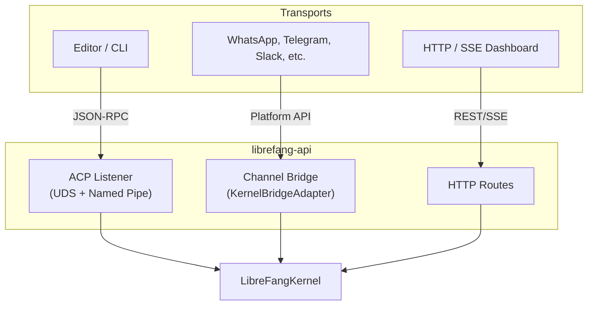

# API Server

# API Server (`librefang-api`)

The API server is the transport layer between external clients—editors, messaging platforms, CLI tools—and the LibreFang kernel. It does not implement agent logic itself; instead, it wires transport-specific listeners and adapters around the shared `LibreFangKernel`, translating between client protocols and the kernel's internal APIs.

## Architecture Overview


```mermaid
graph TD
    subgraph Transports
        Editor["Editor / CLI"]
        Channels["WhatsApp, Telegram, Slack, etc."]
        HTTP["HTTP / SSE Dashboard"]
    end

    subgraph "librefang-api"
        ACP["ACP Listener<br/>(UDS + Named Pipe)"]
        Bridge["Channel Bridge<br/>(KernelBridgeAdapter)"]
        Routes["HTTP Routes"]
    end

    Kernel["LibreFangKernel"]

    Editor -->|JSON-RPC| ACP
    Channels -->|Platform API| Bridge
    HTTP -->|REST/SSE| Routes
    ACP --> Kernel
    Bridge --> Kernel
    Routes --> Kernel
```

## ACP Listener: Daemon-Attached Editor Connections

The Agent Client Protocol (ACP) listener allows multiple editor sessions to share a single long-running kernel. When the daemon is active, editors connect via ACP and all see the same agent state, approval decisions, and session history.

Two platform-specific implementations exist, both wire-compatible (same JSON-RPC framing, same `KernelAdapter`):

### Unix Domain Sockets (`acp_uds.rs`)

**Path:** `~/.librefang/acp.sock`

The `run_listener` function binds a `UnixListener` and spawns a background task per connection. Each task creates a `KernelAdapter` backed by the shared kernel and runs `librefang_acp::run_with_transport` over the framed JSON-RPC stream.

#### Trust model: same-user, same-host

Two layers defend against multi-user host hijack:

1. **Atomic `0o600` socket creation** — `bind_atomic_owner_only` binds to a randomized tempfile (`.{stem}.{pid}.{nanos}`), `chmod`s it to `0o600`, then `rename`s it into place. This avoids the `bind() → chmod()` TOCTOU window where another local user could connect between the two syscalls.

2. **`SO_PEERCRED` peer-uid match** — Every accepted connection's `peer_cred()` is compared against the daemon's own euid. Mismatches are dropped before any ACP bytes are read.

#### Stale orphan cleanup

On macOS Docker Desktop bind-mount volumes, `rename(2)` succeeds on the host but the source file persists in the container's view. After a successful bind+rename, `sweep_stale_orphans` scans the parent directory for `.{stem}.{pid}.{nanos}` tempfiles from previous runs. Three guards prevent accidental deletion of live files:

| Guard | Check | Purpose |
|-------|-------|---------|
| UID | File owner matches daemon euid | Cross-user safety on PID wrap |
| Recency | File mtime > 10 seconds old | Protect in-flight bind→rename |
| PID liveness | `kill(pid, 0)` returns `ESRCH` | Don't touch concurrent daemon's tempfile |

### Windows Named Pipes (`acp_pipe.rs`)

**Pipe name:** `\\.\pipe\librefang-acp` (local-only namespace)

Named pipes work differently from UDS: the server creates one pipe instance, awaits a connect, then creates the next instance for the next connection. The loop in `run_listener` follows this pattern—hand the connected pipe to a background task, immediately create a fresh instance.

#### Trust model: owner-only DACL

The default Windows named pipe DACL grants `GENERIC_READ`/`GENERIC_WRITE` to anyone on the local machine. `create_owner_only_instance` installs an explicit DACL via SDDL `D:P(A;;GA;;;OW)`:

- `D:` — DACL (not SACL)
- `P` — protected (block inheritance from parent `\\.\pipe\`)
- `(A;;GA;;;OW)` — one ACE: allow GENERIC_ALL to OWNER only

Every pipe instance—including rebinds after a connect—uses this descriptor. The `first_pipe_instance(true)` flag is set only on the very first instance to prevent name-squatting races during daemon restart.

## Channel Bridge

The channel bridge connects the kernel to messaging platform adapters (WhatsApp, Telegram, Slack, Discord, etc.). `KernelBridgeAdapter` wraps `Arc<dyn KernelApi>` and implements `ChannelBridgeHandle`, translating platform messages into kernel API calls and streaming kernel responses back to users.

### Streaming Text Bridge

When a channel adapter requests a streaming response (e.g., for Telegram's live message editing), the bridge creates a pipeline:

```
kernel.send_message_streaming_with_routing()
  → mpsc::Receiver<StreamEvent>
  → start_stream_text_bridge()
  → mpsc::Receiver<String>  (user-visible text)
```

`start_stream_text_bridge` processes `StreamEvent` variants and produces user-facing text:

| Event | Action |
|-------|--------|
| `TextDelta` | Buffer text per iteration |
| `ContentComplete` | Flush buffered text (if not tool-call noise) |
| `ToolUseStart` | Inject `🔧 Tool Name` progress line |
| `ToolExecutionResult` (error) | Inject `⚠️ Tool Name failed` line |
| `PhaseChange` (`context_warning`) | Inject `⚠️ Context window trimmed` |

#### Tool call filtering

Some LLM providers emit tool calls as plain text instead of using the proper tool_use API. The bridge filters these before they reach the user via `looks_like_tool_call`, which detects:

- JSON arrays/objects starting with `[{` or `{"type":"function"`
- XML-style tags: `<function=`, `<tool>`, `[TOOL_CALL]`
- Markdown code blocks or backtick-wrapped JSON containing named tool calls
- Provider-specific markers like ` Durham` (Claude tool-use tags)

Long responses (>2000 chars) only match start-of-text patterns to avoid false positives from natural language that discusses tools.

#### Error sanitization

`sanitize_channel_error` prevents raw technical details from leaking to end users:

| Error pattern | User sees |
|--------------|-----------|
| Timeout / inactivity | "The task timed out due to inactivity." |
| Rate limit / 429 / quota | "I've hit my usage limit and need to rest." |
| Auth / 401 | "I'm having trouble with my credentials." |
| Content filter | "The request was blocked by the model's safety filter." |
| LLM driver crash | "Something went wrong on my end." |
| Other | "Something went wrong" + truncated reference |

Group chats suppress all error messages; DMs show sanitized versions. Timeouts with partial output are treated as soft successes (the user already saw streamed content).

### Slash Commands via the Bridge

`KernelBridgeAdapter` implements a full set of administrative and operational slash commands that channel users can invoke:

**Session management:**
- `/reset`, `/reboot`, `/compact` — per-agent or per-channel-session scope
- `/model [name]` — switch or inspect the agent's model
- `/stop` — cancel an active agent run

**Agent management:**
- `/agents` — list non-hand agents
- `/spawn <name>` — load an agent from `~/.librefang/workspaces/agents/{name}/agent.toml`

**Automation:**
- `/workflows`, `/run_workflow <name> <input>` — list and execute workflows
- `/triggers`, `/trigger add <agent> <pattern> <prompt>`, `/trigger del <id>` — manage event triggers
- `/schedule add|del|run` — manage cron jobs with standard 5-field expressions

**Approvals with TOTP:**
- `/approvals` — list pending
- `/approve <id> [totp]` / `/reject <id>` — resolve with optional second factor

TOTP handling includes replay protection (codes are recorded as consumed), lockout after repeated failures, and recovery code support with atomic redeem to prevent double-consumption.

**System:**
- `/models`, `/providers`, `/skills`, `/hands` — inspect available resources
- `/budget` — hourly/daily/monthly spend with limits
- `/peers`, `/a2a` — OFP network and A2A agent status
- `/uptime` — daemon uptime and agent count

### Media Processing

The bridge handles inbound media from channels:

- **Audio transcription** (`transcribe_inbound_audio`) — gated by `[media] audio_transcription` config flag. When enabled, downloaded audio files are dispatched to `MediaEngine::transcribe_audio` and the transcript is prepended to the message.
- **Image description** (`describe_inbound_image`) — gated by `[media] image_description` (default ON). Produces a natural-language description alongside the `ImageFile` block, enabling text-only models to understand images.

### Reply Intent Classification

In group chats, `classify_reply_intent` uses a one-shot LLM call to determine whether a message is directed at the bot or is casual human-to-human conversation. The classifier:

- Sanitizes both `message_text` and `sender_name` (attacker-controlled on Telegram)
- Truncates inputs (500 chars for message, 64 for names)
- Strips backticks, newlines, and brackets to reduce prompt injection surface
- Considers bot name, aliases, and @mentions as directed intent
- Fails open: any error or ambiguous response defaults to replying

### Authorization

`authorize_channel_user` gates channel actions through the kernel's RBAC system. When auth is not configured, all access is allowed. When configured, platform user IDs are mapped to internal user IDs, and actions (`chat`, `spawn`, `kill`, `install_skill`) are checked against the user's permissions.

## Approval Re-export (`approval.rs`)

A thin re-export of `librefang_kernel::approval::ApprovalManager`. API route modules should import through this re-export rather than reaching into `librefang_kernel` directly, keeping the kernel's internal module structure out of the API crate's import surface.

## Key Interfaces

| Component | Implements | Purpose |
|-----------|-----------|---------|
| `KernelBridgeAdapter` | `ChannelBridgeHandle` | Routes channel messages to kernel |
| `run_listener` (UDS) | — | Accepts ACP connections on Unix |
| `run_listener` (pipe) | — | Accepts ACP connections on Windows |
| `start_stream_text_bridge` | — | Converts `StreamEvent` to user-visible text |

## Thread Safety and Concurrency

- The kernel (`Arc<LibreFangKernel>` or `Arc<dyn KernelApi>`) is shared across all connections and channel tasks.
- Each ACP connection gets its own `KernelAdapter` (per-connection isolation) backed by the shared kernel.
- The streaming bridge uses `mpsc::channel` with capacity 64 for text chunks, providing backpressure from slow channel adapters to the kernel.
- The status channel (`oneshot`) carries the kernel task's terminal result so lifecycle management (delivery tracking, error responses) remains accurate even if the text bridge is cancelled mid-flush.