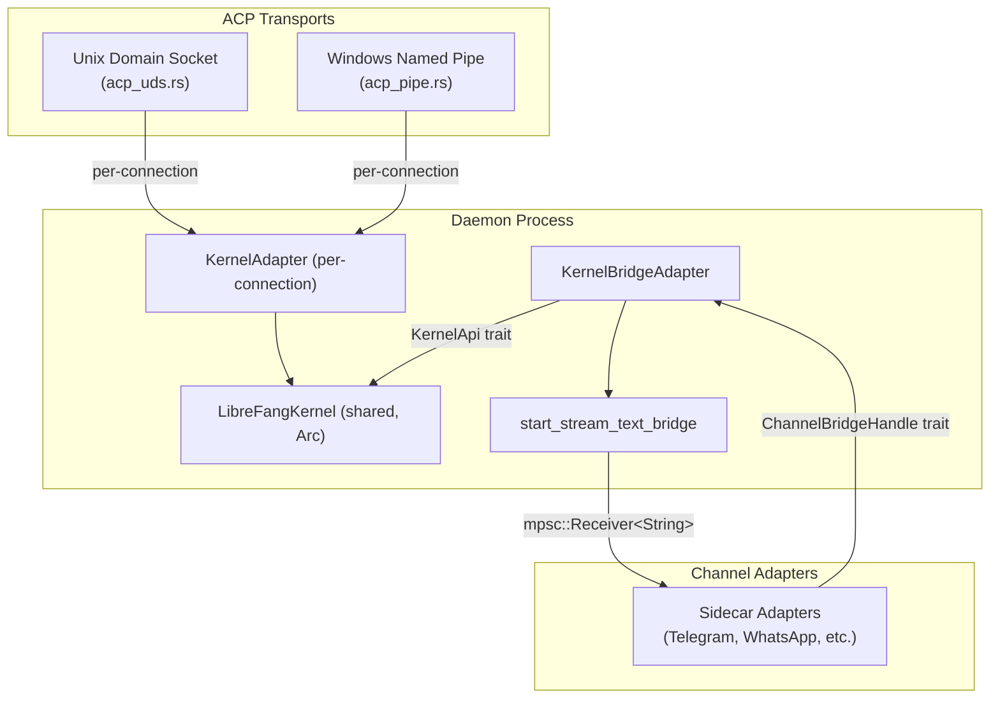

# API Server

# API Server (`librefang-api`)

The API server is the daemon-attached layer that exposes the LibreFang kernel to external consumers: editor integrations via the Agent Client Protocol (ACP), and messaging channels (Telegram, Slack, WhatsApp, etc.) via the channel bridge. It runs inside the long-lived daemon process and multiplexes concurrent connections onto a shared `LibreFangKernel`.

## Architecture


```mermaid
graph TD
    subgraph "Daemon Process"
        Kernel["LibreFangKernel (shared, Arc)"]
        Bridge["KernelBridgeAdapter"]
        StreamBridge["start_stream_text_bridge"]
        ACP["KernelAdapter (per-connection)"]
    end

    subgraph "ACP Transports"
        UDS["Unix Domain Socket<br/>(acp_uds.rs)"]
        Pipe["Windows Named Pipe<br/>(acp_pipe.rs)"]
    end

    subgraph "Channel Adapters"
        Sidecar["Sidecar Adapters<br/>(Telegram, WhatsApp, etc.)"]
    end

    UDS -->|per-connection| ACP
    Pipe -->|per-connection| ACP
    ACP --> Kernel
    Sidecar -->|ChannelBridgeHandle trait| Bridge
    Bridge -->|KernelApi trait| Kernel
    Bridge --> StreamBridge
    StreamBridge -->|mpsc::Receiver&lt;String&gt;| Sidecar
```

## ACP Listeners

ACP lets editor plugins (VS Code, JetBrains) communicate with a daemon-attached kernel over a local transport. Each connection gets its own `KernelAdapter` backed by the shared kernel, so agent state and approval decisions persist across editor restarts.

Both platform variants share the same JSON-RPC wire protocol — only the transport layer differs.

### Unix Domain Socket (`acp_uds.rs`)

Platform: `#[cfg(unix)]`

Entry point: `run_listener(kernel, sock_path)`

**Socket path:** `~/.librefang/acp.sock` (configured by the daemon)

**Security model — two-layer same-user, same-host defense:**

1. **Atomic owner-only bind.** `bind_atomic_owner_only` avoids the TOCTOU window between `bind()` and `chmod()` by binding to a randomised tempfile (`.acp.sock.<pid>.<nanos>`), setting mode `0o600`, then renaming into place. The rename atomically overwrites any stale socket from a crashed daemon.

2. **`SO_PEERCRED` peer-uid match.** Every accepted connection's `peer_cred().uid()` is compared against the daemon's own `geteuid()`. Mismatches are dropped before any ACP bytes are read — defense in depth against a permissive umask or container mount leaking the socket.

**Stale orphan cleanup.** On macOS Docker Desktop bind-mount volumes, `rename(2)` can succeed on the host without unlinking the source inside the container, so tempfiles accumulate across restarts. After a successful bind, `sweep_stale_orphans` scans the parent directory for `.<stem>.<pid>.<nanos>` files and removes them under three guards:

| Guard | Purpose |
|-------|---------|
| UID equality | Only delete files owned by daemon's euid |
| Recency window (10s) | Protect fresh tempfiles still in bind→rename flow |
| PID liveness (`kill(pid, 0)`) | Only remove files whose PID is dead (`ESRCH`) |

### Windows Named Pipe (`acp_pipe.rs`)

Platform: `#[cfg(windows)]`

Entry point: `run_listener(kernel)`

**Pipe name:** `\\.\pipe\librefang-acp` (hard-coded, must stay in sync with `librefang-cli::acp::run_pipe_proxy`)

**Security model — owner-only DACL:**

Named pipes on Windows default to a permissive DACL (`GENERIC_READ`/`GENERIC_WRITE` for all local users). The code hardens this with SDDL `D:P(A;;GA;;;OW)` — a protected DACL granting `GENERIC_ALL` only to the pipe's owner (the daemon's user SID). The `P` flag blocks inheritance from the parent `\\.\pipe\` directory.

**Instance lifecycle:**

Windows named pipes work differently from Unix sockets — there's no single listener. The server creates one pipe instance, awaits a connect, then creates the next instance for the next connection:

```
create_owner_only_instance(first=true)  // first_pipe_instance prevents name-squatting
  → await connect()
  → spawn handle_connection(connected)
  → create_owner_only_instance(first=false)  // ready for next client
```

`first_pipe_instance(true)` is set only on the very first instance after process start. This prevents a second daemon from racing to `CreateNamedPipe` between the old daemon dying and the new one starting. Subsequent rebinds pass `false`.

**Internal types:**

- `OwnerOnlyDescriptor` — wraps a `PSECURITY_DESCRIPTOR` allocated from the SDDL string; freed via `LocalFree` in `Drop`.
- `SecurityAttributes` — borrows an `OwnerOnlyDescriptor` and exposes `as_raw_mut()` for the unsafe `create_with_security_attributes_raw` call.

### Connection handling (shared pattern)

Both transports follow the same per-connection flow in `handle_connection`:

1. Create a `KernelAdapter` wrapping the shared kernel
2. Resolve the default agent (`"assistant"`) via `adapter.resolve_agent()`
3. Split the stream into read/write halves
4. Adapt tokio's `AsyncRead`/`AsyncWrite` to futures' traits via `tokio_util::compat`
5. Construct a `ByteStreams` transport and call `librefang_acp::run_with_transport()`

## Channel Bridge (`channel_bridge.rs`)

The channel bridge connects the kernel to messaging adapters (Telegram, Slack, WhatsApp, Discord, etc.). All channel adapters have been migrated to a sidecar architecture — the bridge implements `ChannelBridgeHandle` and translates channel operations into kernel API calls.

### `KernelBridgeAdapter`

Implements `ChannelBridgeHandle` over `Arc<dyn KernelApi>`. Key method groups:

**Message sending:**

| Method | Purpose |
|--------|---------|
| `send_message` | Synchronous (wait for full response) |
| `send_message_streaming` | Returns `mpsc::Receiver<String>` with live text |
| `send_message_streaming_with_sender` | Streaming with sender context (group/DM aware) |
| `send_message_streaming_with_sender_status` | Streaming + `oneshot::Receiver<Result<(), String>>` for delivery tracking |
| `send_message_ephemeral` | One-shot message without session persistence |

All methods handle the `silent` flag — when the agent responds with `NO_REPLY`/`[[silent]]`, the bridge returns an empty string so the adapter skips sending.

**Session management:**

- `reset_session` / `reboot_session` / `compact_session` — operate on the agent-wide session
- `reset_channel_session` / `reboot_channel_session` / `compact_channel_session` — scoped to a specific `(channel, chat_id)` via `SessionId::for_sender_scope`

**Slash commands exposed to channels:**

The bridge implements text-based interfaces for commands like `/models`, `/providers`, `/skills`, `/hands`, `/workflows`, `/triggers`, `/schedule`, `/approve`, `/reject`, `/budget`, `/peers`, `/a2a`. These format kernel state into human-readable text strings.

### Streaming Text Bridge

`start_stream_text_bridge_with_status` converts kernel `StreamEvent`s into a channel-friendly text stream. This is the core of the live-editing UX on streaming adapters (Telegram message editing, Slack streaming).

**Event handling:**

| Event | Behavior |
|-------|----------|
| `TextDelta` | Buffered until `ContentComplete` |
| `ContentComplete` | Flush buffer (unless filtered — see below) |
| `ToolUseStart` | Inject `🔧 Tool Name` progress line (if `show_progress`) |
| `ToolExecutionResult` (error) | Inject `⚠️ Tool Name failed` (localized) |
| `PhaseChange` (context_warning) | Surface context-window trim warning |

**Content filtering:**

Several classes of text are suppressed before reaching the user:

1. **Leaked tool calls** — `looks_like_tool_call()` detects raw JSON tool-call syntax, XML function tags, markdown code blocks containing tool invocations, and backtick-wrapped tool calls. Long responses (>2000 chars) only match start-of-text patterns to avoid false positives on natural language that discusses tools.

2. **Silent responses** — `NO_REPLY` and `[[silent]]` sentinels are suppressed.

3. **Tool-use-adjacent text** — when a `ToolUseStart` was seen in the current iteration, any accompanying text is the provider echoing the tool call as content.

**Progress deduplication:**

Within a single iteration, repeated calls to the same tool collapse into one `🔧` line (tracked via `iter_tools_seen: HashSet`). The set is cleared at `ContentComplete` so a tool retried in the next iteration still gets its own line.

**Error handling and status channel:**

The `oneshot::Receiver<Result<(), String>>` returned by `_with_status` variants carries the kernel task's terminal state:

- **Ok(Ok(result))** → success, log token counts
- **Ok(Err(e))** → kernel error, sanitize for user display
- **Err(cancelled)** → task was superseded by a newer message for the same agent
- **Err(panicked)** → unexpected failure, generic error message

Timeout errors that produced partial output are treated as soft successes (`Ok(())`) — the user already saw streamed content, and marking it as a failure would incorrectly show ❌.

**Error sanitization:**

`sanitize_channel_error` prevents raw technical details from leaking to end users on messaging platforms. Recognized patterns:

| Pattern | User message |
|---------|-------------|
| Timeout/inactivity | "The task timed out due to inactivity." |
| Rate limit (429/quota) | "I've hit my usage limit and need to rest." |
| Auth failure | "I'm having trouble with my credentials." |
| Content filtered | "The request was blocked by the model's safety filter." |
| Exit code/driver error | "Something went wrong on my end." |
| Generic | "Something went wrong: please try again. (ref: …)" |

**Localization:**

`tr_progress_failed` resolves the "failed" suffix for tool-failure progress lines based on the kernel's configured language (zh-CN, es, ja, de, fr, default English).

### Reply Intent Classification

`classify_reply_intent` determines whether a group-chat message is directed at the bot. It uses a one-shot LLM call with the prompt "Output REPLY or NO_REPLY" after sanitizing inputs (truncation, character escaping). Bot name and aliases are included in the classification prompt. The classifier is fail-open — on any error, it assumes the message warrants a reply.

### Approval Flow (Channel)

`resolve_approval_text` handles `/approve` and `/reject` from messaging channels:

1. Match pending request by ID prefix
2. If TOTP is required for the tool:
   - Check lockout status first
   - Accept recovery codes via atomic `vault_redeem_recovery_code` (prevents concurrent consumption)
   - Accept TOTP codes with replay protection (`record_totp_code_used`)
   - Record failed attempts atomically via `check_and_record_totp_failure`
3. Resolve through `ApprovalManager::resolve()`
4. Double-click / duplicate-command detection: `resolve_no_pending_message` checks the audit log for recently-resolved requests with matching prefix, returning an idempotent ack instead of "not found"

### Media Processing

| Method | Flag | Default |
|--------|------|---------|
| `transcribe_inbound_audio` | `[media] audio_transcription` | OFF |
| `describe_inbound_image` | `[media] image_description` | ON |

Both methods construct a `MediaAttachment` over the already-downloaded file and dispatch to `MediaEngine`. They return `Ok(None)` when the feature is disabled, allowing the bridge to fall back to raw delivery.

## Approval Re-export (`approval.rs`)

A thin re-export of `librefang_kernel::approval::ApprovalManager`. API routes reach for `ApprovalManager` through this module rather than importing the kernel internal path directly, keeping the kernel's module structure out of the API crate's import surface.

## Registering Channel Adapters

All channel adapters (Telegram, WhatsApp, Slack, Discord, Teams, Matrix, Signal, Google Chat, Webhook, LINE, Feishu, Webex, DingTalk, QQ, WeChat, WeCom, Email) have been migrated to the sidecar architecture. They are registered via `SIDECAR_CATALOG` in `routes/channels.rs` rather than as in-process imports. The bridge communicates with sidecars through the `ChannelBridgeHandle` trait.

## Testing

The UDS module includes tests for:

- `bind_atomic_owner_only_sets_mode_0600` — verifies socket mode after atomic bind
- `bind_atomic_owner_only_overwrites_stale_file` — verifies stale-socket overwrite
- `bind_atomic_owner_only_sweeps_dead_pid_orphans` — verifies orphan cleanup with dead PID
- `sweep_preserves_live_pid_tempfile` — verifies live-PID files are not deleted
- `sweep_preserves_recent_tempfile` — verifies recency window protection

The channel bridge tests verify streaming behavior including tool-progress deduplication and error status propagation.